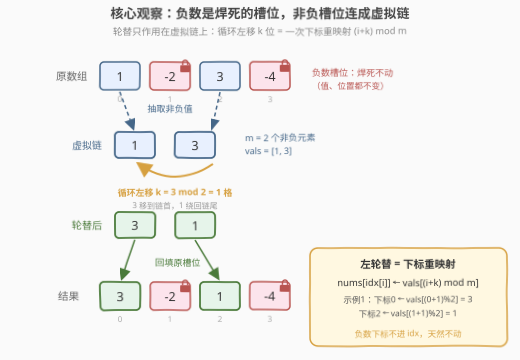
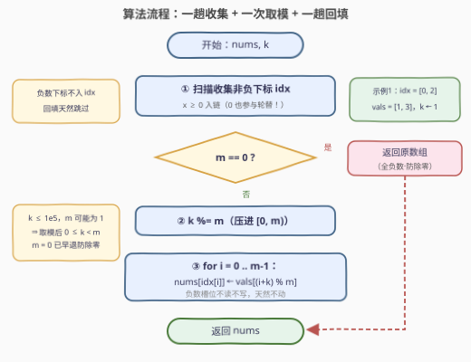

# 非负元素轮替

- **题目名称**：非负元素轮替
- **链接**：[3819. 非负元素轮替](https://leetcode.cn/problems/rotate-non-negative-elements/)
- **难度**：中等
- **标签**：数组、模拟

## 1. 题目概述

给你一个整数数组 `nums` 和一个整数 `k`。

将数组中**非负**元素以**循环**的方式**向左**轮替 `k` 个位置：

- 所有**负数**元素必须保持在它们**原来的位置**，不进行移动；
- 轮替后，将非负元素按照新的顺序放回数组中，**仅填充原先包含非负值的位置**，并跳过所有负数的位置。

返回处理后的数组。

**示例 1**：

```text
输入：nums = [1,-2,3,-4], k = 3
输出：[3,-2,1,-4]
解释：非负元素按顺序为 [1, 3]。以 k = 3 向左轮替：
      [1,3] -> [3,1] -> [1,3] -> [3,1]。
      将它们放回非负值对应的位置，结果为 [3,-2,1,-4]。
```

**示例 2**：

```text
输入：nums = [-3,-2,7], k = 1
输出：[-3,-2,7]
解释：非负元素只有 [7]，怎么轮替都不变。
```

**示例 3**：

```text
输入：nums = [5,4,-9,6], k = 2
输出：[6,5,-9,4]
解释：非负元素按顺序为 [5, 4, 6]，向左轮替 2 位得 [6, 5, 4]，
      放回原非负位置得 [6, 5, -9, 4]。
```

**约束条件**：

- $1 \le nums.length \le 10^5$
- $-10^9 \le nums[i] \le 10^9$
- $0 \le k \le 10^5$

> 💡 **审题关键**：① 轮替只发生在**非负元素之间**——它们构成一条按下标递增的"虚拟链"，负数是**焊死的固定槽位**，值和位置都纹丝不动；② **0 是非负数**，参与轮替（`nums[i] >= 0` 而非 `> 0`）；③ 是**向左**轮替：整体左移 `k` 格，链首元素绕回链尾。

---

## 2. 解题思路

### 2.1 暴力思路

老老实实模拟 `k` 次「左移一格」：每一步扫描整个数组，把非负元素整体左移一位（链首元素搬到链尾）。单步 $O(n)$，总计 $O(n \cdot k)$，最坏 $10^5 \times 10^5 = 10^{10}$，必然超时。

即便优化成「先抽出非负序列，再对序列逐步轮替」，仍是 $O(m \cdot k)$（$m$ 为非负元素个数），$k$ 与 $m$ 同为 $10^5$ 量级时同样爆炸。**瓶颈在于"一位一位地挪"——必须认识到轮替 $k$ 位可以一步算出落点**。

### 2.2 核心观察：槽位-值分离 + 模长一步轮替



**第一步：把数组看成"槽位-值"两层。** 负数格子的值和位置都被冻结，可以无视；所有非负槽位按下标递增连成一条**虚拟链**（示例 1 中链长 $m = 2$，示例 3 中 $m = 3$）。轮替操作**只作用于这条链**，与被负数隔开多少距离无关——这正是「循环」二字的含义。

**第二步：循环移位允许对长度取模。** 左轮替 $k$ 位等价于左轮替 $k \bmod m$ 位：转满 $m$ 格回到原状。$k$ 高达 $10^5$ 而 $m$ 可能只有 $1$，取模把 $k$ 压到 $[0, m)$。⚠️ 若 $m = 0$（全是负数）须**先早退**，否则 `k %= 0` 直接除零。

**第三步：左轮替 = 一次下标重映射。** 抽出的非负序列记为 $vals[0..m-1]$。整体左移 $k$ 格后，**链上第 $i$ 个槽位的新值来自原第 $(i+k) \bmod m$ 个值**：

$$nums\big[idx[i]\big] \leftarrow vals\big[(i+k) \bmod m\big]$$

不需要挪 $k$ 次——取模公式一步算出每个值的最终归宿。方向辨析：向左轮替即每个值向左（下标减小方向）挪 $k$ 格，故位置 $i$ 的**新住客**来自位置 $i+k$（越界回绕）；若写成 $(i-k) \bmod m$ 就成了右轮替。

> 💡 **正确性一句话**：轮替是虚拟链上的**双射** $\pi(i) = (i+k) \bmod m$，负数槽位是恒等映射——两个映射互不干扰，逐槽位照写即得唯一答案。这就是 [189. 轮转数组](https://leetcode.cn/problems/rotate-array/) 的「辅助数组 + 取模映射」解法在**子序列**上的推广。

### 2.3 算法流程图



| 步骤 | 操作 | 说明 |
|------|------|------|
| ① 收集 | 扫描 `nums`，记录非负元素的下标 `idx` | 负数槽位从此不再关心 |
| ② 早退 | 若 `m == 0` 直接返回 | 全负数无可轮替，且防 `k %= 0` 除零 |
| ③ 取模 | `k %= m` | 循环移位：$k$ 只需落在 $[0, m)$ |
| ④ 回填 | `nums[idx[i]] = vals[(i + k) % m]` | 下标重映射，一步算出终态 |
| ⑤ 返回 | 返回 `nums` | 负数位置从未被触碰，天然不动 |

### 2.4 示例演算

**示例 1** `nums = [1,-2,3,-4], k = 3`：非负槽位 `idx = [0, 2]`，`vals = [1, 3]`，$m = 2$，$k \leftarrow 3 \bmod 2 = 1$：

| 链上位置 $i$ | 回填目标 `idx[i]` | 取值 `vals[(i+1) % 2]` |
|--------------|-------------------|------------------------|
| 0 | 下标 0 | $vals[1] = 3$ |
| 1 | 下标 2 | $vals[0] = 1$ |

得 `[3, -2, 1, -4]` ✓（与逐步模拟 `[1,3]→[3,1]→[1,3]→[3,1]` 的终态一致，但只花一次回填）。

**示例 3** `nums = [5,4,-9,6], k = 2`：`idx = [0, 1, 3]`，`vals = [5, 4, 6]`，$m = 3$，$k = 2$：

| 链上位置 $i$ | 回填目标 `idx[i]` | 取值 `vals[(i+2) % 3]` |
|--------------|-------------------|------------------------|
| 0 | 下标 0 | $vals[2] = 6$ |
| 1 | 下标 1 | $vals[0] = 5$ |
| 2 | 下标 3 | $vals[1] = 4$ |

得 `[6, 5, -9, 4]` ✓——下标 2 的 `-9` 全程无人理会。

---

## 3. 参考代码

### C++

```cpp
class Solution {
public:
    vector<int> rotateElements(vector<int>& nums, int k) {
        vector<int> idx;                        // 非负槽位：虚拟链
        idx.reserve(nums.size());
        for (int i = 0; i < (int)nums.size(); ++i)
            if (nums[i] >= 0) idx.push_back(i); // 0 也是非负，参与轮替

        const int m = (int)idx.size();
        if (m == 0) return nums;                // 全负数：早退，防 k %= 0
        k %= m;                                 // 循环移位：k 对链长取模

        vector<int> vals(m);                    // 抽出的非负值
        for (int i = 0; i < m; ++i) vals[i] = nums[idx[i]];

        for (int i = 0; i < m; ++i)             // 左轮替 = 下标重映射
            nums[idx[i]] = vals[(i + k) % m];
        return nums;
    }
};
```

> 💡 **写法要点**：
> - `k %= m` 前必须判 `m == 0`，否则除零；全负数组原样返回即是答案；
> - 取值公式是 `(i + k) % m`（新住客来自右边 $k$ 格），方向写反就成了右轮替；
> - 负数下标从不进入 `idx`，回填循环天然跳过它们，无需任何特判。

### Python

```python
class Solution:
    def rotateElements(self, nums: List[int], k: int) -> List[int]:
        idx = [i for i, x in enumerate(nums) if x >= 0]   # 非负槽位：虚拟链
        m = len(idx)
        if m == 0:
            return nums                                   # 全负数：早退防除零
        k %= m                                            # 循环移位：对链长取模
        vals = [nums[i] for i in idx]
        for i, pos in enumerate(idx):                     # 左轮替 = 下标重映射
            nums[pos] = vals[(i + k) % m]
        return nums
```

> 💡 **写法要点**：收集与回填共用同一套 `idx` 顺序（链上位置 $0..m-1$），先抽值后回填，避免读写交叉覆盖；三段各一趟线性扫描，无嵌套循环。

---

## 4. 复杂度分析

| 维度 | 复杂度 | 说明 |
|------|--------|------|
| **时间** | $O(n)$ | 收集一趟 $O(n)$ + 抽值/回填各 $O(m)$，$m \le n$ |
| **空间** | $O(m)$ | 槽位数组 `idx` 与值数组 `vals`，最坏全非负时 $O(n)$ |
| **量级判断** | $n, k \sim 10^5$ | 逐步模拟 $O(nk) \approx 10^{10}$ 必超时；取模重映射仅 $10^5$ 次赋值 |

---

## 5. 扩展

**① 能否 $O(1)$ 额外空间？** 可以，用 [189. 轮转数组](https://leetcode.cn/problems/rotate-array/) 的**环替换**（cycle replacement）推广：重映射 $\pi(i) = (i+k) \bmod m$ 把链拆成 $\gcd(k, m)$ 个置换环，从每个环起点出发，沿环把值逐个搬到下一个槽位、空出的槽接收链上一位的值。难点是「哪些起点已访问」——子序列不像 189 可以用 `visited` 数组之外的取负标记，实践中 $O(m)$ 辅助数组已经足够且不易写错。

**② 左轮替与右轮替的换算。** 左轮替 $k$ 位 $\equiv$ 右轮替 $(m-k) \bmod m$ 位。若题目改成右轮替，回填公式变为 $nums[idx[i]] \leftarrow vals[(i-k+m) \bmod m]$，仅一个符号之差——面试时先在小数组上比划一步确认方向，再写公式。

**③ "虚拟链上的反转法"为何不讨巧。** 189 的三次反转法（反转前 $k$、反转后 $m-k$、整体反转）物理上依赖**连续内存**；本题链是被负数切碎的槽位，反转必须先抽到 `vals` 数组——抽出来之后用反转还是直接取模，额外空间都是 $O(m)$，反而不如取模直接。

---

## 6. 面试要点

**Q1：为什么 `k %= m` 是安全的？`m == 0` 时会怎样？**

> 左轮替 $m$ 位回到原状，故 $k$ 与 $k \bmod m$ 等价，取模把 $k$ 压进 $[0, m)$。但 $m = 0$（全负数组）时取模是除零，必须**先判空早退**——返回原数组即是答案。

**Q2：向左轮替，为什么公式是 `(i + k) % m` 而不是 `(i - k) % m`？**

> 左轮替 = 值向左挪 $k$ 格 = 位置 $i$ 的新值来自位置 $i + k$（越界回绕取模）。$(i-k) \bmod m$ 描述的是"位置 $i$ 的值去哪了"，那是右轮替的口径——**问"新住客从哪来"而不是"旧住客去哪"**，方向就不会错。

**Q3：`nums[i] = 0` 参与轮替吗？**

> 参与。非负是 `>= 0`，0 是合法的链上成员；用 `> 0` 会让 0 混进"固定槽位"，示例中若含 0 必然出错。这是本题最便宜的审题坑。

**Q4：负数元素为什么天然不受影响？代码里有专门处理吗？**

> 没有，也不需要。负数下标从不进入 `idx`，回填循环只遍历非负槽位——负数格子的值从未被读（抽取时跳过）、从未被写（回填时跳过），"保持在原位"是不变式而非特判。

**Q5：本题与 189 轮转数组是什么关系？**

> 189 是本题 $m = n$（无非负过滤）的特例；本题是 189 的「子序列轮转」推广——轮替对象从物理连续的整段数组变成被负数切碎的**虚拟链**。189 的三解法中，取模重映射与环替换可平移过来，三次反转法因依赖连续性而失效（须先抽链）。

> 💡 **一句话总结**：3819 =「负数是焊死的槽位，非负槽位连成虚拟链」+「循环移位对链长取模」+「左轮替 = 下标重映射 $(i+k) \bmod m$ 一步到位」。三个带走的知识点：先判 $m=0$ 防除零；0 是非负数；问"新住客从哪来"定轮替方向。

---

## 7. 同类练习题

- [189. 轮转数组](https://leetcode.cn/problems/rotate-array/)：整段数组轮转的祖师爷，取模重映射 / 三次反转 / 环替换三解法，本题是其子序列版
- [283. 移动零](https://leetcode.cn/problems/move-zeroes/)（[题解](../0201-0300/283_移动零.md)）：快慢指针保序挪动一类元素、其余元素原地不动的同款"槽位语义"题
- [905. 按奇偶排序数组](https://leetcode.cn/problems/sort-array-by-parity/)（[题解](../0901-1000/905_按奇偶排序数组.md)）：按条件划分并保序的双指针基础模板
- [2164. 对奇偶下标分别排序](https://leetcode.cn/problems/sort-even-and-odd-indices-independently/)（[题解](../2101-2200/2164_对奇偶下标分别排序.md)）：抽取子序列独立变换再回填原位的同构套路
- [2460. 对数组执行操作](https://leetcode.cn/problems/apply-operations-to-an-array/)（[题解](../2401-2500/2460_对数组执行操作.md)）：值变换与保序紧凑化混合的模拟题，同样考"哪些位置参与变换"
