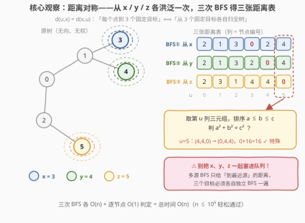
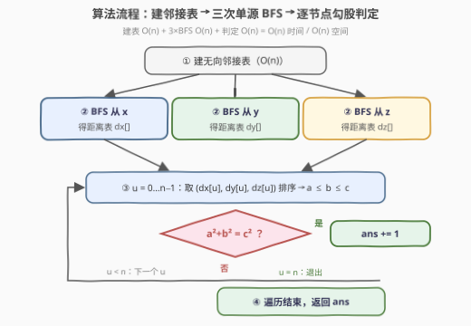

# LeetCode 树上的勾股距离节点 题解

## 1. 题目概述

- **标题 / 题号**：树上的勾股距离节点（#3820，medium）
- **链接**：https://leetcode.cn/problems/pythagorean-distance-nodes-in-a-tree/
- **难度**：中等
- **标签**：树、广度优先搜索

**题意**：给你一个整数 $n$ 和一棵包含 $n$ 个节点的**无向树**，节点编号从 0 到 $n-1$，由长度为 $n-1$ 的二维数组 `edges` 表示。另给你三个**互不相同**的目标节点 $x$、$y$、$z$。

对树中任意节点 $u$，记 $dx$、$dy$、$dz$ 分别为 $u$ 到 $x$、$y$、$z$ 的**距离**（两节点间唯一路径上的边数）。若这三个距离构成**勾股数元组**——按升序排列为 $a \le b \le c$ 后满足 $a^2 + b^2 = c^2$——则称 $u$ 为**特殊节点**。返回特殊节点的数量。

**示例 1**：

```text
输入：n = 4, edges = [[0,1],[0,2],[0,3]], x = 1, y = 2, z = 3
输出：3
解释：节点 0 的距离 (1,1,1) 不满足；节点 1/2/3 的距离排序后都是 (0,2,2)，
      0² + 2² = 2²，均为特殊节点。
```

**示例 2**：

```text
输入：n = 4, edges = [[0,1],[1,2],[2,3]], x = 0, y = 3, z = 2
输出：0
解释：四个节点的距离三元组排序后分别为 (0,2,3)、(1,1,2)、(0,1,2)、(0,1,3)，无一满足勾股条件。
```

**示例 3**：

```text
输入：n = 4, edges = [[0,1],[1,2],[1,3]], x = 1, y = 3, z = 0
输出：1
解释：只有节点 1 的距离 (0,1,1) 满足 0² + 1² = 1²。
```

**约束**：$4 \le n \le 10^5$，`edges` 保证构成一棵有效的树，$x$、$y$、$z$ 互不相同。

> 💡 **审题关键**：① 距离是**边数**（无权），无权图上一次**单源 BFS** 就能线性求出全图距离表；② 勾股判定**不排除 0**——按题面只要 $a^2+b^2=c^2$，$(0,k,k)$ 合法（示例 1 中距离 $(0,2,2)$ 的节点被判定为特殊，明示了这一点）；③ 距离最大 $n-1 < 10^5$，平方后约 $10^{10}$ **超出 32 位 int**，C++ 判等时要用 64 位；④ 三个目标固定、要的是「**每个**节点到 **3 个固定点**」的距离——视角一换，就是从 3 个固定点各洪泛一次。

## 2. 解题思路

### 2.1 暴力思路：逐节点求三距离

最直白的做法：对每个节点 $u$，从 $u$ 出发 BFS 一遍，顺便读出 $d(u,x)$、$d(u,y)$、$d(u,z)$。单次 BFS 是 $O(n)$，全部节点各跑一次就是 $O(n^2)$——$n \sim 10^5$ 时约 $10^{10}$ 次操作，必然超时。

问题出在**视角**：从 $x$ 出发的 BFS 明明**一次性**算出了所有节点到 $x$ 的距离，暴力却只取走 $u$ 一个值，把整张距离表扔掉了——每个目标的距离表都被重算了 $n$ 遍。

### 2.2 核心观察：换视角——从目标出发，三次单源 BFS



距离是对称的：$d(u, x) = d(x, u)$。于是

$$\underbrace{\text{每个 } u \text{ 到 3 个固定目标}}_{n \times 3 \text{ 次单点查询}} \iff \underbrace{\text{从 3 个固定目标各自出发扫全树}}_{3 \text{ 次单源 BFS}}$$

**无权图**上单源 BFS 按层扩展，$O(n)$ 就得到**整张**距离表。于是：

1. 从 $x$、$y$、$z$ 各跑一次 BFS，得到三张距离表 $dx[]$、$dy[]$、$dz[]$；
2. 逐节点取同列三元组，排序得 $a \le b \le c$，判 $a^2 + b^2 = c^2$，成立则计数。

每个节点的判定只是 3 次比较 + 3 次乘法，$O(1)$。总体 $3 \times O(n) + O(n) = O(n)$。

> ⚠️ **不能用一次多源 BFS 偷懒**：把 $x,y,z$ 同时塞进队列的 multi-source BFS 求的是「到**最近**源的距离」，三个距离会串成一张表，完全不是题意。三个目标必须**各自独立**跑一遍。

> 💡 **两个实现细节**：① 按题意 $0$ 参与判定，$(0,k,k)$ 是合法勾股元组——顺手可得一个小结论：$u = x$ 时三元组为 $(0,\ d(x,y),\ d(x,z))$，所以 **$x$ 自身是特殊点 $\iff d(x,y) = d(x,z)$**；② C++ 中 $c \le n-1 < 10^5$，$c^2$ 约 $10^{10}$ 超过 `int`，平方求和务必用 `long long`（Python 无此虞）。

### 2.3 算法流程图：建表 → 三 BFS → 逐节点判定



| 步骤 | 操作 | 说明 |
|------|------|------|
| ① 建邻接表 | `adj[u] += v`，`adj[v] += u` | 无向边两头都存 |
| ② 三次 BFS | 从 $x$、$y$、$z$ 各一次 | 每次 $O(n)$，产出 $dx$ / $dy$ / $dz$ 三张距离表 |
| ③ 遍历判定 | $u = 0 \dots n-1$，取 $(dx[u], dy[u], dz[u])$ 排序 | 排 3 个数 = 3 次比较，$O(1)$ |
| ④ 计数返回 | $a^2 + b^2 = c^2$ 则 `ans++` | 平方和用 64 位；最后返回 `ans` |

### 2.4 示例演算

**官方示例 1** `n = 4, edges = [[0,1],[0,2],[0,3]], x = 1, y = 2, z = 3`（星形树，中心 0）。

三次 BFS 得到三张距离表：

$$dx = [1,0,2,2], \qquad dy = [1,2,0,2], \qquad dz = [1,2,2,0]$$

| $u$ | $(dx,dy,dz)$ | 排序后 $(a,b,c)$ | $a^2+b^2=c^2$? |
|-----|--------------|------------------|----------------|
| 0 | $(1,1,1)$ | $(1,1,1)$ | $1+1=2 \ne 1$ ✗ |
| 1 | $(0,2,2)$ | $(0,2,2)$ | $0+4=4$ ✓ |
| 2 | $(2,0,2)$ | $(0,2,2)$ | $0+4=4$ ✓ |
| 3 | $(2,2,0)$ | $(0,2,2)$ | $0+4=4$ ✓ |

答案 $3$ ✓。

> 💡 **真勾股也会出现**：取路径树 $0-1-2-3-4-5$，令 $x=3,\ y=4,\ z=5$，则 $u=0$ 的三元组是 $(3,4,5)$，$3^2+4^2=5^2$ ✓；同时 $u=4$ 的三元组 $(1,0,1)$ 排序后 $(0,1,1)$ 也合法。树上勾股距离的来源既有 $(0,k,k)$ 这种「退化元组」，也有 $(3,4,5)$ 这类货真价实的勾股数。

## 3. 参考代码

### C++

```cpp
class Solution {
public:
    int specialNodes(int n, vector<vector<int>>& edges, int x, int y, int z) {
        vector<vector<int>> adj(n);                      // 无向邻接表
        for (auto& e : edges) {
            adj[e[0]].push_back(e[1]);
            adj[e[1]].push_back(e[0]);
        }

        auto bfs = [&](int src) {                        // 单源 BFS：整张距离表
            vector<int> dist(n, -1);
            queue<int> q;
            dist[src] = 0;
            q.push(src);
            while (!q.empty()) {
                int v = q.front(); q.pop();
                for (int u : adj[v]) if (dist[u] < 0) {
                    dist[u] = dist[v] + 1;
                    q.push(u);
                }
            }
            return dist;
        };
        auto dx = bfs(x), dy = bfs(y), dz = bfs(z);

        int ans = 0;
        for (int u = 0; u < n; ++u) {
            long long a = dx[u], b = dy[u], c = dz[u];   // 平方可达 1e10，用 64 位
            if (a > b) swap(a, b);
            if (b > c) swap(b, c);
            if (a > b) swap(a, b);
            ans += (a * a + b * b == c * c);
        }
        return ans;
    }
};
```

### Python

```python
class Solution:
    def specialNodes(self, n: int, edges: List[List[int]], x: int, y: int, z: int) -> int:
        adj = [[] for _ in range(n)]                     # 无向邻接表
        for a, b in edges:
            adj[a].append(b)
            adj[b].append(a)

        def bfs(src: int) -> List[int]:                  # 单源 BFS：整张距离表
            dist = [-1] * n
            dist[src] = 0
            q = deque([src])
            while q:
                v = q.popleft()
                for u in adj[v]:
                    if dist[u] == -1:
                        dist[u] = dist[v] + 1
                        q.append(u)
            return dist

        dx, dy, dz = bfs(x), bfs(y), bfs(z)

        ans = 0
        for u in range(n):
            a, b, c = sorted((dx[u], dy[u], dz[u]))
            if a * a + b * b == c * c:
                ans += 1
        return ans
```

> 💡 **写法要点**：① 排 3 个数不必调用通用排序，三次 `swap` 即得 $a \le b \le c$（`sorted` 三元组在 Python 里同样常数极小）；② BFS 用 `dist[u] < 0` 兼作访问标记，省一个 `vis` 数组；③ 树连通，BFS 结束时所有节点距离均非 $-1$，无需补扫。官方三个示例 + 随机小树与逐点 BFS 暴力对拍全部一致。

## 4. 复杂度分析

| 维度 | 复杂度 | 说明 |
|------|--------|------|
| **时间** | $O(n)$ | 建邻接表 $O(n)$ + 3 次单源 BFS 各 $O(n)$ + 逐节点 $O(1)$ 判定共 $O(n)$ |
| **空间** | $O(n)$ | 邻接表 $O(n)$ + 三张距离表 $O(n)$ + BFS 队列 $O(n)$ |
| **量级判断** | $n \sim 10^5$ | 纯线性扫描，宽松通过；瓶颈只是建表与三遍遍历的常数 |

## 5. 扩展：目标不固定 / 带权时的升级路线

### 5.1 多组询问：LCA 把「3 遍 BFS」压成「O(1) 距离查询」

若询问有很多组（每组不同的 $x,y,z$），每组都跑 3 遍 BFS 是 $O(3qn)$。预处理**欧拉序 + 稀疏表 LCA**（$O(n \log n)$）后，任意两点距离变为

$$d(u, v) = dep[u] + dep[v] - 2 \cdot dep[\mathrm{LCA}(u, v)]$$

单次距离 $O(1)$，每组询问只剩一遍线性扫描 $O(n)$。注意每组询问仍需检查**每个**节点（$\Omega(n)$ 不可省），LCA 省掉的是每遍 BFS 的重复洪泛；且该公式对**带权树**（$dep$ 换成带权深度）同样成立，通用性更好。

### 5.2 带边权：BFS → 最短路

边带**正权**时 BFS 的「按层扩展 = 最短」失效，换 **Dijkstra**（$O(m \log n)$）；边权只有 $0/1$ 时用 **0-1 BFS**（双端队列，线性）。勾股判定部分完全不变——变的只是三张距离表的产出来源。

### 5.3 结构小观察：退化元组 $(0,k,k)$

$u$ 取到某个目标（如 $u=x$）时三元组形如 $(0,\ d(x,y),\ d(x,z))$，勾股条件退化为 $d(x,y) = d(x,z)$——即「$x$ 到另外两个目标等距」。示例 1、3 中答案里的特殊点恰好都是这种情形。真勾股元组（如 $(3,4,5)$）则需要树上存在合适的路径拓扑（见 2.4 的构造）。

## 6. 面试要点

**Q1：为什么跑三次单源 BFS，而不是把 x、y、z 一起塞进队列？**

> 多源 BFS 求的是每个点到**最近**源的距离，三个目标的距离会混在同一张表里，语义完全不对。本题要每个节点到**每个**目标的精确距离，三个源必须各自独立跑一遍——好在无权图单源 BFS 是 $O(n)$，三遍也才 $3n$。

**Q2：凭什么 BFS 得到的就是精确距离？**

> 无权图中 BFS 按层扩展：队列中节点的距离单调不减，首次到达某点时经过的边数必最少。树还是连通无环图，每个节点恰好被赋一次距离，BFS 天然遍历全树，不存在漏点。

**Q3：这题有溢出风险吗？**

> 有。$c \le n-1 < 10^5$，$c^2$ 约 $10^{10}$，超出 32 位 `int` 上限（约 $2.1 \times 10^9$）。C++ 判 $a^2 + b^2 = c^2$ 时应把变量声明为 `long long` 再平方；三个数都先提升再乘即可，一处都不能省。

**Q4：$(0,k,k)$ 这种带 0 的算勾股数吗？**

> 按本题定义算：题面只要求排序后 $a^2+b^2=c^2$，$0^2 + k^2 = k^2$ 成立，且示例 1 明确把距离 $(0,2,2)$ 的节点判为特殊。由此还有个快问快答式推论：目标点 $x$ 自身是特殊点 $\iff d(x,y) = d(x,z)$。

**Q5：还能比 $O(n)$ 更快吗？**

> 不能。仅读入 $n-1$ 条边就是 $\Omega(n)$；而三张距离表任何一张都依赖全树信息，$O(n)$ 的三次 BFS + 一遍判定已是最优，常数上也只剩「三次 BFS」这一个可压缩项（见 5.1 的 LCA 方案）。

> 💡 **一句话总结**：3820 =「距离对称换视角：$n$ 个点 × 3 个目标 → 3 个目标 × 各一次 BFS」+「无权图单源 BFS 一遍拿全表」+「三元组排序判 $a^2+b^2=c^2$，0 也算数」。带走的知识点：多目标距离查询先想「从目标出发洪泛」，而不是逐点去查。

## 同类练习题

| # | 题目 | 与本题的关联 |
|---|------|-------------|
| 1245 | [树的直径](https://leetcode.cn/problems/tree-diameter/)（[题解](../1201-1300/1245_树的直径.md)） | 两次单源 BFS 求一般树直径，「单源 BFS 拿整张距离表」的姊妹用法 |
| 863 | [二叉树中所有距离为 K 的结点](https://leetcode.cn/problems/all-nodes-distance-k-in-binary-tree/)（[题解](../0801-0900/863_二叉树中所有距离为K的结点.md)） | 把树转无向图再按距离 BFS 收集节点，建邻接表手法与本题同款 |
| 994 | [腐烂的橘子](https://leetcode.cn/problems/rotting-oranges/)（[题解](../0901-1000/994_腐烂的橘子.md)） | 多源 BFS 的正面教材——那里要的恰是「到最近源的距离」，与本题「逐源独立」互为对照 |
| 543 | [二叉树的直径](https://leetcode.cn/problems/diameter-of-binary-tree/)（[题解](../0501-0600/543_二叉树的直径.md)） | 树形距离经典入门，DFS 求深度与 BFS 求距离的思路互补 |
| 743 | [网络延迟时间](https://leetcode.cn/problems/network-delay-time/)（[题解](../0701-0800/743_网络延迟时间.md)） | 带权图单源最短路，本题 BFS 解法的加权升级版 |
