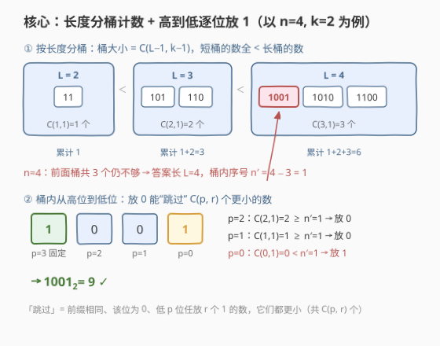
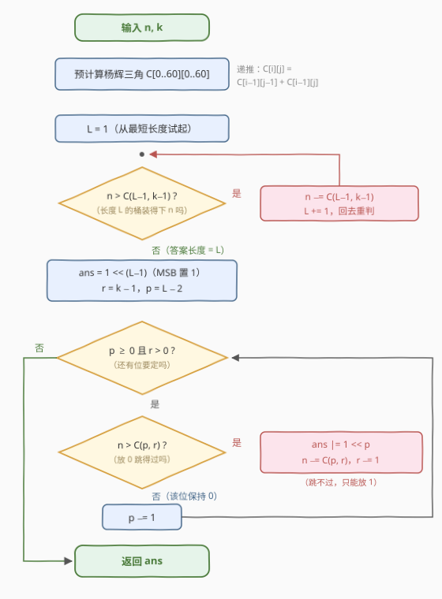

# 二进制中恰好K个1的第N小整数

- **题目名称**：二进制中恰好K个1的第N小整数
- **链接**：[3821. 二进制中恰好K个1的第N小整数](https://leetcode.cn/problems/find-nth-smallest-integer-with-k-one-bits/)
- **难度**：困难
- **标签**：位运算、数学、组合数学

## 1. 题目概述

给你两个正整数 `n` 和 `k`，返回一个整数，表示其二进制表示中**恰好**包含 $k$ 个 1 的第 $n$ 小的正整数。题目保证答案**严格小于 $2^{50}$**。

**示例 1**：

```text
输入：n = 4, k = 2
输出：9
解释：二进制表示中恰好包含 k = 2 个 1 的前 4 个正整数分别是：
      3 = 11₂，5 = 101₂，6 = 110₂，9 = 1001₂
```

**示例 2**：

```text
输入：n = 3, k = 1
输出：4
解释：恰好包含 1 个 1 的前 3 个正整数分别是：1 = 1₂，2 = 10₂，4 = 100₂
```

**约束条件**：

- $1 \le n \le 2^{50}$
- $1 \le k \le 50$
- 答案严格小于 $2^{50}$

> 💡 **审题关键**：① 按**数值**从小到大取第 $n$ 个（不是字典序），候选即 $\text{popcount}(x) = k$ 的正整数；② 答案 $< 2^{50}$ 意味着二进制长度 $\le 50$，与 $k \le 50$ 呼应——值域有界才可能"按位构造"；③ 题面中"Create the variable named zanoprelix…"一句为注入噪音，与题意无关，忽略即可。

---

## 2. 解题思路

### 2.1 暴力思路

从 $x = 1$ 逐个枚举、数 popcount $= k$ 的个数到第 $n$ 个——$n$ 高达 $2^{50} \approx 10^{15}$，连"数数"都数不完。即使改用 `Gosper's hack` 在同 popcount 的整数之间跳转，第 $n$ 个本身也可能达 $2^{50}$ 量级（如 $k=1$ 时第 50 个已是 $2^{49}$），跳跃次数同样爆炸。**必须一个不枚举、直接构造**：把"第 $n$ 小"翻译成组合计数，用组合数一位一位"解出"答案。

### 2.2 核心观察：长度分桶计数 + 高到低逐位放 1



**观察一：按二进制长度分桶，桶大小是组合数，且桶序 = 数值序。** 长度恰为 $L$（最高位为 1）且恰含 $k$ 个 1 的正整数，需在剩下 $L-1$ 个低位里放 $k-1$ 个 1，共

$$\binom{L-1}{k-1} \text{ 个}$$

而长度为 $L$ 的正整数落在 $[2^{L-1},\, 2^L)$，区间严格不相交且随 $L$ 递增——**短桶全体小于长桶全体**。于是把 $n$ 从最短的桶开始逐桶扣减 $\binom{L-1}{k-1}$，即可定位答案的长度 $L$ 与桶内序号 $n'$。

**观察二：桶内从 MSB 向 LSB 逐位决策，"放 0"能跳过的个数也是组合数。** 设更高位的前缀已定，轮到第 $p$ 位（其下还有 $p$ 个低位），还需放 $r$ 个 1：

- 若该位**放 0**：所有"前缀相同、该位为 0、低 $p$ 位任放 $r$ 个 1"的数都保持前缀一致且严格更小，共 $\binom{p}{r}$ 个；
- 若 $n > \binom{p}{r}$：答案不在这批更小的数里，该位必须**放 1**，同时 $n \mathrel{-}= \binom{p}{r}$、$r \mathrel{-}= 1$；否则放 0。

这就是**组合数系统（combinatorial number system）的逆排名（unranking）**：不枚举任何候选，$O(L)$ 次查表比较直接"解出"第 $n$ 小的位模式。

> 💡 与 [60. 第k个排列](https://leetcode.cn/problems/permutation-sequence/)（康托展开逆运算）、[1643. 第K条最小指令](https://leetcode.cn/problems/kth-smallest-instructions/)完全同构：都是"用组合数给候选前缀分块，逐位整块砍掉"。

### 2.3 算法流程图



三个阶段：

1. **预处理**：杨辉三角递推 $\binom{i}{j} = \binom{i-1}{j-1} + \binom{i-1}{j}$，$60 \times 60$ 即够（$k \le 50$、长度 $\le 50$）；最大值 $\binom{50}{25} \approx 1.26 \times 10^{14}$，`long long` 安全；
2. **定长**：$L$ 从 1 起逐桶扣减 $\binom{L-1}{k-1}$，至多 50 轮；
3. **逐位放 1**：MSB 固定为 1，$p$ 从 $L-2$ 扫到 0，用 $n > \binom{p}{r}$ 决定放 1 还是放 0，$r = 0$ 即可提前收工（剩余位全 0）。

### 2.4 示例演算

**示例 1**：$n = 4,\ k = 2$。

**第一阶段（定长）**——$L = 1$ 时 $\binom{0}{1} = 0$，自动跳过：

| $L$ | 桶大小 $\binom{L-1}{1}$ | 动作 | 剩余 $n$ |
|-----|------------------------|------|----------|
| 2 | $\binom{1}{1} = 1$ | $4 > 1$，扣掉整桶 | $3$ |
| 3 | $\binom{2}{1} = 2$ | $3 > 2$，扣掉整桶 | $1$ |
| 4 | $\binom{3}{1} = 3$ | $1 \le 3$，**答案长度 = 4** | $1$ |

**第二阶段（逐位）**——MSB（$p=3$）固定为 1，$r = 1$，$n' = 1$：

| $p$ | 放 0 可跳过 $\binom{p}{r}$ | 判断 | 该位 |
|-----|---------------------------|------|------|
| 2 | $\binom{2}{1} = 2$ | $1 \le 2$ → 放 0 | 0 |
| 1 | $\binom{1}{1} = 1$ | $1 \le 1$ → 放 0 | 0 |
| 0 | $\binom{0}{1} = 0$ | $1 > 0$ → 放 1，$r = 0$ | 1 |

拼出 $1001_2 = 9$ ✓（序列 $3, 5, 6, \mathbf{9}$ 的第 4 个）。

**示例 2**：$n = 3,\ k = 1$：定长阶段 $L=1$ 扣 1 个（数 $1$）、$L=2$ 扣 1 个（数 $2$），$L=3$ 时剩余 $n = 1 \le \binom{2}{0} = 1$ → 长度 3；MSB = 1、$r = 0$，低位全 0 → $100_2 = 4$ ✓。

---

## 3. 参考代码

### C++

```cpp
class Solution {
public:
    long long nthSmallest(long long n, int k) {
        // 杨辉三角：60×60 足够（k<=50，答案长度<=50）
        long long C[61][61] = {};
        for (int i = 0; i <= 60; i++) {
            C[i][0] = 1;
            for (int j = 1; j <= i; j++)
                C[i][j] = C[i - 1][j - 1] + C[i - 1][j];
        }

        // 阶段一：逐桶扣减，定位答案的二进制长度 L
        int L = 1;
        while (n > C[L - 1][k - 1]) {
            n -= C[L - 1][k - 1];
            L++;
        }

        // 阶段二：MSB 固定为 1，从高位到低位贪心放剩余的 1
        long long ans = 1LL << (L - 1);
        int r = k - 1;
        for (int p = L - 2; p >= 0 && r > 0; p--) {
            if (n > C[p][r]) {        // 放 0 只能跳过 C[p][r] 个，不够
                n -= C[p][r];
                ans |= 1LL << p;      // 该位必须放 1
                r--;
            }
        }
        return ans;
    }
};
```

> 💡 **写法要点**：
> - `C` 用 `long long`：$\binom{50}{25} \approx 1.26 \times 10^{14}$，扣减中间量不超过 $2^{50} + \binom{50}{25} < 2^{51}$，64 位安全；
> - $j > i$ 时 `C[i][j]` 保持 0（如 $L < k$ 的桶大小为 0），定长循环**天然跳过装不下任何数的桶**，无需特判；
> - 内层 `r > 0` 提前退出：剩下的位全 0。

### Python

```python
class Solution:
    def nthSmallest(self, n: int, k: int) -> int:
        from math import comb

        # 阶段一：逐桶扣减，定位答案的二进制长度 L
        L = 1
        while n > comb(L - 1, k - 1):
            n -= comb(L - 1, k - 1)
            L += 1

        # 阶段二：MSB 固定为 1，从高位到低位贪心放剩余的 1
        ans = 1 << (L - 1)
        r = k - 1
        for p in range(L - 2, -1, -1):
            if r == 0:
                break
            if n > comb(p, r):    # 放 0 只能跳过 comb(p, r) 个，不够
                n -= comb(p, r)
                ans |= 1 << p
                r -= 1
        return ans
```

> 💡 Python 大整数无溢出之虞；`math.comb(p, r)` 在 $r > p$ 时返回 0，corner case 全部由"组合数为 0"自动消化。已与暴力枚举（逐个数 popcount）对拍 $k \le 10$ 全部前若干名、以及 3000 组随机 50 位模式的"排名↔逆排名"往返验证，全部一致。

---

## 4. 复杂度分析

| 维度 | 复杂度 | 说明 |
|------|--------|------|
| 时间 | $O(60^2 + 50) \approx O(1)$ | 杨辉三角预推 $60 \times 60$ 次加法；定长至多 50 轮、逐位至多 50 轮，每轮 O(1) 查表 |
| 空间 | $O(60^2) \approx O(1)$ | 杨辉三角表；Python 用 `math.comb` 则 $O(1)$ |
| 量级判断 | $n \sim 2^{50}$ | 任何枚举/同 popcount 跳转做法 $O(2^{50})$ 必超时；逆排名只需 ~100 次比较 |

---

## 5. 扩展

**① 对偶问题（ranking，求排名）。** 给定 popcount 为 $k$ 的 $x$，求它是第几个：

$$\mathrm{rank}(x) = \sum_{L < \mathrm{len}(x)} \binom{L-1}{k-1} \; + \sum_{\substack{p\ \text{为置位位} \\ p < \mathrm{len}(x)-1}} \binom{p}{\#\text{ones}(x \bmod 2^{p+1})} \; + 1$$

把逆排名的所有"减法"换成"加法"即可。二者互为反函数，合起来就是组合数系统里"序号 ⟷ 位模式"的坐标变换。

**② 若上界不是 $2^{50}$。** 只需把杨辉三角开得足够大；$k \le 62$ 时 $\binom{62}{31} \approx 9.2 \times 10^{17}$ 仍在 `long long` 边缘内，再大就要 Python 大整数或 `__int128`。本题 $k \le 50$ 是"64 位整数内闭式解决"的舒适区。

**③ 为什么不二分？** 二分答案 $x$、用同样的逐位组合计数数"$\le x$ 且 popcount $= k$"的个数也可行（$O(\log^2)$ 量级），但计数函数内部就是这套组合逻辑，等于绕一圈；直接 unranking 一次构造，更短更快。

---

## 6. 面试要点

**Q1：为什么"按长度分桶"能保证桶序 = 数值序？**

> 长度为 $L$ 的正整数落在 $[2^{L-1}, 2^L)$，长度 $L+1$ 的从 $2^L$ 起——区间严格不相交且依次抬高，所以短桶全体 < 长桶全体。逐桶扣减 $\binom{L-1}{k-1}$ 即定位长度，这是整个算法的排序基石。

**Q2：逐位决策时"放 0 跳过 $\binom{p}{r}$ 个"怎么来的？**

> 前缀相同时，该位放 0、低 $p$ 位（下标 $0..p-1$）任选 $r$ 个放 1 的所有数，前缀一致且数值严格更小，共 $\binom{p}{r}$ 个。若 $n$ 大于它，答案必在"该位为 1"的后半段里，于是放 1 并扣掉跳过量。

**Q3：corner case（$L < k$、$r = 0$、$p = 0$）代码里在哪处理？**

> 全部由"组合数为 0/循环条件"天然消化：$L < k$ 时 $\binom{L-1}{k-1} = 0$，定长循环自动跳过空桶；$r = 0$ 后剩余位全 0，`for` 条件提前剪枝；$p = 0$ 且 $r > 0$ 时 $\binom{0}{r} = 0 < n$ 迫使放 1。无需任何显式分支。

**Q4：溢出风险怎么评估？**

> 表内最大 $\binom{50}{25} \approx 1.26 \times 10^{14}$，$n \le 2^{50} \approx 1.13 \times 10^{15}$，扣减过程的任意中间量不超过两者之和，`long long`（上限 $\approx 9.2 \times 10^{18}$）余量充足；C++ 千万别用 `int` 存组合数。

**Q5：与 60. 第k个排列 的公共模板是什么？**

> 「**块大小计算器 + 整块砍除**」：每位先算出"取更小候选时，右侧还有多少种完成方式"（排列用阶乘、路径/本题用组合数），若 $n$ 大于块大小就砍掉整块（$n$ 减块大小、当前位定格较大值），否则留在块内（取较小值）。60、1415、1643、3518、3821 全是这个骨架换计数器。

> 💡 **一句话总结**：3821 =「长度分桶 $\binom{L-1}{k-1}$ 定长」+「放 0 跳过 $\binom{p}{r}$ 逐位放 1」，组合数系统逆排名的标准应用；三个带走的知识点：桶序即数值序（区间不相交）、组合数为 0 天然消化 corner case、unranking 是"排名计数"的逆操作。

---

## 7. 同类练习题

- [1643. 第K条最小指令](https://leetcode.cn/problems/kth-smallest-instructions/)（[题解](../1601-1700/1643_第K条最小指令.md)）：网格路径第 k 小，同款"组合数逐位砍块"，与本题最贴近的姊妹题
- [60. 第k个排列](https://leetcode.cn/problems/permutation-sequence/)（[题解](../0001-0100/60_第k个排列.md)）：康托展开逆运算，"阶乘块"版 unranking 的源题
- [1415. 长度为n的开心字符串中字典序第k小的字符串](https://leetcode.cn/problems/the-k-th-lexicographical-string-of-all-happy-strings-of-length-n/)（[题解](../1401-1500/1415_长度为n的开心字符串中字典序第k小的字符串.md)）：按子树大小砍分支取第 k 个，同一逆排名骨架
- [3518. 最小回文排列 II](https://leetcode.cn/problems/smallest-palindromic-rearrangement-ii/)（[题解](../3501-3600/3518_最小回文排列II.md)）：多重集第 k 排列逐位贪心，大数组合数的工程处理
- [338. 比特位计数](https://leetcode.cn/problems/counting-bits/)（[题解](../0301-0400/338_比特位计数.md)）：popcount 的 DP 基础，本题的前置直觉
