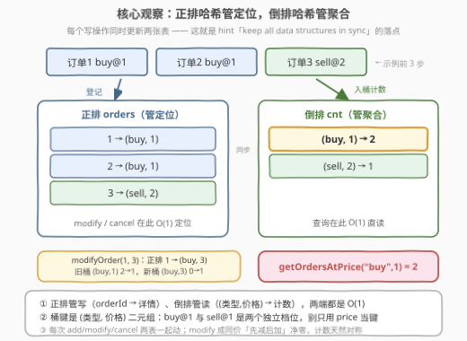
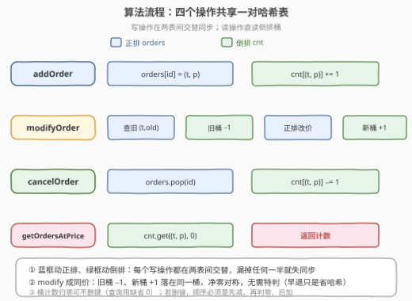

# LeetCode 设计订单管理系统 题解

## 1. 题目概述

- **标题 / 题号**：设计订单管理系统（#3822，medium）
- **链接**：https://leetcode.cn/problems/design-order-management-system/
- **难度**：中等
- **标签**：设计、哈希表

> ⚠️ 本题为 LeetCode 付费题，题意描述根据官方示例用例与 hints 重建，可能与官方题面有出入。

**题意**：设计一个订单管理系统，实时管理买单与卖单。每笔订单由三元组 `(orderId, orderType, price)` 描述，`orderType` 为 `"buy"`（买单）或 `"sell"`（卖单）。实现 `OrderManagementSystem` 类：

- `OrderManagementSystem()`：初始化对象。
- `void addOrder(int orderId, String orderType, int price)`：添加一笔类型为 `orderType`、价格为 `price` 的订单。同一时刻活跃订单的 `orderId` 互不相同（推定）。
- `int getOrdersAtPrice(String orderType, int price)`：返回价格为 `price` 的 `orderType` 类型**活跃订单数量**；无匹配订单返回 `0`。
- `void modifyOrder(int orderId, int newPrice)`：将订单 `orderId` 的价格改为 `newPrice`，**类型不变**。题目保证该订单存在（推定）。
- `void cancelOrder(int orderId)`：取消订单 `orderId`，将其从系统中移除。题目保证该订单存在（推定）。

**示例 1**（按官方 `jsonExampleTestcases` 重建）：

```text
输入：
["OrderManagementSystem","addOrder","addOrder","addOrder","getOrdersAtPrice","modifyOrder","modifyOrder","getOrdersAtPrice","cancelOrder","cancelOrder","getOrdersAtPrice"]
[[],[1,"buy",1],[2,"buy",1],[3,"sell",2],["buy",1],[1,3],[2,1],["buy",1],[3],[2],["buy",1]]

输出：
[null, null, null, null, 2, null, null, 1, null, null, 0]

解释：
OrderManagementSystem obj = new OrderManagementSystem();
obj.addOrder(1, "buy", 1);       // 订单 1：买 @ 1
obj.addOrder(2, "buy", 1);       // 订单 2：买 @ 1
obj.addOrder(3, "sell", 2);      // 订单 3：卖 @ 2
obj.getOrdersAtPrice("buy", 1);  // buy@1 桶里有订单 1、2 → 2
obj.modifyOrder(1, 3);           // 订单 1 改价：buy@1 → buy@3
obj.modifyOrder(2, 1);           // 订单 2 改成原价：buy@1 → buy@1（净零）
obj.getOrdersAtPrice("buy", 1);  // buy@1 只剩订单 2 → 1
obj.cancelOrder(3);              // 撤销卖单 3
obj.cancelOrder(2);              // 撤销订单 2
obj.getOrdersAtPrice("buy", 1);  // buy@1 桶空 → 0
```

**约束条件**（付费题原文不可见，按同类题惯例推定）：

- $1 \le orderId \le 10^5$，同一时刻活跃订单的 `orderId` 互不相同
- `orderType` 仅取 `"buy"` 或 `"sell"`
- $1 \le price, newPrice \le 10^9$
- 各方法总调用次数不超过 $10^5$

> 💡 **审题关键**：① 查询的键是 `(orderType, price)` **二元组**——`buy@1` 与 `sell@1` 是两个互不相干的档位，别只用 `price` 当键；② `modifyOrder` 只改价、**不改类型**；③ 示例里 `modifyOrder(2, 1)` 把订单改成**原价**——官方埋的同步陷阱，计数「先减后加」必须对称；④ `price` 到 $10^9$ 只做哈希键、不参与运算，无溢出风险。

## 2. 解题思路

### 2.1 暴力思路：单列表存订单，每次操作线性扫

用一个数组存所有活跃订单 `(orderId, orderType, price)`：`addOrder` 尾插 `O(1)`；但 `modifyOrder` / `cancelOrder` 要按 `orderId` 找到目标、`getOrdersAtPrice` 要数遍全表——三者都是 $O(n)$ 线性扫。最坏 $10^5$ 次操作 × $10^5$ 笔订单 ≈ $10^{10}$ 次比较，必然超时。

瓶颈有两个：**写操作按 `orderId` 定位慢**、**读操作按 `(类型, 价格)` 聚合慢**——两个方向的访问模式完全不同。出路：给每个方向各配一张哈希表。

### 2.2 核心观察：正排 + 倒排双哈希



**观察一：一张「正排表」解决写定位。** 哈希表 `orders[orderId] = (orderType, price)` 把「按订单号找人」变成 $O(1)$——`modifyOrder` 取旧价格、`cancelOrder` 取类型与价格，都只查一次。

**观察二：一张「倒排表」解决读聚合。** 查询的键恰是 `(orderType, price)`，那就直接按这个键建桶：`cnt[(orderType, price)]` 记录该档位的活跃订单数，`getOrdersAtPrice` 直读桶，$O(1)$ 返回。**查询怎么问，索引就怎么建**——这是倒排索引（inverted index）的一句话精髓，搜索引擎、订单簿、排行榜都是它。

**观察三：每个写操作必须同时更新两张表。** 官方 hint 原话："make sure all related data structures stay in sync"。三个写操作落到两表上是固定搭配：

| 操作 | 正排 orders | 倒排 cnt |
|------|------------|----------|
| `addOrder(id, t, p)` | 写 `orders[id] = (t, p)` | `cnt[(t, p)] += 1` |
| `modifyOrder(id, np)` | 查旧 `(t, old)` → 改价 | `cnt[(t, old)] -= 1`，`cnt[(t, np)] += 1` |
| `cancelOrder(id)` | 弹出 `(t, p)` | `cnt[(t, p)] -= 1` |

> 💡 **一句话总结**：正排管「改谁删谁」，倒排管「查哪个桶」；写一次动两表，读只碰一张。全部操作 $O(1)$，$10^5$ 次调用瞬间跑完。

### 2.3 算法流程图



**逻辑执行步骤**：

| 步骤 | 操作 | 说明 |
|------|------|------|
| ① addOrder | 正排写入 + 倒排 +1 | 两次哈希写，各自 $O(1)$ |
| ② modifyOrder | 正排查旧 → 旧桶 −1 → 正排改价 → 新桶 +1 | 旧价只有正排知道，**必须先查后减** |
| ③ cancelOrder | 正排弹出 → 对应桶 −1 | 弹出的 `(t, p)` 即要减的桶 |
| ④ getOrdersAtPrice | 直读倒排桶 | `cnt.get((t, p), 0)`，缺省 0 |

> ⚠️ **同价修改的陷阱**：`modifyOrder(2, 1)` 把订单 2 改成原价——「旧桶 −1、新桶 +1」落在**同一个桶**上，净变化为 0，计数天然对称、结果不变。计数版对减加顺序其实不敏感；若实现「桶空删键」的版本，顺序必须是**先减、再判零、后加**。真正致命的是**漏掉任何一张表**：只改正排，查询立刻数错；只改倒排，下次 `modifyOrder` 会读到旧价格、扣错桶。

### 2.4 示例演算

以示例 1 全流程走一遍（跟踪两张表）：

| 操作 | orders（正排） | cnt（倒排） | getOrdersAtPrice |
|------|---------------|-------------|------------------|
| `addOrder(1,"buy",1)` | `{1:(buy,1)}` | `(buy,1):1` | — |
| `addOrder(2,"buy",1)` | `+ 2:(buy,1)` | `(buy,1):2` | — |
| `addOrder(3,"sell",2)` | `+ 3:(sell,2)` | `(sell,2):1` | — |
| `getOrdersAtPrice("buy",1)` | | 直读 `(buy,1)` | **2** ✓ |
| `modifyOrder(1,3)` | `1:(buy,3)` | `(buy,1):1, (buy,3):1` | — |
| `modifyOrder(2,1)` | 不变 | 净零，不变 | — |
| `getOrdersAtPrice("buy",1)` | | 直读 `(buy,1)` | **1** ✓ |
| `cancelOrder(3)` | 删 `3` | `(sell,2):0` | — |
| `cancelOrder(2)` | 删 `2` | `(buy,1):0` | — |
| `getOrdersAtPrice("buy",1)` | | 桶空 / 缺省 | **0** ✓ |

与期望输出 `[null, null, null, null, 2, null, null, 1, null, null, 0]` 逐项一致 ✓（首个 `null` 是构造函数）。

## 3. 参考代码

### C++

```cpp
class OrderManagementSystem {
    unordered_map<int, pair<string, int>> order;  // 正排：orderId -> (类型, 价格)
    map<pair<string, int>, int> cnt;              // 倒排：(类型, 价格) -> 活跃订单数

    // 倒排桶减一并保持干净：桶空则删键
    void dec(const string& t, int p) {
        auto it = cnt.find({t, p});
        if (--it->second == 0) cnt.erase(it);
    }

  public:
    void addOrder(int orderId, string orderType, int price) {
        order[orderId] = {orderType, price};
        cnt[{orderType, price}]++;
    }

    int getOrdersAtPrice(string orderType, int price) {
        auto it = cnt.find({orderType, price});
        return it == cnt.end() ? 0 : it->second;
    }

    void modifyOrder(int orderId, int newPrice) {
        auto [type, oldPrice] = order[orderId];    // 正排 O(1) 查旧价
        if (oldPrice == newPrice) return;          // 同价：净零，早退省两次哈希
        dec(type, oldPrice);
        order[orderId] = {type, newPrice};
        cnt[{type, newPrice}]++;
    }

    void cancelOrder(int orderId) {
        auto [type, price] = order[orderId];
        order.erase(orderId);
        dec(type, price);
    }
};
```

> 💡 **写法要点**：
> - `pair<string, int>` 没有现成哈希，倒排用 `map`（红黑树，$O(\log n)$）最省事；要抠成 $O(1)$ 可把键压成 `long long`（`price` 到 $10^9 < 2^{30}$，`key = price * 2 + (type == "sell")`）——本题量级下 `map` 足够快；
> - `dec` 统一「减一 + 判零删键」，`modifyOrder` / `cancelOrder` 共用；删空桶不是正确性必需（查询 `find` 不到返回 0），只是不让 `cnt` 驻留空桶；
> - 同价早退 `if (oldPrice == newPrice) return` 是优化而非正确性依赖——去掉它，先减后加依然对称正确。

### Python

```python
from collections import defaultdict


class OrderManagementSystem:
    def __init__(self):
        self.order = {}                  # 正排：orderId -> (orderType, price)
        self.cnt = defaultdict(int)      # 倒排：(orderType, price) -> 活跃订单数

    def addOrder(self, orderId: int, orderType: str, price: int) -> None:
        self.order[orderId] = (orderType, price)
        self.cnt[(orderType, price)] += 1

    def getOrdersAtPrice(self, orderType: str, price: int) -> int:
        return self.cnt.get((orderType, price), 0)   # .get 避免凭空建桶

    def modifyOrder(self, orderId: int, newPrice: int) -> None:
        orderType, oldPrice = self.order[orderId]    # 正排 O(1) 查旧价
        if oldPrice == newPrice:
            return                                   # 同价：净零，早退
        self.cnt[(orderType, oldPrice)] -= 1
        self.order[orderId] = (orderType, newPrice)
        self.cnt[(orderType, newPrice)] += 1

    def cancelOrder(self, orderId: int) -> None:
        orderType, price = self.order.pop(orderId)
        self.cnt[(orderType, price)] -= 1
```

> 💡 **写法要点**：
> - 桶计数减到 0 后留在 `cnt` 里也无妨——查询用 `.get(..., 0)`，空桶读出 0；桶数上界是历史出现过的 `(类型, 价格)` 组合数 ≤ 操作数；
> - `defaultdict` 的坑：查询千万别写 `self.cnt[key]`，会凭空建桶泄漏内存（同款提醒见本库 3815 题解）；
> - 若想删空桶：`if self.cnt[k] == 0: del self.cnt[k]`，注意先减后判零。

## 4. 复杂度分析

| 维度 | 复杂度 | 说明 |
|------|--------|------|
| 时间（全部操作） | $O(1)$；C++ 倒排用 `map` 时 $O(\log n)$ | Python `dict` / C++ `unordered_map` 均摊 $O(1)$；$10^5$ 次调用下 `map` 的 $\log n \approx 17$ 也无感 |
| 空间 | $O(q)$ | $q$ 为总操作数：正排 ≤ 活跃订单数，倒排 ≤ 历史出现过的档位数，均不超过 $q$ |

> - 对比暴力：最坏 $10^{10}$ 次比较 vs. 本解 $10^5$ 次哈希操作，差五个数量级——全部来自「按访问方向各建一张索引」。

## 5. 扩展：变体与进阶

**变体一：`getOrdersAtPrice` 返回订单号列表而非计数。** 倒排桶从 `int` 换成 `set<int>`（订单号集合）：`addOrder` 桶里 `add(id)`；`modifyOrder` 旧桶 `discard(id)` + 新桶 `add(id)`——同价修改删了再加回，天然无恙；`cancelOrder` `discard(id)`；查询返回 `sorted(bucket)` 或按题意排序。全部操作仍 $O(1)$ 均摊。桶值换成 `dict`（Python 3.7+ 保序）还能按插入序返回——「桶里放什么」由查询语义决定，「怎么分桶」不变。

**变体二：真·限价订单簿（撮合）。** 真实交易所里 `buy` / `sell` 要按**价格优先**撮合：最高买价与最低卖价撞线即成交。此时倒排要升级为按价格有序的结构——`map<int, int>` 维护各价位数量，`rbegin()` / `begin()` 取最优档，即本库 3815（设计拍卖系统）的有序集合套路；再加「时间优先」就在桶内挂队列。

**变体三：历史回溯。** 若要求查询「任意历史时刻」某档位的订单数，就得版本化——1146 快照数组的「版本号 + 有序数组二分」，或离线把询问按时间排序、逐事件回放。

## 6. 面试要点

**Q1：为什么必须两张哈希表？只用一张行不行？**

> 只用正排：查询得扫全部订单，$O(n)$。只用倒排：`modifyOrder` / `cancelOrder` 不知道订单当前的 `(类型, 价格)`，无从知道该减哪个桶。两张表的访问方向相反——一个按 `orderId` 写定位、一个按 `(类型, 价格)` 读聚合——各建一张索引才能两端都 $O(1)$。这是「正排 + 倒排」双索引的标准分工。

**Q2：`modifyOrder` 改成相同价格会不会出 bug？**

> 不会。「旧桶 −1、新桶 +1」作用在同一个桶上，净变化 0，计数天然对称——这正是官方示例埋 `modifyOrder(2, 1)` 的用意。写 `if (oldPrice == newPrice) return` 早退只是省两次哈希，不是正确性依赖。真正要小心的是「桶空删键」的实现：必须先减、再判零、后加。

**Q3：倒排桶计数归零后，要不要把键从哈希表里删掉？**

> 删不删都对：不删，查询 `get(..., 0)` 读空桶得 0，只是空桶驻留内存（上界 = 出现过的档位数 ≤ 操作数，通常可接受）；删，省内存但要保证「先减后判零」的顺序。工程上倾向删——订单簿的档位可能极多，空档位挂着会拖慢遍历类操作。

**Q4：为什么桶键是 `(orderType, price)` 二元组，不能只用 `price`？**

> 买卖两侧是两本独立的账：`buy@100` 与 `sell@100` 是两个档位。真实订单簿（order book）里 bid / ask 各自聚合，混在一个桶里查询就无法按类型过滤。凡是「多维查询键」，哈希键就得是完整元组——漏一维就是串数据。

**Q5：这题和 1396（设计地铁系统）、3815（设计拍卖系统）是什么关系？**

> 一家人。1396 是「双哈希各管一摊」的入门版；本题加上「写操作跨表同步」的倒排索引味道；3815 再叠一层有序集合维护名次。三题连刷正好铺出「设计题 = 按访问模式选数据结构 + 写路径同步」的完整心法。

> 💡 **一句话总结**：3822 = 正排哈希（orderId → 详情）+ 倒排哈希（(类型, 价格) → 计数）+ 写一次动两表。带走三点：查询怎么问索引就怎么建、同价修改靠先减后加的对称性、双表同步是设计题的生命线。

## 同类练习题

| # | 题目 | 与本题的关联 |
|---|------|-------------|
| 1396 | [设计地铁系统](https://leetcode.cn/problems/design-underground-system/) | 双哈希分工的入门款——一张管进行中旅程（定位），一张聚合区间统计 |
| 2353 | [设计食物评分系统](https://leetcode.cn/problems/design-a-food-rating-system/) | 哈希定位 + 有序集合名次，改评分的「删旧键插新键」是本题 `modifyOrder` 的进阶版 |
| 380 | [O(1) 时间插入、删除和获取随机元素](https://leetcode.cn/problems/insert-delete-getrandom-o1/) | 哈希 + 数组双结构同步删除的经典陷阱题 |
| 1146 | [快照数组](https://leetcode.cn/problems/snapshot-array/) | 本题变体三的出处——数据结构要支持「回到过去」时的版本化方案 |
| 3815 | [设计拍卖系统](https://leetcode.cn/problems/design-auction-system/) | 同系列设计题——当查询要「按名次取最优」时，倒排结构从哈希升级成有序集合 |
