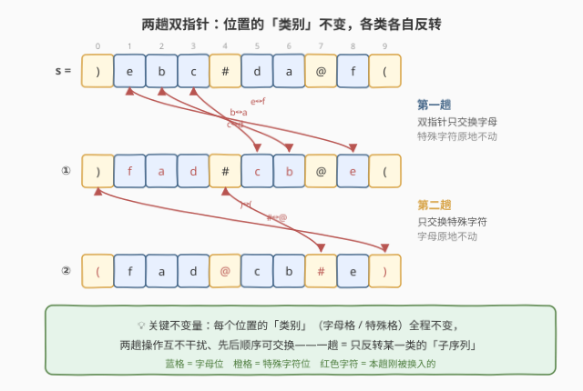
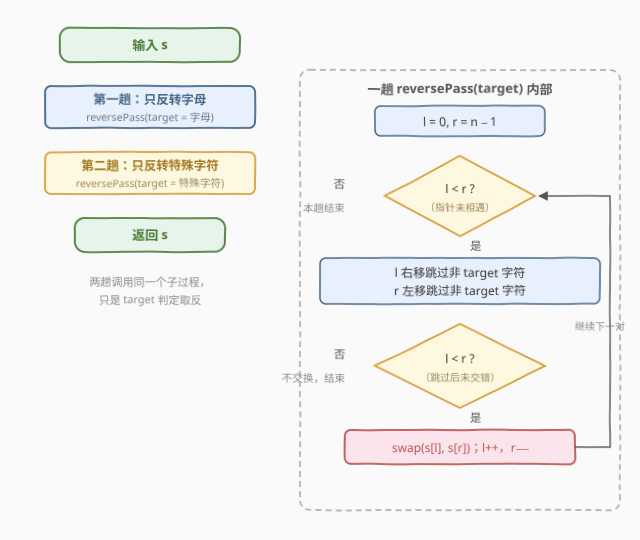

# 反转一个字符串里的字母后反转特殊字符

- **题目名称**：反转一个字符串里的字母后反转特殊字符
- **链接**：[3823. 反转一个字符串里的字母后反转特殊字符](https://leetcode.cn/problems/reverse-letters-then-special-characters-in-a-string/)
- **难度**：简单
- **标签**：双指针、字符串、模拟

## 1. 题目概述

给你一个由**小写英文字母**和**特殊字符**组成的字符串 `s`。任务是**按顺序**执行以下操作：

1. **反转**小写字母，并将它们放回原来字母所占据的位置；
2. **反转**特殊字符，并将它们放回原来特殊字符所占据的位置。

返回执行反转操作后的结果字符串。

**示例 1**：

```text
输入：s = ")ebc#da@f("
输出："(fad@cb#e)"
解释：
字母为 ['e','b','c','d','a','f']，反转得 ['f','a','d','c','b','e']，
  放回字母位置后 s = ")fad#cb@e("
特殊字符为 [')','#','@','(']，反转得 ['(','@','#',')']，
  放回特殊字符位置后 s = "(fad@cb#e)"
```

**示例 2**：

```text
输入：s = "z"
输出："z"
解释：仅一个字母，反转不变；没有特殊字符。
```

**示例 3**：

```text
输入：s = "!@#$%^&*()"
输出：")(*&^%$#@!"
解释：没有字母，反转特殊字符即反转整个字符串。
```

**约束条件**：

- $1 \le \text{s.length} \le 100$
- `s` 仅由小写英文字母和 `!@#$%^&*()` 中的特殊字符组成。

> 💡 **审题关键**：① 两次反转各自**保位**——字母只在"字母位"之间换位，特殊字符只在"特殊位"之间换位，**位置类别永远不变**；② "反转字母子序列"与"反转特殊字符子序列"这两件事互不干扰，先做哪个都一样；③ 特殊字符集是闭集（`!@#$%^&*()`），判定"是不是字母"只需检查 `a`–`z`。

---

## 2. 解题思路

### 2.1 直观思路：提取-反转-填回

最直接的模拟：扫一遍 `s`，把字母挑出来得序列 $A$、特殊字符挑出来得序列 $B$；把 $A$、$B$ 各自反转；再扫一遍 `s`，遇到字母位就填 $A$ 的下一个字符、遇到特殊位就填 $B$ 的下一个字符。三步都是线性扫描，总时间 $O(n)$，但要开两个辅助数组，空间 $O(n)$。

写起来也不难（Python 三个列表推导即可），但"反转后放回原位"这件事其实可以**原地**完成——不需要任何辅助数组。

### 2.2 核心观察：两趟原地双指针，"同类才交换"



**观察：交换两个同类字符，不改变任何位置的类别。** 字母位换成另一个字母、特殊位换成另一个特殊字符——"哪些下标是字母、哪些下标是特殊字符"这个**划分从头到尾不变**。于是两次操作可以解耦成两个独立的"**子序列反转**"问题，各自用一遍**首尾双指针**原地解决：

- **第一趟**（target = 字母）：`l` 从左、`r` 从右，各自**跳过非字母**，停在一对字母上就交换，然后 `l++`、`r--`，直到相遇。从左数第 $i$ 个字母与从右数第 $i$ 个字母配对互换——恰好等价于"反转字母子序列后放回原位"。
- **第二趟**（target = 特殊字符）：同样的循环，只是跳过/停留的判定条件取反。

这正是 [917. 仅仅反转字母](https://leetcode.cn/problems/reverse-only-letters/) 的"跳过式双指针"模板跑两遍：一趟负责字母、一趟负责特殊字符，**每趟只交换 target 类型的字符，另一类原样跳过**。整个算法不申请任何辅助数组。

> 💡 **为什么两趟顺序无关？** 第一趟交换的两个都是字母，位置类别不变 ⇒ 第二趟看到的"特殊字符位置集合"与初始完全相同；反之亦然。两个换位集合（字母对、特殊对）互不相交，作为置换可交换。

### 2.3 算法流程图



两趟调用**同一个子过程** `reversePass(target)`，只是 target 判定一个取"是字母"、一个取"不是字母"。子过程内部就是标准的跳过式双指针循环：外层 `l < r` 驱动，内层两个 `while` 让 `l`/`r` 各自跳到下一个 target 字符，第二次判 `l < r` 防止跳过后交错仍硬交换，交换后两端同时内收。

### 2.4 示例演算

以示例 1 `s = ")ebc#da@f("` 为例。

**第一趟（target = 字母）**：

| 轮次 | l 的停留 | r 的停留 | 动作 | s 的状态 |
|------|----------|----------|------|----------|
| 初始 | `)` 非字母 → l=1 停在 `e` | `(` 非字母 → r=8 停在 `f` | 交换 `e`↔`f`，l=2, r=7 | `)fbc#da@e(` |
| 2 | `b`（l=2） | `@` 非字母 → r=6 停在 `a` | 交换 `b`↔`a`，l=3, r=5 | `)fac#db@e(` |
| 3 | `c`（l=3） | `d`（r=5） | 交换 `c`↔`d`，l=4, r=4 | `)fad#cb@e(` |
| 结束 | l=r=4 | — | `l < r` 不成立，本趟结束 | `)fad#cb@e(` ✓ |

**第二趟（target = 特殊字符）**：

| 轮次 | l 的停留 | r 的停留 | 动作 | s 的状态 |
|------|----------|----------|------|----------|
| 1 | `)`（l=0） | `(`（r=9） | 交换 `)`↔`(`，l=1, r=8 | `(fad#cb@e)` |
| 2 | `f a d` 均字母 → l=4 停在 `#` | `e` 字母 → r=7 停在 `@` | 交换 `#`↔`@`，l=5, r=6 | `(fad@cb#e)` |
| 结束 | l=r=6 | — | 本趟结束 | `(fad@cb#e)` ✓ |

最终 `(fad@cb#e)`，与示例一致。

---

## 3. 参考代码

### C++

```cpp
class Solution {
    static bool isLetter(char c) { return c >= 'a' && c <= 'z'; }

    // 一趟：只反转 target 类型的字符（wantLetter = true 处理字母，false 处理特殊字符）
    void reversePass(string& s, bool wantLetter) {
        int l = 0, r = (int)s.size() - 1;
        while (l < r) {
            while (l < r && isLetter(s[l]) != wantLetter) l++;
            while (l < r && isLetter(s[r]) != wantLetter) r--;
            if (l < r) swap(s[l++], s[r--]);
        }
    }

public:
    string reverseByType(string s) {
        reversePass(s, true);   // 第一趟：只反转字母
        reversePass(s, false);  // 第二趟：只反转特殊字符
        return s;
    }
};
```

> 💡 **写法要点**：
> - `isLetter(s[l]) != wantLetter` 一个表达式同时服务两趟——第二趟只是**判定取反**，循环骨架完全复用；
> - 内层两个 `while` 都带 `l < r` 保护，防止越界；跳完后**必须再判一次 `l < r`** 才交换——例如 `s = "a)"`（假设），`l` 停在唯一的字母上时 `r` 也被拉到同一位置，此时交换自身虽无害，但依赖这个不变式思考更稳；
> - `swap(s[l++], s[r--])` 一行完成交换与双端内收。

### Python

```python
class Solution:
    def reverseByType(self, s: str) -> str:
        def reverse_pass(chars: list, want_letter: bool) -> None:
            l, r = 0, len(chars) - 1
            while l < r:
                while l < r and chars[l].isalpha() != want_letter:
                    l += 1
                while l < r and chars[r].isalpha() != want_letter:
                    r -= 1
                if l < r:
                    chars[l], chars[r] = chars[r], chars[l]
                    l += 1
                    r -= 1

        t = list(s)
        reverse_pass(t, True)    # 第一趟：只反转字母
        reverse_pass(t, False)   # 第二趟：只反转特殊字符
        return ''.join(t)
```

> 💡 `s` 只含小写字母与特殊字符，`str.isalpha()` 恰好等价于"是小写字母"。Python 字符串不可变，先 `list(s)` 转列表原地交换，最后 `join` 回来——比拼接字符串（$O(n^2)$）稳。已与"提取-反转-填回"暴力解对拍 20000 组随机用例，全部一致。

---

## 4. 复杂度分析

| 维度 | 复杂度 | 说明 |
|------|--------|------|
| 时间 | $O(n)$ | 两趟双指针，每个下标至多被 `l` 走过一次、被 `r` 走过一次，总计 $\le 4n$ 次比较 |
| 空间 | $O(1)$ | C++ 原地交换，仅两个下标变量（返回值不计）；Python 因字符串不可变需 $O(n)$ 的列表副本 |
| 规模判断 | $n \le 100$ | 即使 $O(n^2)$ 暴力也能过，但 $O(n)$/$O(1)$ 是该模板的自然复杂度 |

---

## 5. 扩展

**① 为什么"跳过式双指针"恰好等价于"反转子序列后放回原位"？** 设 target 字符（如字母）按出现顺序为 $a_1, a_2, \dots, a_m$。双指针每轮让最左未处理的 $a_i$ 与最右未处理的 $a_{m+1-i}$ 交换，处理完第 $k$ 轮后两端各锁定 $k$ 个——最终第 $i$ 个位置放的是 $a_{m+1-i}$，正是子序列反转的定义。

**② 一趟能做完吗？** 可以但没必要：一次扫描同时维护两对指针（字母的 `l1/r1` + 特殊的 `l2/r2`），每步各自跳各自换，正确性同上；但代码复杂度翻倍、可读性下降，两趟复用同一函数是更好的工程取舍。

**③ 三类及以上怎么办？** 若字符串有 $k$ 种类别（如大小写 + 数字 + 符号），泛化即为"跑 $k$ 趟、每趟一个谓词"，时间 $O(kn)$；类别数大时可退回"提取-反转-填回"的桶做法，一趟 $O(n)$ + $O(n)$ 空间。

---

## 6. 面试要点

**Q1：为什么两趟操作的先后顺序可以交换？**

> 交换只在同类字符之间发生，任何时刻"字母占据的下标集合"与"特殊字符占据的下标集合"都不变。两个换位集合互不相交、作为置换可交换，所以先反转字母还是先反转特殊字符，结果相同。

**Q2：跳过式双指针与普通的整体反转（[344. 反转字符串](https://leetcode.cn/problems/reverse-string/)）差在哪？**

> 整体反转是无条件交换 `s[l]`、`s[r]`；跳过式多两个内层 `while` 把指针**推到下一个 target 字符**再交换，非 target 字符像"礁石"一样被绕过。整体反转是 target = 一切字符的特例。

**Q3：交换前为什么要再判一次 `l < r`？**

> 跳过可能导致指针交错或相遇。例如 target 只剩一个未处理字符时，`l` 和 `r` 会停在同一位置（或擦肩），此时不应交换。缺这个判断虽常因"交换自身无害"而不报错，但 `l > r` 后继续循环可能引发逻辑混乱，显式判 `l < r` 是最稳的写法。

**Q4：这题和 [917. 仅仅反转字母](https://leetcode.cn/problems/reverse-only-letters/) 是什么关系？**

> 917 是"只反转字母、其他字符不动"，恰为本题的**第一趟**；本题再补一个判定取反的第二趟。面试中 917 是模板题，本题是在其上加了一层"操作可解耦"的观察。

**Q5：能否一遍扫描、原地、O(1) 空间同时完成两次反转？**

> 可以（见 5.②双指针对并行推进），但两趟写法复用同一子过程、每趟不变量单一，更不易写错。面试中先给出两趟版本讲清不变量，再提"可合并为一趟"作为优化讨论，层次感更好。

> 💡 **一句话总结**：3823 = 「位置类别不变 ⇒ 两次反转解耦」+「跳过式双指针跑两遍，第二遍谓词取反」，917 模板的直接扩展；三个带走的知识点：交换不改类别（两趟可交换）、跳过式双指针 = 子序列原地反转、判定谓词参数化让循环骨架复用。

---

## 7. 同类练习题

- [917. 仅仅反转字母](https://leetcode.cn/problems/reverse-only-letters/)（[题解](../0901-1000/917_仅仅反转字母.md)）：本题第一趟的"单飞版"，跳过式双指针的源头模板
- [344. 反转字符串](https://leetcode.cn/problems/reverse-string/)（[题解](../0301-0400/344_反转字符串.md)）：无条件首尾双指针交换，跳过式的特例与基础
- [151. 反转字符串中的单词](https://leetcode.cn/problems/reverse-words-in-a-string/)（[题解](../0101-0200/151_反转字符串中的单词.md)）：同样"反转子序列、保位跳过分隔符"的思想，分隔符即本题的特殊字符
- [283. 移动零](https://leetcode.cn/problems/move-zeroes/)：快慢指针"跳过/保留"某类字符的近亲，另一套保序双指针骨架
