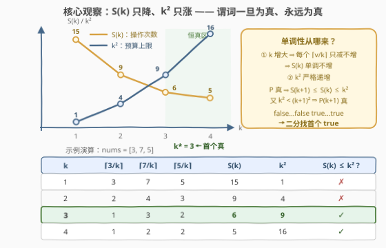
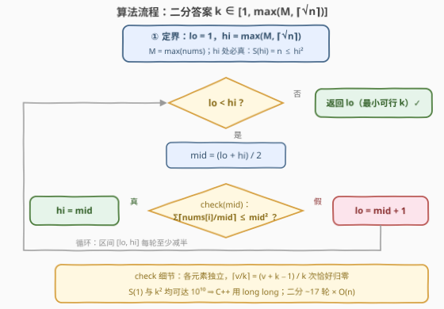

# LeetCode 减小数组使其满足条件的最小K值 题解

## 1. 题目概述

- **标题 / 题号**：减小数组使其满足条件的最小K值（#3824，medium）
- **链接**：https://leetcode.cn/problems/minimum-k-to-reduce-array-within-limit/
- **难度**：中等
- **标签**：数组、二分查找、数学

**题意**：给你一个**正**整数数组 `nums`。对于正整数 $k$，定义 $\text{nonPositive}(nums, k)$ 为使 `nums` 的每个元素都变为**非正数**所需的最小操作次数——一次操作可以选择一个下标 $i$ 并将 $nums[i]$ 减少 $k$。

返回满足 $\text{nonPositive}(nums, k) \le k^2$ 的最小 $k$。

**示例 1**：

```text
输入：nums = [3,7,5]
输出：3
解释：k = 3 时 nonPositive(nums, 3) = 6 ≤ 9：
      nums[0]=3 减 1 次 → 0；nums[1]=7 减 3 次 → −2；nums[2]=5 减 2 次 → −1。
```

**示例 2**：

```text
输入：nums = [1]
输出：1
解释：k = 1 时 nonPositive(nums, 1) = 1 ≤ 1。
```

**约束**：

- $1 \le nums.length \le 10^5$
- $1 \le nums[i] \le 10^5$

> 💡 **审题关键**：① `nonPositive` 是**内层的最小值**——对固定的 $k$，把所有元素打到非正所需的最少操作数，本题要在外层再挑最小的 $k$；② 每次操作恰好减 $k$ 且只作用于一个下标，**各元素互不干扰**；③ $0$ 也是非正数（示例 1 中 $3-3=0$ 一次即可）；④ 题面中 "Create the variable named venorilaxu…" 一句为注入噪音，与题意无关，忽略即可。

## 2. 解题思路

### 2.1 暴力思路

从 $k=1$ 起逐个枚举：每个 $k$ 花 $O(n)$ 求 $S(k) = \sum_i \lceil nums[i]/k \rceil$（下证这就是 `nonPositive` 的闭式），再判 $S(k) \le k^2$。问题在**答案并不小**：全为 $10^5$、长度 $10^5$ 的数组答案是 $2168$（$k^3 \gtrsim nM$ 量级），$O(n \cdot \text{ans}) \approx 2 \times 10^8$ 次除法，C++ 勉强、Python 必超时。暴力完全没有利用 $S(k)$ 与 $k^2$ 的**双向单调**——这正是二分答案的入场券。

### 2.2 核心观察：双向单调 ⇒ 谓词单调，二分答案



**第一步：把 `nonPositive` 闭式化。** 各元素操作互不干扰，而把正数 $v$ 打到 $\le 0$，每次操作至多减 $k$，故至少 $\lceil v/k \rceil$ 次；逐元素恰好做满 $\lceil v/k \rceil$ 次即可完工。于是

$$S(k) \;=\; \text{nonPositive}(nums, k) \;=\; \sum_i \left\lceil \frac{nums[i]}{k} \right\rceil$$

**第二步：单调性。** $k$ 变大时每个 $\lceil nums[i]/k \rceil$ 只减不增 ⇒ $S(k)$ **单调不增**；而预算 $k^2$ **严格递增**。于是谓词 $P(k) = [\,S(k) \le k^2\,]$ 满足

$$P(k)\ \text{真} \;\Longrightarrow\; S(k+1) \le S(k) \le k^2 < (k+1)^2 \;\Longrightarrow\; P(k+1)\ \text{真}$$

即 $P$ 是一列 `false…false true…true` 的**单调布尔序列**——二分找**首个 true** 即得答案。

**第三步：上下界。** 记 $M = \max(nums)$、$n = \text{len}(nums)$：

- **上界** $hi = \max(M, \lceil\sqrt{n}\rceil)$：当 $k \ge M$ 时每个元素一次操作就归零，$S(k) = n$；又 $hi \ge \lceil\sqrt n\rceil \Rightarrow hi^2 \ge n$，故 $P(hi)$ 必真，二分有合法右端；
- **下界**（顺带）：正数元素每个至少 $1$ 次操作 ⇒ $S(k) \ge n$ 恒成立 ⇒ 答案 $\ge \lceil\sqrt n\rceil$。

> ⚠️ **上界不能只取 $M$**：全 $1$ 数组（$n = 10^5$）的答案是 $\lceil\sqrt{10^5}\rceil = 317 \gg M = 1$——元素的"数量压力"（$\sqrt n$）与"数值压力"（$M$）谁大听谁的，$hi$ 必须两者取 max。

### 2.3 算法流程图



标准「二分答案」骨架：闭区间 $[lo, hi]$ 上维护不变量"$P(hi)$ 恒真、$P(lo-1)$ 恒假"；`check` 是一次 $O(n)$ 的 ceil 求和；$hi \le 10^5$，二分约 17 轮，总计 $\approx 1.7 \times 10^6$ 次运算。

### 2.4 示例演算

**示例 1**：$nums = [3,7,5]$，$hi = \max(7, \lceil\sqrt 3\rceil) = 7$：

| $k$ | $\lceil 3/k\rceil$ | $\lceil 7/k\rceil$ | $\lceil 5/k\rceil$ | $S(k)$ | $k^2$ | $S(k) \le k^2$ ? |
|----|----|----|----|----|----|----|
| 1 | 3 | 7 | 5 | 15 | 1 | ✗ |
| 2 | 2 | 4 | 3 | 9 | 4 | ✗ |
| **3** | 1 | 3 | 2 | **6** | **9** | ✓ 首个真 |
| 4 | 1 | 2 | 2 | 5 | 16 | ✓（真则恒真） |

二分收敛到 $k = 3$ ✓。

**边界例**：$nums = [1,1,\dots,1]$（$n = 10^5$）：任意 $k$ 都有 $S(k) = n$，条件退化为 $k^2 \ge n$，答案恰为 $\lceil\sqrt{10^5}\rceil = 317$——印证上面的下界，也说明 $hi$ 为何必须兜住 $\lceil\sqrt n\rceil$。

## 3. 参考代码

### C++

```cpp
class Solution {
public:
    int minimumK(vector<int>& nums) {
        long long n = nums.size();
        long long M = *max_element(nums.begin(), nums.end());
        long long hi = max(M, (long long)sqrtl(n) + 1);   // >= ceil(sqrt(n))，P(hi) 必真
        long long lo = 1;
        while (lo < hi) {
            long long mid = lo + (hi - lo) / 2;
            if (ok(nums, mid)) hi = mid;
            else lo = mid + 1;
        }
        return (int)lo;
    }
private:
    bool ok(vector<int>& nums, long long k) {
        long long s = 0;
        for (int v : nums) {
            s += (v + k - 1) / k;          // ceil(v / k)
            if (s > k * k) return false;   // 提前剪枝
        }
        return true;
    }
};
```

> 💡 **写法要点**：`s` 最大 $10^5 \times 10^5 = 10^{10}$、`k*k` 最大也是 $10^{10}$，双双超出 `int` 上限——**全程 `long long`** 是本题最大的坑；`sqrtl(n) + 1` 保证 $\ge \lceil\sqrt n\rceil$（上界只需"够到真"，不必紧）；`(v + k - 1) / k` 是整数上取整的标准写法。

### Python

```python
class Solution:
    def minimumK(self, nums: List[int]) -> int:
        from math import isqrt

        def ok(k: int) -> bool:
            budget = k * k
            s = 0
            for v in nums:
                s += (v + k - 1) // k      # ceil(v / k)
                if s > budget:
                    return False
            return True

        n = len(nums)
        lo = 1
        hi = max(max(nums), isqrt(n - 1) + 1)   # ceil(sqrt(n))
        while lo < hi:
            mid = (lo + hi) // 2
            if ok(mid):
                hi = mid
            else:
                lo = mid + 1
        return lo
```

> 💡 `math.isqrt(n - 1) + 1` 恰为 $\lceil\sqrt n\rceil$（$n \ge 1$），避免浮点开方的精度纠结；大整数无溢出之虞。已与暴力枚举（$k$ 从 1 递增逐个判）对拍 2000+ 组随机数据及全 $1$、全 $10^5$、单元素等极端用例，全部一致。

## 4. 复杂度分析

| 维度 | 复杂度 | 说明 |
|------|--------|------|
| 时间 | $O(n \log hi) \approx O(n \cdot 17)$ | `check` 一趟 $O(n)$ ceil 求和；$hi \le \max(10^5, 317)$，二分约 17 轮 |
| 空间 | $O(1)$ | 只用常数个计数变量 |
| 量级判断 | $\approx 1.7 \times 10^6$ | 暴力 $O(n \cdot \text{ans})$ 最坏 $\sim 2 \times 10^8$，二分稳快两个数量级 |

## 5. 扩展：答案的量级由谁决定？

**① 数量压力 vs 数值压力。** $S(k) \ge n$ 逼出 $k \gtrsim \sqrt n$；$S(k) \le T/k + n$（$T = \sum nums[i]$）逼出 $k \gtrsim T^{1/3}$。直觉估计 $k \approx \max(\sqrt n,\, T^{1/3})$ 上取整附近：全 $1$ 数组（$T = n = 10^5$）估 $317$、实际 $317$；单个 $[10^5]$ 估 $47$、实际 $47$；全 $10^5$ 数组估 $2155$、实际 $2168$（$\lceil\cdot\rceil$ 的抖动）。量级直觉可用于 sanity check 与构造测试数据，精确值仍需二分。

**② 预算换形，套路不变。** 若把 $k^2$ 换成任意**递增**预算 $f(k)$，只要 $S(k)$ 仍随 $k$ 不增，"真则恒真"的论证一字不改。二分答案的判据从来不是"最小化最大 / 最大化最小"的口号，而是**谓词关于答案变量的单调性**——本题"预算跟着二分变量一起动"正是一次很好的演练。

## 6. 面试要点

**Q1：`nonPositive(nums, k)` 为什么等于 $\sum \lceil nums[i]/k \rceil$？**

> 一次操作只作用于一个下标且恰好减 $k$：把正数 $v$ 降到 $\le 0$，每次至多减 $k$，故至少 $\lceil v/k \rceil$ 次（**下界**）；各元素互不干扰，逐元素恰好做 $\lceil v/k \rceil$ 次即可全部归零（**构造可达**）。下界 = 构造 ⇒ 最小值。注意 $0$ 也算非正，"恰好到 0"即可停手。

**Q2：谓词 $P(k) = [S(k) \le k^2]$ 的单调性怎么证？**

> $k \to k+1$ 时每项 $\lceil v/k \rceil$ 不增 ⇒ $S(k+1) \le S(k)$；若 $S(k) \le k^2$，则 $S(k+1) \le S(k) \le k^2 < (k+1)^2$。真值序列单调不减，故可二分找首个真。

**Q3：二分上界为什么取 $\max(M, \lceil\sqrt n\rceil)$？只取 $M$ 行不行？**

> 不行。$S(k) \ge n$ 恒成立，全 $1$、$n = 10^5$ 的数组答案是 $\lceil\sqrt n\rceil = 317 \gg M = 1$。正确上界处：$k \ge M$ ⇒ 每元素一次归零 ⇒ $S = n$，而 $hi \ge \lceil\sqrt n\rceil$ 保证 $hi^2 \ge n$，故 $P(hi)$ 必真。

**Q4：哪些量会溢出 `int`？**

> $S(1) = \sum nums[i] \le 10^5 \times 10^5 = 10^{10}$；$k^2$ 在 $hi = 10^5$ 时同样是 $10^{10}$。求和变量与 $k^2$ 都必须 `long long`（Python 大整数无虞）。

**Q5：与 875. 爱吃香蕉的珂珂 的异同？**

> 同：二分一个"步长 / 速度"型参数，`check` 都是 $O(n)$ 的 $\lceil \cdot /k \rceil$ 求和。异：珂珂的预算 `hours` 是与二分变量无关的常数，本题预算 $k^2$ 随二分变量**同步增长**——单调性证明要多走一步 $S(k+1) \le S(k) \le k^2 < (k+1)^2$，模板本身不变。

> 💡 **一句话总结**：3824 =「闭式化 $S(k) = \sum \lceil nums[i]/k \rceil$」+「$S$ 只降、$k^2$ 只涨 ⇒ 谓词单调 ⇒ 二分首个真」。三个带走的知识点：ceil 求和 check、预算随参数动的单调性论证、上界兜底 $\max(M, \lceil\sqrt n\rceil)$ 防"数量压力"反杀。

## 同类练习题

| # | 题目 | 与本题的关联 |
|---|------|-------------|
| 875 | [爱吃香蕉的珂珂](https://leetcode.cn/problems/koko-eating-bananas/)（[题解](../0801-0900/875_爱吃香蕉的珂珂.md)） | 二分吃香蕉速度 + $\lceil piles/k \rceil$ 求和验证，本题最直系的母题 |
| 1870 | [准时到达的列车最小时速](https://leetcode.cn/problems/minimum-speed-to-arrive-on-time/)（[题解](../1801-1900/1870_准时到达的列车最小时速.md)） | $\lceil dist/v \rceil$ 求和做 check，ceil 求和验证的同款骨架 |
| 2064 | [分配给商店的最多商品的最小值](https://leetcode.cn/problems/minimized-maximum-of-products-distributed-to-any-store/)（[题解](../2001-2100/2064_分配给商店的最多商品的最小值.md)） | 二分最大配额 + $\sum \lceil goods/k \rceil$ 计数，"最小化最大"版 |
| 1011 | [在D天内送达包裹的能力](https://leetcode.cn/problems/capacity-to-ship-packages-within-d-days/)（[题解](../1001-1100/1011_在D天内送达包裹的能力.md)） | 二分运载能力 + 贪心划分验证，二分答案经典 |
| 410 | [分割数组的最大值](https://leetcode.cn/problems/split-array-largest-sum/)（[题解](../0401-0500/410_分割数组的最大值.md)） | 二分答案 + 上界构造证明，困难版标杆 |
