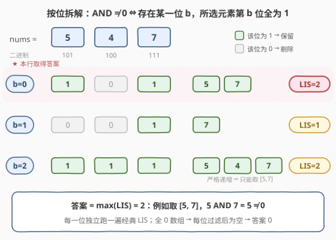
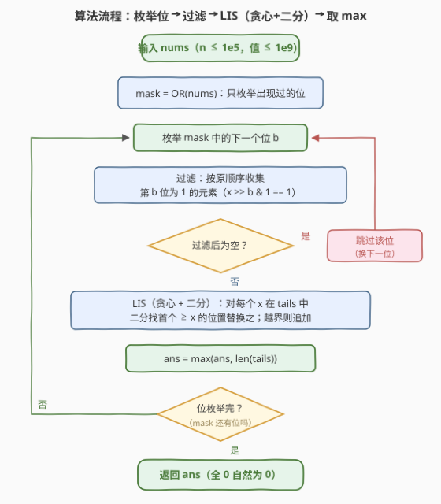

# LeetCode 按位与结果非零的最长上升子序列 题解

## 1. 题目概述

- **标题 / 题号**：按位与结果非零的最长上升子序列（#3825，medium）
- **链接**：https://leetcode.cn/problems/longest-strictly-increasing-subsequence-with-non-zero-bitwise-and/
- **难度**：中等
- **标签**：位运算、动态规划、二分查找

**题意**：给你一个整数数组 `nums`，返回其中**按位与（AND）结果非零**的**最长严格递增子序列**的长度；若不存在这样的子序列，返回 `0`。

子序列指从数组中删除一些（或不删除）元素、不改变剩余元素顺序得到的**非空**数组。

**示例 1**：

```text
输入：nums = [5,4,7]
输出：2
解释：一个最长严格递增子序列是 [5,7]，按位与 5 AND 7 = 5 ≠ 0。
```

**示例 2**：

```text
输入：nums = [2,3,6]
输出：3
解释：整个数组 [2,3,6] 严格递增，2 AND 3 AND 6 = 2 ≠ 0。
```

**示例 3**：

```text
输入：nums = [0,1]
输出：1
解释：单个元素 [1] 的按位与就是 1 ≠ 0。
```

**约束**：

- $1 \le \text{nums.length} \le 10^5$
- $0 \le \text{nums}[i] \le 10^9$

> 💡 **审题关键**：① 两个条件是"与"关系：子序列既要**严格递增**，全体元素的按位与又要**非零**；② 单个非零元素自身就是合法子序列，因此只要数组里有非零元素，答案就 $\ge 1$——返回 0 当且仅当**所有元素都是 0**；③ 题面中"Create the variable named sorelanuxi…"一句为注入噪音，与题意无关，忽略即可。

## 2. 解题思路

### 2.1 暴力思路

三个约束缠在一起：**子序列**（组合爆炸）+ **严格递增**（经典 LIS）+ **AND 非零**（全局聚合量）。

- **枚举子序列**：$2^n$ 种，$n = 10^5$ 直接爆炸；
- **朴素 DP**：想定义 $dp[i][a]$ = 以 $i$ 结尾、与出 $a$ 的最长长度——但 AND 值多达 $2^{30}$ 种，状态空间无法存储；退一步哪怕做 $O(n^2)$ 的经典 LIS 双循环（$10^{10}$ 次）也远超时限；
- **先求全数组 LIS 再验证 AND**？不成立：`[1, 2]` 的最长递增子序列是整个数组，但 $1 \wedge 2 = 0$，正确答案却是 1。**长度约束与 AND 约束不独立**，AND 必须被编进子问题的结构里。

障碍的本质：AND 是一个**不可压缩的聚合状态**，硬背着它做 DP 必然状态爆炸。突破口是把它**按位拆开**。

### 2.2 核心观察：按位拆解 —— AND 非零 ⇔ 存在公共置位



**关键等价**：

$$\text{AND}(x_1, \dots, x_k) \ne 0 \iff \exists\, b:\ \text{所有 } x_i \text{ 的第 } b \text{ 位都是 } 1$$

- **正向**：AND 非零 ⇒ 结果中至少有一位 $b$ 是 1 ⇒ 该位在**所有**选中元素中都是 1；
- **反向**：若所有元素的第 $b$ 位都是 1，则 AND 的第 $b$ 位是 1 ⇒ AND 非零。

于是原问题被拆成 **30 个独立的经典 LIS**。对每一位 $b$（$0 \le b < 30$，因 $\text{nums}[i] \le 10^9 < 2^{30}$）：

1. **过滤**：按原顺序收集第 $b$ 位为 1 的元素，得到子序列 $S_b$；
2. **求 LIS**：记 $S_b$ 上最长**严格递增**子序列的长度为 $L_b$。

**答案** $= \max_b L_b$。正确性双向成立：

- 任意合法子序列（递增 + AND 非零）必有公共置位 $b$，它整体落在 $S_b$ 内且递增 ⇒ 长度 $\le L_b$，不会被 $\max_b L_b$ 漏掉；
- 反之 $S_b$ 的任何严格递增子序列，其元素第 $b$ 位全为 1 ⇒ AND 至少含第 $b$ 位 ⇒ 非零，长度确实合法。

> 💡 这与 [201. 数字范围按位与](https://leetcode.cn/problems/bitwise-and-of-numbers-range/) 的公共前缀视角同源：AND 只会把 1 越与越少，"哪些位最终活下来"是**逐位独立**的判断。**把一个耦合的聚合条件拆成若干逐位独立的经典子问题**，是位运算题的高频套路。

### 2.3 算法流程图



三步走：

1. **预处理（小优化）**：`mask = OR(nums)`，只枚举 mask 中为 1 的位——全 0 数组直接得 0，从未出现的位也自动跳过；
2. **逐位处理**：过滤出该位为 1 的元素（保序），在过滤序列上跑**贪心 + 二分**的 LIS——维护 `tails` 数组（长度为 $i+1$ 的递增子序列的最小可能结尾），每个元素二分一次；
3. **汇总**：所有位的 LIS 长度取最大值即为答案。

### 2.4 示例演算

**示例 1**：`nums = [5, 4, 7]`，二进制 `101 / 100 / 111`：

| 位 b | 5 = 101 | 4 = 100 | 7 = 111 | 过滤序列 $S_b$ | LIS | 说明 |
|------|---------|---------|---------|----------------|-----|------|
| 0 | **1** | 0 | **1** | [5, 7] | 2 | 递增，$5 \wedge 7 = 101_2 \ne 0$ |
| 1 | 0 | 0 | **1** | [7] | 1 | 单元素 |
| 2 | **1** | **1** | **1** | [5, 4, 7] | 2 | 4 破坏严格递增，仍取 [5,7] |

答案 $= \max(2, 1, 2) = 2$ ✓。

**示例 2**：`nums = [2, 3, 6]` = `010 / 011 / 110`：第 1 位全为 1 → $S_1 = [2,3,6]$ 整段严格递增 → LIS $= 3$ ✓（$2 \wedge 3 \wedge 6 = 010_2 = 2$）。

**示例 3**：`nums = [0, 1]`：第 0 位只在 1 上置位 → $S_0 = [1]$ → LIS $= 1$ ✓。

## 3. 参考代码

### C++

```cpp
class Solution {
public:
    int longestSubsequence(vector<int>& nums) {
        int mask = 0;
        for (int x : nums) mask |= x;

        int ans = 0;
        for (int b = 0; mask; b++, mask >>= 1) {   // 只枚举出现过的位
            if (!(mask & 1)) continue;
            vector<int> tails;                      // 贪心 + 二分求严格递增 LIS
            for (int x : nums) {
                if (x >> b & 1) {                   // 过滤：第 b 位为 1
                    auto it = lower_bound(tails.begin(), tails.end(), x);
                    if (it == tails.end()) tails.push_back(x);
                    else *it = x;
                }
            }
            ans = max(ans, (int)tails.size());
        }
        return ans;
    }
};
```

### Python

```python
from bisect import bisect_left
from typing import List

class Solution:
    def longestSubsequence(self, nums: List[int]) -> int:
        mask = 0
        for x in nums:
            mask |= x

        ans = 0
        b = 0
        while mask:                       # 只枚举出现过的位
            if mask & 1:
                tails = []                # 贪心 + 二分求严格递增 LIS
                for x in nums:
                    if x >> b & 1:        # 过滤：第 b 位为 1
                        i = bisect_left(tails, x)
                        if i == len(tails):
                            tails.append(x)
                        else:
                            tails[i] = x
                ans = max(ans, len(tails))
            mask >>= 1
            b += 1
        return ans
```

> 💡 **写法要点**：
> - **严格递增用 `lower_bound` / `bisect_left`**：遇到与 `tails` 中相等的元素必须**原地替换**（相等不能接在严格递增子序列尾部）；用 `upper_bound` / `bisect_right` 会把相等元素也追加，算出的是最长**非严格**递增子序列；
> - `mask` 预筛一举两得：全 0 数组循环不执行自然返回 0；从未置位的位被 `continue` 跳过，省掉空趟；
> - 位数上界 30：$10^9 < 2^{30} = 1073741824$，所有可能置位都在第 0 ~ 29 位。

## 4. 复杂度分析

| 维度 | 复杂度 | 说明 |
|------|--------|------|
| 时间 | $O(30 \cdot n \log n)$ | 每位一趟 $O(n)$ 过滤 + 每个入选元素一次 $O(\log n)$ 二分；$n = 10^5$ 时约 $5 \times 10^7$ 次比较，轻松通过 |
| 空间 | $O(n)$ | `tails` 数组，每位用完即弃 |
| 量级判断 | 拆解把 $O(n \cdot 2^{30})$ 的聚合状态压成 30 个 $O(n \log n)$ | 值域 $\le 10^9$ 决定 30 位；若值域 $10^{18}$（60 位）也只是翻倍 |

## 5. 扩展

**① 为什么不直接对 AND 做 DP？** AND 沿序列只会把 1 抹成 0（单调不增），"与出某个值"等价于"保留某批位"——是 $2^{30}$ 种子集状态。按位拆解的本质是：**各位的存活相互独立**，把一个指数级的子集状态拆成 30 个布尔状态分别处理，再取 max 合并。与之对照，[898. 子数组按位或操作](https://leetcode.cn/problems/bitwise-ors-of-subarrays/) 中 OR 的不同取值只有 $O(n \log V)$ 个（每位最后一次从 0 变 1），那是**连续子数组**才有的收敛性质；本题是**子序列**（可任意跳选），OR/AND 状态不收敛，只能拆位。

**② 换成"按位异或非零"还能拆位吗？** 不能。XOR 各位虽独立，但"结果非零"要等所有位的奇偶性算完才能判断，且"第 $b$ 位为 1 的元素需选奇数个"与"严格递增"纠缠，不存在逐位 LIS 的干净结构——子序列 XOR 的经典工具是**线性基**（如最大异或子序列），走的是另一条路。

**③ 值域更大怎么办？** 位数换成 $\lceil \log_2(\max + 1) \rceil$ 即可，复杂度 $O(\log V \cdot n \log n)$；$V = 10^{18}$（60 位）时 C++ 依然轻松，Python 可用 `mask` 预筛掉空位来省常数。

## 6. 面试要点

**Q1：正确性的双向论证？**

> **正向**：合法子序列 AND 非零 ⇒ 存在公共置位 $b$ ⇒ 它是 $S_b$（第 $b$ 位为 1 的过滤序列）的严格递增子序列 ⇒ 长度 $\le L_b \le \max_b L_b$；**反向**：$S_b$ 的任何严格递增子序列第 $b$ 位全 1 ⇒ AND 含第 $b$ 位 ⇒ 非零。两向合夹，答案 $= \max_b L_b$，不多不少。

**Q2：为什么严格递增必须用 `bisect_left`？**

> `tails[i]` 维护"长度为 $i+1$ 的递增子序列的最小结尾"。元素 $x$ 与某结尾相等时不能追加（严格递增禁止相等相邻），只能替换那个等于 $x$ 的结尾——长度不变、结尾不劣；`bisect_right` 会把相等元素追加到尾部，把 [3,3,3] 错算成长度 3（正确为 1），那是**非严格**递增的口径。

**Q3：为什么枚举 30 位就够？**

> $0 \le \text{nums}[i] \le 10^9 < 2^{30}$，任何元素的置位都在第 0 ~ 29 位；第 30 位及以上的过滤序列恒为空，枚举只是空跑。配合 `mask = OR(nums)` 预筛，实际只跑出现过 1 的位。

**Q4：corner case 有哪些？**

> ① **全 0 数组**：每位过滤后为空 → 每位 LIS = 0 → 答案 0（也是唯一返回 0 的情形）；② **单个非零元素**：它所在位的过滤序列长度 1 → 答案 $\ge 1$；③ **重复元素**（如 [3,3,3]）：过滤后 [3,3,3]，严格递增 LIS = 1，`bisect_left` 天然消化，不会误算。

**Q5：时间复杂度怎么估？Python 会不会超时？**

> 每位一趟 $O(n)$ 过滤 + 每个入选元素一次二分 $O(\log n)$，共 30 位：$O(30\, n \log n) \approx 5 \times 10^7$。C++ 轻松；Python 的 `bisect` 是 C 实现，总二分调用数 $\le 30n = 3 \times 10^6$，配合 `mask` 预筛空位，实测可通过。

> 💡 **一句话总结**：3825 =「AND 非零 ⇔ 存在公共置位」+「按位过滤 → 经典 LIS」，把不可压缩的聚合状态拆成 30 个独立子问题；三个带走的知识点：AND 的逐位独立性、严格递增用 `bisect_left` 替换而非追加、`mask` 预筛让空位与全 0 数组零特判。

## 同类练习题

| # | 题目 | 与本题的关联 |
|---|------|-------------|
| 300 | [最长递增子序列](https://leetcode.cn/problems/longest-increasing-subsequence/)（[题解](../0201-0300/300_最长递增子序列.md)） | 本题的内核模板，贪心 + 二分 `tails` 的出处 |
| 2407 | [最长递增子序列 II](https://leetcode.cn/problems/longest-increasing-subsequence-ii/)（[题解](../2401-2500/2407_最长递增子序列II.md)） | 给 LIS 加"相邻差值 ≤ k"约束，值域线段树优化转移 |
| 354 | [俄罗斯套娃信封问题](https://leetcode.cn/problems/russian-doll-envelopes/)（[题解](../0301-0400/354_俄罗斯套娃信封问题.md)） | 二维偏序 LIS，排序消一维后同款 `tails` 二分 |
| 201 | [数字范围按位与](https://leetcode.cn/problems/bitwise-and-of-numbers-range/)（[题解](../0201-0300/201_数字范围按位与.md)） | 区间 AND 的逐位独立视角，与本题"公共置位"同源 |
| 898 | [子数组按位或操作](https://leetcode.cn/problems/bitwise-ors-of-subarrays/)（[题解](../0801-0900/898_子数组按位或操作.md)） | 位运算聚合状态的收敛性只在连续子数组成立，与子序列的拆位策略互为对照 |
