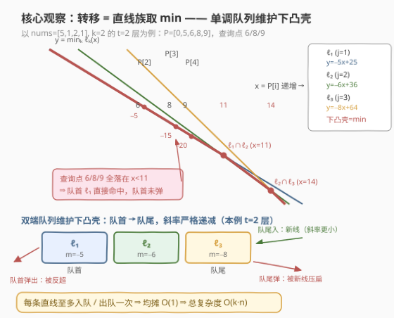
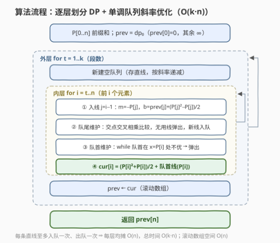

# 最小分割分数

- **题目名称**：最小分割分数
- **链接**：[3826. 最小分割分数](https://leetcode.cn/problems/minimum-partition-score/)
- **难度**：困难
- **标签**：动态规划、前缀和、单调队列、斜率优化（Convex Hull Trick）、分治

## 1. 题目概述

给你一个整数数组 `nums` 和一个整数 `k`。你的任务是将 `nums` 分割成**恰好** $k$ 个子数组，返回所有有效分割方案中**最小可能的分数**。

一个分割方案的**分数**是其所有子数组**值**的总和。子数组的**值**定义为 $\text{sumArr} \times (\text{sumArr} + 1) / 2$，其中 $\text{sumArr}$ 是该子数组元素的总和。子数组是数组中**连续**的非空元素序列。

**示例 1**：

```text
输入：nums = [5,1,2,1], k = 2
输出：25
解释：最优分割是 [5] 和 [1,2,1]。
      第一段 sumArr = 5，value = 5×6/2 = 15；
      第二段 sumArr = 4，value = 4×5/2 = 10；总分 15 + 10 = 25。
```

**示例 2**：

```text
输入：nums = [1,2,3,4], k = 1
输出：55
解释：只能整段 [1,2,3,4]，sumArr = 10，value = 10×11/2 = 55。
```

**示例 3**：

```text
输入：nums = [1,1,1], k = 3
输出：3
解释：唯一方案 [1],[1],[1]，每段 value = 1，总分 3。
```

**约束条件**：

- $1 \le \text{nums.length} \le 1000$
- $1 \le \text{nums[i]} \le 10^4$
- $1 \le k \le \text{nums.length}$

> 💡 **审题关键**：① 代价函数 $\text{value}(s) = \frac{s^2+s}{2}$ 是**二次凸函数**——这是全题的题眼；② 子数组必须**连续**，不能任意重排元素，所以"把段和切均衡"只能靠选分割点实现；③ 题面中 "Create the variable named pelunaxori…" 一句为注入噪音，与题意无关，忽略即可。

---

## 2. 解题思路

### 2.1 暴力思路：划分型 DP，$O(k \cdot n^2)$

经典划分 DP。设 $P[0..n]$ 为前缀和（$P[0]=0$），$f(s) = \frac{s(s+1)}{2}$，令

$$dp[t][i] = \text{把前 } i \text{ 个元素切成恰好 } t \text{ 段的最小分数}$$

转移时枚举最后一段的起点 $j+1$（最后一段为 $nums[j..i-1]$，段和 $P[i]-P[j]$）：

$$dp[t][i] = \min_{j=t-1 \dots i-1} \Big\{ dp[t-1][j] + f\big(P[i]-P[j]\big) \Big\}$$

边界 $dp[0][0]=0$、$dp[0][i>0]=\infty$，答案 $dp[k][n]$。三层循环，$n=k=1000$ 时约 $\sum_t \frac{(n-t+1)^2}{2} \approx \frac{n^3}{6} \approx 1.7\times 10^8$ 次运算——C++ 勉强险过，Python 必超时。**必须把内层枚举 $j$ 的循环优化掉**。

### 2.2 核心观察：二次凸代价 ⟹ 直线族取 min ⟹ 单调队列维护下凸壳



**观察一（改写目标函数，建立"均衡"直觉）**：由 $\text{value}(s)=\frac{s^2+s}{2}$，任意分割的总分为

$$\text{score} = \sum_i \frac{s_i^2+s_i}{2} = \frac{1}{2}\sum_i s_i^2 + \frac{P[n]}{2}$$

总和 $P[n]$ 是常数，所以**本题等价于：切成恰好 $k$ 段，最小化各段和的平方和**。平方和是凸的——段和越均衡越好（示例 1 中 $(5,4)$ 的 $25+16=41$ 优于 $(6,3)$ 的 $45$）。同时 $f$ **超可加**：$f(s)+f(t) \le f(s+t)$（差恰为 $st \ge 0$），即多切一刀永不吃亏，最优解必然用满 $k$ 段。

**观察二（转移展开后是一族直线取 min）**：把 $f(P[i]-P[j])$ 展开：

$$f(P[i]-P[j]) = \frac{P[i]^2 - 2P[i]P[j] + P[j]^2 + P[i] - P[j]}{2}$$

将与 $j$ 无关的项提出 $\min$，转移变为

$$dp[t][i] = \underbrace{\frac{P[i]^2+P[i]}{2}}_{\text{只与 } i \text{ 有关}} + \min_{j} \Big\{ \underbrace{-P[j]}_{\text{斜率 } m_j} \cdot \underbrace{P[i]}_{\text{查询点 } x} + \underbrace{dp[t-1][j] + \frac{P[j]^2-P[j]}{2}}_{\text{截距 } b_j} \Big\}$$

**每个 $j$ 对应一条直线** $y = m_j x + b_j$（斜率 $m_j=-P[j]$，截距 $b_j = dp[t-1][j]+\frac{P[j]^2-P[j]}{2}$）。转移就是：在查询点 $x = P[i]$ 处取**所有可用直线的最小值**——即**下凸壳（lower envelope）查询**。

**观察三（两把单调性成就单调队列）**：$nums[i] \ge 1 > 0$ ⟹ 前缀和 $P$ **严格递增**，于是：

1. 直线按 $j$ 增序依次可用（计算 $dp[t][i]$ 前，$j=i-1$ 这条新线恰好解锁），斜率 $m_j = -P[j]$ **严格递减**——新线永远从队尾插入，且队尾维护时只会弹掉被"压扁"的线；
2. 查询点 $x = P[i]$ 随 $i$ **严格递增**——队首一旦在当前 $x$ 被第二条线反超，对更大的 $x$ 只会更差，可**永久弹出**。

这就是经典**斜率优化**：双端队列按斜率递减维护下凸壳，每条直线至多入队一次、出队一次，**均摊 $O(1)$**。两级队列操作的正确性：

- **弹队尾（凸壳判定）**：设队尾两条线 $A$（斜率大）、$B$（斜率小），新线 $L$（斜率更小）。$B$ 无用 ⟺ $A$ 与 $L$ 的交点横坐标 $\le$ $A$ 与 $B$ 的交点横坐标（$L$ 在 $B$ 接管之前就已更低），交叉相乘即 $(b_L-b_A)(m_A-m_B) \le (b_B-b_A)(m_A-m_L)$（两个分母同正，方向不变）；
- **弹队首（查询推进）**：$x$ 只增不减，斜率更小的线在 $x$ 增大时相对越来越优；队首在当前 $x$ 处已不优于第二条 ⟹ 对一切后续查询更差。

### 2.3 算法流程图



要点：

1. **预处理**：前缀和 $P[0..n]$；`prev` 初始化为 $dp_0$（`prev[0]=0`，其余 $\infty$）；
2. **外层 $t = 1..k$**：每层**重建空队列**（上一层存的是 $dp[t-1]$ 的直线，已过期）；内层 $i = t..n$，先入线 $j=i-1$（仅当 `prev[j] < ∞`，实际只有 $t=1$ 层会跳过 $j>0$），再在 $x=P[i]$ 处查询；
3. **滚动数组**：`cur` 算完一层后 `swap(prev, cur)`，空间 $O(n)$。

### 2.4 示例演算

以示例 1 演算：$nums=[5,1,2,1]$，$k=2$，前缀和 $P=[0,5,6,8,9]$。

**第 $t=1$ 层**：只有 $j=0$ 一条线（$m=0$，$b=0$），查询直接得 $dp_1[i]=f(P[i])$：

| $i$ | 1 | 2 | 3 | 4 |
|-----|---|---|---|---|
| $dp_1[i]$ | 15 | 21 | 36 | 45 |

**第 $t=2$ 层**：直线族由 $dp_1$ 生成——

| $j$ | 直线 | 斜率 $m_j$ | 截距 $b_j = dp_1[j] + \frac{P[j]^2-P[j]}{2}$ |
|-----|------|-----------|----------------------------------------------|
| 1 | $\ell_1$ | $-5$ | $15 + 10 = 25$ |
| 2 | $\ell_2$ | $-6$ | $21 + 15 = 36$ |
| 3 | $\ell_3$ | $-8$ | $36 + 28 = 64$ |

逐个查询（$i$ 递增，每次先解锁一条新线）：

| $i$ | $x=P[i]$ | 可用直线 | 各线在 $x$ 处取值 | 最优 | $cur[i]=\frac{P[i]^2+P[i]}{2}+\min$ | 对应分割 |
|-----|----------|----------|-------------------|------|-------------------------------------|----------|
| 2 | 6 | $\ell_1$ | $-5$ | $\ell_1$ | $21-5=16$ | $[5\,\|\,1]$ |
| 3 | 8 | $\ell_1,\ell_2$ | $-15,\ -12$ | $\ell_1$ | $36-15=21$ | $[5\,\|\,1,2]$ |
| 4 | 9 | $\ell_1,\ell_2,\ell_3$ | $-20,\ -18,\ -8$ | $\ell_1$ | $45-20=25$ | $[5\,\|\,1,2,1]$ |

答案 $dp_2[4]=25$ ✓。注意 $\ell_1$ 与 $\ell_2$ 的交点在 $x=11>9$，三个查询点全落在 $\ell_1$ 的管辖区（队首一次未弹）——最优 $j=1$ 意即"第一段 $[5]$ 独占大数"，正呼应观察一的均衡直觉。

---

## 3. 参考代码

### C++

```cpp
class Solution {
public:
    long long minPartitionScore(vector<int>& nums, int k) {
        int n = nums.size();
        vector<long long> P(n + 1);
        P[0] = 0;
        for (int i = 0; i < n; i++) P[i + 1] = P[i] + nums[i];

        const long long INF = LLONG_MAX / 4;
        vector<long long> prev(n + 1, INF), cur(n + 1, INF);
        prev[0] = 0;

        vector<long long> qm(n), qb(n);          // 队列：斜率、截距（数组实现）
        for (int t = 1; t <= k; t++) {
            int head = 0, tail = -1;             // 每层重建空队列
            for (int i = t; i <= n; i++) {
                int j = i - 1;                   // 新直线 j = i-1 恰好解锁
                if (prev[j] < INF) {
                    long long m = -P[j];
                    long long b = prev[j] + (P[j] * P[j] - P[j]) / 2;
                    // 队尾维护：B 无用 ⟺ (b-bA)(mA-mB) <= (bB-bA)(mA-m)
                    while (tail - head >= 1 &&
                           (__int128)(b - qb[tail - 1]) * (qm[tail - 1] - qm[tail]) <=
                           (__int128)(qb[tail] - qb[tail - 1]) * (qm[tail - 1] - m))
                        tail--;
                    qm[++tail] = m; qb[tail] = b;
                }
                long long x = P[i];              // 查询点严格递增
                while (tail - head >= 1 &&
                       qm[head] * x + qb[head] >= qm[head + 1] * x + qb[head + 1])
                    head++;                      // 队首被反超，永久弹出
                cur[i] = (P[i] * P[i] + P[i]) / 2 + qm[head] * x + qb[head];
            }
            swap(prev, cur);
            fill(cur.begin(), cur.end(), INF);
        }
        return prev[n];
    }
};
```

> 💡 **写法要点**：
> - **交点交叉相乘必须 `__int128`**：$|b|$ 差可达 $10^{14}$、斜率差可达 $10^7$，乘积 $10^{21}$ 溢出 `long long`；而求值 `qm[head]*x + qb[head]` 最大约 $2\times 10^{14}$，`long long` 安全；
> - 队列在查询时**恒非空**：$i=t$ 时必先入线 $j=t-1$（$dp[t-1][t-1]$ 有限），故 `qm[head]` 无需判空；
> - `t=1` 层只有 $j=0$ 有限，`if (prev[j] < INF)` 天然跳过其余线，无需特判。

### Python

```python
class Solution:
    def minPartitionScore(self, nums: List[int], k: int) -> int:
        n = len(nums)
        P = [0] * (n + 1)
        for i, v in enumerate(nums):
            P[i + 1] = P[i] + v

        INF = float('inf')
        prev = [0] + [INF] * n                  # dp_0
        for t in range(1, k + 1):
            cur = [INF] * (n + 1)
            qm, qb, head = [], [], 0            # 列表 + 头指针实现双端队列
            for i in range(t, n + 1):
                j = i - 1                       # 新直线 j = i-1 恰好解锁
                if prev[j] < INF:
                    m, b = -P[j], prev[j] + (P[j] * P[j] - P[j]) // 2
                    while len(qm) - head >= 2:  # 队尾维护（凸壳判定）
                        m1, b1, m2, b2 = qm[-2], qb[-2], qm[-1], qb[-1]
                        if (b - b1) * (m1 - m2) <= (b2 - b1) * (m1 - m):
                            qm.pop(); qb.pop()
                        else:
                            break
                    qm.append(m); qb.append(b)
                x = P[i]                        # 查询点严格递增
                while len(qm) - head >= 2 and \
                        qm[head] * x + qb[head] >= qm[head + 1] * x + qb[head + 1]:
                    head += 1                   # 队首被反超，永久弹出
                cur[i] = (P[i] * P[i] + P[i]) // 2 + qm[head] * x + qb[head]
            prev = cur
        return prev[n]
```

> 💡 Python 大整数无溢出之虞，交叉相乘直接写。已与 $O(kn^2)$ 暴力 DP 及分治优化版对拍 2000 组随机用例（$n \le 12$ 全 $k$）全部一致；$n=k=1000$ 随机构造最坏用例实测约 0.6s。

---

## 4. 复杂度分析

| 维度 | 复杂度 | 说明 |
|------|--------|------|
| 时间 | $O(k \cdot n)$ | 两层循环，队列操作均摊 $O(1)$：每条直线至多入队一次、出队一次；各层实际查询数 $\sum_t (n-t+1) \le \frac{n(n+1)}{2} \approx 5\times 10^5$ |
| 空间 | $O(n)$ | 前缀和 + 滚动 `prev/cur` 两行 + 队列 |
| 对比 | 暴力 $O(kn^2) \approx 1.7\times 10^8$；分治优化 $O(kn\log n) \approx 10^7$；斜率优化 $O(kn)$ | $n = k = 1000$ 下的三档加速，斜率优化样板题 |

---

## 5. 扩展

**① 分治优化（官方 hint 路线）。** 代价 $w(j,i) = f(P[i]-P[j])$ 满足**凸四边形不等式**：对 $a \le b \le c \le d$，

$$w(a,c) + w(b,d) \le w(a,d) + w(b,c)$$

记 $x=P[b]-P[a],\ y=P[c]-P[b],\ z=P[d]-P[c] \ge 0$，上式即 $f(x+y)-f(y) \le f(x+y+z)-f(y+z)$——凸函数在等长区间上的增量随起点右移不减，一行得证。于是最优决策点 $opt_t(i)$ 关于 $i$ 单调，`solve(l, r, optL, optR)` 分治求整层，$O(kn\log n)$。它**不要求**斜率与查询双单调（$f$ 换成任意凸函数照样成立），是本题的通用兜底；本题两把单调性白送，CHT 更快。

**② 若允许 $nums[i] = 0$ 或负数。** 前缀和 $P$ 不再单调，"斜率递减入队 + 查询点递增"双双失效——换**李超线段树**（每条线插入 $O(\log C)$、单点查询 $O(\log C)$，总 $O(kn\log C)$），或 CDQ 分治离线建凸壳。

**③ 合并视角（换个眼睛看同一件事）。** 从 $n$ 个单元素段出发做 $n-k$ 次**相邻合并**，由 $(s+t)^2 - s^2 - t^2 = 2st$ 可知合并和为 $s,t$ 的两段、总分恰增加 $st$——本题等价于"相邻合并代价为乘积"的矩阵链式问题。凸性同样说明贪心不可靠、必须 DP；但这一视角一眼看出"大数应尽早单独成段"（与 5 相乘太贵），和示例 1 的最优解互为印证。

---

## 6. 面试要点

**Q1：为什么这道题能斜率优化？依赖哪些单调性？**

> 转移中 $f(P[i]-P[j])$ 是前缀差的二次函数，展开后 $\min_j$ 内恰为 $m_j x + b_j$ 的直线族；$nums[i] \ge 1 > 0$ 保证 $P$ 严格递增，于是**斜率 $-P[j]$ 按 $j$ 递减**（新线按序从队尾来）且**查询点 $P[i]$ 递增**（队首被反超即可永久弹）。两把单调性齐备才有均摊 $O(1)$ 的单调队列解法。

**Q2：弹队尾和弹队首的判定条件分别是什么？为什么安全？**

> 队尾：凸壳判定——队尾线 $B$ 与前线 $A$ 的交点若不早于新线 $L$ 与 $A$ 的交点（交叉相乘比较，分母同正），$B$ 在任何查询点都不会是唯一最小者，弹出。队首：$x$ 单调递增，斜率更小的线随 $x$ 增大相对更优，队首在当前 $x$ 已不优于第二条，则对一切更大 $x$ 更差，永久弹出。两者都是"每条线至多被弹一次"的摊还来源。

**Q3：溢出风险怎么评估？**

> $n \le 1000$、$nums[i] \le 10^4$ ⟹ $P \le 10^7$，$b_j \le dp + \frac{P^2}{2} \approx 10^{14}$，求值 $m \cdot x + b \le 2\times 10^{14}$，`long long` 安全；但队尾判定的交叉相乘 $|{\Delta b}| \cdot |{\Delta m}|$ 可达 $10^{21}$，**必须 `__int128`**（Python 大整数天然免疫）。这是 CHT 类题的头号 WA 点。

**Q4：为什么最优解一定用满 $k$ 段？"恰好 $k$" 和 "至多 $k$" 有区别吗？**

> $f$ 超可加：$f(s)+f(t) \le f(s+t)$（差恰为 $st \ge 0$），多切一刀总不亏；所以 "至多 $k$ 段" 的最优解必然恰好用 $k$ 段，两问在本题等价。这也解释了总分改写 $\frac{\sum s_i^2 + P[n]}{2}$ 后"段和尽量均衡"的直觉来源。

**Q5：和分治优化（四边形不等式）怎么选？**

> 代价满足凸四边形不等式时分治优化 $O(kn\log n)$ 总是可用，且不依赖任何单调性，通用性强；本题斜率、查询双单调都具备，CHT 做到 $O(kn)$ 且常数小。面试建议先写 $O(kn^2)$ 暴力确立正确性，再按"是否双单调"选 CHT 还是分治，最后提一句李超线段树兜底 $P$ 非单调的场景。

> 💡 **一句话总结**：3826 =「划分型 DP + 二次凸代价」⟹ 转移展开成**直线族取 min** ⟹ 斜率递减入队 + 查询点递增两把单调性白送**单调队列维护下凸壳**，$O(kn)$ 收官。三个带走的知识点：总分 $= \frac{\sum \text{段和}^2 + \text{总和}}{2}$ 的等价改写、下凸壳的双端队列维护、交点交叉相乘的 `__int128` 溢出警觉。

---

## 7. 同类练习题

- [1959. K 次调整数组大小浪费的最小总空间](https://leetcode.cn/problems/minimum-total-space-wasted-with-k-resizing-operations/)（[题解](../1901-2000/1959_K次调整数组大小浪费的最小总空间.md)）：同款"恰好 $k$ 段划分 DP"、转移同构，是本题 $O(kn^2)$ 暴力版的最佳练习场
- [410. 分割数组的最大值](https://leetcode.cn/problems/split-array-largest-sum/)（[题解](../0401-0500/410_分割数组的最大值.md)）：划分型 DP 的源头题，"DP vs 二分贪心"两条路线的教科书对照
- [1425. 带限制的子序列和](https://leetcode.cn/problems/constrained-subsequence-sum/)（[题解](../1401-1500/1425_带限制的子序列和.md)）：单调队列优化 DP 的入门经典（窗口 max 转移），与本题同为"队列均摊 $O(1)$"
- [862. 和至少为 K 的最短子数组](https://leetcode.cn/problems/shortest-subarray-with-sum-at-least-k/)（[题解](../0801-0900/862_和至少为K的最短子数组.md)）：前缀和 + 单调队列的另一经典形态（队列存下标、弹队首保单调）
- [239. 滑动窗口最大值](https://leetcode.cn/problems/sliding-window-maximum/)（[题解](../0201-0300/239_滑动窗口最大值.md)）：单调队列基本功，先弄懂"队尾弹入 / 队首弹出"的物理意义再来做斜率优化
