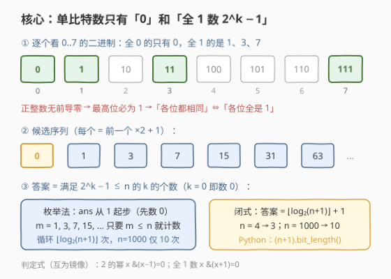
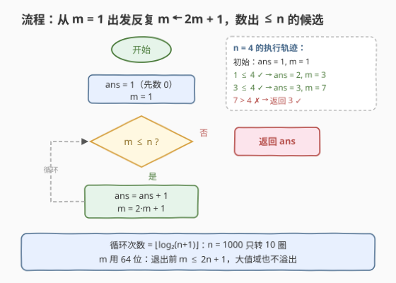

# 统计单比特整数

- **题目名称**：统计单比特整数
- **链接**：[3827. 统计单比特整数](https://leetcode.cn/problems/count-monobit-integers/)
- **难度**：简单
- **标签**：位运算、枚举、数学

## 1. 题目概述

给你一个整数 `n`。如果一个整数的二进制表示中**所有位都相同**，则称其为**单比特数**（Monobit）。返回范围 $[0, n]$（包括两端）内单比特数的个数。

**示例 1**：

```text
输入：n = 1
输出：2
解释：范围 [0, 1] 内的整数对应的二进制表示为 "0" 和 "1"。
      每个表示都由相同的位组成，因此答案是 2。
```

**示例 2**：

```text
输入：n = 4
输出：3
解释：范围 [0, 4] 内的二进制表示为 "0"、"1"、"10"、"11"、"100"。
      只有 0、1、3 满足单比特条件，因此答案是 3。
```

**约束条件**：

- $0 \le n \le 1000$

> 💡 **审题关键**：① 0 的二进制 "0" 只有一位、当然"所有位都相同"，**0 要算进去**；② 正整数的二进制**无前导零**，最高位必为 1——这直接决定了"所有位相同"的正数只能是**全 1**；③ $n \le 1000$ 很小，但最优解的复杂度与 $n$ 本身无关，只与 $\log n$ 有关。

---

## 2. 解题思路

### 2.1 暴力思路

遍历 $[0, n]$ 中每个整数 $x$，逐一判断它是不是单比特数。判断可以用一个位运算小技巧：**全 1 的数满足 $x \,\&\, (x+1) = 0$**（如 $7 = 111_2$，$7 + 1 = 1000_2$，按位与为 0；而 $0 \,\&\, 1 = 0$，恰好把 0 也涵盖）：

```python
ans = sum(x & (x + 1) == 0 for x in range(n + 1))
```

时间 $O(n)$，$n \le 1000$ 完全能过。但"逐个检查"本身就是浪费——单比特数是一个**已知的极小集合**，根本不需要扫描整个区间。

### 2.2 核心观察：单比特数只有「0」和「2^k − 1」



**观察一：正的单比特数必为全 1，即 $2^k - 1$。** 正整数二进制无前导零，最高位必是 1；若"所有位都相同"，则每一位都等于最高位的 1，形如 $11\cdots1_2 = 2^k - 1$（**梅森数**）：$1, 3, 7, 15, 31, \cdots$

**观察二：全 0 的数只有 0。** 任何正数至少有一个 1（最高位），不可能是"全 0"。

**结论**：$[0, n]$ 内的单比特数就是

$$\{\,0\,\} \cup \{\,2^k - 1 : k \ge 1\,\}$$

与 $[0, n]$ 的交集。**不需要枚举 $[0, n]$，只需枚举这 $O(\log n)$ 个候选**：$k$ 从 0 起步（$2^0 - 1 = 0$，正好把 0 并进来），只要 $2^k - 1 \le n$ 就计入。相邻候选满足递推

$$2^{k+1} - 1 = 2 \cdot (2^k - 1) + 1$$

即 `m ← 2m + 1`，连幂运算都不用。甚至有闭式：**答案 $= \lfloor \log_2(n+1) \rfloor + 1$**（$n \le 1000$ 时至多 10）。

> 💡 判定技巧的**镜像关系**：2 的幂判定是 $x \,\&\, (x-1) = 0$（去掉最低位的 1 后归零），全 1 数判定是 $x \,\&\, (x+1) = 0$（进位冲掉一整片 1）。一个抹低位、一个靠进位，两者互为对偶。

### 2.3 算法流程图



流程只有一个循环：`ans` 初始为 1（先把 0 计入），`m` 从 1 出发反复执行 $m \leftarrow 2m + 1$，只要 $m \le n$ 就 `ans++`。循环次数 $= \lfloor \log_2(n+1) \rfloor$，与 $n$ 的大小呈**对数**关系。

### 2.4 示例演算

**示例 2**（$n = 4$）：

| 步骤 | m | 判断 $m \le 4$? | ans |
|------|---|----------------|-----|
| 初始 | — | 先计入 0 | 1 |
| 1 | 1 | ✓ 计入 | 2 |
| 2 | 3 | ✓ 计入 | 3 |
| 3 | 7 | ✗ 退出循环 | **3** ✓ |

**上界验证**（$n = 1000$）：候选 $0, 1, 3, 7, 15, 31, 63, 127, 255, 511$ 全部 $\le 1000$，共 10 个；下一个 $2^{10} - 1 = 1023 > 1000$，答案恰为 10。

---

## 3. 参考代码

### C++

```cpp
class Solution {
public:
    int countMonobit(int n) {
        int ans = 1;                // 0 本身就是单比特数
        long long m = 1;            // 依次枚举 1, 3, 7, 15, ... 即 2^k - 1
        while (m <= n) {
            ans++;
            m = m * 2 + 1;          // 2^(k+1) - 1 = 2 * (2^k - 1) + 1
        }
        return ans;
    }
};
```

> 💡 `m` 用 `long long`：本题 $n \le 1000$ 用 `int` 也够，但若值域推广到 `INT_MAX`，退出循环前最后一次 `m = 2m + 1` 会先溢出再比较——64 位一步到位最稳。

### Python

```python
class Solution:
    def countMonobit(self, n: int) -> int:
        ans = 1              # 0 是单比特数
        m = 1                # 依次枚举 1, 3, 7, 15, ... (2^k - 1)
        while m <= n:
            ans += 1
            m = m * 2 + 1    # 2^(k+1) - 1 = 2 * (2^k - 1) + 1
        return ans
```

Python 还可以一行写闭式（$O(1)$）：

```python
class Solution:
    def countMonobit(self, n: int) -> int:
        return (n + 1).bit_length()   # floor(log2(n+1)) + 1
```

> 💡 对拍验证：`(n+1).bit_length()` 与枚举法在 $n \in [0, 10^6]$ 全区间一致；C++ 对应 C++20 的 `std::bit_width`。

---

## 4. 复杂度分析

| 维度 | 复杂度 | 说明 |
|------|--------|------|
| 时间 | $O(\log n)$ | 循环次数 $= \lfloor \log_2(n+1) \rfloor$；$n = 1000$ 时仅 10 次 |
| 空间 | $O(1)$ | 只有 `ans`、`m` 两个变量 |
| 对比暴力 | $O(n)$ | 逐个检查 $[0, n]$；本题能过，但思维停留在"扫描"层面 |

---

## 5. 扩展：从枚举到闭式

**① 为什么答案 $= \lfloor \log_2(n+1) \rfloor + 1$？** "$2^k - 1 \le n$" 等价于 "$2^k \le n + 1$"，满足它的非负整数 $k$ 恰有 $\lfloor \log_2(n+1) \rfloor + 1$ 个（$k = 0, 1, \cdots, \lfloor \log_2(n+1) \rfloor$）。于是 C++20 可写 `return bit_width((unsigned long long)n + 1);`——注意 $n = \text{INT\_MAX}$ 时 `n + 1` 会先溢出 `int`，必须先提升再相加。

**② 判定式 $x \,\&\, (x+1) = 0$ 的证明。** 设 $x > 0$ 且不全为 1，取其最低的 0 在第 $j$ 位：$x + 1$ 只把第 $j$ 位变 1、第 $j$ 位以下清零，**第 $j$ 位以上原样保留**——两者高于 $j$ 的位相同且不全为 0，按位与必非零；反之 $x = 2^k - 1$ 时 $x + 1 = 2^k$，与运算显然为 0。

**③ 值域推广。** $n \le 10^{18}$ 时算法完全不变，循环约 60 次；真正的瓶颈变成大整数的读入与比较，位运算枚举依然是最优做法。

---

## 6. 面试要点

**Q1：为什么正的单比特数一定是 $2^k - 1$？**

> 正整数二进制无前导零，最高位必为 1；"所有位都相同"迫使每一位都等于最高位的 1，即 $11\cdots1_2 = 2^k - 1$（梅森数）。全 0 的分支只有 0 本身，故候选集合为 $\{0\} \cup \{2^k - 1\}$。

**Q2：$x \,\&\, (x+1) = 0$ 为什么能判定"全 1"？**

> 全 1 数加一会进位成单薄的 $100\cdots0$，两数没有任何公共的 1 位；反过来，若 $x$ 含有 0 位，$x+1$ 只改变最低 0 位及以下，更高位的大片 1 原封不动，按位与必非零。它与 2 的幂判定 $x \,\&\, (x-1) = 0$ 恰好互为镜像。

**Q3：0 算不算单比特数？代码里怎么处理最干净？**

> 算——"0" 只有一位，所有位相同。最干净的处理是 `ans` 从 1 起步；或把 $k = 0$ 的 $2^0 - 1 = 0$ 并入候选序列，两种写法殊途同归（`0 & 1 == 0`，判定式天然包含它）。

**Q4：$n$ 只有 1000，为什么还强调 $O(\log n)$？**

> 题目约束小是"宽容"，不是"目标"。把 $n$ 换成 $10^{18}$，暴力立刻失效而枚举候选毫无变化——识别出**候选集合大小是 $\log$ 级**，才是本题考查的位运算直觉。

**Q5：循环里 $m = 2m + 1$ 会不会溢出或漏数？**

> 漏数不可能：递推严格生成 $2^k - 1$ 全体。溢出只需把 `m` 声明为 64 位——退出循环前最后一次 $m \le 2n + 1$，`long long` 在 $n \le 10^{18}$ 下依然安全。

> 💡 **一句话总结**：单比特数 $= \{0\} \cup \{2^k - 1\}$，枚举梅森数即得 $O(\log n)$；带走两个位运算判别式——2 的幂看 $x \,\&\, (x-1)$，全 1 看 $x \,\&\, (x+1)$。

---

## 7. 同类练习题

- [231. 2 的幂](https://leetcode.cn/problems/power-of-two/)（[题解](../0201-0300/231_2的幂.md)）：$x \,\&\, (x-1) = 0$ 判定 2 的幂，与本题的全 1 判定互为镜像
- [191. 位1的个数](https://leetcode.cn/problems/number-of-1-bits/)（[题解](../0001-0100/191_位1的个数.md)）：popcount 基础，位运算第一课
- [338. 比特位计数](https://leetcode.cn/problems/counting-bits/)（[题解](../0301-0400/338_比特位计数.md)）：$O(n)$ 批量统计每个数的 1 个数，位运算 DP
- [1009. 十进制整数的反码](https://leetcode.cn/problems/complement-of-base-10-integer/)（[题解](../1001-1100/1009_十进制整数的补数.md)）：构造与 $n$ 等长的全 1 掩码，正是本题的候选数
- [868. 二进制间距](https://leetcode.cn/problems/binary-gap/)（[题解](../0801-0900/868_二进制间距.md)）：逐位扫描二进制的基本功训练
