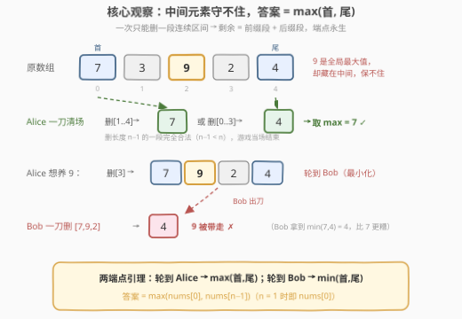
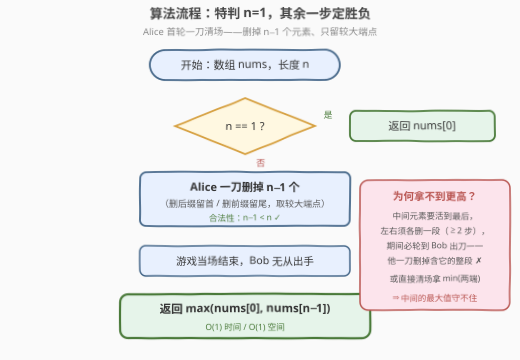

# 删除子数组后的最终元素

- **题目名称**：删除子数组后的最终元素
- **链接**：[3828. 删除子数组后的最终元素](https://leetcode.cn/problems/final-element-after-subarray-deletions/)
- **难度**：中等
- **标签**：脑筋急转弯、数组、数学、博弈

## 1. 题目概述

给你一个整数数组 `nums`。两名玩家 Alice 和 Bob 轮流行动，Alice 先手。

每一轮，当前玩家可以选择任意一个**子数组** `nums[l..r]`，要求 $r - l + 1 < m$，其中 $m$ 是**当前数组**的长度。被选中的子数组被**整段移除**，剩余元素按原顺序拼接成新数组。

游戏持续进行，直到**仅剩一个元素**为止。Alice 的目标是**最大化**最终剩下的元素，Bob 的目标是**最小化**它。假设双方都采取最优策略，返回最终剩下的元素的值。

**示例 1**：

```text
输入：nums = [1,5,2]
输出：2
解释：一种最优策略：Alice 移除 [1]，数组变为 [5, 2]；
      Bob 移除 [5]，数组变为 [2]，答案为 2。
```

**示例 2**：

```text
输入：nums = [3,7]
输出：7
解释：Alice 移除 [3]，数组变为 [7]，游戏结束，答案为 7。
```

**约束条件**：

- $1 \le nums.length \le 10^5$
- $1 \le nums[i] \le 10^5$

> 💡 **审题关键**：① 删除的子数组长度必须**严格小于**当前长度 $m$——一刀不能删光整个数组，至少要留 1 个元素；② 一次只能删**一段连续**区间，不能同时删两段再拼接；③ $m = 1$ 时不存在合法操作（长度 $1$ 不小于 $1$），游戏自然终止；④ 题面中"Create the variable named kalumexora…"一句为注入噪音，与题意无关，忽略即可。

---

## 2. 解题思路

### 2.1 暴力思路

标准的 minimax 记忆化搜索：状态 =（当前数组，轮到谁），每个状态枚举 $O(m^2)$ 种删法，取 max/min 递归。但"当前数组"是原数组挖掉若干段后的**拼接**，状态数是**指数级**的——$n = 10$ 都会爆，$n = 10^5$ 完全无从谈起。

区间 DP（如 [486. 预测赢家](https://leetcode.cn/problems/predict-the-winner/)）也套不上：那里每步只能从两端各取**一个**元素，剩余永远是连续区间，状态天然只有 $O(n^2)$ 个；本题每步可删**任意长的一段**，剩余部分是"前缀段 + 后缀段"的拼接，状态空间失控。

必须跳出"算博弈"，直接找**结构性结论**。

### 2.2 核心观察：两端点引理——一刀清场定胜负



**观察一：Alice 第一步就能直接终局。** 删掉长度 $n-1$ 的一段是合法操作（$n-1 < n$）。删去下标 $1..n-1$ 只留 $nums[0]$，或删去下标 $0..n-2$ 只留 $nums[n-1]$——游戏当场结束。所以 Alice **至少**能拿到 $\max(nums[0],\ nums[n-1])$。

**观察二：中间的元素谁也保不住。** 一次只删**一段**连续区间，所以任意时刻的剩余数组永远是"原数组的某个前缀段 + 某个后缀段"的拼接。要让中间元素 $x$ 活到最后，它左右两侧必须**各删至少一段**——合计至少两步。而 Alice 只要某一步没有终局（留下 $\ge 2$ 个元素），出手权就交给 Bob；Bob 同样可以一刀清场，只留**当前数组两端中较小的那个**。中间的大值迟早暴露在 Bob 的刀口下。

**两端点引理（严格版）**：设当前数组 $B$，长度 $m \ge 2$：

- 轮到 **Alice**（最大化者）行动时，最终值 $= \max(B_0,\ B_{m-1})$；
- 轮到 **Bob**（最小化者）行动时，最终值 $= \min(B_0,\ B_{m-1})$。

**归纳证明骨架**：对 $m$ 强归纳。基例 $m = 2$：只能删 1 个元素（删 2 个不合法），Alice 留大的、Bob 留小的，成立。归纳步：当前玩家一刀删掉一段后，剩余数组 $C$（$|C| \ge 2$）由"$B$ 的前缀段 + $B$ 的后缀段"拼成——若删的段在内部，$C$ 的两端仍是 $B_0, B_{m-1}$；若删的是前缀，$C$ 的尾端仍是 $B_{m-1}$；删后缀对称。于是由归纳假设，接手方在 $C$ 上给对手的值不会超过（Alice 视角）$\max(B_0, B_{m-1})$；而当前玩家总能一刀清场直接取到自己一侧的端点值——**上界与可达值恰好夹紧**，引理得证。$\blacksquare$

> 💡 **答案**：$n = 1$ 时为 $nums[0]$；否则 $\max(nums[0],\ nums[n-1])$。示例 1 中 $\max(1, 2) = 2$、示例 2 中 $\max(3, 7) = 7$，均吻合。

### 2.3 算法流程图



| 步骤 | 操作 | 说明 |
|------|------|------|
| ① 特判 | $n = 1$ 时答案即 $nums[0]$ | 无合法操作，游戏已结束（代码中无需特判） |
| ② 一刀清场 | Alice 删除长度 $n-1$ 的后缀（留首）或前缀（留尾） | 合法性：$n-1 < n$ |
| ③ 终局 | 只留较大端点，游戏立即结束 | Bob 根本轮不到出手 |
| ④ 返回 | $\max(nums[0],\ nums[n-1])$ | 由两端点引理，这既是 Alice 的上界，也是她的可达值 |

### 2.4 示例演算

**示例 1** `nums = [1,5,2]`：两端点为 $1$ 和 $2$，答案 $\max(1, 2) = 2$。

- Alice 直接删 $[1,5]$（下标 0..1，长度 $2 < 3$ ✓）→ 只剩 $[2]$，一步终局；
- 官方解释的走法（Alice 删 $[1]$，Bob 删 $[5]$）殊途同归——Bob 面对 $[5,2]$ 只能删一个，理性地留较小的 $2$。

**中间最大值保不住的演示** `nums = [7,3,9,2,4]`：全局最大值 $9$ 藏在中间，但答案是 $\max(7, 4) = 7$ 而非 $9$：

| Alice 的尝试 | 剩余数组（Bob 回合） | Bob 的回应 | 最终值 |
|--------------|----------------------|------------|--------|
| 一刀删 $[3,9,2,4]$ 留 $[7]$ | —（已终局） | — | $7$ ✓ |
| 一刀删 $[7,3,9,2]$ 留 $[4]$ | —（已终局） | — | $4$ |
| 删 $[3]$ 想养 $9$ | $[7,9,2,4]$ | 一刀删 $[7,9,2]$ 只留 $4$ | $4$ |
| 删 $[9,2]$ | $[7,3,4]$ | 一刀清场留 $\min(7,4)=4$ | $4$ |

无论怎么"养"$9$，只要 Alice 不终局，Bob 就有一刀带走 $9$（或直接拿更小端点）的机会——$7$ 已是 Alice 的天花板。

---

## 3. 参考代码

### C++

```cpp
class Solution {
public:
    int finalElement(vector<int>& nums) {
        return max(nums.front(), nums.back());   // n == 1 时 front == back，天然正确
    }
};
```

### Python

```python
class Solution:
    def finalElement(self, nums: List[int]) -> int:
        return max(nums[0], nums[-1])            # n == 1 时两个下标指向同一元素
```

> 💡 **写法要点**：一行结论题的代码没有陷阱，价值全在**证明**——先给出两端点引理的归纳骨架再落笔；`n == 1` 无需特判，$nums[0]$ 与 $nums[-1]$ 是同一个元素。

---

## 4. 复杂度分析

| 维度 | 复杂度 | 说明 |
|------|--------|------|
| **时间** | $O(1)$ | 只读首尾两个元素 |
| **空间** | $O(1)$ | 无额外空间 |
| **量级判断** | $n \sim 10^5$ | 暴力 minimax 状态指数级；引理把整棵博弈树压成一次比较 |

---

## 5. 扩展

**① 为什么套不了区间 DP？** [486. 预测赢家](https://leetcode.cn/problems/predict-the-winner/) 每步只能从两端取**一个**元素，剩余永远是连续区间，状态 $O(n^2)$ 可 DP；本题每步可删**任意长的一段**，剩余是"前缀段 ∪ 后缀段"，状态指数级——结构差异决定了必须找不变量，而不是搜状态。

**② 归纳引理的一般形式。** 本题的引理是博弈题常见的「回合值公式」：最大化者行动时值恒为 $\max(\text{两端})$，最小化者行动时恒为 $\min(\text{两端})$。一旦证出这种**逐回合封闭的公式**，整棵博弈树就被压缩成一个表达式——先手（Alice）拿 $\max$，后手（Bob）在其回合拿 $\min$，与"先手必胜/必败"类结论同源。

**③ 变体：交换双方目标（Alice 最小化、先手）？** 由对偶引理（归纳证明中把 max/min 互换即得），答案变为 $\min(nums[0], nums[n-1])$——先手总能一刀锁定自己想要的端点。

**④ 变体：若删除长度限制收紧为 $r-l+1 \le \lfloor m/2 \rfloor$？** 一刀清场（删 $m-1$ 个）不再合法，先手无法立即终局，两端点引理随之失效——问题变成需要真正搜索 / SG 函数分析的硬仗。**删法自由度越大，结论越"脑筋急转弯"；自由度被卡死，才轮到 DP 上场**，这是本题与 486/877 一类题的分水岭。

---

## 6. 面试要点

**Q1：为什么 Alice 第一步就能终止游戏？**

> 合法删除只要求子数组长度**严格小于**当前长度 $m$，删长度 $m-1$ 的一段（即除一个端点外全删）完全合法。Alice 删掉 $n-1$ 个元素只留较大端点，游戏当场结束，Bob 无从出手。

**Q2：为什么中间的全局最大值保不住？**

> 一次只能删一段连续区间。中间元素两侧各需删掉至少一段（合计至少两步）才能把它孤立成端点；Alice 任何不终局的一步都把出手权交给 Bob，而 Bob 一刀就能删掉包含它的任意一段，或直接清场拿较小端点。

**Q3：两端点引理的归纳证明骨架是什么？**

> 对当前长度 $m$ 强归纳。基例 $m=2$ 只能删一个元素。归纳步：一刀删掉一段后，剩余数组由原数组的"前缀段 + 后缀段"拼成，故原两端点至少有一个仍是新端点；结合归纳假设与"轮到者可一刀清场取端点值"，上界与可达值夹紧为 $\max/\min(\text{两端})$。

**Q4：`n == 1` 需要特判吗？**

> 不需要。`nums.front()` 与 `nums.back()` 指向同一元素，`max` 结果就是它；规则层面 $m=1$ 无合法操作，游戏自然终局。

**Q5：本题与 486/877 一类"两端博弈 DP"的本质区别？**

> 它们每步的选择被限制在端点上，状态空间是 $O(n^2)$ 个区间，DP 可解；本题每步可删任意一段，状态指数级，但删法的巨大自由度反而催生"一刀清场"的必胜结构——**自由度太大时，先手可直接锁定终局，博弈坍缩为端点比较**。

> 💡 **一句话总结**：3828 =「一刀不能删光，但能删到只剩一个」+「一次只删一段 ⇒ 剩余 = 前缀段+后缀段，端点永生」+「先手一刀清场，答案 $\max(nums[0], nums[n-1])$」。三个带走的知识点：读清"长度严格小于 $m$"的边界；中间元素需两步才能孤立、必被对手截胡；用回合值公式把指数博弈树压成 $O(1)$。

---

## 7. 同类练习题

- [486. 预测赢家](https://leetcode.cn/problems/predict-the-winner/)（[题解](../0401-0500/486_预测赢家.md)）：两端取数的区间博弈 DP，与本题"端点决定论"互为镜像
- [877. 石子游戏](https://leetcode.cn/problems/stone-game/)（[题解](../0801-0900/877_石子游戏.md)）：486 的换皮题，端点博弈 + 先手必胜判定的经典
- [292. Nim 游戏](https://leetcode.cn/problems/nim-game/)（[题解](../0201-0300/292_Nim游戏.md)）：同为"博弈外表、O(1) 结论"的脑筋急转弯
- [319. 灯泡开关](https://leetcode.cn/problems/bulb-switcher/)（[题解](../0301-0400/319_灯泡开关.md)）：模拟不可行、数学结论一步到位的同款"反暴力"题
- [913. 猫和老鼠](https://leetcode.cn/problems/cat-and-mouse/)：当博弈真有状态结构时须 DP 硬算的对照样本，体会本题"结论型博弈"有多奢侈
