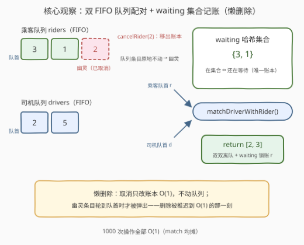
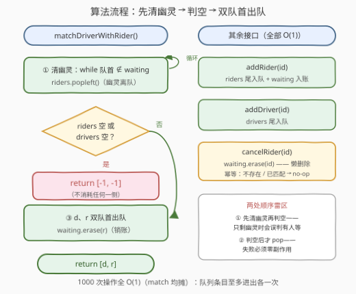

# 设计共享出行系统

- **题目名称**：设计共享出行系统
- **链接**：[3829. Design Ride Sharing System](https://leetcode.cn/problems/design-ride-sharing-system/)
- **难度**：中等
- **标签**：设计、队列、哈希表、数据流

## 1. 题目概述

设计一个共享出行系统，管理乘客的叫车请求与司机的空闲状态：乘客随时发出叫车请求，司机陆续变为可用，系统按**双方到达的先后顺序**配对。实现 `RideSharingSystem` 类：

- `RideSharingSystem()`：初始化对象。
- `void addRider(int riderId)`：乘客 `riderId` 发出叫车请求，进入等待。
- `void addDriver(int driverId)`：司机 `driverId` 变为可用。
- `int[] matchDriverWithRider()`：把**最早到达的空闲司机**与**最早等待的乘客**配对，并将两者从系统中移除，返回 `result = [driverId, riderId]`；无可用匹配时返回 `[-1, -1]`。
- `void cancelRider(int riderId)`：取消 `riderId` 的叫车请求，**前提是该乘客存在且尚未被匹配**（否则操作无效）。

**示例 1**：

```text
输入：
["RideSharingSystem","addRider","addDriver","addRider","matchDriverWithRider","addDriver","cancelRider","matchDriverWithRider","matchDriverWithRider"]
[[],[3],[2],[1],[],[5],[3],[],[]]

输出：
[null, null, null, null, [2,3], null, null, [5,1], [-1,-1]]

解释：
rideSharingSystem.addRider(3);            // 乘客 3 进入等待
rideSharingSystem.addDriver(2);           // 司机 2 上线
rideSharingSystem.addRider(1);            // 乘客 1 排在 3 之后
rideSharingSystem.matchDriverWithRider(); // 最早司机 2 × 最早乘客 3 → [2,3]
rideSharingSystem.addDriver(5);           // 司机 5 上线
rideSharingSystem.cancelRider(3);         // 3 已被匹配 → 无效操作
rideSharingSystem.matchDriverWithRider(); // [5,1]
rideSharingSystem.matchDriverWithRider(); // 双方皆空 → [-1,-1]
```

**示例 2**：

```text
输入：
["RideSharingSystem","addRider","addDriver","addDriver","matchDriverWithRider","addRider","cancelRider","matchDriverWithRider"]
[[],[8],[8],[6],[],[2],[2],[]]

输出：
[null, null, null, null, [8,8], null, null, [-1,-1]]

解释：
addRider(8); addDriver(8); addDriver(6); // 乘客 8；司机 8、6 依次上线
matchDriverWithRider();                  // 最早司机 8 × 最早乘客 8 → [8,8]
addRider(2); cancelRider(2);             // 乘客 2 等待中取消
matchDriverWithRider();                  // 等待乘客已全部取消 → [-1,-1]（司机 6 保留）
```

**约束条件**：

- $1 \le riderId, driverId \le 1000$
- 每个 `riderId` 在乘客中唯一，最多被添加一次；`driverId` 同理
- `addRider`、`addDriver`、`matchDriverWithRider`、`cancelRider` 的调用总次数不超过 $1000$

> 💡 **审题关键**：① 匹配是「双 FIFO」——**最早乘客 × 最早司机**，与 id 数值大小无关（示例 2 的 `[8,8]` 还说明司机与乘客的 id 可以相同，两者是**独立的编号空间**）；② `cancelRider` 对「不存在 / 已匹配 / 已取消」的乘客一律**静默无效**（示例 1 的 `cancelRider(3)`）；③ 匹配失败**不消耗**任何一侧资源——返回 `[-1,-1]` 后司机、乘客都原地待命（示例 2 末尾司机 6 仍在等下一位乘客）；④ 操作总数 $\le 1000$，任何单次 $O(n)$ 的做法都能过——本题考的不是复杂度卡点，而是**数据流设计题的规范姿势**：如何让「FIFO 序 + 任意位置取消 + 队首配对」三件事同时 $O(1)$。

---

## 2. 解题思路

### 2.1 暴力思路：数组保序 + 中间删除

用两个动态数组按到达序存乘客和司机：`addRider` / `addDriver` 尾插；`cancelRider` 线性找到该乘客并 `erase`（数组中删 $O(n)$）；`matchDriverWithRider` 取两数组首元素再各自删头。

总代价 $O(q \cdot n) \approx 10^6$，在 $q \le 1000$ 的规模下毫无压力。但「数组中删」是数据流设计题的减分答案：取消一旦密集，每次都要搬移整段内存。真正的设计问题在于——**队列只擅长两头操作，而删除发生在中间**，如何调和？

### 2.2 核心观察：双 FIFO 队列 + 懒删除



**观察一：匹配语义 = 两条独立 FIFO 的队首配对。** 「按到达顺序匹配」意味着乘客序、司机序互不干扰——各自维护一条队列，`match` 时各取队首即可，连比较逻辑都不需要。

**观察二：取消是「记账」而非「搬运」。** 从队列中间删除是 $O(n)$，但注意——FIFO 保证每个在队条目**迟早会轮到队首**。把删除推迟到它到达队首的那一刻：`cancelRider` 只把它从哈希集合 `waiting` 中移走（$O(1)$ 记账），队列条目原地不动、成为「幽灵」；`match` 前先把队首的幽灵弹掉。这就是**懒删除**（lazy deletion）：每个队列条目至多进出各一次，弹幽灵的代价摊还给当初的 `addRider`，单次操作**均摊 $O(1)$**。

**观察三：`waiting` 集合是唯一事实来源。** 「在集合里 ⇔ 还在等待」。已匹配的乘客在 `match` 时被移出集合，已取消的在 `cancel` 时移出——于是 `cancelRider` 对这两类（以及从未存在过的）乘客统一退化为「删除一个不存在的键」，天然幂等，题目「前提是存在且未被匹配」的约束零特判代码。

三个结构各司其职：

| 结构 | 职责 | 单次操作 |
|------|------|---------|
| `riders` 双端队列 | 乘客到达序（含待清理的幽灵条目） | 队尾加 / 队首弹 $O(1)$ |
| `drivers` 双端队列 | 司机到达序 | 队尾加 / 队首弹 $O(1)$ |
| `waiting` 哈希集合 | 乘客是否仍在等待（对账账本） | 查 / 增 / 删 $O(1)$ |

> 💡 **一句话总结**：两条 deque 管「序」，一个 set 管「账」；取消只记账不动队（懒删除），配对前先按账清幽灵。每个接口都是 $O(1)$（match 均摊），$10^3$ 次调用瞬间出解。

### 2.3 算法流程图



**逻辑执行步骤**：

| 步骤 | 操作 | 说明 |
|------|------|------|
| ① 清幽灵 | `while riders 非空且队首 ∉ waiting: 队首出队` | 已取消乘客此刻才真正离队 |
| ② 判空 | `riders` 空 **或** `drivers` 空 → `return [-1, -1]` | 失败不消耗任何一侧资源 |
| ③ 配对 | `d = 司机队首出队`；`r = 乘客队首出队`；`waiting 移除 r` | 返回 `[d, r]` |

> ⚠️ **两处顺序雷区**：① 必须先清幽灵**再**判 `riders` 是否为空——若队列里只剩已取消乘客，不清就直接判「非空」会误以为还有人在等；② 必须两侧都确认有效**才**各自 `pop`——先弹了司机才发现没有乘客，司机就凭空丢了（违反审题关键③的零消耗原则）。

### 2.4 示例演算

示例 1 全流程（跟踪三个结构）：

| 操作 | riders 队列 | waiting 集 | drivers 队列 | 返回 |
|------|-------------|-----------|--------------|------|
| `addRider(3)` | `[3]` | `{3}` | `[]` | — |
| `addDriver(2)` | `[3]` | `{3}` | `[2]` | — |
| `addRider(1)` | `[3, 1]` | `{3, 1}` | `[2]` | — |
| `match` | `[]` | `{}` | `[]` | **[2, 3]** ✓ |
| `addDriver(5)` | `[]` | `{}` | `[5]` | — |
| `cancelRider(3)` | `[]` | `{}`（3 已不在，幂等） | `[5]` | — |
| `match` | `[]` | `{}` | `[]` | **[5, 1]** ✓ |
| `match` | `[]` | `{}` | `[]` | **[-1, -1]** ✓ |

示例 2 的关键一幕（懒删除的价值所在）：

| 操作 | riders 队列 | waiting 集 | drivers 队列 | 返回 |
|------|-------------|-----------|--------------|------|
| `addRider(8)` + 两次 `addDriver` | `[8]` | `{8}` | `[8, 6]` | — |
| `match` | `[]` | `{}` | `[6]` | **[8, 8]** ✓ |
| `addRider(2)` | `[2]` | `{2}` | `[6]` | — |
| `cancelRider(2)` | `[2]`（幽灵原地留队） | `{}` | `[6]` | — |
| `match` | 弹掉幽灵 2 → `[]` | `{}` | `[6]`（原地不动） | **[-1, -1]** ✓ |

---

## 3. 参考代码

### C++

```cpp
class RideSharingSystem {
    deque<int> riders;           // 乘客到达序（含已取消的幽灵条目）
    deque<int> drivers;          // 司机到达序
    unordered_set<int> waiting;  // 仍在等待的乘客 id —— 唯一事实来源

  public:
    void addRider(int riderId) {
        riders.push_back(riderId);
        waiting.insert(riderId);
    }

    void addDriver(int driverId) {
        drivers.push_back(driverId);
    }

    void cancelRider(int riderId) {
        waiting.erase(riderId);          // 懒删除：只记账，不动队列（幂等）
    }

    vector<int> matchDriverWithRider() {
        while (!riders.empty() && !waiting.count(riders.front()))
            riders.pop_front();          // 队首幽灵此刻才真正离队
        if (riders.empty() || drivers.empty())
            return {-1, -1};             // 失败不消耗任何资源
        int d = drivers.front(); drivers.pop_front();
        int r = riders.front(); riders.pop_front();
        waiting.erase(r);                // 已匹配，销账
        return {d, r};
    }
};
```

> 💡 **写法要点**：
> - `cancelRider` 就一行 `waiting.erase`——对「不存在 / 已匹配 / 已取消」三类目标，删除一个不在集合里的键本来就无事发生，幂等性替我们消化了全部前置条件；
> - 清幽灵的 `while` 必须放在判空**之前**，顺序不可交换（见 2.3 雷区①）；
> - 只有走完「清幽灵 + 双侧判空」的关卡，才允许 `pop` 任何一侧。

### Python

```python
from collections import deque
from typing import List


class RideSharingSystem:
    def __init__(self):
        self.riders = deque()       # 乘客到达序（含幽灵条目）
        self.drivers = deque()      # 司机到达序
        self.waiting = set()        # 仍在等待的乘客 id —— 唯一事实来源

    def addRider(self, riderId: int) -> None:
        self.riders.append(riderId)
        self.waiting.add(riderId)

    def addDriver(self, driverId: int) -> None:
        self.drivers.append(driverId)

    def cancelRider(self, riderId: int) -> None:
        self.waiting.discard(riderId)   # 懒删除：只记账，不动队列（幂等）

    def matchDriverWithRider(self) -> List[int]:
        while self.riders and self.riders[0] not in self.waiting:
            self.riders.popleft()       # 队首幽灵此刻才真正离队
        if not self.riders or not self.drivers:
            return [-1, -1]             # 失败不消耗任何资源
        d = self.drivers.popleft()
        r = self.riders.popleft()
        self.waiting.remove(r)          # 已匹配，销账
        return [d, r]
```

> 💡 **写法要点**：
> - 用 `set.discard` 而非 `remove`——后者删不存在的键会抛 `KeyError`，`discard` 天然幂等，正好对齐 `cancelRider` 的语义；
> - `self.riders[0] not in self.waiting` 是集合成员判定 $O(1)$，别误写成 `riders[0] not in riders` 之类对队列的线性扫；
> - 两份代码均已对示例 1 / 示例 2 逐步验证，输出逐项一致。

---

## 4. 复杂度分析

| 维度 | 复杂度 | 说明 |
|------|--------|------|
| `addRider` / `addDriver` 时间 | $O(1)$ | 队尾追加 + 集合插入 |
| `cancelRider` 时间 | $O(1)$ | 哈希集合删除（懒删除，队列零改动） |
| `matchDriverWithRider` 时间（均摊） | $O(1)$ | 每个队列条目至多进出各一次，弹幽灵总量 $\le$ add 总次数 |
| 空间 | $O(q)$ | $q \le 1000$ 为操作总数上界（两条队列 + 等待集合） |

> - $10^3$ 次操作全为 $O(1)$（match 均摊），总计 $10^3$ 量级基本运算；
> - 对比暴力：最坏 $O(q^2) = 10^6$——本题规模下也能过，但把每个接口做到 $O(1)$ 才是数据流设计的标准答案，规模放大 $10^6$ 倍时只有它不用换方案。

---

## 5. 扩展：真删除版——把中删也做成 O(1)

懒删除把代价推迟到队首，代价是幽灵条目暂占内存。若想「取消即真删」，需要**保插入序 + $O(1)$ 中删**的结构：

**Python**：3.7+ 的 `dict` 本身保插入序，`id -> None` 恰好是个「有序集合」——`pop(key)` 真删且不破坏其余顺序，`next(iter(d))` 取最早：

```python
from collections import deque
from typing import List


class RideSharingSystem:
    def __init__(self):
        self.riders = {}            # 保插入序的「有序集合」：id -> None
        self.drivers = deque()

    def addRider(self, riderId: int) -> None:
        self.riders[riderId] = None

    def addDriver(self, driverId: int) -> None:
        self.drivers.append(driverId)

    def cancelRider(self, riderId: int) -> None:
        self.riders.pop(riderId, None)     # O(1) 真删除，保序

    def matchDriverWithRider(self) -> List[int]:
        if not self.riders or not self.drivers:
            return [-1, -1]
        d = self.drivers.popleft()
        r = next(iter(self.riders))        # 最早插入且未被删除的乘客
        del self.riders[r]
        return [d, r]
```

**C++**：标准库没有保序可中删的现成结构，用 `list<int>` + `unordered_map<int, list<int>::iterator>` 定位——正是 **146 LRU 缓存**的经典组合：

```cpp
class RideSharingSystem {
    list<int> riders;
    unordered_map<int, list<int>::iterator> pos;  // riderId -> 队列节点
    deque<int> drivers;

  public:
    void addRider(int riderId) {
        riders.push_back(riderId);
        pos[riderId] = prev(riders.end());
    }

    void addDriver(int driverId) { drivers.push_back(driverId); }

    void cancelRider(int riderId) {
        auto it = pos.find(riderId);
        if (it != pos.end()) {           // 只删「仍在等待」的
            riders.erase(it->second);
            pos.erase(it);
        }
    }

    vector<int> matchDriverWithRider() {
        if (riders.empty() || drivers.empty()) return {-1, -1};
        int d = drivers.front(); drivers.pop_front();
        int r = riders.front(); riders.pop_front();
        pos.erase(r);
        return {d, r};
    }
};
```

两版取舍：真删除结构更省内存、`match` 无需清幽灵；懒删除版代码短一半、不做迭代器簿记。**规模不大时懒删除通常更划算**——这也是它在懒删除堆（2034 股票价格波动）里被反复重用的原因。

**变体速查**：若司机也能下线（`cancelDriver`），对称地再加一个司机等待集合即可；若匹配规则升级为「距离最近的司机」，FIFO 换成按 `(距离, 到达序)` 排序的有序集合，队首弹出改为取最小元；若同一乘客允许取消后**重新**叫车，懒删除版依然成立（新条目重新入队入集合，旧幽灵照常跳过），dict 真删除版则天然支持重插。

---

## 6. 面试要点

**Q1：为什么取消用懒删除，而不是直接把乘客从队列里删掉？**

> `deque` 只保证两头的 $O(1)$，中间删除要线性定位 + 搬移。懒删除把「删除」改写成「记账」（从 `waiting` 集合移除，$O(1)$），真正的离队推迟到该条目自然到达队首的 `match` 时刻。正确性靠 `waiting` 集合对账；代价上，每个条目至多被弹出一次，总弹出数 $\le$ 总添加数，均摊 $O(1)$。同款思想见懒删除堆（2034 股票价格波动）：哈希对账 + 弹出陈旧条目。

**Q2：`cancelRider` 对已匹配或不存在的乘客，为什么不用写任何判断？**

> `waiting` 是唯一事实来源：乘客匹配成功时已移出集合，取消时也移出。于是「存在且未匹配」⟺「在集合中」，而 `erase`/`discard` 一个不在集合里的键本来就是 no-op——幂等性天然覆盖「不存在、已匹配、重复取消」全部非法情形，前置条件零特判。

**Q3：`matchDriverWithRider` 里「清幽灵」和「判空」的顺序为什么不能反？**

> 若队列里只剩已取消的乘客（全是幽灵），先判空会得出「有乘客」的错误结论，进而误弹司机或误报成功。必须先把队首幽灵清干净，此时队列非空才真正意味着「有人在等」。同理，`pop` 两侧必须同时进行——任何一侧单独出队都会造成资源凭空丢失，违反匹配失败零消耗的语义。

**Q4：这题的复杂度底线在哪？暴力为什么也算「过」？**

> 操作总数 $\le 1000$，数组中删的 $O(q^2) = 10^6$ 毫无压力。面试官期待的不是「能不能过」，而是**可扩展的设计**：把每个接口做到 $O(1)$（match 均摊），规模放大到 $10^6$ 级别时方案不用换。回答时主动指出「本题规模不卡复杂度，但标准姿势是队列 + 懒删除」是加分项。

**Q5：如果同一乘客允许「取消后再次叫车」，现在的方案还成立吗？**

> 懒删除版成立：再次 `addRider` 追加新条目并重新入集合，旧幽灵照常被跳过——FIFO 语义按「最新一次请求」排位。但若允许**同一 id 同时挂多个等待请求**，`waiting` 集合（键唯一）就不够了，得改为计数或把「请求」封装成对象入队；dict 真删除版天然支持重插（重新赋值即回到末位）。边界语义一变，结构选择就要跟着重审——这是设计题的常态。

> 💡 **一句话总结**：3829 = 双 FIFO 队列 + waiting 集合懒删除。带走的三个关键：删除可以「记账不做工」、判空之前先清幽灵、失败操作必须零副作用。

---

## 7. 同类练习题

- [933. 最近的请求次数](https://leetcode.cn/problems/number-of-recent-calls/)：数据流上的纯 FIFO——入队 + 惰性弹出窗口外请求，与本题「队首清理」同一手法
- [146. LRU 缓存](https://leetcode.cn/problems/lru-cache/)：第 5 节真删除 C++ 版的出处——`list` + 哈希迭代器定位，$O(1)$ 保序中删的祖师爷
- [1670. 设计前中后队列](https://leetcode.cn/problems/design-front-middle-back-queue/)：`deque` 设计操练——双端操作语义与中位定位，练熟队列底层的控位能力
- [622. 设计循环队列](https://leetcode.cn/problems/design-circular-queue/)：用裸数组实现定容 FIFO，理解队列抽象背后的环形缓冲原理
- [2034. 股票价格波动](https://leetcode.cn/problems/stock-price-fluctuation/)：懒删除思想的进阶应用——哈希对账 + 堆弹陈旧条目，维护动态最值
