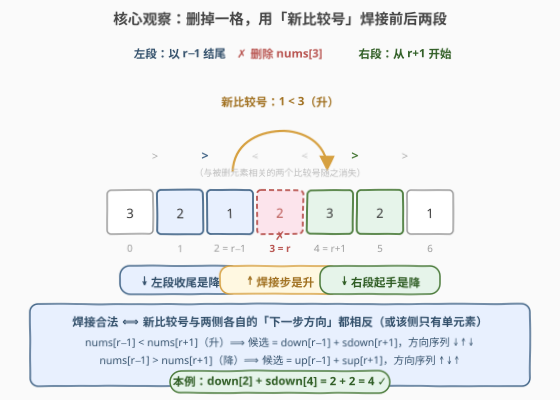
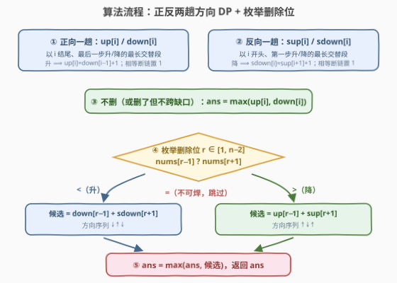

# 移除至多一个元素后的最长交替子数组

- **题目名称**：移除至多一个元素后的最长交替子数组
- **链接**：[3830. 移除至多一个元素后的最长交替子数组](https://leetcode.cn/problems/longest-alternating-subarray-after-removing-at-most-one-element/)
- **难度**：困难
- **标签**：数组、动态规划、前后缀分解

## 1. 题目概述

给你一个整数数组 `nums`。

如果一个子数组 $nums[l..r]$ 满足以下条件之一，则称其为**交替子数组**：

- $nums[l] < nums[l+1] > nums[l+2] < nums[l+3] > \cdots$
- $nums[l] > nums[l+1] < nums[l+2] > nums[l+3] < \cdots$

换句话说，如果比较子数组中的**相邻元素**，这些比较在**严格大于**和**严格小于**之间交替进行，则该子数组是交替的。

你可以从数组 `nums` 中**最多移除一个元素**。然后，你需要从 `nums` 中选择一个交替子数组。

返回一个整数，表示你可以选择的最长交替子数组的长度。

注意：子数组是数组中**连续**的一段元素；**长度为 1 的子数组被认为是交替的**。

**示例 1**：

```text
输入：nums = [2,1,3,2]
输出：4
解释：不移除任何元素，选择整个数组 [2, 1, 3, 2]，它是交替的，因为 2 > 1 < 3 > 2。
```

**示例 2**：

```text
输入：nums = [3,2,1,2,3,2,1]
输出：4
解释：移除 nums[3]（值为 2），数组变为 [3, 2, 1, 3, 2, 1]，选择子数组 [2, 1, 3, 2]，满足 2 > 1 < 3 > 2，长度为 4。
```

**示例 3**：

```text
输入：nums = [100000,100000]
输出：1
解释：不移除任何元素。两个相邻元素相等，无法构成更长的交替子数组，只能选单个元素。
```

**约束条件**：

- $2 \le nums.length \le 10^5$
- $1 \le nums[i] \le 10^5$

> ⚠️ 官方示例 2 的解释存在笔误：它声称删除后可选子数组 $[3,2,1,3,2,1]$，但其中 $3 > 2 > 1$ 出现两个连续的降号，**并不交替**。删除 $nums[3]$ 后真正能选出的最长交替子数组是 $[2,1,3,2]$（下标 1–4），长度 4，与输出一致。

> 💡 **审题关键**：① 「交替」指相邻**比较号**在严格 `<` 与严格 `>` 之间来回，**相等直接断链**；② 「最多移除一个」——可以不移除，移除后子数组从**新数组**里选，因此可以**跨越缺口**（这正是难点所在）；③ 长度 1 天然交替 ⟹ 答案至少为 1；④ 移除首/尾元素不会产生任何新的相邻关系（缺口一侧没有元素），新数组的子数组都是原数组子数组，**不可能更优**——只需枚举内部位置。

---

## 2. 解题思路

### 2.1 暴力思路

枚举删除选择：不删，或删某个 $r$，共 $n+1$ 种情形；对每种情形的一维数组跑一趟「最长交替子数组」DP（[978. 最长湍流子数组](https://leetcode.cn/problems/longest-turbulent-subarray/)的双状态写法），取全程最大值。单趟 $O(n)$，总体 $O(n^2)$；$n = 10^5$ 时约 $10^{10}$ 次比较，必然超时。

浪费是明显的：删除位置 $r$ 只影响 $r$ 附近两个比较号，而每趟扫描把全数组所有位置的链长全部重算了一遍。**「以每个位置结尾/开头的交替链有多长」与删谁无关，完全可以预先算好**——这正是前后缀分解的切入点。

### 2.2 核心观察：删一格 = 用「新比较号」焊接前后两段



**第一步：分类。** 设最优解删掉了位置 $r$（或没删）。选中的交替子数组要么**不跨缺口**，要么**跨缺口**：

- **不跨缺口**（$r$ 不在子数组内部）：该子数组在原数组中**原样存在**，与「不删除」情形答案相同；
- **跨缺口**：子数组 = **左段**（原数组中以 $r-1$ 结尾的交替段）+ **右段**（原数组中从 $r+1$ 开始的交替段），中间靠删除后新产生的比较号 $t = (nums[r-1] \text{ vs } nums[r+1])$ **焊接**。

**第二步：四个方向 DP。** 与删谁无关的「链长」按下表预计算（单元素视为长度 1——它没有内部比较号，向任一方向延伸都合法，这也是四个数组共同的兜底值）：

| 数组 | 含义 | 递推（条件不满足则置 1） |
|------|------|------|
| $up[i]$ | 以 $i$ **结尾**、最后一步是**升**的最长交替段 | $nums[i-1] < nums[i] \Rightarrow up[i] = down[i-1] + 1$ |
| $down[i]$ | 以 $i$ **结尾**、最后一步是**降**的最长交替段 | $nums[i-1] > nums[i] \Rightarrow down[i] = up[i-1] + 1$ |
| $sup[i]$ | 以 $i$ **开头**、第一步是**升**的最长交替段 | $nums[i] < nums[i+1] \Rightarrow sup[i] = sdown[i+1] + 1$ |
| $sdown[i]$ | 以 $i$ **开头**、第一步是**降**的最长交替段 | $nums[i] > nums[i+1] \Rightarrow sdown[i] = sup[i+1] + 1$ |

$up/down$ 从左向右填，就是 978 湍流子数组的经典双状态 DP；$sup/sdown$ 从右向左填，是它的镜像。

**第三步：焊接条件。** 比较号严格交替 ⟹ **相邻两个比较号必须一升一降**。焊接号 $t$ 的左右两侧紧邻的比较号都必须与 $t$ 方向相反（若某侧段长为 1、没有内部比较号，则天然合法）：

$$\begin{cases} nums[r-1] < nums[r+1] \ (\text{焊接号为升}) & \Rightarrow \text{候选} = down[r-1] + sdown[r+1] \quad (\downarrow\uparrow\downarrow) \\ nums[r-1] > nums[r+1] \ (\text{焊接号为降}) & \Rightarrow \text{候选} = up[r-1] + sup[r+1] \quad (\uparrow\downarrow\uparrow) \\ nums[r-1] = nums[r+1] & \Rightarrow \text{无法焊接，跳过} \end{cases}$$

$$ans = \max\Big(\underbrace{\max_i \{up[i], down[i]\}}_{\text{不删 / 不跨缺口}},\ \max_{1 \le r \le n-2} \text{候选}(r)\Big)$$

> 💡 **一句话**：升的焊接号要配「两降」（左段以降收尾、右段以降起手），降的焊接号要配「两升」——方向序列 $\downarrow\uparrow\downarrow$ 或 $\uparrow\downarrow\uparrow$ 才是交替的。这与 [1186](https://leetcode.cn/problems/maximum-subarray-sum-with-one-deletion/)（删一次的最大子数组和）是同一个**前后缀分解**骨架，只是「可加性」从求和换成了「方向兼容的拼接」。

### 2.3 算法流程图



| 步骤 | 操作 | 说明 |
|------|------|------|
| ① 正向一趟 | 填 $up[i]$ / $down[i]$ | 以 $i$ 结尾、最后一步升/降；相等断链置 1 |
| ② 反向一趟 | 填 $sup[i]$ / $sdown[i]$ | 以 $i$ 开头、第一步升/降；相等断链置 1 |
| ③ 不删基线 | $ans \leftarrow \max_i \{up[i], down[i]\}$ | 覆盖「不删」与「删了但不跨缺口」 |
| ④ 枚举删除位 | $r \in [1, n-2]$，比较 $nums[r-1]$ 与 $nums[r+1]$ | 首尾位置不产生新相邻关系，无需枚举 |
| ⑤ 焊接更新 | 按方向取 $down[r-1] + sdown[r+1]$ 或 $up[r-1] + sup[r+1]$ | 相等则跳过；与 $ans$ 取最大 |

### 2.4 示例演算

**示例 2** `nums = [3,2,1,2,3,2,1]`（下标 0–6），相邻比较号依次为 `> > < < > >`：

**正趟（以 $i$ 结尾）**：

| $i$ | 0 | 1 | 2 | 3 | 4 | 5 | 6 |
|------|---|---|---|---|---|---|---|
| 比较号（进入 $i$） | — | $>$ | $>$ | $<$ | $<$ | $>$ | $>$ |
| $up[i]$ | 1 | 1 | 1 | **3** | 2 | 1 | 1 |
| $down[i]$ | 1 | 2 | **2** | 1 | 1 | **3** | 2 |

例如 $up[3] = down[2] + 1 = 3$ 对应 $[2,1,2]$（$2>1<2$）。不删的基线 $= 3$。

**反趟（以 $i$ 开头）**：

| $i$ | 0 | 1 | 2 | 3 | 4 | 5 | 6 |
|------|---|---|---|---|---|---|---|
| 比较号（离开 $i$） | $>$ | $>$ | $<$ | $<$ | $>$ | $>$ | — |
| $sup[i]$ | 1 | 1 | 2 | **3** | 1 | 1 | 1 |
| $sdown[i]$ | 2 | **3** | 1 | 1 | **2** | 2 | 1 |

**枚举删除位**（$r \in [1,5]$）：

| $r$ | $nums[r-1]$ vs $nums[r+1]$ | 候选 | 对应子数组 |
|-----|------|------|------|
| 1 | $3 > 1$（降） | $up[0] + sup[2] = 1 + 2 = 3$ | $[3,1,2]$：$3>1<2$ |
| 2 | $2 = 2$ | 跳过 | — |
| 3 | $1 < 3$（升） | $down[2] + sdown[4] = 2 + 2 = \mathbf{4}$ | $[2,1,3,2]$：$2>1<3>2$ |
| 4 | $2 = 2$ | 跳过 | — |
| 5 | $3 > 1$（降） | $up[4] + sup[6] = 2 + 1 = 3$ | $[2,3,1]$：$2<3>1$ |

$$ans = \max(3,\ 3,\ 4,\ 3) = 4$$

与示例一致。**示例 1** 中 $up/down$ 的最大值 $down[3] = 4$（整个数组 $2>1<3>2$），不删即得 4；**示例 3** 全部相等，四个数组全为 1 且无合法焊接，答案 1。

---

## 3. 参考代码

### C++

```cpp
class Solution {
public:
    int longestAlternating(vector<int>& nums) {
        int n = nums.size();
        vector<int> up(n, 1), down(n, 1), sup(n, 1), sdown(n, 1);
        for (int i = 1; i < n; ++i) {
            if (nums[i - 1] < nums[i]) up[i] = down[i - 1] + 1;       // 升步只能接在降步后
            else if (nums[i - 1] > nums[i]) down[i] = up[i - 1] + 1;  // 降步只能接在升步后
        }
        for (int i = n - 2; i >= 0; --i) {
            if (nums[i] < nums[i + 1]) sup[i] = sdown[i + 1] + 1;
            else if (nums[i] > nums[i + 1]) sdown[i] = sup[i + 1] + 1;
        }
        int ans = 1;
        for (int i = 0; i < n; ++i) ans = max({ans, up[i], down[i]});   // 不删 / 不跨缺口
        for (int r = 1; r < n - 1; ++r) {
            if (nums[r - 1] < nums[r + 1]) ans = max(ans, down[r - 1] + sdown[r + 1]); // ↓↑↓
            else if (nums[r - 1] > nums[r + 1]) ans = max(ans, up[r - 1] + sup[r + 1]); // ↑↓↑
        }
        return ans;
    }
};
```

### Python

```python
class Solution:
    def longestAlternating(self, nums: List[int]) -> int:
        n = len(nums)
        up, down = [1] * n, [1] * n        # 以 i 结尾：最后一步 升 / 降
        sup, sdown = [1] * n, [1] * n      # 以 i 开头：第一步 升 / 降
        for i in range(1, n):
            if nums[i - 1] < nums[i]:
                up[i] = down[i - 1] + 1
            elif nums[i - 1] > nums[i]:
                down[i] = up[i - 1] + 1
        for i in range(n - 2, -1, -1):
            if nums[i] < nums[i + 1]:
                sup[i] = sdown[i + 1] + 1
            elif nums[i] > nums[i + 1]:
                sdown[i] = sup[i + 1] + 1
        ans = max(max(up), max(down))      # 不删 / 不跨缺口
        for r in range(1, n - 1):
            if nums[r - 1] < nums[r + 1]:
                ans = max(ans, down[r - 1] + sdown[r + 1])   # ↓↑↓
            elif nums[r - 1] > nums[r + 1]:
                ans = max(ans, up[r - 1] + sup[r + 1])       # ↑↓↑
        return ans
```

> 💡 **写法要点**：
> - 四个数组初始化全 1：单元素没有内部比较号，向任一方向延伸都合法，兜底值 1 同时覆盖「链断重开」与「长度 1 的子数组天然交替」两个口径；
> - 三处相等判断都走 `else` 落空置 1 / 跳过：$nums[i-1] = nums[i]$ 断链、$nums[r-1] = nums[r+1]$ 不可焊；
> - $r$ 只枚举 $[1, n-2]$：$n = 2$ 时循环体不执行，天然退化为 978 湍流问题，无需特判。

---

## 4. 复杂度分析

| 维度 | 复杂度 | 说明 |
|------|--------|------|
| **时间** | $O(n)$ | 正向一趟 + 反向一趟 + 枚举删除位一趟，共三次线性扫描 |
| **空间** | $O(n)$ | 四个长度为 $n$ 的数组；$up/down$ 可滚动化成常数变量，但 $sup/sdown$ 必须整存供焊接查询 |
| **量级判断** | $n \sim 10^5$ | 暴力 $O(n^2) \approx 10^{10}$ 必超时；三趟扫描仅 $3 \times 10^5$ 次比较 |

---

## 5. 扩展

**① 空间还能压吗？** $up/down$ 只在「当前 $r-1$」处被查询，可滚动成两个变量；但候选依赖**任意** $r+1$ 处的右向链长 $sup/sdown$，后缀信息必须整体预存——所以渐近空间仍是 $O(n)$，滚动只能省一半常数。这与其他前后缀分解题（如 [1186](https://leetcode.cn/problems/maximum-subarray-sum-with-one-deletion/)）的结论一致：**后缀信息是刚需**。

**② 与 978 的关系。** 把「最多移除一个元素」删掉，本题就退化为 [978. 最长湍流子数组](https://leetcode.cn/problems/longest-turbulent-subarray/)：一趟正向双状态 DP 取最大值。本题的 ①② 步正是复用了 978 的解，新增的只是反向镜像数组与焊接枚举——「先写无操作版，再想操作如何插入」是这类可操作题的通用拆解顺序。

**③ 泛化为「至多删除 $k$ 个」。** 需要把「已删个数 $j$」与「末步方向 $d$」一起纳入状态 $f[i][j][d]$（结尾为 $i$、已删 $j$ 个、末步方向 $d$ 的最长交替段），转移时区分「接上 $nums[i]$」与「删掉 $nums[i]$」，规模 $O(nk)$。$k=1$ 时它与本节的焊接公式等价，但状态法更通用、边界更繁琐——单点操作用前后缀拼接往往更快更不容易写错。

**④ 值约束变体。** [2765. 最长交替子数组](https://leetcode.cn/problems/longest-alternating-subarray/) 在「交替」之上还要求相邻差**恰好为 1**（$+1$ 与 $-1$ 交替）：结构判断完全同构，只是比较号从 $<$ / $>$ 收紧为 $+1$ / $-1$，链断条件更多；而 [376. 摆动序列](https://leetcode.cn/problems/wiggle-subsequence/) 把「连续子数组」放宽为「子序列」（可删任意多个**不连续**元素），贪心数拐点即可 $O(n)$。

---

## 6. 面试要点

**Q1：为什么删除首/尾元素不用枚举？**

> 删除 $nums[0]$ 或 $nums[n-1]$ 不会产生任何**新的相邻关系**——缺口的一侧没有元素，形不成新的比较号。新数组的所有子数组都是原数组的子数组，答案不可能因此变优。所以 $r$ 只需枚举 $[1, n-2]$，只有内部位置才能「造出」$nums[r-1]$ 与 $nums[r+1]$ 这个新邻居。

**Q2：相等元素要在哪几处特殊处理？**

> 三处：① 正向 DP 中 $nums[i-1] = nums[i]$ 时 $up[i]$、$down[i]$ 均置 1（链断）；② 反向 DP 同理；③ 焊接时 $nums[r-1] = nums[r+1]$ 直接跳过——$=$ 不能充当比较号。示例 3 $[100000, 100000]$ 正是靠这三条落到答案 1。

**Q3：「最多删一个」中的不删情形怎么被覆盖？**

> $ans$ 的初值取全体 $up[i]$、$down[i]$ 的最大值，即 978 湍流子数组的答案。它同时覆盖「完全不删」与「删了但选中的子数组不跨缺口」——后者在原数组中原样存在。只有**跨缺口**的子数组才需要焊接公式，两类取最大即完备。

**Q4：焊接公式为什么「升号配两降」？**

> 交替的定义是相邻比较号方向相反。焊接号是升（$nums[r-1] < nums[r+1]$）时，它左侧紧邻的比较号（左段的最后一步）必须是降，即取 $down[r-1]$；右侧紧邻的比较号（右段的第一步）也必须是降，即取 $sdown[r+1]$；整体方向序列为 $\downarrow\uparrow\downarrow$。镜像地，降号配「两升」$up[r-1] + sup[r+1]$。两侧若为单元素（值为 1 的兜底）则没有内部比较号，天然兼容任何焊接方向。

**Q5：单元素为什么能当任意方向的「种子」？**

> 长度 1 的子数组没有内部比较号，无论向左还是向右、接升号还是降号都不违反交替。DP 中把四个数组的兜底值统一设为 1，正是让「该方向不存在更长链」与「单元素」共用同一个值——接上一个比较号后二者效果完全相同（都得到长度 2 的新链），省去单独的分类讨论。

> 💡 **一句话总结**：3830 =「删一格 ⟹ 跨缺口的子数组 = 左段 + 新比较号 + 右段」+「四个方向 DP 预存链长」+「焊接号与两侧紧邻比较号方向相反（$\downarrow\uparrow\downarrow$ / $\uparrow\downarrow\uparrow$）」。带走三个点：删首尾不产生新相邻关系故不枚举；相等在三处断链/跳过；不删与不跨缺口被 $\max(up, down)$ 一并兜住。

---

## 7. 同类练习题

- [978. 最长湍流子数组](https://leetcode.cn/problems/longest-turbulent-subarray/)（[题解](../0901-1000/978_最长湍流子数组.md)）：本题「不删除」部分的原型，正向双状态方向 DP 入门
- [3738. 替换至多一个元素后最长非递减子数组](https://leetcode.cn/problems/longest-non-decreasing-subarray-after-replacing-at-most-one-element/)（[题解](../3701-3800/3738_替换至多一个元素后最长非递减子数组.md)）：同为「至多改一处」的前后缀游程桥接，把交替约束换成非递减
- [1186. 删除一次得到子数组最大和](https://leetcode.cn/problems/maximum-subarray-sum-with-one-deletion/)（[题解](../1101-1200/1186_删除一次得到子数组最大和.md)）：删除一个元素的前后缀分解鼻祖，「可加性」版拼接
- [1493. 删掉一个元素以后全为 1 的最长子数组](https://leetcode.cn/problems/longest-subarray-of-1s-after-deleting-one-element/)（[题解](../1401-1500/1493_删掉一个元素以后全为1的最长子数组.md)）：前后缀拼接求最长的计数版入门，滑动窗口亦可解
- [2765. 最长交替子数组](https://leetcode.cn/problems/longest-alternating-subarray/)（[题解](../2701-2800/2765_最长交替子数组.md)）：同款交替结构 + 相邻差恰为 $\pm 1$ 的值约束变体
