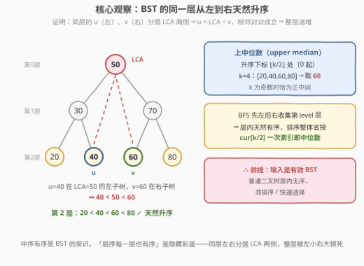
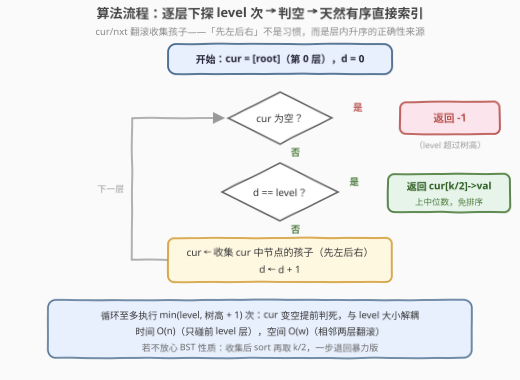

# LeetCode 二叉搜索树某一层的中位数 题解

## 1. 题目概述

- **标题 / 题号**：二叉搜索树某一层的中位数（#3831，medium）
- **链接**：https://leetcode.cn/problems/median-of-a-binary-search-tree-level/
- **难度**：中等
- **标签**：树、深度优先搜索、广度优先搜索、二叉搜索树、二叉树

> ⚠️ 本题为 LeetCode 付费题，题意描述根据官方示例用例与 hints 重建，可能与官方题面有出入。函数签名 `levelMedian(root, level)`、三个示例输入与提示语均来自官方接口；「根节点位于第 0 层」的层级约定由示例反推（见下方审题关键）。

**题意**：给你一棵**二叉搜索树（BST）**的根节点 `root` 和一个整数 `level`。节点的层级按如下定义：**根节点位于第 0 层**，任意节点的子节点层级比该节点大 1。

把**第 `level` 层的所有节点值**收集起来升序排序，记个数为 $k$，返回其中的**上中位数**：

- $k$ 为奇数时，即正中间那个数（排序后下标 $\lfloor k/2 \rfloor$ 处，0 起）；
- $k$ 为偶数时，取中间两个数中**较大**的那个（同样落在下标 $\lfloor k/2 \rfloor$ 处）；
- 若第 `level` 层没有任何节点（如 `level` 超过树高），返回 $-1$。

**示例 1**：

```text
输入：root = [4,null,5,null,7], level = 2
输出：7
解释：第 0 层 [4]，第 1 层 [5]，第 2 层 [7]，只有一个数，中位数为 7。
```

**示例 2**：

```text
输入：root = [6,3,8], level = 1
输出：8
解释：第 1 层为 [3, 8]，共偶数个，上中位数取较大者 8。
```

**示例 3**：

```text
输入：root = [2,1], level = 2
输出：-1
解释：树只有第 0、1 两层，第 2 层为空，返回 -1。
```

**约束条件**（按示例与 hints 推断）：树中节点数在 $[1, 10^4]$ 量级；节点值构成有效 BST；$0 \le level$ 且允许超过树高。

> 💡 **审题关键**：① 层级从 0 起数——示例 3 中 `[2,1]` 只有根与左孩子两层，却查询 `level = 2` 并按「空层返回 -1」的提示给出输出，说明根在第 0 层、`[2,1]` 的第 2 层恰为空；同理示例 2 查 `level = 1` 得到偶数个节点的层 `[3,8]`（正好演示上中位数），佐证同一约定；② 「上中位数」统一了奇偶两种情况：**都是升序序列下标 $\lfloor k/2 \rfloor$ 处的元素**，不需要讨论奇偶；③ 题面特意强调「二叉搜索树」而不只是「二叉树」——这正是本题的题眼：**BST 的同一层从左到右天然升序**（2.2 节证明），排序一步可以直接省掉。

## 2. 解题思路

### 2.1 暴力思路：收集 + 排序

官方提示给出的朴素路线：用 DFS 或 BFS 把第 `level` 层的节点值收集到一个数组里，判空返回 $-1$，否则**排序**后取下标 $\lfloor k/2 \rfloor$ 处的值。

- 收集：DFS 带 `depth` 参数，`depth == level` 时记下节点值并剪枝（不再下探）；或 BFS 逐层推进 `level` 次。
- 排序：$O(k \log k)$。

对普通二叉树这就是标准答案（层内值无序，必须排）；但这是一棵 **BST**——数据本身自带有序性，排序是白干的。$n$ 到 $10^4$ 量级时暴力当然也能过，可若把 $n$ 放大、或把「查询某一层中位数」变成高频操作，省掉 $O(k \log k)$ 的意义就出来了。

### 2.2 核心观察：BST 的同一层从左到右天然有序



大家都知道 **BST 的中序遍历有序**，但还有一个更隐蔽的性质：**层序遍历中，每一层的值从左到右严格递增**。

**证明**：任取同层的两个节点 $u$、$v$，设 $u$ 在 $v$ 左侧。设 $w = \mathrm{LCA}(u, v)$：因为 $u$、$v$ 同层且分列左右，$u$ 必在 $w$ 的**左子树**里，$v$ 必在 $w$ 的**右子树**里（若同在一侧，公共祖先还能更深，与 LCA 定义矛盾）。由 BST 性质：

$$u.val < w.val < v.val$$

于是从左到右任意相邻两个同层节点都满足左小右大，整层严格递增。∎

> 💡 **换句话说**：`level` 层里「左边的节点」整体位于某个祖先的左子树、「右边的节点」位于右子树，BST 的左小右大把整层的次序**天然锁死**。所以只要 BFS 扩展时**先左孩子后右孩子**，收集到的第 `level` 层序列就已经是有序的——`hint` 里的"sort"一步整体删除，直接取第 $\lfloor k/2 \rfloor$ 个就是上中位数。

> ⚠️ **前提是有效 BST**：该性质依赖左子树全小、右子树全大（值互异时严格递增；即便允许重复，也是非降序，不影响取 $\lfloor k/2 \rfloor$）。若输入只是普通二叉树，层内无序，排序不可省（见 5.2 节）。

### 2.3 算法流程图：逐层下探 level 次 → 判空 → 直接索引



| 步骤 | 操作 | 说明 |
|------|------|------|
| ① 初始化 | `cur = [root]` | `cur` 持有当前层的节点，从第 0 层出发 |
| ② 逐层下探 | 重复 `level` 次：收集 `cur` 中节点的孩子（**先左后右**）作为新 `cur` | 先左后右保证层内从左到右的次序，即升序；中途 `cur` 变空即可提前判死 |
| ③ 判空 | `cur` 为空 → 返回 $-1$ | `level` 超过树高，该层不存在 |
| ④ 取中位数 | 返回 `cur[k/2]->val` | 层内天然有序，下标 $\lfloor k/2 \rfloor$ 即上中位数，**无需排序** |

### 2.4 示例演算

**自造例子**（三个官方示例层数太浅，用一个 7 节点完全 BST 演算）：

```text
        50                第 0 层：[50]
       /  \
     30    70             第 1 层：[30, 70]
    /  \   /  \
  20   40 60   80          第 2 层：[20, 40, 60, 80]
```

查询 `level = 2`：BFS 两次下探后 `cur = [20, 40, 60, 80]`（先左后右收集，天然升序）。$k = 4$ 为偶数，上中位数 = 下标 $4/2 = 2$ 处的 **60**。若查询 `level = 3`：第 3 层为空，返回 $-1$。

**官方示例 2** `[6,3,8], level = 1`：一次下探后 `cur = [3, 8]`，$k = 2$，上中位数 = 下标 $1$ 处的 **8** ✓。
**官方示例 3** `[2,1], level = 2`：第一次下探得 `[1]`，第二次下探得 `[]`，返回 **-1** ✓。

## 3. 参考代码

### C++

```cpp
class Solution {
public:
    int levelMedian(TreeNode* root, int level) {
        if (root == nullptr) return -1;                  // 防御空树
        vector<TreeNode*> cur{root};
        while (level-- > 0 && !cur.empty()) {            // 逐层下探 level 次
            vector<TreeNode*> nxt;
            for (TreeNode* p : cur) {
                if (p->left)  nxt.push_back(p->left);    // 先左后右 ⇒ 层内天然升序
                if (p->right) nxt.push_back(p->right);
            }
            cur = move(nxt);
        }
        if (cur.empty()) return -1;                      // level 超过树高
        return cur[cur.size() / 2]->val;                 // 上中位数：下标 k/2
    }
};
```

### Python

```python
class Solution:
    def levelMedian(self, root: Optional[TreeNode], level: int) -> int:
        if not root:
            return -1
        cur = [root]                                     # 第 0 层
        for _ in range(level):                           # 逐层下探 level 次
            cur = [ch for node in cur
                     for ch in (node.left, node.right)   # 先左后右 ⇒ 天然升序
                     if ch]
            if not cur:                                  # 提前判死，防 level 极大时空转
                return -1
        return cur[len(cur) // 2].val                    # 上中位数：下标 k/2
```

> 💡 **写法要点**：① 「逐层」用两层 `cur/nxt` 翻滚而不是单队列 `size` 快照——语义更直白，且 `cur` 本身就是答案层；② 循环条件里的 `!cur.empty()` / 提前 `return -1` 让循环至多执行「树高 + 1」次，`level` 即便给到很大也不会空转；③ 返回前**不再排序**——靠的是 2.2 节的层内有序定理；若不放心（或题面改成了普通二叉树），把最后一行换成「收集值 + `sort` + 取 `k/2`」即可退化回暴力版。三个官方示例 + 自造 7 节点完全 BST + 链状树（每层单节点）均验证一致。

## 4. 复杂度分析

| 维度 | 复杂度 | 说明 |
|------|--------|------|
| **时间** | $O(n)$ | BFS 只访问**前 `level` 层**的全部节点，至多 $n$ 个；取中位数是 $O(1)$ 数组索引，无排序 |
| **空间** | $O(w)$ | `cur`/`nxt` 只存相邻两层节点，$w$ 为最宽层宽，上界 $O(n)$（满树时最底层约占一半） |
| **量级判断** | $n \sim 10^4$ | 纯线性遍历，毫无压力；对比暴力版多出的 $O(k \log k)$ 排序被 BST 性质整体省去 |

## 5. 扩展

### 5.1 多次查询：一次遍历，任意层 O(1)

若要对同一棵树反复查询不同 `level` 的中位数，逐次 BFS 是 $O(qn)$。改成一次 DFS/BFS 把**每一层的节点列表**存下来（$O(n)$ 预处理，$O(n)$ 空间）：由层内有序定理，每个列表直接有序，任意查询取 `levels[l][len/2]` 即 $O(1)$。这与「BFS 分层模板」（102 题）只差一个把每层列表留下来的动作。

### 5.2 退化与对偶：普通二叉树 / 上中位数 vs 下中位数

- **普通二叉树**：层内无序，必须排序 $O(k \log k)$，或用快速选择（C++ `nth_element`）平均 $O(k)$ 直接找第 $\lfloor k/2 \rfloor + 1$ 小——这正是「第 k 小」套路（215 题）在树上的一层内应用。
- **下中位数**：若题意改成取中间两个数中**较小**者，把下标 $\lfloor k/2 \rfloor$ 换成 $\lfloor (k-1)/2 \rfloor$ 即可，其余完全不变。
- **对偶事实**：BST 每层**最右端**的节点就是该层最大值——于是「每个树行找最大值」（515 题）在 BST 上可以免比较直接取每层最后一个，与本题互为印证。

## 6. 面试要点

**Q1：凭什么 BST 同一层从左到右是有序的？现场证明一下。**

> 取同层的 $u$（左）、$v$（右），令 $w = \mathrm{LCA}(u,v)$。因 $u$、$v$ 同层且一左一右，$u$ 在 $w$ 左子树、$v$ 在 $w$ 右子树，由 BST 性质 $u.val < w.val < v.val$。相邻节点对对成立，整层严格递增。关键是「同层」+「左右分置」保证了 LCA 一定是真祖先、二者一定分居其两侧。

**Q2：上中位数是什么？为什么不用两个中间值取平均？**

> $k$ 个数升序后取下标 $\lfloor k/2 \rfloor$（0 起）：奇数个时是正中间，偶数个时是中间两个中较大者。不取平均是因为返回类型是整数，且题意明确规定偶数取「上中位数」，一次索引统一奇偶，无需分支。

**Q3：`level` 远大于树高怎么办？**

> 下探过程中某一层变空，说明更深的层全是空的，立即返回 $-1$。实现上把「`cur` 为空」写进循环条件或循环体内提前返回，保证循环至多执行树高 + 1 次，与 `level` 的大小解耦。

**Q4：BFS 和 DFS 在这题里怎么选？**

> BFS 逐层推进，天然只碰前 `level` 层、拿到目标层后立刻停；DFS 需要带深度参数并自行剪枝，且递归深度等于树高——链状树（如示例 1）高 $n$，C++ 里 $10^4 \sim 10^5$ 深度有爆栈风险。两者时间同为 $O(n)$，工程上 BFS 更稳。

**Q5：这题去掉「二叉搜索树」条件还成立吗？**

> 不成立。普通二叉树同一层的值无序（层序只保证位置次序，不保证值次序），免排序索引的合法性来自 BST 的左小右大。此时退回「收集 + 排序/快速选择」，时间多一个 $O(k \log k)$ 或平均 $O(k)$。面试里这种「数据结构自带性质 → 省掉通用步骤」的追问非常常见，值得形成条件反射。

> 💡 **一句话总结**：3831 =「BFS 逐层下探 `level` 次，空层 $-1$」+「BST 层内从左到右天然升序（LCA 一句话证明）⇒ 免排序，下标 $\lfloor k/2 \rfloor$ 直接就是上中位数」。带走的知识点：BST 的有序性不止中序——**层序的每一层也有序**，这个性质在「按层取最值 / 中位数」类问题上能白嫖一个排序。

## 同类练习题

| # | 题目 | 与本题的关联 |
|---|------|-------------|
| 102 | [二叉树的层序遍历](https://leetcode.cn/problems/binary-tree-level-order-traversal/)（[题解](../0101-0200/102_二叉树的层序遍历.md)） | `cur/nxt` 逐层翻滚的分层 BFS 基础模板，本题的骨架 |
| 637 | [二叉树的层平均值](https://leetcode.cn/problems/average-of-levels-in-binary-tree/)（[题解](../0601-0700/637_二叉树的层平均值.md)） | 同为「逐层聚合统计」，对照本题「聚合的是有序序列的中位数」 |
| 515 | [在每个树行中找最大值](https://leetcode.cn/problems/find-largest-value-in-each-tree-row/)（[题解](../0501-0600/515_在每个树行中找最大值.md)） | 每层聚合最值；在 BST 上每层最右端即最大，与本文 5.2 节的对偶事实呼应 |
| 2415 | [反转二叉树的奇数层](https://leetcode.cn/problems/reverse-odd-levels-of-binary-tree/)（[题解](../2401-2500/2415_反转二叉树的奇数层.md)） | 同样的「根为第 0 层」层级约定，练熟按层号操作 |
| 98 | [验证二叉搜索树](https://leetcode.cn/problems/validate-binary-search-tree/)（[题解](../0001-0100/98_验证二叉搜索树.md)） | BST 左小右大性质的正统考察，2.2 节证明的地基 |
