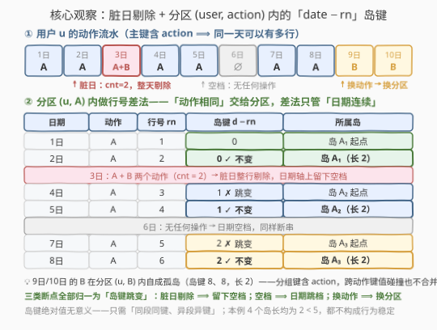
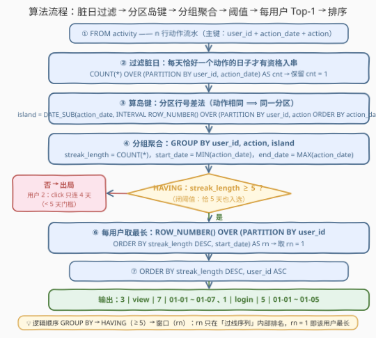

# LeetCode 查找具有持续行为模式的用户 题解

## 1. 题目概述

- **标题 / 题号**：查找具有持续行为模式的用户（#3832，hard）
- **链接**：https://leetcode.cn/problems/find-users-with-persistent-behavior-patterns/
- **难度**：困难
- **标签**：数据库、SQL、窗口函数、Gaps and Islands（间隙与孤岛）、`COUNT(*) OVER`、`ROW_NUMBER()`、`DATE_SUB`、CTE、Top-1 per group

**表结构**：`activity`

| 列名 | 类型 |
|------|------|
| user_id | int |
| action_date | date |
| action | varchar |

- `(user_id, action_date, action)` 是这张表的主键（值互不相同）。
- 每一行代表一个用户在特定日期执行的具体操作。

**目标**：识别**行为稳定的用户**——若一个用户存在一段**连续至少 5 天**的行为序列，同时满足：

1. 该用户在该期间**每天只执行了一个操作**（恰好一个，不是至少一个）；
2. 这些连续日子里的**操作全都相同**；

则称其行为稳定。若一个用户有**多条**符合条件的序列，只考虑**最长**的那一条。输出 `user_id, action, streak_length, start_date, end_date` 五列，按 `streak_length` **降序**、再按 `user_id` **升序**排序。

**示例**：

```text
输入：activity 表
+---------+-------------+--------+
| user_id | action_date | action |
+---------+-------------+--------+
| 1       | 2024-01-01  | login  |
| 1       | 2024-01-02  | login  |
| 1       | 2024-01-03  | login  |
| 1       | 2024-01-04  | login  |
| 1       | 2024-01-05  | login  |
| 1       | 2024-01-06  | logout |
| 2       | 2024-01-01  | click  |
| 2       | 2024-01-02  | click  |
| 2       | 2024-01-03  | click  |
| 2       | 2024-01-04  | click  |
| 3       | 2024-01-01  | view   |
| 3       | 2024-01-02  | view   |
| 3       | 2024-01-03  | view   |
| 3       | 2024-01-04  | view   |
| 3       | 2024-01-05  | view   |
| 3       | 2024-01-06  | view   |
| 3       | 2024-01-07  | view   |
+---------+-------------+--------+

输出：
+---------+--------+---------------+------------+------------+
| user_id | action | streak_length | start_date | end_date   |
+---------+--------+---------------+------------+------------+
| 3       | view   | 7             | 2024-01-01 | 2024-01-07 |
| 1       | login  | 5             | 2024-01-01 | 2024-01-05 |
+---------+--------+---------------+------------+------------+
```

> 💡 **审题关键**：
> ① 主键是**三元组** `(user_id, action_date, action)` ⟹ 同一用户**同一天可以有多行**（只要动作互异）——「每天只执行了一个操作」是必须显式检查的条件：按 `(user_id, action_date)` 数行数，` = 1` 的「干净日」才有资格入串；`≥ 2` 的「脏日」**整天作废**，且会把前后两段截断；
> ② 「连续」指**自然日相邻**（昨天 = 今天 − 1 天），日历跳档即断串——与行的相邻无关；
> ③ 「操作都相同」是断串的第二个条件，动作一换即断；
> ④ 「连续至少 5 天」是**闭阈值**：恰 5 天入选（示例用户 1），连 4 天出局（示例用户 2）；
> ⑤ 每用户只输出**最长的一条合格序列**——组内 Top-1 问题；
> ⑥ 排序双键：`streak_length DESC, user_id ASC`。

## 2. 解题思路

### 2.1 暴力思路：枚举窗口 / 递归拼串

过程式直觉：对每个 `(user_id, action, 起点)` 枚举向后拼连续天，逐日验证「昨天存在、恰好一个动作、动作相同」，直到断点，再对每个用户取最长。在 SQL 里落地只有两条路：

- **自连接**：`t1.action_date + 1 = t2.action_date` 逐对拼邻——只能处理定长（如 180 题「恰好连续 3 次」），**任意长度**要多次自连接或 `WITH RECURSIVE`，代码膨胀；
- **应用层扫描**：把全表读进 pandas/内存逐行状态机——正确但把本该一条 `SELECT` 说清的事搬出数据库，违背 SQL 的声明式哲学。

> ⚠️ 瓶颈在于「断串」有三个来源（脏日 / 日期空档 / 换动作），逐对验证的写法要分别处理、极易漏判。突破口是把「连续段」打上**对所有同段行都相同的标签（岛键）**——于是「判定连续」退化为「按标签分组」，一次聚合拿到段长与起止日期。

### 2.2 核心观察：分区行号差法——一个岛键同时消化三个断串条件



**观察一：主键三元组 ⟹「每日动作数」一趟窗口就算出。**

`(user_id, action_date, action)` 互异 ⟹ 同一 `(user_id, action_date)` 的行数 = 当天动作数：

```sql
SELECT user_id, action_date, action,
       COUNT(*) OVER (PARTITION BY user_id, action_date) AS cnt
FROM activity
```

保留 `cnt = 1` 的「干净日」。**脏日整天剔除**——它不仅自己不能入串，剔除后在日期轴上留下空档，把前后两段自然截断。

**观察二：把「动作相同」交给 `PARTITION BY`，把「日期连续」交给差法。**

对干净日按 `(user_id, action)` 分区、按日期升序编号，作差：

$$\boxed{\text{island} = \text{DATE\_SUB}\big(\text{action\_date},\; \text{INTERVAL}\; \text{ROW\_NUMBER()}\;\text{OVER}\;(\text{PARTITION BY user\_id, action ORDER BY action\_date})\;\text{DAY}\big)}$$

- 同一动作分区内日期**连续**（$d_k = d_{k-1} + 1$ 天）时，日期 $+1$ 与行号 $+1$ **抵消**，岛键不变；
- 日期**跳档**（空档、或脏日剔除后留下的缺口）时，日期 $+g$（$g \ge 2$）> 行号 $+1$，抵消失败，岛键跳变，裂为新岛；
- **动作改变**时，行进入另一个分区（`(user_id, action)` 不同）——天然自成一段，无需比较。

> 💡 **与 2752 的关键区别**：[2752. 在连续天数上进行了最多交易次数的顾客](../2701-2800/2752_在连续天数上进行了最多交易次数的顾客.md) 只判「日期连续」，岛键按 `user_id` 分区即可；本题多出「操作相同」条件——**分区键加上 `action`**，差法原封不动。这是行号差法的标准加强版：**每个「必须保持不变」的维度，要么进 `PARTITION BY`（离散值），要么进差法基准（可加减的连续值）**。

> ⚠️ **分组键必须带 `action`**：不同动作的岛键数值可能碰撞（如 A 的岛键与 B 的岛键同为某天），`GROUP BY user_id, action, island` 保证跨动作不合并；同一分区内岛键随跳档**单调递增**，永不回头，同段必同键、异段必异键。

**观察三：每用户取最长是 argmax，不是 `MAX`。**

输出要带回 `action / start_date / end_date` 整行信息——`GROUP BY user_id + MAX(streak_length)` 只能算出长度、丢掉所在行。标准做法是 `ROW_NUMBER() OVER (PARTITION BY user_id ORDER BY streak_length DESC)` 取 `rn = 1`（Top-1 per group）。

| 断串条件 | 由谁负责 | 机制 |
|----------|----------|------|
| 当天多个动作（脏日） | 观察一的窗口 `COUNT` 过滤 | 整天剔除 → 留下空档 |
| 日期空档 | 差法 `date − rn` | 跳档 ⟹ 键跳变 |
| 动作改变 | `PARTITION BY user_id, action` | 换分区 ⟹ 换岛 |
| 段长 ≥ 5 | `HAVING COUNT(*) >= 5` | 闭阈值过滤 |
| 每用户最长 | `ROW_NUMBER ... rn = 1` | 组内 Top-1 |

> 💡 一句话：**窗口 `COUNT` 滤脏日 → `(user, action)` 分区差法出岛键 → 按岛分组聚合出段长与起止 → `HAVING >= 5` → 每用户 `rn = 1` → 双键排序收尾。**

### 2.3 算法流程图



**逻辑执行步骤**：

| 步骤 | 操作 | 说明 |
|------|------|------|
| ① FROM | 读入 `activity` 全部 n 行 | 主键三元组，行行互异 |
| ② 滤脏日 | `COUNT(*) OVER (PARTITION BY user_id, action_date)`，保留 `cnt = 1` | 每天恰好一个动作才有资格入串 |
| ③ 算岛键 | `DATE_SUB(action_date, INTERVAL ROW_NUMBER() OVER (PARTITION BY user_id, action ORDER BY action_date) DAY)` | 日期连续 ⟹ 同键；跳档/换动作 ⟹ 换键/换分区 |
| ④ 分组聚合 | `GROUP BY user_id, action, island` | `COUNT(*)` 段长，`MIN/MAX` 起止日期 |
| ⑤ 阈值过滤 | `HAVING streak_length >= 5` | 闭阈值，恰 5 天入选 |
| ⑥ 组内 Top-1 | `ROW_NUMBER() OVER (PARTITION BY user_id ORDER BY streak_length DESC)`，取 `rn = 1` | 每用户只留最长一条 |
| ⑦ 输出排序 | `ORDER BY streak_length DESC, user_id ASC` | 双键收尾 |

> ⚠️ 步骤 ⑤⑥ 有**先后**：SQL 逻辑顺序是 `GROUP BY → HAVING → 窗口函数`——`HAVING >= 5` 先把短段踢出局，`rn` 只在「过线序列」内部排名，`rn = 1` 才是「该用户**合格**序列中最长的一条」。若把窗口写在 `HAVING` 之前（如先 `rn` 后过滤），用户最长序列 < 5 时可能错拿不合格段。分层 CTE 天然保证顺序。

### 2.4 示例演算

对示例中 3 个用户逐一走「滤脏日 → 岛键 → 分组」：

| 用户 | 干净日序列 | 岛（孤岛段） | 段长 | ≥ 5？ | 输出 |
|------|-----------|--------------|:--:|:--:|------|
| 1 | login×5（01-01~01-05）、logout×1（01-06） | login 岛（键 12-31）、logout 岛 | 5、1 | login ✓ | (login, 5, 01-01, 01-05) |
| 2 | click×4（01-01~01-04） | click 岛（键 12-31） | 4 | **✗** | ❌ 出局 |
| 3 | view×7（01-01~01-07） | view 岛（键 12-31） | 7 | ✓ | (view, 7, 01-01, 01-07) |

以用户 1 的 login 分区验算差法（岛键 = 日期 − 行号）：

| 日期 | 行号 | 岛键 |
|------|:--:|------|
| 01-01 | 1 | 12-31 |
| 01-02 | 2 | 12-31 ✓ |
| 01-03 | 3 | 12-31 ✓ |
| 01-04 | 4 | 12-31 ✓ |
| 01-05 | 5 | 12-31 ✓ |

5 天同键成岛；`logout`（01-06）在另一分区，自成 1 天短岛。两用户幸存，按 `streak_length DESC` 排序：$7 > 5$ → 输出 `3` 在前、`1` 在后，与官方一致 ✓。

再验一个**脏日**扩展：用户连续 login 01-01~02-03、当天另有 click（02-03 两动作）、再 login 02-04~02-08——02-03 整天剔除后，login 裂为 {01-01, 01-02}（长 2）与 {02-04~02-08}（长 5）两岛，后者恰好过线入选。**脏日不是「跳过该行」，而是「整天作废 + 截断」**——这是本题最容易写错的一处。

## 3. 参考代码

### MySQL（解法 A：分区行号差法，推荐）

```sql
# Write your MySQL query statement below
WITH daily AS (
    SELECT user_id, action_date, action,
           COUNT(*) OVER (PARTITION BY user_id, action_date) AS cnt
    FROM activity
),
solo AS (
    SELECT user_id, action_date, action
    FROM daily
    WHERE cnt = 1
),
islands AS (
    SELECT user_id, action_date, action,
           DATE_SUB(action_date,
                    INTERVAL ROW_NUMBER() OVER (
                        PARTITION BY user_id, action ORDER BY action_date
                    ) DAY) AS island
    FROM solo
),
streaks AS (
    SELECT user_id,
           action,
           COUNT(*)         AS streak_length,
           MIN(action_date) AS start_date,
           MAX(action_date) AS end_date,
           ROW_NUMBER() OVER (PARTITION BY user_id
                              ORDER BY COUNT(*) DESC, MIN(action_date)) AS rn
    FROM islands
    GROUP BY user_id, action, island
    HAVING streak_length >= 5
)
SELECT user_id, action, streak_length, start_date, end_date
FROM streaks
WHERE rn = 1
ORDER BY streak_length DESC, user_id;
```

> 💡 **写法要点**：
> - `COUNT(*) OVER (PARTITION BY user_id, action_date)`：窗口版「每日动作数」——主键保证同 `(user, date)` 的行动作互异，行数即动作数；`cnt = 1` 的干净日才入串，脏日整天剔除；
> - 岛键：`PARTITION BY user_id, action` 把「动作相同」内化为分区前提；`ORDER BY action_date` 保证行号随日期单调 +1——差法成立的数学前提，缺一不可；
> - `GROUP BY user_id, action, island`：分组键带 `action`，跨动作的岛键碰撞不会错误合并；
> - `HAVING streak_length >= 5` 引用 SELECT 别名是 MySQL 方言；跨库写 `HAVING COUNT(*) >= 5`。窗口 `ROW_NUMBER` 在 `HAVING` **之后**求值（GROUP BY → HAVING → 窗口），`rn` 排的是过线序列的名次；
> - `ORDER BY COUNT(*) DESC, MIN(action_date)`：并列最长时取 `start_date` 最早的一条，保证确定性（判题数据未见并列，属防御性 tiebreaker）；
> - ✓ 需 MySQL 8.0+（窗口函数）。

### MySQL（解法 B：`LAG` 断点标记 + 累计 `SUM`——通用 gaps-and-islands 模板）

```sql
# Write your MySQL query statement below
WITH daily AS (
    SELECT user_id, action_date, action,
           COUNT(*) OVER (PARTITION BY user_id, action_date) AS cnt
    FROM activity
),
solo AS (
    SELECT user_id, action_date, action
    FROM daily
    WHERE cnt = 1
),
marked AS (
    SELECT user_id, action_date, action,
           CASE WHEN LAG(action_date) OVER w = DATE_SUB(action_date, INTERVAL 1 DAY)
                  AND LAG(action)     OVER w = action
                THEN 0 ELSE 1 END AS brk
    FROM solo
    WINDOW w AS (PARTITION BY user_id ORDER BY action_date)
),
grouped AS (
    SELECT user_id, action_date, action,
           SUM(brk) OVER (PARTITION BY user_id ORDER BY action_date
                          ROWS UNBOUNDED PRECEDING) AS island
    FROM marked
),
streaks AS (
    SELECT user_id,
           action,
           COUNT(*)         AS streak_length,
           MIN(action_date) AS start_date,
           MAX(action_date) AS end_date
    FROM grouped
    GROUP BY user_id, action, island
    HAVING streak_length >= 5
)
SELECT user_id, action, streak_length, start_date, end_date
FROM (
    SELECT t.*,
           ROW_NUMBER() OVER (PARTITION BY t.user_id
                              ORDER BY t.streak_length DESC, t.start_date) AS rn
    FROM streaks t
) t
WHERE rn = 1
ORDER BY streak_length DESC, user_id;
```

> 💡 **写法要点**：
> - `CASE WHEN LAG(日期) = 昨天 AND LAG(动作) = 本行动作 THEN 0 ELSE 1 END`——两个断串条件**显式**写出；首行 `LAG` 为 `NULL`，比较结果为 `NULL`，`CASE` 落到 `ELSE 1`，天然把首行标为新岛起点（若用裸布尔 `OR`，`NULL` 会让首岛 `SUM` 出 `NULL`，必须用 `CASE` 兜底）；
> - `SUM(brk) OVER (... ROWS UNBOUNDED PRECEDING)` 把 0/1 断点标记**累计成组号**——这是行号差法之外另一套通用孤岛模板，可推广到任意「与前一行的关系」断串（如金额递增、状态翻转），差法做不了的离散条件它都能写；
> - A vs B：A 一次排序出键、更短；B 显式列出断点条件、更贴业务语义。面试先讲 A，被追问「断点条件不是日期差怎么办」时亮 B。

### Pandas

```python
import pandas as pd

def find_behaviorally_stable_users(activity: pd.DataFrame) -> pd.DataFrame:
    a = activity.copy()
    a['action_date'] = pd.to_datetime(a['action_date'])
    a['cnt'] = a.groupby(['user_id', 'action_date'])['action'].transform('count')
    a = a[a['cnt'] == 1].sort_values(['user_id', 'action', 'action_date'])

    a['rn'] = a.groupby(['user_id', 'action']).cumcount() + 1
    a['island'] = a['action_date'] - pd.to_timedelta(a['rn'], unit='D')

    streaks = (a.groupby(['user_id', 'action', 'island'])
                 .agg(streak_length=('action_date', 'size'),
                      start_date=('action_date', 'min'),
                      end_date=('action_date', 'max'))
                 .reset_index())
    streaks = streaks[streaks['streak_length'] >= 5]

    streaks = streaks.sort_values(
        ['user_id', 'streak_length', 'start_date'], ascending=[True, False, True])
    ans = streaks.groupby('user_id').head(1)

    return (ans.sort_values(['streak_length', 'user_id'], ascending=[False, True])
               [['user_id', 'action', 'streak_length', 'start_date', 'end_date']]
               .reset_index(drop=True))
```

> 💡 **pandas 对照**：
> - `groupby(['user_id', 'action_date']).transform('count')` = 窗口 `COUNT(*) OVER`；布尔筛 `cnt == 1` = `WHERE`；
> - `groupby(['user_id', 'action']).cumcount() + 1` = `ROW_NUMBER() OVER (PARTITION BY user_id, action ORDER BY ...)`——`cumcount` 从 0 起，故 $+1$；**先 `sort_values` 再 `cumcount`**，行号必须随日期递增；
> - `action_date - pd.to_timedelta(rn, unit='D')` = `DATE_SUB(action_date, INTERVAL rn DAY)`，得到 Timestamp 型岛键；`groupby + agg(size/min/max)` = `streaks` CTE；
> - 每用户 Top-1：先按 `(user_id, 段长降序, 起始日)` 排序，再 `groupby('user_id').head(1)`——对应 SQL 的 `ROW_NUMBER ... rn = 1` + tiebreaker。

## 4. 复杂度分析

设 $n$ 为 `activity` 行数，$s$ 为岛（连续段）个数（$s \le n$），$u$ 为幸存用户数。

| 维度 | 复杂度 | 说明 |
|------|--------|------|
| **时间复杂度** | $O(n \log n)$ | 两个窗口排序主导（按 `(user_id, action_date)` 与 `(user_id, action, action_date)` 各一次 $O(n \log n)$）；分组聚合、过滤、Top-1 均为线性单趟 |
| **空间复杂度** | $O(n)$ | CTE 中间结果物化（`daily`/`solo`/`islands` 各至多 $n$ 行，`streaks` 至多 $s$ 行） |
| **中间行数** | $O(n)$ | 脏日剔除只减不增；每干净日恰保留一行 |

> - **排序主导**：若 `(user_id, action_date, action)` 主键索引可用（本题天然有序），两个窗口的排序可被索引顺序替代，降至 $O(n)$；
> - 对比暴力自连接的 $O(n^2)$ 与递归拼串的逐日往返，差法用**一次排序**把「三类断点判定」全部转化为「分组聚合」，是质的飞跃。

## 5. 扩展：平局口径与断点条件的一般化

### 5.1 最长序列并列时输出几行？

题面只说「只考虑最长的那条序列」，未规定并列口径。两种写法：

| 写法 | 并列最长时 | 适用 |
|------|-----------|------|
| `ROW_NUMBER() ... ORDER BY 段长 DESC, start_date` | 恰一行（取起始日最早） | 判题期望每用户一行；**确定性** tiebreaker |
| `RANK() ... ORDER BY 段长 DESC` | 全部并列行 | 若题目改为「输出所有并列最长序列」 |

本文与官方一致取 `ROW_NUMBER`（每用户一行），并加 `start_date` 作第二键保证结果确定——裸 `ROW_NUMBER ... ORDER BY 段长 DESC` 在并列时依赖实现顺序，是**不确定性输出**，生产环境务必补 tiebreaker。

### 5.2 断点条件一般化：LAG 断点标记模板

差法要求「连续值随行号同步 +1」（日期、整数 id 天然满足）。若断点条件是任意「与前一行的关系」——例如「金额逐日递增」「状态不能翻转两次」——差法失效，改用解法 B 的三段式：

```text
LAG 取前一行相关列 → CASE 算断点标记 brk(0/1) → SUM(brk) OVER 累计成组号 → 按组号分组聚合
```

首行 `LAG` 为 `NULL` 必须由 `CASE ... ELSE 1` 兜底（见 3.B 要点），这是该模板最常踩的坑。

### 5.3 行号差法家族对照

| 连续对象 | 岛键构造 | 分区键 | 对应题目 |
|----------|----------|--------|----------|
| 连续自然日（单维） | `date − rn` | `user_id` | [2752. 在连续天数上进行了最多交易次数的顾客](https://leetcode.cn/problems/customers-with-maximum-number-of-transactions-on-consecutive-days/) |
| 连续日 + 动作相同（**本题**） | `date − rn` | `user_id, action` | 3832 |
| 连续活跃 ≥ 5 天 | `date − rn` | `user_id` | [1454. 活跃用户](https://leetcode.cn/problems/active-users/) |
| 连续整数 id | `id − rn` | — | [1285. 找到连续区间的开始和结束数字](https://leetcode.cn/problems/find-the-start-and-end-number-of-continuous-ranges/) |
| 连续空座 | `seat_id − rn` | — | [603. 连续空余座位](https://leetcode.cn/problems/consecutive-available-seats/) |
| 定长连续 3 次 | `LAG` 取前两行比对 | — | [180. 连续出现的数字](https://leetcode.cn/problems/consecutive-numbers/) |

> 💡 记忆锚点：**连续段问题先想行号差法；「须保持不变」的离散维度进 `PARTITION BY`（本题的 `action`），可加减的连续维度进差法基准（本题的 `date`）**；差法覆盖不了的关系型断点退到 `LAG` 断点标记模板。

## 6. 面试要点

**Q1：「每天只执行了一个操作」为什么必须先过滤脏日，而不是拼串时再检查？**

> 主键是 `(user_id, action_date, action)`，同一用户同一天可有多行（动作互异）。「恰好一个操作」按 `(user_id, action_date)` 数行数，`cnt = 1` 才入串：脏日**整天作废**——不仅当天不能入串，还把前后两段截断（剔除后日期轴留缺口，差法自动跳键）。若不过滤，同日多行会让行号与日期错位，差法直接失真；若只「跳过该行」而不截断，又会把脏日两侧错误拼成一段。

**Q2：为什么 `PARTITION BY` 要带 `action`？分组键为什么也要带？**

> 带进 `PARTITION BY` 让「动作相同」成为分区前提——动作一换即换分区，天然断串，无需显式比较；分组键再带 `action` 是防**跨动作键值碰撞**：A 分区与 B 分区的岛键可能数值相同（都是某个日期），`GROUP BY user_id, action, island` 保证不合并。同分区内岛键随跳档单调递增、永不回头，故同段必同键、异段必异键。

**Q3：岛键 `date − rn` 为什么能识别连续段？**

> 连续自然日的充要条件是相邻行日期差恰为 1 天，而行号对每行恰 $+1$。日期减行号后，日期的「连续 $+1$」与行号的「$+1$」抵消，同段行残值稳定；日期一旦跳 $g \ge 2$ 天，抵消失败，残值至少 $+1$，裂为新岛。本质是把「相邻行差分关系」转为「每行绝对不变量」，于是「判定连续」退化为「按不变量分组」。

**Q4：每用户取最长为什么不能用 `GROUP BY user_id + MAX`？**

> `MAX` 只能算出最长段的**长度**，丢掉 `action / start_date / end_date` 所在行——这是 argmax（取最值所在行）问题。MySQL 无原生 argmax 聚合，标准写法是 `ROW_NUMBER() OVER (PARTITION BY user_id ORDER BY streak_length DESC)` 取 `rn = 1`（Top-1 per group）。注意 `HAVING >= 5` 在窗口之前求值（GROUP BY → HAVING → 窗口），`rn = 1` 取的是「合格序列」中的最长，而非全序列中的最长。

**Q5：用户最长序列恰好并列（两条都是最长）怎么办？**

> 题面未规定口径。`RANK` 会输出全部并列行，`ROW_NUMBER` 恰输出一行；判题按每用户一行（`ROW_NUMBER`）设计。裸 `ORDER BY streak_length DESC` 的 `ROW_NUMBER` 在并列时顺序不确定，应补 `start_date` 之类确定性第二键——「先想并列是否存在，再钉死 tiebreaker」是 Top-1 类 SQL 的收尾习惯。

> 💡 **一句话总结**：3832 = 行号差法的「分区加强版」——**窗口 `COUNT` 滤脏日、`(user, action)` 分区差法出岛键、按岛聚合出段长、`HAVING >= 5` 后组内 `rn = 1`**。带走三件事：离散的不变维度进 `PARTITION BY`、脏日是「整天作废 + 截断」、argmax 用 `ROW_NUMBER` 不用 `MAX`。

## 同类练习题

| # | 题目 | 与本题的关联 |
|---|------|-------------|
| 1454 | [活跃用户](https://leetcode.cn/problems/active-users/)（[题解](../1401-1500/1454_活跃用户.md)） | 连续活跃 ≥ 5 天 + 每用户取一条——本题去掉「动作相同」约束的最经典形态，`user_id` 单维分区即可 |
| 2752 | [在连续天数上进行了最多交易次数的顾客](https://leetcode.cn/problems/customers-with-maximum-number-of-transactions-on-consecutive-days/)（[题解](../2701-2800/2752_在连续天数上进行了最多交易次数的顾客.md)） | 同为差法 + 嵌套聚合，但按 `user_id` 分区（无动作维度），最后取全局最大筛回 |
| 180 | [连续出现的数字](https://leetcode.cn/problems/consecutive-numbers/)（[题解](../0101-0200/180_连续出现的数字.md)） | `LAG` 取前两行判「连续出现 3 次」，定长连续入门，可对照本题理解任意长推广 |
| 1285 | [找到连续区间的开始和结束数字](https://leetcode.cn/problems/find-the-start-and-end-number-of-continuous-ranges/)（[题解](../1201-1300/1285_找到连续区间的开始和结束数字.md)） | `id − rn` 岛键 + 输出每段端点，与本题 `streaks` 层（`MIN/MAX` 起止）完全同构 |
| 603 | [连续空余座位](https://leetcode.cn/problems/consecutive-available-seats/)（[题解](../0601-0700/603_连续空余座位.md)） | 整数版行号差法，对照本题理解「基准选取无关性」——岛键平移不影响分组 |
