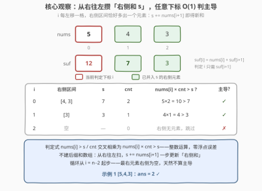

# 统计主导元素下标数

- **题目名称**：统计主导元素下标数
- **链接**：[3833. 统计主导元素下标数](https://leetcode.cn/problems/count-dominant-indices/)
- **难度**：简单
- **标签**：数组、枚举、后缀和

## 1. 题目概述

给你一个长度为 $n$ 的整数数组 `nums`。当下标 $i$ 满足以下条件时，该下标处的元素被称为**主导元素**：

$$nums[i] > average(nums[i+1],\ nums[i+2],\ \ldots,\ nums[n-1])$$

即 **`nums[i]` 严格大于它右侧所有元素的平均值**。你的任务是统计数组中主导元素的下标数。

**平均值**指一组数的总和除以该组数的个数。注意：数组的**最右边元素**不算主导元素（右侧没有元素，无从比较）。

**示例 1**：

```text
输入：nums = [5,4,3]
输出：2
解释：
- 下标 0 处，5 > average(4, 3) = 3.5，是主导元素；
- 下标 1 处，4 > average(3) = 3，是主导元素；
- 下标 2 右侧没有元素，不算主导元素。答案为 2。
```

**示例 2**：

```text
输入：nums = [4,1,2]
输出：1
解释：
- 下标 0 处，4 > average(1, 2) = 1.5，是主导元素；
- 下标 1 处，1 > average(2) = 2 不成立；
- 下标 2 右侧没有元素，不算主导元素。答案为 1。
```

**约束条件**：

- $1 \le nums.length \le 100$
- $1 \le nums[i] \le 100$

> 💡 **审题关键**：① 平均的对象是**右侧后缀** $nums[i+1..n-1]$，不是前缀、不是整个数组，方向别搞反；② 是**严格大于** $>$——恰好等于平均值不算主导（如 $[7,7,7]$ 答案是 0）；③ 最右元素右侧为空，天然不算，$n = 1$ 时答案为 0；④ $n \le 100$、值 $\le 100$，$O(n^2)$ 暴力完全能过——但「一遍扫描 + 整数判定」的写法更优雅，且模式可以直接迁移到大约束场景（见 2.2）。

---

## 2. 解题思路

### 2.1 暴力思路：逐下标重算右侧平均

对每个 $0 \le i \le n-2$，重新遍历 $i+1 \ldots n-1$ 求和、除以个数得平均值，再与 $nums[i]$ 比较：

```text
for i in 0 .. n-2:
    sum = Σ nums[j]  (j = i+1 .. n-1)   ← 每个下标从头重算，O(n)
    if nums[i] > sum / (n-1-i): ans += 1
```

时间 $O(n^2)$。$n \le 100$ 时至多约 5000 次加法，毫无压力。但注意重复劳动：$i$ 每左移一格，右侧区间 $[i+1, n-1]$ 恰好比上一步 $[i+2, n-1]$ **多出一个元素** $nums[i+1]$——和却每次从头加起。

### 2.2 核心观察：从右往左一遍扫，增量维护「右侧和」



判断下标 $i$ 只需要两个量：

- $s = nums[i+1] + \cdots + nums[n-1]$（右侧区间和）；
- $cnt = n-1-i$（右侧元素个数）。

而这两个量随 $i$ 左移**单调增量变化**：从右往左扫（$i$ 从 $n-2$ 递减到 $0$），进入下标 $i$ 时执行 $s \mathrel{+}= nums[i+1]$，$s$ 即为当前右侧区间和——**不需要显式的后缀和数组**，一个变量就够。任意下标的判定降为 $O(1)$，总复杂度 $O(n)$、空间 $O(1)$。

第二个细节：判定式怎么算才稳？直接写 $nums[i] > s / cnt$ 会引入浮点（$s/cnt$ 可能是循环小数，如 $7/3$）。**交叉相乘**把除法消掉：

$$nums[i] > \frac{s}{cnt} \iff nums[i] \times cnt > s \qquad (cnt \ge 1)$$

整数运算，零浮点误差。本题 $n \le 100$、值 $\le 100$，乘积上界 $10^4$，`int` 轻松装下；即便约束放大到 $10^5 \times 10^9$，`long long`（Python 天然大整数）也足够。

### 2.3 算法流程图


| 步骤 | 操作 | 说明 |
|------|------|------|
| ① 初始化 | `ans = 0, s = 0, i = n-2` | 最右元素天然不算主导，从 $n-2$ 起步 |
| ② 入帐 | `s += nums[i+1]` | 刚跨过的元素并入右侧和；$cnt = n-1-i$ 免单独维护 |
| ③ 判定 | `nums[i] * (n-1-i) > s` ? | 交叉相乘，纯整数比较 |
| ④ 计数 | 成立则 `ans++` | 下标 $i$ 为主导元素 |
| ⑤ 左移 | `i--`，回到 ② | 直到 $i < 0$ |
| ⑥ 返回 | `return ans` | $n=1$ 时循环不执行，返回 0 |

### 2.4 示例演算

**示例 1** `nums = [5,4,3]`（从右往左）：

- $i=1$：先 $s \mathrel{+}= nums[2] = 3$ 得 $s=3$，判 $4 \times 1 = 4 > 3$ ✓ 计数；
- $i=0$：再 $s \mathrel{+}= nums[1] = 4$ 得 $s=7$，判 $5 \times 2 = 10 > 7$ ✓ 计数；
- 循环结束，`ans = 2` ✓（对应 2.2 图中表格）。

**示例 2** `nums = [4,1,2]`：

- $i=1$：$s = 2$，判 $1 \times 1 = 1 > 2$ ✗；
- $i=0$：$s = 2 + 1 = 3$，判 $4 \times 2 = 8 > 3$ ✓ 计数；
- `ans = 1` ✓。

**边界**：$n=1$（如 `[9]`）循环不执行，返回 0；全相等 `[7,7,7]`：$i=1$ 判 $7 > 7$ ✗、$i=0$ 判 $14 > 14$ ✗，返回 0——严格大于语义被交叉相乘精确表达。

---

## 3. 参考代码

### C++

```cpp
class Solution {
public:
    int dominantIndices(vector<int>& nums) {
        int n = nums.size(), ans = 0;
        long long s = 0;                          // s = nums[i+1..n-1] 之和
        for (int i = n - 2; i >= 0; i--) {        // 最右元素不算主导
            s += nums[i + 1];                     // 刚跨过的元素入帐
            if ((long long)nums[i] * (n - 1 - i) > s)  // 交叉相乘，零浮点
                ans++;
        }
        return ans;
    }
};
```

### Python

```python
class Solution:
    def dominantIndices(self, nums: List[int]) -> int:
        n, ans, s = len(nums), 0, 0
        for i in range(n - 2, -1, -1):            # 最右元素不算主导
            s += nums[i + 1]                      # 刚跨过的元素入帐
            if nums[i] * (n - 1 - i) > s:         # 交叉相乘，零浮点
                ans += 1
        return ans
```

> 💡 **写法要点**：① 循环变量从 $n-2$ 起步，最右元素的豁免不需要特判，直接不进循环；② $cnt$ 不设变量，用表达式 $n-1-i$ 现算——它就是「下标 $i$ 右侧的元素个数」，语义自明；③ C++ 里 `nums[i] * (n-1-i)` 写成 `long long` 乘法是给大约束留余量，本题 `int` 也够；④ 官方两个示例 + $n=1$、全等数组、单增/单减数组均验证一致。

---

## 4. 复杂度分析

| 维度 | 复杂度 | 说明 |
|------|--------|------|
| **时间** | $O(n)$ | 一遍从右往左扫描，每个下标 $O(1)$ 判定（入帐一次加法 + 一次乘法比较） |
| **空间** | $O(1)$ | 只维护 $s$ 与答案，不建后缀和数组 |
| **量级判断** | $n \le 100$ | 暴力 $O(n^2) \approx 10^4$ 也过；优化版的意义在模式可迁移——约束放大千倍依然线性 |

---

## 5. 扩展

### 5.1 直接用浮点除法行不行？

本题数据范围（$s \le 10^4$）下浮点大概率也能过，但存在隐患：$s/cnt$ 在二进制下未必精确（如 $1/3$ 是循环小数），浮点比较在「$nums[i]$ 恰与平均值的浮点近似相等」的边界情形可能翻车，且不同语言/平台的舍入行为存在差异。竞赛与面试的通用惯例：**能交叉相乘就不做除法**——整数比较零心智负担，还顺带回答了「溢出吗」这类追问。

### 5.2 变体练习

- **非严格版本**（$nums[i] \ge average$）：把 `>` 换成 `>=` 即可，其余不动；
- **大于右侧每个元素**（不再平均）：判定改为「严格大于右侧最大值」，从右往左维护 $mx = \max(nums[i+1..n-1])$，判定 $nums[i] > mx$——同一套「从右往左一遍扫」框架，只是聚合值从「和」换成「最大值」；
- **大于右侧平均值的 $k$ 倍**：判定式 $nums[i] \times cnt > k \times s$，交叉相乘同样一行搞定。

---

## 6. 面试要点

**Q1：为什么最右元素不用判断？**

> 题面明确定义最右元素不算主导：右侧没有元素，平均值无定义。实现上让循环从 $n-2$ 起步即可，无需任何 `if` 特判；$n = 1$ 时循环体一次都不执行，自然返回 0。

**Q2：为什么从右往左扫？从左往右行不行？**

> 行，但要先花 $O(n)$ 空间预计算后缀和数组 $suf[i] = nums[i] + suf[i+1]$，再正着扫一遍判定。从右往左把「攒和」与「判定」合并到同一趟里，空间降到 $O(1)$——因为 $i$ 左移时右侧区间只增一个元素，增量更新天然成立。这是「区间和判定」类题的通用取舍。

**Q3：如何避免浮点误差？**

> 交叉相乘：$nums[i] > s/cnt$ 在 $cnt \ge 1$ 时等价于 $nums[i] \times cnt > s$。左右两侧都是整数，比较精确无舍入。同时顺手做溢出评估：本题乘积上界 $100 \times 100 = 10^4$；推广到 $n \le 10^5$、$nums[i] \le 10^9$ 时上界 $10^{14}$，C++ 换 `long long`，Python 无需处理。

**Q4：这题的「模式」是什么？能迁移到哪？**

> 「判定式只依赖一侧连续区间的聚合值 ⇒ 沿该方向一遍扫描 + 增量维护聚合量」。前缀和是这个模式在「左侧区间」的化身，后缀和/后缀最大值是「右侧区间」的化身。724（中心下标：左右两侧和同时维护）、238（除自身乘积：后缀积一遍扫）、1685（有序数组差绝对值：前缀和数学化简）都是同族。

**Q5：暴力 $O(n^2)$ 和优化 $O(n)$ 在这题里怎么取舍？**

> $n \le 100$ 时两者都能过，先写对再优化。但面试场景下，$O(n)$ 版本展示了「发现区间增量关系 + 消除除法」两个信号点，且代码并不比暴力长——没有理由停在暴力。真正要警惕的是反向优化：为 $n=100$ 的题上线线段树之类的重型结构，属于过度设计。

> 💡 **一句话总结**：3833 =「从右往左一遍扫，$s \mathrel{+}= nums[i+1]$ 增量维护右侧和」+「交叉相乘 $nums[i] \times cnt > s$ 消除除法」。带走的知识点：**一侧区间的聚合判定，用同方向的一遍扫描把 $O(n^2)$ 压成 $O(n)$；能乘不除，整数比较零浮点**。

---

## 7. 同类练习题

- [1480. 一维数组的动态和](https://leetcode.cn/problems/running-sum-of-1d-array/)（[题解](../1401-1500/1480_一维数组的动态和.md)）：前缀和入门，本题后缀和的镜像基础
- [724. 寻找数组的中心下标](https://leetcode.cn/problems/find-pivot-index/)（[题解](../0701-0800/724_寻找数组的中心下标.md)）：左右两侧区间和同时维护的同族判定题
- [238. 除自身以外数组的乘积](https://leetcode.cn/problems/product-of-array-except-self/)（[题解](../0201-0300/238_除自身以外数组的乘积.md)）：后缀（积）思想 + O(1) 空间一遍扫的进阶版
- [1310. 子数组异或查询](https://leetcode.cn/problems/xor-queries-of-a-subarray/)（[题解](../1301-1400/1310_子数组异或查询.md)）：前缀和的异或变体——前缀聚合可推广到任意满足结合律的运算
- [1685. 有序数组中差绝对值之和](https://leetcode.cn/problems/sum-of-absolute-differences-in-a-sorted-array/)（[题解](../1601-1700/1685_有序数组中差绝对值之和.md)）：前缀和 + 数学化简，区间聚合判定的进一步应用
