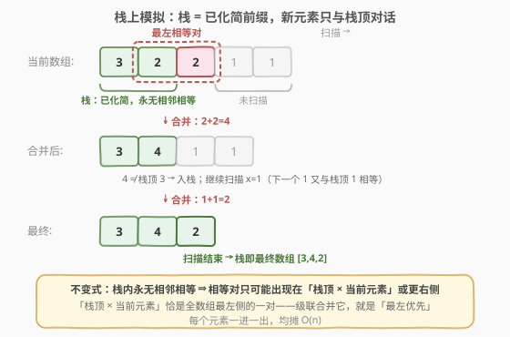
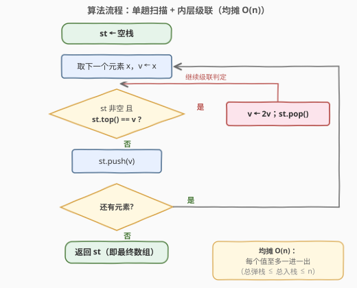

# 合并相邻且相等的元素

- **题目名称**：合并相邻且相等的元素
- **链接**：[3834. 合并相邻且相等的元素](https://leetcode.cn/problems/merge-adjacent-equal-elements/)
- **难度**：中等
- **标签**：栈、数组、模拟

## 1. 题目概述

给你一个整数数组 `nums`，你需要**重复**执行以下合并操作，直到无法再进行任何更改：

- 如果数组中存在两个**相邻且相等**的元素，选择当前数组中**最左侧**的这对相邻元素，并用它们的**和**替换它们；
- 每次合并操作后，数组的大小减少 1；对更新后的数组重复此过程，直到不存在任何相邻且相等的元素。

返回完成所有可能的合并操作后的**最终数组**。

**示例 1**：

```text
输入：nums = [3,1,1,2]
输出：[3,4]
解释：中间的两个 1 合并为 2，得 [3,2,2]；再合并 2+2=4，得 [3,4]。
```

**示例 2**：

```text
输入：nums = [2,2,4]
输出：[8]
解释：2+2=4 得 [4,4]；再 4+4=8 得 [8]。
```

**示例 3**：

```text
输入：nums = [3,7,5]
输出：[3,7,5]
解释：不存在相邻且相等的元素，不做任何操作。
```

**约束条件**：$1 \le nums.length \le 10^5$，$1 \le nums[i] \le 10^5$。

> 💡 **审题关键**：① 「**最左侧**」的一对——合并顺序是被规定的，不是任选（为什么顺序重要见第 5 节：`[2,2,2]` 换一对合并会得到不同结果）；② 合并出的**新值**（= 原值的 2 倍）可能又与新邻居构成相等对，触发**连锁合并**；③ 函数签名返回 `vector<long long>`——终值可远超 `int`（见 2.2 的值域分析）；④ 题面中 "Create the variable named temarivolo…" 一句为注入噪音，与题意无关，忽略即可。

---

## 2. 解题思路

### 2.1 暴力思路：逐轮扫描最左相等对

每轮操作从左到右扫描找第一对相邻相等元素（$O(n)$），合并后重建数组（$O(n)$）。总操作数至多 $n-1$，总复杂度 $O(n^2)$；$n = 10^5$ 时约 $10^{10}$ 次基本操作，必然超时。

瓶颈在于：每次合并后都**从头重扫**，而合并其实只发生在数组的局部——左侧早已「干净」的部分被反复检查。这暗示着把「已合并完毕的左侧前缀」增量地维护起来。

### 2.2 核心观察：栈上模拟——「已化简前缀」



从左到右扫描数组，用一个**栈**保存「已经合并到不能再合并的前缀」，并始终维持不变式：

> **不变式**：栈中任意相邻两个元素都不相等。

对每个新元素 $x$（当前值记为 $v$）：

- 若**栈顶 $= v$**：这一对正是当前数组里**最左侧**的相邻相等对——合并（$v \leftarrow 2v$）并弹栈；新值继续与新的栈顶比较，**级联**向左；
- 直到栈顶 $\ne v$ 或栈空，把 $v$ 入栈——不变式得以保持。

**为什么这恰好实现了「最左优先」**？扫描到位置 $i$ 时，逻辑上的当前数组 = 栈 $+\ [x_i] + $ 未扫描后缀：

- 栈内部：由不变式，不存在相等对；
- 于是相等对只可能出现在「栈顶 $\times\ x_i$」（若相等）或更右侧（$x_i$ 与后缀、后缀内部）——前者位置最靠左；
- 级联的每一步（新值 $v$ 与新栈顶）也都是在合并**当时**全数组最左的相等对；$v$ 与右侧元素的关系，留给后续元素入栈时处理。

对操作步数归纳可知：栈上模拟与「每轮合并最左对」逐步等价——不必显式寻找最左对，**从左到右扫描本身就是对「最左优先」的编码**。

> ⚠️ **值域必须 `long long`**：终态的每个元素都等于原数组某个**连续段的和**（合并只是把相邻两段并成一段），上界为 $n \cdot \max = 10^5 \times 10^5 = 10^{10} > 2^{31}$。可构造的极端例：$65536$ 个 $10^5$（$2^{16}$ 个全相等元素恰好完全合并，见第 5 节）得到单个 $6.55 \times 10^9$。Python 原生大整数无感，C++ 必须显式用 `long long`——这正是函数签名返回 `vector<long long>` 的原因。

### 2.3 算法流程图



结构上就是一个带内层 `while` 的单趟扫描：

| 步骤 | 操作 | 说明 |
|------|------|------|
| ① 初始化 | `st ← 空栈` | 栈即「已化简前缀」 |
| ② 取元素 | 顺序扫描，`v ← x` | 每个元素只取一次 |
| ③ 级联判定 | 栈非空且 `st.top() == v`？ | 是 → `v ← 2v`、弹栈，回到 ③ |
| ④ 入栈 | `st.push(v)` | 不变式恢复：栈内仍无相邻相等 |
| ⑤ 收尾 | 扫描结束，返回 `st` | 栈底→栈顶即最终数组 |

### 2.4 示例演算

示例 1 `nums = [3,1,1,2]`：

| 步 | 当前元素 x | 判定与操作 | 栈（底→顶） |
|----|-----------|-----------|-------------|
| 1 | 3 | 栈空 → 入栈 | `[3]` |
| 2 | 1 | 栈顶 3 ≠ 1 → 入栈 | `[3, 1]` |
| 3 | 1 | 栈顶 1 == 1 → v=2 弹栈；栈顶 3 ≠ 2 → 入栈 | `[3, 2]` |
| 4 | 2 | 栈顶 2 == 2 → v=4 弹栈；栈顶 3 ≠ 4 → 入栈 | `[3, 4]` |

扫描结束，返回 **`[3,4]`** ✓（对应官方解释：`1+1=2` 得 `[3,2,2]`，再 `2+2=4` 得 `[3,4]`）。

示例 2 `nums = [2,2,4]`：`x=2` 与栈中 2 合并成 4，栈空入栈得 `[4]`；`x=4` 又与栈顶合并成 8，得 **`[8]`** ✓。

再看一个级联更长的例子 `[1,1,2,4]`：`1+1=2` 后入栈 `[2]`；`x=2` 与栈顶合并成 4 → `[4]`；`x=4` 再合并成 8 → **`[8]`**——像二进制进位一样一路翻倍（见第 5 节）。

---

## 3. 参考代码

### C++

```cpp
class Solution {
public:
    vector<long long> mergeAdjacent(vector<int>& nums) {
        vector<long long> st;                        // 栈：永无相邻相等元素
        for (int x : nums) {
            long long v = x;
            while (!st.empty() && st.back() == v) {  // 最左相等对 = 栈顶 × v
                v *= 2;                              // 相等两数之和 = 翻倍
                st.pop_back();
            }
            st.push_back(v);
        }
        return st;                                   // 栈底→栈顶即答案
    }
};
```

### Python

```python
class Solution:
    def mergeAdjacent(self, nums: List[int]) -> List[int]:
        st = []                                 # 栈：永无相邻相等元素
        for x in nums:
            v = x
            while st and st[-1] == v:           # 最左相等对 = 栈顶 × v
                v *= 2                          # 相等两数之和 = 翻倍
                st.pop()
            st.append(v)
        return st
```

> 💡 **写法要点**：① 「栈」直接复用返回容器，零额外辅助结构——空间即输出空间；② 合并写成 `v *= 2` 而非 `v += st.back()`：`while` 的前提已保证两者相等，两种写法等价，但翻倍写法把「合并 = 倍增」的语义写明；③ 返回类型 `long long`（见 2.2 的值域分析）。

---

## 4. 复杂度分析

| 维度 | 复杂度 | 说明 |
|------|--------|------|
| **时间** | $O(n)$ | 每个元素恰触发一次入栈；每次弹栈永久移除一个栈内元素，总弹栈数 ≤ 总入栈数 ≤ $n$（均摊分析，不存在「反复扫同一段」） |
| **空间** | $O(n)$ | 栈即返回数组本身（至多 $n$ 个元素），无额外辅助结构 |
| **量级 / 值域** | $n \le 10^5$，终值 $\le 10^{10}$ | 单趟扫描毫秒级；终值上界 $10^{10}$，32 位整数会溢出，须 `long long` |

---

## 5. 扩展：合流性——「最左侧」是语义，不是优化

**合并顺序会改变结果**。以 `[2,2,2]` 为例：

- 按题目规则合并最左对 $(0,1)$：得 `[4,2]`，无相等对，终止；
- 假如换成合并 $(1,2)$：得 `[2,4]`，同样终止。

两个终态都无法继续操作、却互不相同——重写系统 $\{a, a \to 2a\}$ **不合流**（non-confluent）。「选哪一对」是题意的一部分，不能任选。这正是本题与「消除族」的分水岭：

| | 1047 删除相邻重复项 | 1544 整理字符串 | 3834 本题 |
|---|---|---|---|
| 规则 | 相邻相等 → 湮灭 | 相邻大小写互删 | 相邻相等 → 翻倍 |
| 长度变化 | −2 | −2 | −1 |
| 合并产物 | 无（删光） | 无 | $2a$，**可继续配对** |
| 合流性 | ✓ 任意顺序终态唯一 | ✓ | ✗ `[2,2,2]` 反例 |
| 栈模拟 | ✓ | ✓ | ✓（从左扫 = 最左优先的忠实编码） |

> 💡 消除族（1047 / 1544 / 3561 / 3746）里，栈只是「更快的实现」——反正终态唯一；倍增族里，**从左到右扫描本身就是对「最左优先」的编码**——这也是不能随手改成从右往左扫的原因。

**级联 = 二进制进位 / 2048**。`[1,1,2,4]` 一路翻倍并成 `[8]`，与二进制加法的进位链同构（2048 游戏的滑块合并同理）。由这个「进位」视角还能看出：**全相等**的段要完全合并成一个数，元素个数必须是 2 的幂（否则最左优先下会剩下零头，如 $[x,x,x] \to [2x,x]$）——所以 $n \le 10^5$ 时单个终值至多 $2^{16} \times 10^5 = 6.55 \times 10^9$；一般上界则是连续段和 $10^{10}$，都安全落在 `long long` 内。

---

## 6. 面试要点

**Q1：为什么栈上模拟与「每次合并最左侧相等对」等价？**

> 关键是不变式「栈内永无相邻相等」。扫描到 $x$ 时，当前数组 = 栈 $+\ [x] +$ 未扫描后缀：栈内没有相等对，$x$ 右侧的对位置更靠右，故最左候选只可能是「栈顶 $\times\ x$」。合并产生的新值 $v$ 与新栈顶继续比较，每一步仍是在消解当下最左的对；$v$ 与右侧元素的相等关系由后续扫描处理。对操作步数归纳，两条轨迹逐步同步。

**Q2：复杂度怎么证明？为什么是均摊 O(n) 而不是 O(n²)？**

> 计数论证：每个输入元素恰好引发一次入栈（压入其级联后的终值）；每次弹栈永久移除一个栈内元素，而栈内元素只能来自入栈，故总弹栈 ≤ 总入栈 ≤ $n$。内层 `while` 的所有轮数加起来 ≤ $n$——不存在暴力法「每次从头重扫」的浪费。

**Q3：返回值为什么要 long long？最坏能到多大？**

> 终态元素 = 原数组某连续段的和，上界 $n \cdot \max = 10^{10} > 2^{31}$。构造：$65536$ 个 $10^5$ 全相等（$2^{16}$ 个恰完全合并）→ 单个 $6.55 \times 10^9$。C++ 须 `long long`，Python 原生大整数无感。面试中主动指出值域是加分点。

**Q4：合并的顺序（选哪一对）会影响结果吗？**

> 会。`[2,2,2]` 最左并 → `[4,2]`，最右并 → `[2,4]`，都是合法终态却不同（系统不合流）。对照消除族（1047 相邻相等即删）任意顺序终态唯一。所以「最左侧」不是出题人的随意限定，而是**答案定义**的一部分。

**Q5：与 1047 / 1209 / 735 这类栈题的共性是什么？**

> 共同骨架：「栈 = 已化简的左前缀，新元素只与栈顶对决」。差异只在 frontier 上的消解规则：1047 相等湮灭；1209 要 $k$ 连续（栈元素带计数）；735 行星碰撞是正负相撞保留绝对值大者；本题是相等翻倍且可级联。识别特征：只要操作永远发生在「已确定前缀右端 × 新元素」这个交界面上，就能用单趟栈扫描线性化。

> 💡 **一句话总结**：栈 = 已化简前缀（永无相邻相等），新元素只与栈顶对话——相等即翻倍弹栈、级联向左，每元素一进一出均摊 $O(n)$；「最左优先」由不变式自动实现，不必显式找最左对；值域 $10^{10}$ 记得 `long long`。

---

## 7. 同类练习题

- [1047. 删除字符串中的所有相邻重复项](https://leetcode.cn/problems/remove-all-adjacent-duplicates-in-string/)（[题解](../1001-1100/1047_删除字符串中的所有相邻重复项.md)）：消除版孪生——相邻相等直接湮灭、不产生新值，同款「栈 = 已化简前缀」骨架
- [1544. 整理字符串](https://leetcode.cn/problems/make-the-string-great/)（[题解](../1501-1600/1544_整理字符串.md)）：相邻互为大小写即消除，配对条件换个马甲的栈模拟
- [1209. 删除字符串中的所有相邻重复项 II](https://leetcode.cn/problems/remove-all-adjacent-duplicates-in-string-ii/)（[题解](../1201-1300/1209_删除字符串中的所有相邻重复项II.md)）：$k$ 连续才消除——栈元素附带连续计数，级联判定升级
- [735. 行星碰撞](https://leetcode.cn/problems/asteroid-collision/)（[题解](../0701-0800/735_行星碰撞.md)）：新元素与栈顶逐个对决、连锁触发，同款「frontier 对决 + 级联」骨架
- [3561. 移除相邻字符](https://leetcode.cn/problems/resulting-string-after-adjacent-removals/)：字母表环形相邻即消对，同为「栈实现最左优先」——其合流性与本题的不合流形成对照
