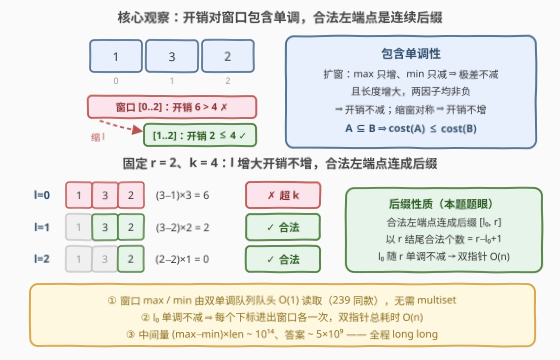
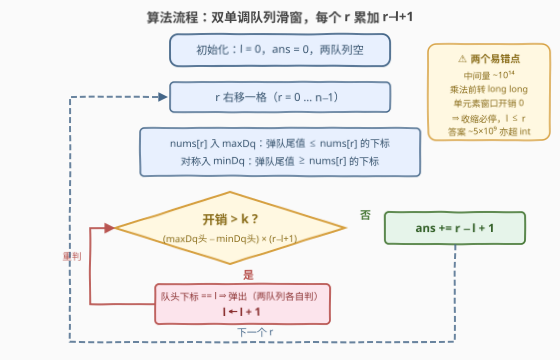

# 开销小于等于 K 的子数组数目

- **题目名称**：开销小于等于 K 的子数组数目
- **链接**：[3835. 开销小于等于 K 的子数组数目](https://leetcode.cn/problems/count-subarrays-with-cost-less-than-or-equal-to-k/)
- **难度**：中等
- **标签**：队列、数组、滑动窗口、单调队列

## 1. 题目概述

给你一个整数数组 `nums` 和一个整数 `k`。对于任意子数组 `nums[l..r]`，其**开销**定义为：

$$cost = \big(\max(nums[l..r]) - \min(nums[l..r])\big) \times (r - l + 1)$$

即「窗口极差 × 窗口长度」。返回 `nums` 中开销**小于或等于** `k` 的子数组数量。**子数组**是数组中连续的**非空**元素序列。

**示例 1**：

```text
输入：nums = [1,3,2], k = 4
输出：5
解释：所有 6 个子数组中，仅 nums[0..2] 的开销 (3-1)×3 = 6 超过 4，其余 5 个均满足。
```

**示例 2**：

```text
输入：nums = [5,5,5,5], k = 0
输出：10
解释：任何子数组的最大值与最小值都相同，开销恒为 0，全部合法（共 4×5/2 = 10 个）。
```

**示例 3**：

```text
输入：nums = [1,2,3], k = 0
输出：3
解释：开销为 0 的只有 3 个单元素子数组。
```

**约束条件**：

- $1 \le nums.length \le 10^5$
- $1 \le nums[i] \le 10^9$
- $0 \le k \le 10^{15}$

> 💡 **审题关键**：① $n$ 到 $10^5$，子数组总数 $\binom{n+1}{2} \approx 5\times10^9$，$O(n^2)$ 逐个枚举判定必然超时，目标 $O(n)$ / $O(n\log n)$；② 开销上界约 $10^9 \times 10^5 = 10^{14}$、答案上界约 $5\times10^9$，**C++ 中开销中间量与答案都必须用 `long long`**（恰好题目函数签名就把 `k` 声明成了 `long long`）；③ $k \ge 0$ 意味着**单元素子数组开销恒为 0、永远合法**——这保证了滑窗永远不会收缩到空。

---

## 2. 解题思路

### 2.1 暴力思路：枚举所有子数组

固定左端点 `l`，向右扩张 `r`，边扩边维护-running 的 `max`/`min`，每个子数组的开销 $O(1)$ 可得：

```text
for l in 0..n-1:
    mx = mn = nums[l]
    for r in l..n-1:
        mx = max(mx, nums[r]); mn = min(mn, nums[r])
        if (mx - mn) * (r - l + 1) <= k: ans++
```

总时间 $O(n^2)$，$n = 10^5$ 时约 $5\times10^9$ 次判断，不可接受。瓶颈在于：**把每个子数组当成独立个体重复判定**，而实际上相邻子数组的 `max`/`min` 高度共享。突破口是找到开销随窗口伸缩的**单调性**，从而把「逐个判定」变成「按右端点批量计数」。

### 2.2 核心观察：开销对窗口包含关系单调 → 滑动窗口计数



**观察一（包含单调性）**：设窗口 $A \subseteq B$（$A$ 是 $B$ 的子区间），则 $cost(A) \le cost(B)$。

- 扩窗（$B \supseteq A$）：$\max$ 只增不减、$\min$ 只减不增 ⇒ **极差不减**；**长度更大** ⇒ 两个非负因子相乘，乘积不减；
- 缩窗（$A \subseteq B$）：对称地，极差不增、长度更小 ⇒ 开销不增。

于是「开销 $\le k$」是一个**对包含关系封闭**的性质：大窗口非法则包含它的小窗口未必非法，但**小窗口合法则包含它的大窗口未必合法**——反过来说更顺口：

> 固定右端点 $r$，若 $cost(l..r) > k$，则任何 $l' < l$（窗口更大）也非法；若 $cost(l..r) \le k$，则任何 $l' > l$（窗口更小）也合法。

**观察二（合法左端点是连续后缀）**：固定 $r$，合法的 $l$ 恰好构成区间 $[l_0(r),\ r]$ 一段**连续后缀**。因此无需逐个判定，只需求出最小的合法左端点 $l_0(r)$，以 $r$ 结尾的合法子数组个数就是 $r - l_0(r) + 1$。

**观察三（l₀ 单调不减，双指针可行）**：由 $cost(l, r+1) \ge cost(l, r)$（右端扩张包含原窗口），$r$ 右移后原先非法的 $l$ 依旧非法，故 $l_0(r+1) \ge l_0(r)$——左指针**只会右移**，每个元素至多进出窗口一次，总移动 $O(n)$。

**观察四（窗口 max/min 需 O(1)）**：收缩左端点后窗口的 $\max/\min$ 要即时更新，普通 multiset 是 $O(\log n)$；用 [239. 滑动窗口最大值](https://leetcode.cn/problems/sliding-window-maximum/) 的**双单调队列**可以做到均摊 $O(1)$：`maxDq` 存下标、对应值**单调递减**（队头即窗口最大值），`minDq` 对应值**单调递增**（队头即窗口最小值）。

> 💡 **一句话**：包含单调性 ⇒ 合法左端点是后缀且随 $r$ 单调右移 ⇒ 「枚举 $r$ + 双指针收缩 + 每步累加 $r-l+1$」的**滑动窗口计数**模板；max/min 用双单调队列 $O(1)$ 维护。这与「求和 ≥ target 的最短子数组」共享同一套骨架，只是判定量从 `sum` 换成了 `极差 × 长度`。

### 2.3 算法流程图



| 步骤 | 操作 | 说明 |
|------|------|------|
| ① 扩窗 | `r` 右移一格；从 `maxDq` 队尾弹出所有值 $\le nums[r]$ 的下标后入队；`minDq` 对称（弹出 $\ge$） | 维护队头到队尾的递减 / 递增单调性 |
| ② 判定 | $cost = (nums[\text{maxDq.head}] - nums[\text{minDq.head}]) \times (r-l+1)$ | 三个因子全部 $O(1)$ 读队头 |
| ③ 收缩 | `while cost > k`：队头下标 $== l$ 者弹出（两个队列各自判断），`l++` 后重算 | 单元素窗口开销为 0，循环必在 $l \le r$ 前停下，窗口不会变空 |
| ④ 计数 | `ans += r - l + 1` | 以 $r$ 结尾、左端点落在 $[l, r]$ 的子数组全部合法 |

### 2.4 示例演算

以示例 1 `nums = [1,3,2], k = 4` 演算（队列内容存下标，括号标注对应值）：

| r | 入队后 maxDq | 入队后 minDq | 窗口 | 开销 | 收缩动作 | 贡献 |
|---|-------------|-------------|------|------|---------|------|
| 0 | [0](1) | [0](1) | [0,0] | (1−1)×1 = 0 ≤ 4 | 无 | 0−0+1 = **1** |
| 1 | [1](3) | [0,1](1,3) | [0,1] | (3−1)×2 = 4 ≤ 4 | 无 | 1−0+1 = **2** |
| 2 | [1,2](3,2) | [0,2](1,2) | [0,2] | (3−1)×3 = 6 > 4 | 弹 minDq 队头 0，l→1 | — |
|   | [1,2](3,2) | [2](2) | [1,2] | (3−2)×2 = 2 ≤ 4 | 停 | 2−1+1 = **2** |

累计 $1+2+2 = 5$ ✓。注意第 3 行收缩时 `maxDq` 队头是下标 1（值 3，仍是窗口 $[1,2]$ 的最大值）**不弹出**，`minDq` 队头下标 0 等于 `l` 才弹出——两个队列各自独立判断，这是实现上最容易写错的一处。

**示例 2** `[5,5,5,5], k=0`：极差恒为 0，窗口从不收缩，贡献 $1+2+3+4=10$ ✓。**示例 3** `[1,2,3], k=0`：每个新元素都使极差变正，`l` 始终被顶到 `r`，贡献恒为 1，共 3 ✓。

---

## 3. 参考代码

### C++

```cpp
class Solution {
public:
    long long countSubarrays(vector<int>& nums, long long k) {
        long long ans = 0;
        int n = nums.size(), l = 0;
        deque<int> maxDq, minDq;              // 存下标：maxDq 值递减，minDq 值递增
        for (int r = 0; r < n; ++r) {
            while (!maxDq.empty() && nums[maxDq.back()] <= nums[r]) maxDq.pop_back();
            maxDq.push_back(r);
            while (!minDq.empty() && nums[minDq.back()] >= nums[r]) minDq.pop_back();
            minDq.push_back(r);

            while ((long long)(nums[maxDq.front()] - nums[minDq.front()]) * (r - l + 1) > k) {
                if (maxDq.front() == l) maxDq.pop_front();   // 两队列各自判断是否弹队头
                if (minDq.front() == l) minDq.pop_front();
                ++l;
            }
            ans += r - l + 1;                 // 以 r 结尾的合法子数组个数
        }
        return ans;
    }
};
```

### Python

```python
from collections import deque

class Solution:
    def countSubarrays(self, nums: List[int], k: int) -> int:
        ans, l = 0, 0
        max_dq, min_dq = deque(), deque()     # 存下标：max_dq 值递减，min_dq 值递增
        for r, x in enumerate(nums):
            while max_dq and nums[max_dq[-1]] <= x:
                max_dq.pop()
            max_dq.append(r)
            while min_dq and nums[min_dq[-1]] >= x:
                min_dq.pop()
            min_dq.append(r)

            while (nums[max_dq[0]] - nums[min_dq[0]]) * (r - l + 1) > k:
                if max_dq[0] == l:
                    max_dq.popleft()
                if min_dq[0] == l:
                    min_dq.popleft()
                l += 1
            ans += r - l + 1
        return ans
```

> 💡 **写法要点**：① 中间量 `(max − min) × len` 最大约 $10^9 \times 10^5 = 10^{14}$，`int` 装不下，C++ 必须显式转 `long long`（乘法**之前**转，`int × int` 先溢出再转就晚了）；② 弹队头必须「等于 `l` 才弹」而不是无条件弹——队头下标可能大于 `l`，它仍是当前窗口的最值；③ 收缩循环不会越界：窗口缩到单元素时开销为 0 $\le k$（$k \ge 0$），必然退出。

---

## 4. 复杂度分析

| 维度 | 复杂度 | 说明 |
|------|--------|------|
| **时间** | $O(n)$ | 每个下标入队、出队各至多 1 次（两个队列共 $4n$ 次队操作）；`l` 单向右移至多 $n$ 步；`r` 循环 $n$ 轮，每轮均摊 $O(1)$ |
| **空间** | $O(n)$ | 两个单调队列最多各存 $n$ 个下标（数组严格递增/递减时取到上界） |
| **量级判断** | $n \sim 10^5$ | 线性扫描毫无压力；对比暴力 $O(n^2) \approx 5\times10^9$ 次判定，快 5 个数量级 |

> ⚠️ 虽然收缩 `while` 嵌套在扩窗 `for` 里，但与单调栈同理做**均摊分析**：`l` 从 0 走到至多 $n-1$，全程总收缩步数 $\le n$；两个队列每个元素至多进一次出一次。两层循环的总执行次数是 $O(n)$ 而非 $O(n^2)$。

---

## 5. 扩展

### 5.1 判定量的「包含单调性」谱系

滑动窗口计数的合法性完全取决于判定量是否对窗口包含关系单调，值得整理一张谱系表：

| 判定量 | 单调性 | 例题 |
|--------|--------|------|
| 非负数组的 `sum ≤ k` | ✅ 扩窗只增 | [209. 长度最小的子数组](https://leetcode.cn/problems/minimum-size-subarray-sum/) |
| 极差 `max − min ≤ limit` | ✅ 扩窗只增 | [1438. 绝对差不超过限制的最长连续子数组](https://leetcode.cn/problems/longest-continuous-subarray-with-absolute-diff-less-than-or-equal-to-limit/) |
| 极差 × 长度（本题） | ✅ 两个非负因子都只增 | 3835 |
| 带负数数组的 `sum` | ❌ 扩窗可能变小 | [862. 和至少为 K 的最短子数组](https://leetcode.cn/problems/shortest-subarray-with-sum-at-least-k/)，改用前缀和 + 单调队列 |
| 按位或 `\|` | ✅ 只增不減（但难撤销） | 3026 等，需额外技巧 |

### 5.2 变体速查

- **改求「严格小于 k」**：开销与 $k$ 都是整数，等价于 $\le k-1$，一行改动；「恰好等于 k」则用 $\le k$ 减 $\le k-1$ 两次滑窗。
- **改求最长合法子数组**：保留收缩逻辑，答案改为 $\max(r - l + 1)$——即 1438 / [2762. 不间段子数组](https://leetcode.cn/problems/continuous-subarrays/) 的形态。
- **max/min 固定为指定值**：退化为 [2444. 统计定界子数组的数目](https://leetcode.cn/problems/count-subarrays-with-fixed-bounds/)，那里用「三次滑窗相减」替代双单调队列，两种计数姿势可以互相印证。
- **换 ST 表 / 线段树维护区间最值**：也能做，查询 $O(1)$ 但预处理 $O(n\log n)$ 且无法 $O(1)$ 撤销左端点——对本题是杀鸡用牛刀，单调队列是最优工程选择。

---

## 6. 面试要点

**Q1：凭什么这题敢用滑动窗口？现场证明单调性。**

> 开销 $=$（极差）$\times$（长度），两个因子都非负。扩窗时 $\max$ 只增不减、$\min$ 只减不增 ⇒ 极差不减，且长度严格变大，故开销对窗口包含关系单调不减。于是固定右端点 $r$ 时合法左端点是连续后缀 $[l_0(r), r]$；又因 $cost(l, r+1) \ge cost(l, r)$，$l_0$ 随 $r$ 单调不减，双指针成立。

**Q2：单调队列在这里具体维护什么？和 239 题有何异同？**

> 两个双端队列都存**下标**：`maxDq` 从队头到队尾对应值严格递减（队头即窗口最大值），`minDq` 递增（队头即最小值）。入队时从队尾弹掉所有被新元素「压制」的下标；左端点右移越过队头时从队头弹出。与 239 的区别只在：239 是固定长度窗口、每步读一次队头；这里是变长窗口，队头还要参与收缩判定。

**Q3：溢出风险有哪些？**

> 三处：① 中间量 `(max−min)×(r−l+1)` 上界约 $10^9 \times 10^5 = 10^{14}$，C++ 中乘法前就要转 `long long`；② 答案上界 $\binom{n+1}{2} \approx 5 \times 10^9$，超过 `int32`；③ 本题 $k$ 本身就能到 $10^{15}$，函数签名已给 `long long`。Python 无此虑。

**Q4：收缩时为什么两个队列要「各自判断队头是否等于 l」而不是一起弹？**

> 队头下标等于 `l` 才说明该最值恰好在被移出的位置上；另一个队列的队头可能指向窗口内部的位置，仍是有效最值。若无条件弹队头，会把仍在窗口内的最值丢掉，后续开销算小、答案偏大。

**Q5：为什么收缩循环不需要担心窗口变空、数组越界？**

> 窗口缩到单元素 $[r, r]$ 时开销为 $(nums[r]-nums[r]) \times 1 = 0 \le k$（约束保证 $k \ge 0$），循环必然终止在 $l \le r$，因此队头访问和 `ans += r - l + 1` 永远安全。若题目允许 $k < 0$，则需加 `l <= r` 的防御。

**Q6：为什么答案是 `ans += r - l + 1` 而不是别的组合？**

> 固定右端点 $r$ 枚举：合法左端点恰是后缀 $[l, r]$，个数 $r - l + 1$；且不同右端点的子数组互不相同，全体右端点的贡献相加不重不漏。这是所有「计数型滑窗」的通用收尾，与「求最长型」收尾取 $\max$ 相对照。

> 💡 **一句话总结**：3835 =「开销 = 极差 × 长度对窗口包含关系单调 ⇒ 合法左端点是后缀且随 r 单调右移」+「双单调队列 O(1) 维护窗口 max/min」+「每个 r 累加 r−l+1」。带走的知识点：**计数型滑动窗口的通用三段式——单调性论证、O(1) 窗口度量、按右端点批量计数**。

---

## 7. 同类练习题

- [239. 滑动窗口最大值](https://leetcode.cn/problems/sliding-window-maximum/)（[题解](../0201-0300/239_滑动窗口最大值.md)）：单调队列维护窗口最值的招牌题，本题双队列的直接源头
- [1438. 绝对差不超过限制的最长连续子数组](https://leetcode.cn/problems/longest-continuous-subarray-with-absolute-diff-less-than-or-equal-to-limit/)（[题解](../1401-1500/1438_绝对差不超过限制的最长连续子数组.md)）：同款双单调队列，判定量少了长度因子、求最长而非计数
- [2762. 不间段子数组](https://leetcode.cn/problems/continuous-subarrays/)（[题解](../2701-2800/2762_不间段子数组.md)）：同为「极差约束 + 滑窗计数」，且也要防中间量溢出
- [2444. 统计定界子数组的数目](https://leetcode.cn/problems/count-subarrays-with-fixed-bounds/)（[题解](../2401-2500/2444_统计定界子数组的数目.md)）：计数型滑窗的另一姿势——三次相减替代双队列
- [862. 和至少为 K 的最短子数组](https://leetcode.cn/problems/shortest-subarray-with-sum-at-least-k/)（[题解](../0801-0900/862_和至少为K的最短子数组.md)）：判定量（带负数的 sum）失去包含单调性时的补救：前缀和 + 单调队列
- [209. 长度最小的子数组](https://leetcode.cn/problems/minimum-size-subarray-sum/)（[题解](../0201-0300/209_长度最小的子数组.md)）：包含单调性滑窗的入门题，理解 5.1 谱系表的起点
