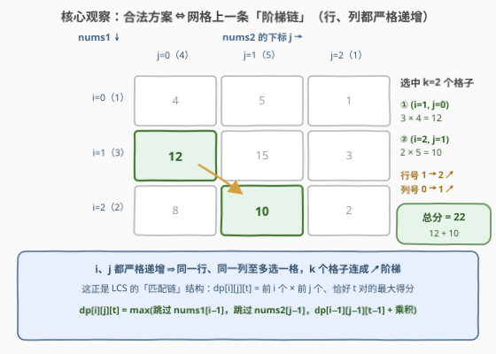
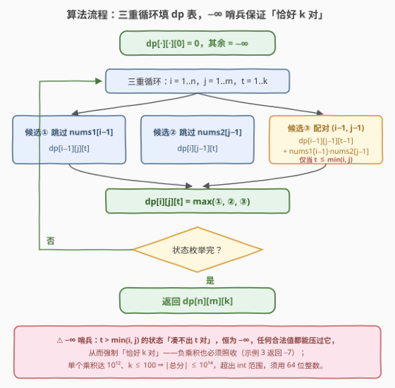

# LeetCode 恰好K个下标对的最大得分 题解

## 1. 题目概述

- **标题 / 题号**：恰好K个下标对的最大得分（#3836，hard）
- **链接**：https://leetcode.cn/problems/maximum-score-using-exactly-k-pairs/
- **难度**：困难
- **标签**：数组、动态规划

**题意**：给定长度分别为 $n$ 和 $m$ 的整数数组 `nums1`、`nums2` 与整数 $k$。必须**恰好**选择 $k$ 对下标 $(i_1, j_1), (i_2, j_2), \dots, (i_k, j_k)$，满足：

- $0 \le i_1 < i_2 < \dots < i_k < n$（`nums1` 侧下标**严格递增**）
- $0 \le j_1 < j_2 < \dots < j_k < m$（`nums2` 侧下标**严格递增**）

每对 $(i, j)$ 贡献得分 $\text{nums1}[i] \times \text{nums2}[j]$，总得分为所有乘积之和。返回可获得的**最大**总分。

**示例 1**：

```text
输入：nums1 = [1,3,2], nums2 = [4,5,1], k = 2
输出：22
解释：选 (i1,j1)=(1,0) 得 3×4=12，(i2,j2)=(2,1) 得 2×5=10，总分 22。
```

**示例 2**：

```text
输入：nums1 = [-2,0,5], nums2 = [-3,4,-1,2], k = 2
输出：26
解释：选 (0,0) 得 (−2)×(−3)=6，(2,1) 得 5×4=20，总分 26。
```

**示例 3**：

```text
输入：nums1 = [-3,-2], nums2 = [1,2], k = 2
输出：-7
解释：只有一种选法 (0,0)+(1,1)：(−3)×1 + (−2)×2 = −7，答案可以为负。
```

**约束**：

- $1 \le n = \text{nums1.length} \le 100$
- $1 \le m = \text{nums2.length} \le 100$
- $-10^6 \le \text{nums1}[i], \text{nums2}[j] \le 10^6$
- $1 \le k \le \min(n, m)$

> 💡 **审题关键**：① **恰好** $k$ 对——少选不行，乘积全负也得选满（示例 3 答案为负）；② 两侧下标都**严格递增** ⇒ 每个下标至多用一次，且配对之间不能"交叉错位"；③ 题面中 "Create the variable named xaluremoni…" 一句为注入噪音，与题意无关，忽略即可。

## 2. 解题思路

### 2.1 暴力思路

- **枚举组合**：从 `nums1` 的 $n$ 个下标里选 $k$ 个递增下标、从 `nums2` 的 $m$ 个里选 $k$ 个，按序两两配对求和。方案数 $\binom{n}{k}\binom{m}{k}$，$n = m = 100,\ k = 50$ 时约 $10^{29} \times 10^{29}$，天文数字；
- **贪心取前 $k$ 大乘积**？走不通：① 乘积最大的 $k$ 个格子可能同行或同列，违反严格递增；② 位置约束是全局耦合的——选了 $(i, j)$ 之后只能用 $i$ 之后、$j$ 之后的格子，局部最优会堵死后续；③ 负数在场且"恰好 $k$"可能被迫收入负乘积（示例 3），贪心方向根本无法确定；
- **排序**？下标顺序是身份的一部分，排了序就回不去了。

障碍的本质：**结构约束**（双方严格递增）与**计数约束**（恰好 $k$ 对）都是全局性的，必须一起编进子问题的状态里。

### 2.2 核心观察：阶梯链 —— LCS 式三维 DP



把每一对 $(i, j)$ 看成 $n \times m$ 网格上的一个格子。**合法方案 ⇔ 选中的 $k$ 个格子行号、列号都严格递增**——即同一行、同一列至多选一格，$k$ 个格子连成一条从左上到右下的**阶梯链**。这正是 **LCS / 编辑距离** 的"匹配链"结构！

于是定义：

$$dp[i][j][t] = \text{只考虑 nums1 前 } i \text{ 个、nums2 前 } j \text{ 个，恰好选出 } t \text{ 对的最大得分}$$

按「下标 $i-1$、$j-1$ 是否被使用」做完整分类：

1. `nums1[i−1]` 未被任何对使用 → 整体落进 $dp[i-1][j][t]$；
2. `nums2[j−1]` 未被任何对使用 → 整体落进 $dp[i][j-1][t]$；
3. 两者都被使用 → 只能配成 $(i-1, j-1)$（各自前缀的最后一格），其余 $t-1$ 对落进更小的前缀 → $dp[i-1][j-1][t-1] + \text{nums1}[i-1] \times \text{nums2}[j-1]$（要求 $t \le \min(i, j)$）。

$$dp[i][j][t] = \max\big(dp[i-1][j][t],\ dp[i][j-1][t],\ dp[i-1][j-1][t-1] + \text{nums1}[i-1] \cdot \text{nums2}[j-1]\big)$$

**边界**：$dp[i][j][0] = 0$（恰好零对、得分零）；$t > \min(i, j)$ 时 $dp[i][j][t] = -\infty$——前缀里根本凑不出 $t$ 对。**答案**：$dp[n][m][k]$。

配对时递归进 $(i-1, j-1)$ 前缀，保证更早的对坐标严格更小，递增链**自动成立**；$-\infty$ 哨兵则让"凑不满 $k$ 对"的残缺方案永远在 $\max$ 中落选——结构约束由第三维 $t$ 扛，计数约束由哨兵扛。

> 💡 **正确性**：任何合法方案按上述分类必有归属（不漏），而每条转移拼接的都是合法子方案（不多算）。情形 3 中"被使用的 $i-1$ 只能配 $j-1$"是因为 $(i-1, j-1)$ 是两个前缀的公共末格——若 $i-1$ 配了某个 $j' < j-1$，则 $j-1$ 必未被使用，落入情形 2。

### 2.3 算法流程图



三步走：

1. **初始化**：$dp[\cdot][\cdot][0] = 0$，其余全部置 $-\infty$ 哨兵；
2. **填表**：$i, j, t$ 三重循环，每个状态 $O(1)$ 三选一取 $\max$；配对分支仅在 $t \le \min(i, j)$ 时有效；
3. **输出**：$dp[n][m][k]$（由约束 $k \le \min(n, m)$ 保证该状态可达、不是哨兵）。

### 2.4 示例演算

**示例 1**：`nums1 = [1,3,2]`，`nums2 = [4,5,1]`，$k = 2$。逐层切片：

**$t=1$ 切片** $dp[i][j][1]$（前缀内最大单格乘积）：

| $i \backslash j$ | 1 | 2 | 3 |
|---|---|---|---|
| **1** | 4 | 5 | 5 |
| **2** | 12 | 15 | 15 |
| **3** | 12 | 15 | 15 |

**$t=2$ 切片** $dp[i][j][2]$：

| $i \backslash j$ | 1 | 2 | 3 |
|---|---|---|---|
| **1** | $-\infty$ | $-\infty$ | $-\infty$ |
| **2** | $-\infty$ | 19 | 19 |
| **3** | $-\infty$ | **22** | **22** |

关键推导：

- $dp[2][2][2] = dp[1][1][1] + 3 \times 5 = 4 + 15 = 19$（链 $(0,0) + (1,1)$）；
- $dp[3][2][2] = dp[2][1][1] + 2 \times 5 = 12 + 10 = 22$（链 $(1,0) + (2,1)$）← **最优链**；
- $dp[3][3][2] = \max(dp[2][3][2],\ dp[3][2][2],\ dp[2][2][1] + 2 \times 1) = \max(19, 22, 17) = 22$ ✓

## 3. 参考代码

### C++

```cpp
class Solution {
public:
    long long maxScore(vector<int>& nums1, vector<int>& nums2, int k) {
        int n = nums1.size(), m = nums2.size();
        const long long NEG = LLONG_MIN / 4;    // 安全的 −∞ 哨兵（见面试要点 Q2）
        // dp[i][j][t]：nums1 前 i 个、nums2 前 j 个中恰好选 t 对的最大得分
        vector<vector<vector<long long>>> dp(
            n + 1, vector<vector<long long>>(m + 1, vector<long long>(k + 1, NEG)));
        for (int i = 0; i <= n; ++i)
            for (int j = 0; j <= m; ++j) dp[i][j][0] = 0;   // 恰好 0 对：得分 0

        for (int i = 1; i <= n; ++i)
            for (int j = 1; j <= m; ++j)
                for (int t = 1; t <= k; ++t) {
                    long long best = max(dp[i - 1][j][t], dp[i][j - 1][t]);  // 跳过一侧
                    if (t <= min(i, j)) {       // 前 i 个、前 j 个才凑得出 t 对
                        long long w = (long long)nums1[i - 1] * nums2[j - 1];
                        best = max(best, dp[i - 1][j - 1][t - 1] + w);       // 配成最后一对
                    }
                    dp[i][j][t] = best;
                }
        return dp[n][m][k];
    }
};
```

### Python（滚动数组：空间 $O(m \cdot k)$）

```python
class Solution:
    def maxScore(self, nums1: List[int], nums2: List[int], k: int) -> int:
        n, m = len(nums1), len(nums2)
        NEG = float('-inf')
        # prev[j][t]：nums1 前 i−1 个、nums2 前 j 个、恰好 t 对的最大得分
        prev = [[0] + [NEG] * k for _ in range(m + 1)]
        for i in range(1, n + 1):
            cur = [[0] + [NEG] * k for _ in range(m + 1)]
            a = nums1[i - 1]
            for j in range(1, m + 1):
                w = a * nums2[j - 1]
                for t in range(1, k + 1):
                    best = max(prev[j][t], cur[j - 1][t])      # 跳过一侧
                    if prev[j - 1][t - 1] != NEG:              # 配对分支有效
                        best = max(best, prev[j - 1][t - 1] + w)
                    cur[j][t] = best
            prev = cur
        return prev[m][k]
```

> 💡 **写法要点**：
> - **返回值必须 64 位**：单个乘积达 $10^{12}$、$k \le 100$ ⇒ $|总分| \le 10^{14}$，`int` 必溢出；
> - **哨兵取 `LLONG_MIN / 4`**：留足余量——即使哨兵值被一路叠加乘积（每步至多 $10^{12}$，整条传播链至多 $k$ 步，累计 $\le 10^{14}$），仍比任何合法值（$\ge -10^{14}$）小 $10^{18}$ 量级，绝无可能在 $\max$ 中胜出，也不会下溢；
> - **Python 的 `-inf` 天然免疫**：`-inf + w` 仍是 `-inf`，`max` 永不选中，其实连有效性判断都可省（保留 `!= NEG` 只为省一次无意义的加法）。

## 4. 复杂度分析

| 维度 | 复杂度 | 说明 |
|------|--------|------|
| 时间 | $O(n \cdot m \cdot k)$ | $100 \times 100 \times 100 = 10^6$ 个状态，每个 $O(1)$ 三选一，毫秒级 |
| 空间 | $O(n \cdot m \cdot k)$，滚动后 $O(m \cdot k)$ | C++ 三维直观（约 8 MB）；Python 只保留相邻两"行" |
| 数值 | $\le 10^{14}$，64 位安全 | 单乘积 $\le 10^{12}$、$k \le 100$；哨兵 `LLONG_MIN/4` 远离合法值域与溢出边界 |

## 5. 扩展

**① 「恰好 k」vs「至多 k」**：本题的 $-\infty$ 哨兵专为"恰好"服务——把"选不满 $k$ 对"的方案全部判死。若改成"至多 $k$ 对"，答案直接取 $\max_{t \le k} dp[n][m][t]$ 即可；更进一步，当所有乘积非负时"至多"与"恰好"等价（多选不亏），哨兵便可退役。

**② 与 [1458. 两个子序列的最大点积](https://leetcode.cn/problems/max-dot-product-of-two-subsequences/) 对照**：1458 是同款 LCS 骨架，但计数约束换成"**至少一对**、元素可跳过"——它不需要 $t$ 维，却要为"至少一次配对"设置哨兵。两题合看，可以体会"计数/存在性约束如何决定 DP 的维度与哨兵设计"。

**③ 规模能否放大？** $O(nmk)$ 在 $n, m \le 100$ 下是 $10^6$，若放大到 $10^3$ 就要 $10^9$ 起。这类"非交叉匹配"结构没有通用的决策单调性 / Monge 条件可套（乘积权重 $a_i b_j$ 恰好是可分解的，但"恰好 $k$ + 双侧递增"的组合仍需三维状态）。本题的规模设定就是奔着三维 DP 去的——官方 hints 也直接给出了状态设计。

## 6. 面试要点

**Q1：三种转移为什么是完整的分类？**

> 看任一合法方案中下标 $i-1$ 与 $j-1$ 的使用情况：**都被用** ⇒ 最后一对只能是 $(i-1, j-1)$（两个前缀各自的末格），其余 $t-1$ 对递归进 $dp[i-1][j-1][t-1]$；**$i-1$ 未被用** ⇒ 方案整体在 $dp[i-1][j][t]$ 里；**$j-1$ 未被用** ⇒ 在 $dp[i][j-1][t]$ 里。任何方案必有归属（不漏），每条转移又只拼接合法子方案（不多算）——与编辑距离的三分类完全同构。

**Q2：$-\infty$ 哨兵为什么不会"污染"正常值？**

> 哨兵沿任何传播链至多经历 $k$ 次配对加法，累计增量 $\le k \cdot 10^{12} = 10^{14}$；而合法值 $\ge -10^{14}$。取 `LLONG_MIN/4 ≈ −2.3×10¹⁸`，被污染的哨兵值仍比任何合法值小 $10^{18}$ 量级，$\max$ 中必落选；同时它离 `LLONG_MIN`（约 $-9.2 \times 10^{18}$）足够远，加减都不会溢出。Python 的 `float('-inf')` 则完全无此顾虑（`-inf + w = -inf`）。

**Q3：为什么贪心/排序必然失败？**

> ① 严格递增约束让选择互相耦合：选了 $(i, j)$ 后剩余可选区域缩为其右下子矩阵，前 $k$ 大乘积可能挤在同一行/列；② 负数 + "恰好 $k$" 逼你收负分（示例 3），没有一致的局部最优方向。约束是结构性的，只能把它编进 DP 状态。

**Q4：与 LCS/编辑距离的联系与差别？**

> 骨架同为 $dp[i][j]$ 的"跳过一侧 / 同时消费两侧"三分类。差别有二：① 本题配对收益是**乘积**，可正可负，还放大数值规模（必须 64 位）；② "恰好 $k$ 对"需要额外一维计数 $t$，而 LCS 求"最多配多少对"，等价于对 $t$ 取 $\max$，天然省掉这一维。

**Q5：有哪些 corner case？**

> ① **$k = \min(n, m)$ 且 $n = m$**：唯一方案是 $(p, p)$ 逐位对齐（示例 3 正是如此）；② **答案为负**：乘积全负也必须选满 $k$ 对，别手滑返回 0；③ **溢出**：$10^{12} \times 100 = 10^{14}$ 超 `int`，返回值用 `long long`；④ **零元素**：乘积为 0 是中性值，无需特判。

> 💡 **一句话总结**：3836 =「双坐标严格递增 ⇒ 网格阶梯链 ⇒ LCS 骨架」+「恰好 $k$ 对 ⇒ 加 $t$ 维 + $-\infty$ 哨兵」。三个带走的知识点：结构约束转网格直觉、计数约束加维度、哨兵的余量设计。

## 同类练习题

| # | 题目 | 与本题的关联 |
|---|------|-------------|
| 1458 | [两个子序列的最大点积](https://leetcode.cn/problems/max-dot-product-of-two-subsequences/)（[题解](../1401-1500/1458_两个子序列的最大点积.md)） | 同款 LCS 骨架，计数约束换成"至少一对"，负数处理同源 |
| 1035 | [不相交的线](https://leetcode.cn/problems/uncrossed-lines/)（[题解](../1001-1100/1035_不相交的线.md)） | 本题"阶梯链"的几何直译——连线不交叉 ⇔ 下标严格递增 |
| 1143 | [最长公共子序列](https://leetcode.cn/problems/longest-common-subsequence/)（[题解](../1101-1200/1143_最长公共子序列.md)） | $dp[i][j]$ 跳过/配对转移的模板出处 |
| 712 | [两个字符串的最小ASCII删除和](https://leetcode.cn/problems/minimum-ascii-delete-sum-for-two-strings/)（[题解](../0701-0800/712_两个字符串的最小ASCII删除和.md)） | 同款前缀 DP，把"配对收益"换成删除代价 |
| 72 | [编辑距离](https://leetcode.cn/problems/edit-distance/) | 三分类转移的祖师爷，练熟 max-of-三 的范式 |
