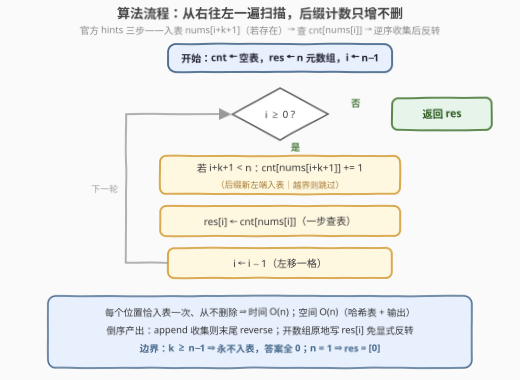

# LeetCode 相等元素的延迟计数 题解

## 1. 题目概述

- **标题 / 题号**：相等元素的延迟计数（#3837，medium）
- **链接**：https://leetcode.cn/problems/delayed-count-of-equal-elements/
- **难度**：中等
- **标签**：数组、哈希表、计数

> ⚠️ 本题为 LeetCode 付费题（Plus 会员专享），题意描述根据官方示例用例与 hints 重建，可能与官方题面有出入。

**题意**：给定下标从 0 开始的整数数组 `nums` 和整数 `k`。返回长度为 `n` 的数组 `res`，其中 `res[i]` 表示**出现在下标 `i` 之后、且间隔超过 `k` 个位置**的相等元素个数——即满足 `nums[j] == nums[i]` 且 $j \ge i+k+1$ 的下标 `j` 的数目。换句话说，从 `nums[i]` 向右看：紧邻的 `k` 个位置（`i+1 … i+k`）内的相等元素**不计数**，相等元素要「延迟」超过 `k` 个位置才算数。

**重建依据**（官方 hints 原文，共 4 条）：

1. Use a hashmap.
2. Traverse ..., and at index `i` insert `nums[i + k + 1]` (if it exists) into the hashmap.
3. For the current index `i`, count how many of its occurrences are in the hashmap and push it into the result.
4. Reverse the resulting list and return it.

hints 2–4 恰好完整刻画「**从右向左扫描** + 哈希表维护后缀计数 + 逆序收集再反转」的实现（见 2.2 的不变式分析），据此反推题意为上述「向右延迟计数」口径。

**示例 1**：

```text
输入：nums = [1,2,1,1], k = 1
输出：[2,0,0,0]
解释：i=0 的 1：右侧间隔 >1 的位置是 2、3，两处都是 1 → 计 2；
      i=1 的 2 右侧没有 2；i=2、i=3 右侧没有间隔 >1 的位置。
```

**示例 2**：

```text
输入：nums = [3,1,3,1], k = 0
输出：[1,1,0,0]
解释：k=0 即统计右侧全部相等元素：i=0 的 3 在 j=2 再现 → 1；
      i=1 的 1 在 j=3 再现 → 1；i=2、i=3 右侧无相等元素。
```

**约束条件**（官方约束未公开，按官方 hints 与同类题推测）：

- $1 \le n \le 10^5$
- $0 \le k \le n$
- $-10^9 \le nums[i] \le 10^9$（哈希计数不依赖值域）

> 💡 **审题关键**：① **向右**计数——每个位置只统计它**右侧**的相等元素，不是两侧（两侧变体见第 5 节）；② 「延迟」口径是**严格超过 $k$**：$j - i \ge k+1$ 才算，紧随其后的 $k$ 个位置一律不算；③ $k \ge n-1$ 时右侧永远够不着，答案全 0；④ $k=0$ 退化为「统计右侧全部相等元素」。

## 2. 解题思路

### 2.1 暴力思路：每个位置向右重扫一遍

对每个下标 $i$，从 $i+k+1$ 扫到 $n-1$，逐个数出与 $nums[i]$ 相等的元素——单次 $O(n)$，总计 $O(n^2)$；$n = 10^5$ 时最坏 $10^{10}$ 次比较，必然超时。

瓶颈显而易见：**右侧后缀被反复重扫**。而 $i$ 每左移一格，需要统计的后缀 $[i+k+1,\ n-1]$ 只在**左端多出一个位置**——从右向左增量维护一张「后缀计数表」，就能把每个位置的统计降到 $O(1)$。

### 2.2 核心观察：从右向左扫描，哈希表 = 「位置 ≥ i+k+1」的后缀计数

![核心观察：cnt 恰为后缀 [i+k+1, n-1] 的计数，i 每左移一格恰一个新位置入表](../images/p3837_delayed_count_concept.svg)

答案在**右侧**，那就把扫描方向反过来，让「未来」变成「已处理」。整趟维持一条不变式：

> **不变式**：处理下标 $i$ 时（$i$ 从 $n-1$ 递减到 $0$），哈希表 `cnt` 恰好是 $\{\,nums[j] \mid j \ge i+k+1\,\}$ 的出现计数。

于是 $res[i] = cnt[nums[i]]$，一次查表即得。不变式的维持是**一步一个人**：从 $i+1$ 转移到 $i$，后缀左端从 $i+k+2$ 变为 $i+k+1$，恰有一个新位置 $i+k+1$ 进入后缀——这正是官方 hint 2 的「**at index $i$ insert $nums[i+k+1]$ (if it exists)**」（「if it exists」即越界保护 $i+k+1 < n$）。

**为什么必须倒着扫**：正着扫时 $i$ 的答案依赖尚未见到的右侧后缀；反向扫描把后缀变成「已经入表的过去」，整趟**只插入、不删除**。正扫也有对偶写法——先统计全部计数，每步把 $nums[i+k+1]$ **出表**——但需要预统计加删除操作，不如倒扫只增不删来得干净。

**产出顺序**：$i$ 递减，答案逆序生成。官方 hint 4 的「Reverse the resulting list」正是为此——`append` 收集完再反转；若直接开长度 $n$ 的数组原地写 `res[i]`，则无需显式反转。

### 2.3 算法流程图



| 步骤 | 操作 | 说明 |
|------|------|------|
| ① 初始化 | `cnt ← 空表`，`res ← n 元数组`，`i ← n−1` | 从最右端起步，表初始为空 |
| ② 循环判定 | `i ≥ 0 ?` | 否 → 返回 `res` |
| ③ 入表 | 若 `i+k+1 < n`：`cnt[nums[i+k+1]] += 1` | 后缀新左端入表（hint 2） |
| ④ 查表 | `res[i] ← cnt[nums[i]]` | 一步得答案（hint 3） |
| ⑤ 左移 | `i ← i−1`，回到 ② | 每个位置恰入表一次 |

### 2.4 示例演算

示例 1 `nums = [1,2,1,1]`，`k = 1`（$i$ 从 3 递减到 0）：

| i | 入表（位置 i+k+1） | cnt（后缀计数） | res[i] = cnt[nums[i]] |
|---|------|------|------|
| 3 | 5 越界，跳过 | `{}` | `cnt[1] = 0` |
| 2 | 4 越界，跳过 | `{}` | `cnt[1] = 0` |
| 1 | `nums[3] = 1` | `{1:1}` | `cnt[2] = 0` |
| 0 | `nums[2] = 1` | `{1:2}` | `cnt[1] = 2` |

得 `res = [2,0,0,0]` ✓。示例 2 `nums = [3,1,3,1]`，`k = 0`：`i=3` 越界跳过、`i=2` 入 `nums[3]=1`、`i=1` 入 `nums[2]=3` 后查 `cnt[1]=1`、`i=0` 入 `nums[1]=1` 后查 `cnt[3]=1`，得 `[1,1,0,0]` ✓。

## 3. 参考代码

### C++

```cpp
class Solution {
public:
    vector<int> delayedCount(vector<int>& nums, int k) {
        int n = nums.size();
        unordered_map<int, int> cnt;                    // 后缀 [i+k+1, n-1] 的计数
        vector<int> res(n);
        for (int i = n - 1; i >= 0; --i) {
            if (i + k + 1 < n) cnt[nums[i + k + 1]]++;  // 新左端入表
            res[i] = cnt[nums[i]];                      // 一步查表
        }
        return res;
    }
};
```

### Python

```python
class Solution:
    def delayedCount(self, nums: List[int], k: int) -> List[int]:
        n = len(nums)
        cnt = defaultdict(int)                  # 后缀 [i+k+1, n-1] 的计数
        res = [0] * n
        for i in range(n - 1, -1, -1):
            if i + k + 1 < n:
                cnt[nums[i + k + 1]] += 1       # 新左端入表
            res[i] = cnt[nums[i]]               # 一步查表
        return res
```

> 💡 **写法要点**：① 原地 `res[i] = ...` 免去 hint 4 的 append + reverse，两者完全等价；② `cnt[nums[i]]` 在 C++/Python 里都会给不存在的键做**零值插入**——无害：计数只经 `+= 1` 显式增长；③ 判定 `i + k + 1 < n` 与 hint 的「if it exists」一一对应，天然兜住 $k \ge n-1$ 全 0 的边界。

## 4. 复杂度分析

| 维度 | 复杂度 | 说明 |
|------|--------|------|
| **时间** | $O(n)$ | 每个位置恰入表一次（只增不删）、每次一步查表；哈希操作均摊 $O(1)$ |
| **空间** | $O(n)$ | 哈希表至多 $n$ 个不同值 + 输出数组 $n$ |
| **量级 / 值域** | $n \le 10^5$（推测），值域任意 | 单趟毫秒级；含负数也能哈希计数——值域小且非负（如 $\le 10^6$）时可换普通数组再省常数 |

## 5. 扩展：镜像问题与「两侧延迟」变体

**镜像问题（向左延迟计数）**：$ans[i] = \#\{j \le i-k-1 : nums[j] = nums[i]\}$——统计「出现超过 $k$ 个位置**之前**」的相等元素。同一骨架、方向翻转让：**从左向右**扫，处理 $i$ 时把 $nums[i-k-1]$ 入表（若存在），$ans[i] = cnt[nums[i]]$；产出天然正序，无需反转。

**两侧变体**：$ans[i] = \#\{j : |i-j| \ge k+1,\ nums[j] = nums[i]\}$——两侧距离都超过 $k$ 的相等元素总数。不必发明新算法：它恰是两个镜像问题之和 $ans[i] = left[i] + right[i]$，两次 $O(n)$ 扫描拼接即可；也可用「总次数 − 窗口 $[i-k,\ i+k]$ 内次数」的对偶口径，同样线性。

**口径平移**：若把「严格超过 $k$」改成「间隔 $\ge k$」，只是入表下标从 $i+k+1$ 换成 $i+k$，模板不动——面试中先与面试官对齐**开闭边界**再动笔。

## 6. 面试要点

**Q1：为什么必须从右向左扫？正扫不行吗？**

> $res[i]$ 依赖**尚未处理**的右侧后缀 $[i+k+1,\ n-1]$，倒序扫描把「未来」变成「已入表的过去」，哈希表只增不删。正扫也有对偶写法：先统计全部计数，每步把 $nums[i+k+1]$ **出表**再查——需要预统计与删除，代码更长；「倒扫 + 插入」是最简形式。

**Q2：入表下标为什么恰好是 i+k+1？如何一句话叙述不变式？**

> 不变式：处理 $i$ 时 `cnt` = 后缀 $[i+k+1,\ n-1]$ 的计数。从 $i+1$ 到 $i$，后缀左端由 $i+k+2$ 变为 $i+k+1$，新进入的恰是位置 $i+k+1$——「延迟严格超过 $k$」⟺ $j \ge i+k+1$，边界严格对齐。

**Q3：复杂度是多少？什么时候可以不用哈希表？**

> 时间 $O(n)$（每位置恰一次入表、一次查表）、空间 $O(n)$。值域小且非负（如 $\le 10^6$）时用普通数组计数省去哈希常数；值域大、含负数或稀疏时必须哈希。

**Q4：与 315「计算右侧小于当前元素的个数」一类题的共性？**

> 都是「答案在右侧」→ **倒序扫描**把未来变过去。差别在右侧要维护的结构：315 是序关系（右侧更小元素个数），需要树状数组或归并；本题只是相等判定，一张计数哈希表就够——先想清「右侧统计需要什么结构」是这类题的定式。

**Q5：官方 hints 里的「Reverse the resulting list」是怎么回事？**

> 倒序扫描按 $i = n-1 \dots 0$ 产出答案，若用 `append` 逐个收集，结果天然是逆序的，返回前反转一次即可；若开好长度 $n$ 的数组直接 `res[i]` 原地赋值，则无需显式反转——两种写法等价，后者更顺手。

> 💡 **一句话总结**：答案在右侧 → 倒序扫；哈希表维护后缀 $[i+k+1,\ n-1]$ 的计数，每左移一格恰一个新位置入表（`insert nums[i+k+1]`），`res[i] = cnt[nums[i]]` 一步查表——只增不删单趟 $O(n)$。

## 同类练习题

| # | 题目 | 与本题的关联 |
|---|------|-------------|
| 315 | [计算右侧小于当前元素的个数](https://leetcode.cn/problems/count-of-smaller-numbers-after-self/)（[题解](../0301-0400/315_计算右侧小于当前元素的个数.md)） | 同款「答案在右侧 → 倒序扫描」，右侧要维护的是序结构（BIT/归并）而非计数表 |
| 1512 | [好数对的数目](https://leetcode.cn/problems/number-of-good-pairs/)（[题解](../1501-1600/1512_好数对的数目.md)） | 相等元素对计数的一趟哈希入门——「先查再入表」与本例「先入表再查」互为镜像 |
| 2006 | [差的绝对值为 K 的数对数目](https://leetcode.cn/problems/count-number-of-pairs-with-absolute-difference-k/)（[题解](../2001-2100/2006_差的绝对值为K的数对数目.md)） | 把「相等」放宽成「差为 k」，同一张计数哈希表换个查询键 |
| 2080 | [区间内查询数字的频率](https://leetcode.cn/problems/range-frequency-queries/)（[题解](../2001-2100/2080_区间内查询数字的频率.md)） | 值 → 位置列表的静态预处理计数，与本题在线单趟计数互为补充 |
