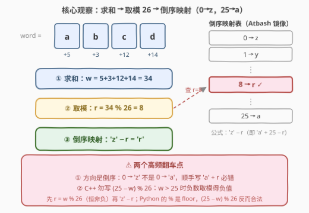
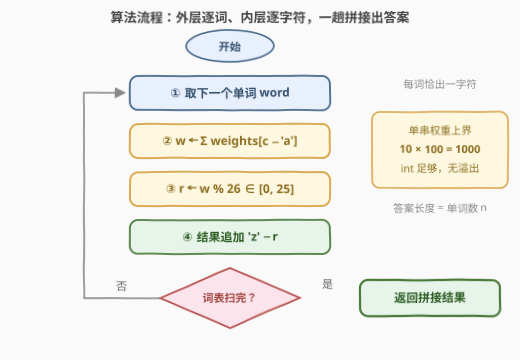

# LeetCode 带权单词映射 题解

## 1. 题目概述

- **标题 / 题号**：带权单词映射（#3838，easy）
- **链接**：https://leetcode.cn/problems/weighted-word-mapping/
- **难度**：简单
- **标签**：数组、字符串、模拟

**题意**：给你一个字符串数组 `words`，其中每个字符串表示一个由**小写英文字母**组成的单词；同时给你一个长度为 26 的整数数组 `weights`，其中 $weights[i]$ 表示第 $i$ 个小写英文字母（$\texttt{'a'} + i$）的**权重**。

单词的**权重**定义为其所有字符权重的**总和**。对于每个单词，将其权重**对 26 取模**，并把结果**按字母倒序**映射到一个小写英文字母：

$$0 \to \texttt{'z'},\quad 1 \to \texttt{'y'},\quad \dots,\quad 25 \to \texttt{'a'}$$

返回将所有单词映射后的字符**按顺序连接**而成的字符串。

**示例 1**：

```text
输入：words = ["abcd","def","xyz"], weights = [5,3,12,14,1,2,3,2,10,6,6,9,7,8,7,10,8,9,6,9,9,8,3,7,7,2]
输出："rij"
解释：
  "abcd" 权重 5+3+12+14 = 34，34 % 26 = 8，映射 'r'；
  "def"  权重 14+1+2   = 17，17 % 26 = 17，映射 'i'；
  "xyz"  权重 7+7+2    = 16，16 % 26 = 16，映射 'j'。
```

**示例 2**：

```text
输入：words = ["a","b","c"], weights = [1,1,1,...,1]（全 1）
输出："yyy"
解释：每个单词权重均为 1，1 % 26 = 1，映射 'y'。
```

**示例 3**：

```text
输入：words = ["abcd"], weights = [7,5,3,4,3,5,4,9,4,2,2,7,10,2,5,10,6,1,2,2,4,1,3,4,4,5]
输出："g"
解释："abcd" 权重 7+5+3+4 = 19，19 % 26 = 19，映射 'g'。
```

**约束**：$1 \le words.length \le 100$，$1 \le words[i].length \le 10$，$weights.length = 26$，$1 \le weights[i] \le 100$，`words[i]` 仅由小写英文字母组成。

> 💡 **审题关键**：① 映射是**倒序**的——余数 $r$ 对应字符 $\texttt{'z'} - r$，不是 $\texttt{'a'} + r$；② 每个单词无论多长**恰好产出一个字符**，答案长度恒等于单词数；③ $weights[i] \ge 1$ 保证权重和恒正，输入侧不存在负数——但**表达式写法**自己引入负数就是另一回事了（见 2.2）。

## 2. 解题思路

### 2.1 朴素思路：照题意直译三步

题面本身就是算法：对每个单词 ① 求权重和 → ② 对 26 取模 → ③ 查倒序映射表得字符。朴素做法不需要任何优化，风险全在**第③步的方向**上：

- 顺手写成 $\texttt{'a'} + r$（正序）——示例 1 立刻翻车：$r = 8$ 得 $\texttt{'i'}$ 而非 $\texttt{'r'}$，输出 `"irq"` ≠ `"rij"`；
- 想把 ②③ 合并成一个表达式 $\texttt{'a'} + (25 - w) \bmod 26$——Python 恰好对（`%` 是 floor 取模、模正数时结果恒非负），C++ 当 $w > 25$ 时 `25 - w` 为负，**截断取模返回负数**，加到 `'a'` 上直接越出小写字母区间。

数据规模（总字符数 $L \le 100 \times 10 = 1000$）怎么写都是线性，**考点不是效率，是映射方向与取模语义**。

### 2.2 核心观察：三步流水线 + 「先取模，再查表」



三个要点：

1. **流水线拆解**：① 求和 $w = \sum_{c \in word} weights[c - \texttt{'a'}]$；② 取模 $r = w \bmod 26 \in [0, 25]$；③ 倒序映射 $\texttt{c} = \texttt{'z'} - r$。三步复杂度分别为 $O(\lvert word \rvert)$、$O(1)$、$O(1)$；
2. **倒序映射 = 字母表镜像**：$r \mapsto \texttt{'z'} - r$ 等价于 $r \mapsto \texttt{'a'} + (25 - r)$，这正是古老的 **Atbash 密码**（把字母表首尾对折）。因为 $r$ 已取过模、必然落在 $[0, 25]$，$\texttt{'z'} - r$ 也必然落在 `['a','z']`——**先取模再映射，负数从根上不存在**；
3. **算术不熟就查表**：把倒序字母表写成常量串 `"zyxwvutsrqponmlkjihgfedcba"`，直接 `table[r]` 下标访问——零算术、零方向错误风险，性能与公式版完全一致。

> 💡 **周期性**：$w$ 与 $w + 26$ 映射到同一字符（模 26 的同余类），所以权重和多大都不怕——1000 也好、$10^6$ 也好，一个 `% 26` 全部压回 $[0, 25]$。

### 2.3 算法流程图



| 步骤 | 操作 | 说明 |
|------|------|------|
| ① 外层循环 | 依次取出每个 `word` | 共 $n$ 轮，每轮产出一字符 |
| ② 求和 | `w += weights[c - 'a']` 逐字符累加 | 单词内层循环 |
| ③ 取模 | `r = w % 26` | 被除数非负 ⇒ 余数 $\in [0, 25]$ |
| ④ 映射拼接 | 追加 `'z' - r` | 查表版：`table[r]` |
| ⑤ 收尾 | 返回拼接结果 | 长度恰为 $n$，可作自检 |

### 2.4 示例演算

官方示例 1 逐词走一遍流水线：

| 单词 | 字符权重分解 | $w$ | $r = w \bmod 26$ | 映射字符 |
|------|--------------|-----|------------------|----------|
| `"abcd"` | $5+3+12+14$ | 34 | 8 | $\texttt{'z'} - 8 = \texttt{'r'}$ |
| `"def"` | $14+1+2$ | 17 | 17 | $\texttt{'z'} - 17 = \texttt{'i'}$ |
| `"xyz"` | $7+7+2$ | 16 | 16 | $\texttt{'z'} - 16 = \texttt{'j'}$ |

拼接得 `"rij"` ✓。示例 2 是「全 1 权重」的退化情形：$r = 1$ 恒成立，输出 `"yyy"`；示例 3 说明单词表只有一个词时答案就是单字符。

## 3. 参考代码

### C++

```cpp
class Solution {
public:
    string mapWordWeights(vector<string>& words, vector<int>& weights) {
        string res;
        res.reserve(words.size());                      // 每词恰出一字符，长度可预知
        for (const string& word : words) {
            int w = 0;
            for (char c : word) w += weights[c - 'a'];  // ① 求和
            res += char('z' - w % 26);                  // ②③ 先取模（非负），再倒序映射
        }
        return res;
    }
};
```

### Python

```python
class Solution:
    def mapWordWeights(self, words: List[str], weights: List[int]) -> str:
        res = []
        for word in words:
            w = sum(weights[ord(c) - 97] for c in word)   # ① 求和
            res.append(chr(ord('z') - w % 26))             # ②③ 取模 + 倒序映射
        return ''.join(res)
```

> 💡 **写法要点**：① `%` 优先级高于二元 `-`，`'z' - w % 26` 自动解析为 `'z' - (w % 26)`，不加括号也对——但**显式括号更可读**，团队代码建议写全；② 查表版把映射行换成 `res += table[w % 26]`（`string table = "zyxwvutsrqponmlkjihgfedcba";`），对「方向不自信」完全免疫；③ Python 一行版：`return ''.join(chr(122 - sum(weights[ord(c) - 97] for c in w) % 26) for w in words)`；④ 若同一单词会重复出现极多次，可加 `单词 → 字符` 的字典缓存——本题 $n \le 100$ 完全用不上。

## 4. 复杂度分析

| 维度 | 复杂度 | 说明 |
|------|--------|------|
| **时间** | $O(L)$ | $L$ 为所有单词总长（$\le 1000$）：每个字符一次下标换算 + 加法，每词一次取模 + 追加 |
| **空间** | $O(1)$ | 输出串不计入；额外只有累加器 $w$（查表版多一个 26 字节常量串） |
| **量级判断** | $L \le 1000$ | 线性直译绰绰有余；$O(L)$ 已是下界——每个字符的权重至少要读一次 |

## 5. 扩展：倒序映射的「密码学血统」与 mod 26 家族

- **Atbash 密码**：本题的倒序映射 $p \mapsto 25 - p$（字母表对折）就是 Atbash——公元前希伯来文的古老替换密码。它是**对合**（involution）：$25 - (25 - p) = p$，映射两次回到自身，所以「加密」和「解密」是同一张表。本题只用它半边（余数 → 字符）；
- **ROT13**：凯撒密码 $k = 13$ 的特例，$13 + 13 \equiv 0 \pmod{26}$，同样是对合——加解密同函数，与 Atbash 的对合性殊途同归；
- **mod 26 的下标口径**：[168. Excel表列名称](https://leetcode.cn/problems/excel-sheet-column-title/) 是本题的「1-indexed 镜像」：A 代表 1 而非 0，取模前必须先自减，否则永远差一位——mod 类题的第一大坑就是**进制下标从 0 还是从 1 起算**，本题 $0 \to \texttt{'z'}$ 是干净的 0-indexed；
- **负数取模的跨语言分野**：C++/Java 的 `%` 向零截断（符号随被除数），Python 的 `%` 是 floor（模正数时恒非负）。通用防御写法：$((x \bmod m) + m) \bmod m$。本题只要「先 `%` 后减」就永远碰不到这个坑。

## 6. 面试要点

**Q1：这题最容易翻车的点是什么？**

> 映射**方向**。$0 \to \texttt{'z'}$、$25 \to \texttt{'a'}$ 是倒序，肌肉记忆写 $\texttt{'a'} + r$ 必错——示例 1 会输出 `"irq"` 而非 `"rij"`，好在官方用例能当场拦住。稳妥写法是 $\texttt{'z'} - r$，或直接查倒序表常量串。

**Q2：为什么强调「先取模、再映射」？合并成 `(25 - w) % 26` 行不行？**

> Python 行（floor 取模恒非负），C++ 不行：$w > 25$ 时 `25 - w` 为负，截断取模返回负数，$\texttt{'a'} +$ 负数直接跑出小写字母区间。拆开写 $r = w \bmod 26$ 后，$\texttt{'z'} - r$ 的每一步都保证落在合法区间——**用计算顺序消灭非法状态**。

**Q3：需要担心溢出吗？**

> 本题不用：单词最长 10、单字符权重至多 100，$w \le 1000$，`int` 绰绰有余。若面试官追问「约束放大到 $10^5$ 字符」——累加和 $10^7$ 仍在 `int` 内，再放大才需要 `long long`；取模之后的操作与规模无关。

**Q4：答案长度有什么性质？**

> 每个单词无论长短恰好映射出一个字符，所以答案长度恒等于单词数 $n$——可以拿这条性质做自检：输出长度不等于单词数，一定是循环结构写错了。

**Q5：还能优化吗？**

> 不能也不必：任何算法都要读完全部字符才能算出权重和，$O(L)$ 时间、$O(1)$ 辅助空间已是下界。唯一「可加」的是同词缓存（哈希记忆化），仅在单词大量重复时才有意义。

> 💡 **一句话总结**：3838 =「求和 → 取模 → **倒序**查表」的三步直译。带走的知识点：**mod 26 的下标口径**与**先取模再映射**的防御性写法。

## 同类练习题

| # | 题目 | 与本题的关联 |
|---|------|-------------|
| 168 | [Excel表列名称](https://leetcode.cn/problems/excel-sheet-column-title/)（[题解](../0001-0100/168_Excel表列名称.md)） | mod 26 的 1-indexed 版，取模前先减一是它的招牌坑，与本题 0-indexed 互为镜像 |
| 171 | [Excel表列序号](https://leetcode.cn/problems/excel-sheet-column-number/)（[题解](../0101-0200/171_Excel表列序号.md)） | 字符按位加权求和的 26 进制版，正是本题第①步「求和」的进位进阶 |
| 1663 | [具有给定数值的最小字符串](https://leetcode.cn/problems/smallest-string-with-a-given-numeric-value/)（[题解](../1601-1700/1663_具有给定数值的最小字符串.md)） | 给定权重和反推字典序最小字符串，本题「求和」的逆向问题 |
| 2278 | [字母在字符串中的百分比](https://leetcode.cn/problems/percentage-of-letter-in-string/)（[题解](../2201-2300/2278_字母在字符串中的百分比.md)） | 单字符计数 + 公式换算，同为「照公式直译」的字符串模拟 |
| 2469 | [温度转换](https://leetcode.cn/problems/convert-the-temperature/)（[题解](../2401-2500/2469_温度转换.md)） | 一组换算公式直译输出数组，模拟题的公式换算基本功 |
