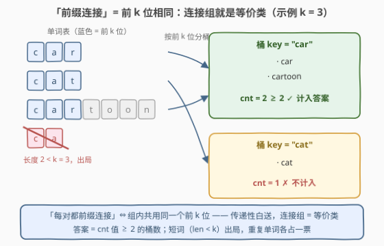
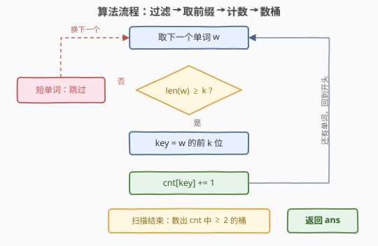

# 前缀连接组的数目

- **题目名称**：前缀连接组的数目
- **链接**：[3839. 前缀连接组的数目](https://leetcode.cn/problems/number-of-prefix-connected-groups/)
- **难度**：中等
- **标签**：数组、哈希表、字符串、计数

## 1. 题目概述

**题意**：给定字符串数组 $words$ 和整数 $k$。若位于**不同下标**的单词 $a$ 和 $b$ 满足 $a[0..k-1] = b[0..k-1]$（前 $k$ 个字符完全相同），则称二者是**前缀连接的**。一个**连接组**是一组单词，其中**每对**单词都前缀连接。返回由给定单词形成的、包含**至少两个单词**的连接组数目。

**示例 1**：

```text
输入：words = ["apple","apply","banana","bandit"], k = 2
输出：2
解释："apple" 与 "apply" 共享前缀 "ap"；"banana" 与 "bandit" 共享前缀 "ba"。
```

**示例 2**：

```text
输入：words = ["car","cat","cartoon"], k = 3
输出：1
解释："car" 与 "cartoon" 共享前缀 "car"；"cat" 不与任何单词共享长度 3 前缀。
```

**示例 3**：

```text
输入：words = ["bat","dog","dog","doggy","bat"], k = 3
输出：2
解释："bat"、"bat" 成一组；"dog"、"dog"、"doggy" 共享前缀 "dog" 成一组。
```

**约束条件**：$1 \le words.length \le 5000$，$1 \le words[i].length \le 100$，$1 \le k \le 100$，$words[i]$ 仅由小写英文字母组成。注意：**长度小于 $k$ 的单词不能加入任何组**；**重复字符串视为不同单词**。

> 💡 **审题关键**：① 「每对单词都前缀连接」听起来像图论里的**两两关系**（连通分量既视感），但「前 $k$ 位相同」其实是一条**等价关系**——传递性白送，连接组就是等价类，问题坍缩成哈希分桶后**数桶**；② 长度 $< k$ 的单词必须**显式过滤**：`substr` / 切片对短词返回**整个词**而非报错，两个相同的短词会被凭空凑成一组（本题最大的坑）；③ 重复字符串按下标算不同单词——计数时**不能去重**，同桶计数天然正确。

---

## 2. 解题思路

### 2.1 暴力思路：两两判定前缀

最直白的做法是按定义枚举所有下标对 $(i, j)$，逐字符比较前 $k$ 位：

```python
ans = 0
for i in range(n):
    for j in range(i + 1, n):
        if len(words[i]) >= k and len(words[j]) >= k and words[i][:k] == words[j][:k]:
            ans += 1  # 注意：这数的是"对数"，还要再归并成组
```

时间 $O(n^2 \cdot k)$：$n = 5000$ 时约 $1.25 \times 10^7$ 对，每对至多比较 $k = 100$ 个字符，共 $1.25 \times 10^9$ 次字符比较——要么超时要么卡常硬过，而且**即便过了也没回答"组数"**，还得把数出的对归并成组。更重要的是：判定条件是「等于同一个前缀」，而**等于同一个东西的彼此必相等**（传递性），两两比较完全是浪费。

### 2.2 核心观察：等价关系 → 哈希分桶 → 数桶



「前 $k$ 位相同」满足等价关系三要素：**自反**（自己等于自己）、**对称**（$a = b$ 则 $b = a$）、**传递**（$a$、$b$ 同前缀且 $b$、$c$ 同前缀 ⇒ $a$、$c$ 同前缀）。于是「组内每对都前缀连接」⟺「组内所有单词共用同一个前 $k$ 位」——**连接组就是等价类**，根本不需要建图或并查集：

- 把每个长度 $\ge k$ 的单词按其前 $k$ 位扔进哈希表计数；
- 一个桶 = 一个等价类 = 一个连接组（桶内任意两词都前缀连接）；
- 「至少两个单词」⟺ 桶大小 $\ge 2$。

$$ans = \sum_{key} \mathbb{1}\big[ cnt[key] \ge 2 \big]$$

上图中（示例 2 再加一个短单词 `ca`）：`car` 与 `cartoon` 落入桶 `"car"`（$cnt = 2$，计入）；`cat` 独占桶 `"cat"`（$cnt = 1$，不计入）；`ca` 长度 $2 < k = 3$，连入桶的资格都没有。

### 2.3 算法流程图：单遍扫描计数，再数一次桶



| 步骤 | 操作 | 说明 |
|------|------|------|
| ① 过滤 | $\text{len}(w) < k$ 直接跳过 | 短词不可能拥有长度为 $k$ 的前缀 |
| ② 取 key | $key = w[0..k-1]$ | 等价类的代表元 |
| ③ 计数 | $cnt[key] \mathrel{+}= 1$ | 重复单词各 +1，不去重 |
| ④ 数桶 | 遍历 $cnt$，数出值 $\ge 2$ 的桶 | 桶数即答案 |

> 💡 **为什么「数桶」而不是「数对」**：本题问的是**组数**而非对数，所以不需要 $\sum \binom{c}{2}$ 那套组合计数（对比 [3805](../3801-3900/3805_统计凯撒加密对数目.md) 数对、本题数组），直接统计 $cnt \ge 2$ 的桶的个数即可——这也是为什么 2.1 的暴力即使跑完了也只走了一半路。

### 2.4 示例演算

**示例 3** `words = ["bat","dog","dog","doggy","bat"]`，$k = 3$（含重复单词，最能暴露口径）：

| 单词 | 长度 ≥ 3？ | key | $cnt$ 变化 | 当前 $cnt \ge 2$ 的桶数 |
|------|-----------|-----|-----------|----------------------|
| `"bat"` | ✓ | `"bat"` | bat: 0 → 1 | 0 |
| `"dog"` | ✓ | `"dog"` | dog: 0 → 1 | 0 |
| `"dog"` | ✓ | `"dog"` | dog: 1 → 2 | **1** |
| `"doggy"` | ✓ | `"dog"` | dog: 2 → 3 | 1 |
| `"bat"` | ✓ | `"bat"` | bat: 1 → 2 | **2** |

最终 $cnt = \{bat{:}\,2,\ dog{:}\,3\}$，两个桶都 $\ge 2$，$ans = 2$ ✓——重复的 `"dog"`、`"bat"` 各自占一票，正是「按下标视为不同单词」的口径。

**边界自查**：所有词都不同前缀 ⇒ 答案 0；所有词同前缀 ⇒ 答案 1；全部由短词组成 ⇒ $cnt$ 为空，答案 0。答案上界 $\lfloor n/2 \rfloor = 2500$，`int` 绰绰有余。

---

## 3. 参考代码

### C++

```cpp
class Solution {
public:
    int prefixConnected(vector<string>& words, int k) {
        unordered_map<string, int> cnt;
        for (const string& w : words)
            if ((int)w.size() >= k)          // 短词出局：substr 对短词返回整串
                cnt[w.substr(0, k)]++;
        int ans = 0;
        for (auto& [_, c] : cnt)
            ans += c >= 2;                   // 大小 ≥ 2 的桶才是一个连接组
        return ans;
    }
};
```

> 💡 **写法要点**：
> - **过滤必须放在取前缀之前**——`w.substr(0, k)` 对 `len(w) < k` 的词不报错、返回整个 `w`：`["ab","ab"]`、$k = 3$ 时若不过滤会凭空多出一个组；
> - `w.size()` 是无符号数，与 `int k` 比较会有符号转换告警，习惯性写 `(int)w.size() >= k`；
> - `ans += c >= 2` 把布尔当 0/1 累加，与 `if` 判断等价但更紧凑。

### Python

```python
class Solution:
    def prefixConnected(self, words: List[str], k: int) -> int:
        cnt = Counter(w[:k] for w in words if len(w) >= k)
        return sum(c >= 2 for c in cnt.values())
```

> 💡 **写法要点**：`w[:k]` 切片越界**不报错**、返回整串，所以 `len(w) >= k` 的过滤同样不能省（`["ab","ab"]`、`k=3` 会错误返回 1）；`Counter` 吃生成器一行完成分桶，`sum(c >= 2 ...)` 对布尔求和即数桶。三个官方示例 + 短词/重复词边界用例 + 与暴力对拍均通过。

---

## 4. 复杂度分析

| 维度 | 复杂度 | 说明 |
|------|--------|------|
| **时间** | $O(n \cdot k)$ | 每个单词取前缀 $O(k)$、哈希单次均摊 $O(1)$；$n \cdot k \le 5 \times 10^5$ |
| **空间** | $O(n \cdot k)$ | 哈希表最多存 $n$ 个长度为 $k$ 的 key |
| **量级判断** | $n \le 5000$，$k \le 100$ | 暴力 $O(n^2 k) \approx 1.25 \times 10^9$ 次字符比较纯属浪费；分桶后与 $n^2$ 彻底解耦 |

---

## 5. 扩展：一次建 Trie，回答所有 k

本题 $k$ 是单次给定的。若把问题改成「对**每个** $k = 1, 2, \dots, 100$ 都回答一遍连接组数目」，逐个 $k$ 重建哈希表要 $O(n \cdot k^2)$。更优雅的做法是把所有单词**插入一棵 Trie**，并在每个结点上维护 **pass 计数**（经过该结点的单词数）：

- 深度为 $k$ 的结点 = 前缀 $key$ 的桶，其 pass 计数 = $cnt[key]$；
- 某个 $k$ 的答案 = 深度 $k$ 上 pass 计数 $\ge 2$ 的结点数；
- **短词过滤被 Trie 天然吸收**：长度 $< k$ 的单词路径根本延伸不到深度 $k$，无需任何特判；
- 建树 $O(n \cdot L)$（$L$ 为单词最大长度），所有 $k$ 的答案一次性全出——这正是 [1804. 实现 Trie （前缀树） II](https://leetcode.cn/problems/implement-trie-ii-prefix-tree/) 中 `countWordsStartingWith` 的数据结构原型。

此外，当单词共享大量公共前缀时，Trie 比「每个单词独立存一份长度 $k$ 的子串」更省内存（公共前缀只存一份）；本题规模下二者都毫无压力，哈希写起来最短。

---

## 6. 面试要点

**Q1：题面说「每对单词都前缀连接」，为什么等价于「同前缀」？**

> 「前 $k$ 位相同」是等价关系：自反、对称、传递。传递性意味着 $a$、$b$ 同前缀且 $b$、$c$ 同前缀时 $a$、$c$ 必同前缀，因此「组内两两连接」⟺「组内共用同一个前 $k$ 位」——连接组恰好是等价类，由 key 唯一决定。

**Q2：这题为什么不需要并查集或建图？**

> 并查集用于「传递闭包不显然」的关系（如 990 等式方程、LCS 相似度传递合并），需要靠合并操作发现等价类。本题的关系**本身**已是等价关系，等价类直接由前缀 key 确定——哈希分桶一遍扫描就是最简形式，DSU 反而多此一举。识别「要不要图论」比会写图论更重要。

**Q3：实现上最大的坑是什么？**

> 短词过滤的位置。`substr(0, k)` / `w[:k]` 对 `len < k` 的词返回**整串**而非报错：`["ab","ab"]`、$k=3$ 时若先取前缀后判长度（或干脆不判），两词 key 同为 `"ab"`，凭空多出一个组。必须**先**判 `len(w) >= k` **再**取前缀。

**Q4：重复单词怎么处理？需要去重吗？**

> 题目明说「重复的字符串被视为不同的单词」——按出现次数计数即可，`"bat"、"bat"` 使 $cnt[\text{"bat"}] = 2$ 恰好成组。**绝不能**先 `set(words)` 去重，否则示例 3 的两个 `"dog"` 会被吞掉一个。

**Q5：如果要对每个 k 都回答一遍呢？**

> 见第 5 节：所有单词建一棵带 pass 计数的 Trie，深度 $k$ 上计数 $\ge 2$ 的结点数即为该 $k$ 的答案；短词路径不达深度 $k$，长度过滤天然成立。建树一次 $O(n \cdot L)$，回答所有 $k$ 只需遍历结点。

> 💡 **一句话总结**：3839 =「**识别等价关系**」+「**哈希分桶数桶**」。带走的知识点：看到「两两满足某关系才成组」的题面，先验证关系是否为等价关系（重点验**传递性**）——是则签名分桶一遍扫描，传递性不显然（相似、连通、方程）才轮到并查集/图论登场。

---

## 7. 同类练习题

- [14. 最长公共前缀](https://leetcode.cn/problems/longest-common-prefix/)（[题解](../0001-0100/14_最长公共前缀.md)）：前缀基本功——纵向扫描逐位比较，理解「前缀」口径
- [648. 单词替换](https://leetcode.cn/problems/replace-words/)（[题解](../0601-0700/648_单词替换.md)）：按「最短前缀」归并单词，前缀哈希 / Trie 的直接应用
- [820. 单词的压缩编码](https://leetcode.cn/problems/short-encoding-of-words/)（[题解](../0801-0900/820_单词的压缩编码.md)）：去掉被其他词包含的单词（后缀版前缀关系），同属「前缀关系去重」家族
- [1804. 实现 Trie （前缀树） II](https://leetcode.cn/problems/implement-trie-ii-prefix-tree/)（[题解](../1801-1900/1804_实现TrieII.md)）：Trie 结点维护 pass 计数，正是第 5 节扩展的数据结构原型
- [3805. 统计凯撒加密对数目](https://leetcode.cn/problems/count-caesar-cipher-pairs/)（[题解](../3801-3900/3805_统计凯撒加密对数目.md)）：同属「签名 + 哈希分桶」家族，签名从「前缀」换成「规范化移位」，且数的是对数而非组数
