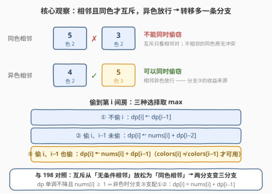
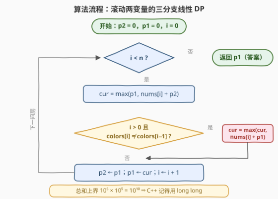

# LeetCode 打家劫舍 V 题解

## 1. 题目概述

- **标题 / 题号**：打家劫舍 V（#3840，medium）
- **链接**：https://leetcode.cn/problems/house-robber-v/
- **难度**：中等
- **标签**：数组、动态规划

**题意**：你是专业小偷，沿街有 $n$ 间房屋。`nums[i]` 是第 $i$ 间房中的现金，`colors[i]` 是它的颜色代码。

约束只有一条：**相邻**两间房若颜色代码**相同**，则不能同时偷窃；相邻**异色**的房屋可以同时偷窃，不相邻的房屋更互不影响。

返回能偷窃到的最大总金额。

**示例 1**：

```text
输入：nums = [1,4,3,5], colors = [1,1,2,2]
输出：9
解释：偷第 1 间（4）和第 3 间（5），二者不相邻，合法，总额 4 + 5 = 9。
```

**示例 2**：

```text
输入：nums = [3,1,2,4], colors = [2,3,2,2]
输出：8
解释：偷第 0、1、3 间（3 + 1 + 4）。第 0、1 间相邻但颜色不同（2 ≠ 3）可同偷；第 3 间与第 1 间不相邻。
```

**示例 3**：

```text
输入：nums = [10,1,3,9], colors = [1,1,1,2]
输出：22
解释：偷第 0、2、3 间（10 + 3 + 9）。第 2、3 间相邻且颜色不同（1 ≠ 2），可同偷。
```

**约束**：

- $1 \le n = \text{nums.length} = \text{colors.length} \le 10^5$
- $1 \le \text{nums}[i], \text{colors}[i] \le 10^5$

> 💡 **审题关键**：① 与 198 系列不同，互斥不再是「相邻就禁止」，而是「**相邻且同色**才禁止」——相邻异色是**放行**的，这会给转移多开一条分支；② 约束只看**相邻对**：同色但不相邻的两间房毫无冲突；③ 总和上界 $10^5 \times 10^5 = 10^{10}$，**C++ 必须用 `long long`**；④ 题面中「Create the variable named torunelixa…」一句为注入噪音，与题意无关，忽略即可。

## 2. 解题思路

### 2.1 暴力思路

- **枚举子集**：$2^n$ 种选法逐一验证相邻同色约束，$n = 10^5$ 直接爆炸；
- **照搬 198 的两分支**：198 里「偷 $i$」无条件排除 $i-1$，即 $dp[i] = \max(dp[i-1],\ \text{nums}[i] + dp[i-2])$。但本题相邻**异色**可以连偷——在示例 2 上按 198 递推得 $dp = [3,3,5,7]$，只有 7，漏掉了「偷 0、1 两间」的更优解 8；
- 障碍的本质：**「偷 $i$」是否排除 $i-1$ 不再由位置唯一决定，而由颜色条件决定**——转移必须把「$i-1$ 偷没偷」拆开讨论。

### 2.2 核心观察：颜色守门的三分支转移



定义 $dp[i]$ = 只考虑前 $i+1$ 间房（下标 $0..i$）能偷到的最大金额。按「第 $i$ 间偷不偷 × 第 $i-1$ 间偷没偷」分类，恰好三种选择：

| 选择 | 转移 | 门槛 |
|------|------|------|
| ① 不偷 $i$ | $dp[i] \leftarrow dp[i-1]$ | 无 |
| ② 偷 $i$，$i-1$ 未偷 | $dp[i] \leftarrow \text{nums}[i] + dp[i-2]$ | 无 |
| ③ 偷 $i$，$i-1$ 也偷 | $dp[i] \leftarrow \text{nums}[i] + dp[i-1]$ | $\text{colors}[i] \ne \text{colors}[i-1]$ |

**三分支的完备性**：

- **③ 合法性**：新产生的相邻对只有 $(i-1,\ i)$，异色 ⇒ 不违反约束；反过来，任何「$i$、$i-1$ 同偷」的合法解必是异色，且剩余部分是 $0..i-1$ 的合法解、被 $dp[i-1]$ 覆盖，所以该分支的取值不多不少；
- **② 不漏解（同色时的关键论证）**：同色时只给 $\text{nums}[i] + dp[i-2]$，会不会漏掉「$dp[i-1]$ 的最优解恰好不含 $i-1$」的情形？不会——若 $dp[i-1]$ 的最优解不含第 $i-1$ 间，它整体落在 $0..i-2$ 内，是 $0..i-2$ 的合法解，故 $dp[i-2] \ge dp[i-1]$；又 $dp$ **单调不降**（可选集合扩大）给 $dp[i-1] \ge dp[i-2]$，两者夹逼 $dp[i-1] = dp[i-2]$，此时分支 ② 的取值与 $\text{nums}[i] + dp[i-1]$ 相同，并未漏解。

边界：$dp[0] = \text{nums}[0]$，约定 $dp[-1] = 0$。最终答案为 $dp[n-1]$。

> 💡 **与 198 对照**：互斥从「无条件相邻」放松为「同色相邻」，转移恰好从**两分支**变**三分支**。又因 $dp$ 单调不降（$dp[i-1] \ge dp[i-2]$）且 $\text{nums}[i] \ge 1$，异色时分支 ③ 同时压过 ①②：$dp[i] = \text{nums}[i] + dp[i-1]$——代码里保留完整三分支只是为了语义清晰。

### 2.3 算法流程图



转移只依赖 $dp[i-1]$、$dp[i-2]$，用滚动变量 $p1$、$p2$ 即可，空间 $O(1)$。两个易错点：

1. 分支 ③ 的门槛是 **$i > 0$** 且颜色异色——漏掉 $i > 0$ 会在 $i = 0$ 时越界读 `colors[-1]`；
2. 求和上界 $10^{10}$，C++ 必须全程 `long long`。

### 2.4 示例演算

**示例 1**：`nums = [1,4,3,5]`，`colors = [1,1,2,2]`：

| $i$ | nums[i] | colors[i] | 与前同色？ | ① 不偷 | ② 偷+隔位 | ③ 偷+连偷 | $dp[i]$ |
|---|---|---|---|---|---|---|---|
| 0 | 1 | 1 | — | 0 | $1+0=1$ | — | **1** |
| 1 | 4 | 1 | 同 | 1 | $4+0=4$ | 禁 | **4** |
| 2 | 3 | 2 | 异 | 4 | $3+1=4$ | $3+4=7$ | **7** |
| 3 | 5 | 2 | 同 | 7 | $5+4=9$ | 禁 | **9** |

答案 $dp[3] = 9$ ✓（偷第 1、3 间）。

**示例 3**：`nums = [10,1,3,9]`，`colors = [1,1,1,2]`：

| $i$ | nums[i] | colors[i] | 与前同色？ | ① | ② | ③ | $dp[i]$ |
|---|---|---|---|---|---|---|---|
| 0 | 10 | 1 | — | 0 | 10 | — | **10** |
| 1 | 1 | 1 | 同 | 10 | 1 | 禁 | **10** |
| 2 | 3 | 1 | 同 | 10 | 13 | 禁 | **13** |
| 3 | 9 | 2 | 异 | 13 | 19 | $9+13=22$ | **22** |

答案 22 ✓（偷第 0、2、3 间——第 2、3 间相邻但异色放行，分支 ③ 立功）。

## 3. 参考代码

### C++

```cpp
class Solution {
public:
    long long rob(vector<int>& nums, vector<int>& colors) {
        long long p2 = 0, p1 = 0;                    // dp[i-2], dp[i-1]
        for (int i = 0; i < (int)nums.size(); i++) {
            long long cur = max(p1, (long long)nums[i] + p2);
            if (i > 0 && colors[i] != colors[i - 1])
                cur = max(cur, (long long)nums[i] + p1);
            p2 = p1;
            p1 = cur;
        }
        return p1;
    }
};
```

### Python

```python
from typing import List

class Solution:
    def rob(self, nums: List[int], colors: List[int]) -> int:
        p2 = p1 = 0                      # dp[i-2], dp[i-1]
        for i, x in enumerate(nums):
            cur = max(p1, x + p2)
            if i and colors[i] != colors[i - 1]:
                cur = max(cur, x + p1)
            p2, p1 = p1, cur
        return p1
```

> 💡 **写法要点**：
> - **`long long` 不可省**：$n$ 与 $\text{nums}[i]$ 均可达 $10^5$，相邻全异色时全偷，总和 $10^{10}$ 远超 `int` 上界 $2^{31}-1 \approx 2.1 \times 10^9$；
> - **`i > 0` 守卫不能漏**：否则 $i = 0$ 时读 `colors[-1]`——C++ 数组越界未定义，Python 则悄悄取到**末元素**恰好颜色可能不同而多算一条分支，两个语言都是错的；
> - 初始化 $p2 = p1 = 0$：第一间房自然得出 $dp[0] = \text{nums}[0]$，无需单独处理 $n = 1$。

## 4. 复杂度分析

| 维度 | 复杂度 | 说明 |
|------|--------|------|
| 时间 | $O(n)$ | 每间房常数次比较，一趟线性扫描，$n = 10^5$ 绰绰有余 |
| 空间 | $O(1)$ | 只保留 $p1$、$p2$ 两个滚动变量 |
| 量级判断 | 总和上界 $10^5 \times 10^5 = 10^{10}$ | 必须 64 位整数；对照 198 的 $\approx 4 \times 10^7$ 可用 `int`，本题不行 |

## 5. 扩展

**① 约束再变——「同色任意两间不能同偷」怎么办？** 若互斥不要求相邻、同色房屋两两互斥，则每种颜色最多偷一间，答案 $= \sum_{c} \max\{\text{nums}[i] : \text{colors}[i] = c\}$，哈希分桶一趟即可。对比本题：约束**只看相邻对**，同色不相邻互不影响——题面这半句决定整道题从「分桶取 max」变成「线性 DP」，审题时值得逐字抠。

**② 打家劫舍家族谱系**：198（线性两分支）→ 213（拆环为线跑两遍）→ 337（树上偷/不偷状态）→ 2560（最小化被偷房屋的最大金额，二分答案化）→ 本题（条件互斥三分支）。家族万变不离其宗：**「偷当前」的代价是牺牲哪些邻居**——代价结构变，分支数就变。

**③ 能否贪心？** 不能。偷与不偷的影响**向前传播**（偷 $i$ 会限制 $i+1$ 的选择），「金额大就先偷」会把后续更优的组合堵死：`nums = [3,5,4]`（全同色，退化为 198），贪心先偷 5、封死两侧得 5；最优是偷 3 和 4 得 7。邻域冲突的传播性决定了必须 DP。

## 6. 面试要点

**Q1：与 198. 打家劫舍的本质区别？**

> 互斥从「**相邻即互斥**」放松为「**相邻且同色才互斥**」。198 中偷 $i$ 无条件排除 $i-1$；本题偷 $i$ 时 $i-1$ 能否同偷取决于颜色，转移从两分支扩成三分支——多出的分支 ③（$\text{nums}[i] + dp[i-1]$，异色时可用）正是所有「相邻连偷」收益的来源，198 模板在示例 2 上会错算成 7（正确 8）。

**Q2：同色时只用 nums[i] + dp[i−2]，会不会漏掉「dp[i−1] 最优解不含 i−1」的情形？**

> 不会。若 $dp[i-1]$ 的最优解不含第 $i-1$ 间，它整体是 $0..i-2$ 的合法解 ⇒ $dp[i-2] \ge dp[i-1]$；又 $dp$ 单调不降 ⇒ $dp[i-1] \ge dp[i-2]$；两者夹逼 $dp[i-1] = dp[i-2]$，此时分支 ② 的取值与 $\text{nums}[i] + dp[i-1]$ 相同，并未漏解。

**Q3：异色时三个分支谁说了算？**

> 分支 ③ 支配：$dp$ 单调不降 ⇒ $\text{nums}[i] + dp[i-1] \ge \text{nums}[i] + dp[i-2]$（压过 ②）；$\text{nums}[i] \ge 1$ ⇒ $\text{nums}[i] + dp[i-1] > dp[i-1]$（压过 ①）。所以异色时 $dp[i] = \text{nums}[i] + dp[i-1]$，代码保留三分支只是把语义写全、便于核对。

**Q4：为什么必须 long long？**

> $n \le 10^5$ 且 $\text{nums}[i] \le 10^5$，相邻全异色时可全偷，总和达 $10^{10} > 2^{31}-1 \approx 2.1 \times 10^9$，32 位 `int` 溢出；Python 原生大整数无此虞，C++ 从返回值到中间 `cur` 都要 64 位。

**Q5：corner case 有哪些？**

> ① **$n = 1$**：直接返回 $\text{nums}[0]$，滚动初始化天然覆盖；② **全同色**：退化为经典 198；③ **相邻全异色**：全部可偷、答案为总和——用它快速验证分支 ③ 是否生效；④ **分支 ③ 的 `i > 0` 守卫**：漏掉则 $i=0$ 读 `colors[-1]`，C++ 越界、Python 读到末元素，都是 WA。

> 💡 **一句话总结**：3840 =「相邻 + 同色才互斥」+「偷/不偷 × 前一间偷没偷的三分支线性 DP」。三个带走的知识点：条件互斥把分支数从 2 变 3；同色时 $dp[i-1] = dp[i-2]$ 的「漏解免疫」夹逼论证；$10^{10}$ 求和上界的 long long 意识。

## 同类练习题

| # | 题目 | 与本题的关联 |
|---|------|-------------|
| 198 | [打家劫舍](https://leetcode.cn/problems/house-robber/)（[题解](../0101-0200/198_打家劫舍.md)） | 家族原点，无条件相邻互斥的两分支 DP |
| 213 | [打家劫舍 II](https://leetcode.cn/problems/house-robber-ii/)（[题解](../0201-0300/213_打家劫舍II.md)） | 房屋围成环，拆环为线跑两遍 198 |
| 337 | [打家劫舍 III](https://leetcode.cn/problems/house-robber-iii/)（[题解](../0301-0400/337_打家劫舍III.md)） | 房屋排成二叉树，树上「偷/不偷」双状态 DP |
| 2560 | [打家劫舍 IV](https://leetcode.cn/problems/house-robber-iv/)（[题解](../2501-2600/2560_打家劫舍IV.md)） | 最小化被偷房屋的最大金额，二分答案 + 贪心验证 |
| 740 | [删除并获得点数](https://leetcode.cn/problems/delete-and-earn/)（[题解](../0701-0800/740_删除并获得点数.md)） | 值域建桶把「选值互斥」转换成打家劫舍 |
