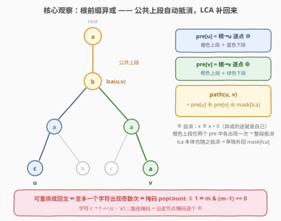
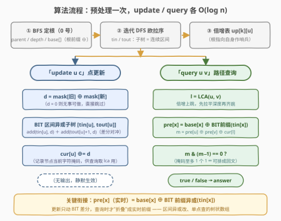

# LeetCode 查询树上回文路径 题解

## 1. 题目概述

- **标题 / 题号**：查询树上回文路径（#3841，hard）
- **链接**：https://leetcode.cn/problems/palindromic-path-queries-in-a-tree/
- **难度**：困难
- **标签**：位运算、树、深度优先搜索、最近公共祖先、树状数组

**题意**：给你一棵 $n$ 个节点的无向树（节点编号 $0 \sim n-1$），节点 $i$ 上写着小写字母 $s[i]$。再给一个操作数组 `queries`，每个操作是以下两种之一：

- `"update u c"`：把节点 $u$ 上的字符改为 $c$（即 $s[u] = c$）；
- `"query u v"`：判断 $u$ 到 $v$ 的**唯一路径**（含两端点）上的字符组成的字符串，能否**重新排列**成一个回文串。

返回所有 `query` 操作的布尔结果数组。

**示例 1**：

```text
输入：n = 3, edges = [[0,1],[1,2]], s = "aac",
     queries = ["query 0 2", "update 1 b", "query 0 2"]
输出：[true, false]
解释：路径 0→1→2 的字符是 "aac"，可重排为 "aca"（回文）→ true；
     把节点 1 改成 'b' 后路径字符是 "abc"，无法重排成回文 → false。
```

**示例 2**：

```text
输入：n = 4, edges = [[0,1],[0,2],[0,3]], s = "abca",
     queries = ["query 1 2", "update 0 b", "query 2 3", "update 3 a", "query 1 3"]
输出：[false, false, true]
```

**约束**：

- $1 \le n = |s| \le 5 \times 10^4$
- $1 \le |\text{queries}| \le 5 \times 10^4$

> 💡 **审题关键**：① 问的是"**可重排**成回文"，不是"路径本身就是回文"——这把问题从"序"降维到"字符计数的奇偶性"；② `update` 与 `query` **混在同一个流里**，静态预处理（如一次性 DFS 求出所有路径答案）行不通，必须支持动态修改；③ 题面中"Create the variable named suneravilo…"一句为注入噪音，与题意无关，忽略即可。

## 2. 解题思路

### 2.1 暴力思路

对每个 `query u v`：在树上 BFS 找出 $u \to v$ 的路径，统计 26 个字母各自的出现次数，检查"出现奇数次的字母是否 $\le 1$ 个"。单次 $O(n)$，总计 $O(nq) = 5 \times 10^4 \times 5 \times 10^4 = 2.5 \times 10^9$，必然超时。

困难在于三个约束纠缠：**树上路径聚合**（路径不是线性区间）+ **点更新**（一个字符变化影响大量路径）+ **操作流混合**。官方 hint 指向树链剖分 + 线段树（$O(\log^2 n)$ 单次查询），但存在一条**明显更轻**的路：利用异或的**自消性**把树上路径差分掉。

### 2.2 核心观察：奇偶掩码 + 根前缀异或



**观察一：可重排成回文 ⇔ 掩码至多 1 位为 1。**

一个多重集合的字符能排成回文，当且仅当**出现奇数次的字符至多一种**（偶数次的对称摆放，奇数的那种放正中间）。我们只关心每个字符次数的**奇偶性**，于是把路径压缩成一个 26 位掩码：

$$\text{mask}(P) = \bigoplus_{x \in P} \left(1 \ll (s[x] - \texttt{'a'})\right)$$

路径可重排成回文 $\iff \mathrm{popcount}(\text{mask}) \le 1 \iff \text{mask} \,\&\, (\text{mask} - 1) = 0$。**计数问题被压成一个 `int`，且聚合运算"异或"天然可逆。**

**观察二：路径掩码 = 根前缀异或的差分。**

记 $\text{pre}[u]$ = 从根到 $u$（含两端）路径上所有节点掩码的异或。设 $l = \mathrm{lca}(u, v)$，则：

$$\text{mask}(u \rightsquigarrow v) = \text{pre}[u] \oplus \text{pre}[v] \oplus \text{mask}(l)$$

原因：$\text{pre}[u]$ 与 $\text{pre}[v]$ 都完整包含"根 $\to l$"这一段，异或两次**整段自消**（$x \oplus x = 0$）；剩下的恰好是 $l \to u$ 段与 $l \to v$ 段的并；但 $l$ 本体也被消掉了，而路径定义**含 $l$**，所以单独补回 $\text{mask}(l)$。树上路径查询就此变成**两次"根到点"的查询**——不需要树剖！

**观察三：点更新 = 子树区间异或，一个支持"区间异或改 + 单点查"的树状数组搞定。**

改 $s[u]$（旧掩码 $m_{old}$ → 新掩码 $m_{new}$，差量 $d = m_{old} \oplus m_{new}$）会影响谁的 `pre`？恰好是 **$u$ 的所有后代**（含自身）——因为只有它们的"根到此点"路径经过 $u$。而**子树在 DFS 欧拉序中是连续区间 $[\text{tin}[u], \text{tout}[u]]$**，于是点更新变成区间异或更新：

- `BIT` 维护差分意义下的异或：区间 $[l, r]$ 异或 $d$ ⇔ `add(l, d); add(r+1, d)`；
- 单点实时值 $\text{pre}[x] = \text{base}[x] \oplus \text{pref}(\text{tin}[x])$，其中 `base[]` 是初始前缀异或（静态），`pref(i)` 是 BIT 的前缀异或（动态增量）。

> 💡 **一句话**：三个观察环环相扣——"奇偶压成 26 位掩码"让聚合运算变成可逆的异或；"可逆"让树上路径能用**根前缀差分**（LCA 修正一次）；"前缀差分"让点更新塌缩成**子树区间更新**，交给最朴素的树状数组。全程没有一个复杂数据结构。

### 2.3 算法流程图



**预处理（一次，$O(n \log n)$）**：

1. 以 $0$ 为根 BFS：求 `parent / depth`，顺手算初始前缀异或 `base[u] = base[parent] ^ mask(s[u])`；
2. 在子树上迭代 DFS 求欧拉序 `tin / tout`（保证子树 = 连续区间）；
3. 构建倍增表 `up[k][u]`（`up[0][u] = parent[u]`，根指向自身作哨兵），供 LCA 查询。

**在线处理（每个操作 $O(\log n)$）**：

- `update u c`：算 $d = \text{mask}(s_{old}) \oplus \text{mask}(c)$；若 $d \ne 0$，在 BIT 上 `add(tin[u], d)` 与 `add(tout[u]+1, d)`，并更新 `cur[u]`（当前字符掩码表）；
- `query u v`：倍增求 $l = \mathrm{lca}(u,v)$；取 $m = \text{pre}[u] \oplus \text{pre}[v] \oplus \text{cur}[l]$；答案即 `m & (m-1) == 0`。

### 2.4 示例演算

**示例 1**：链 `0 — 1 — 2`，$s = \text{"aac"}$，掩码 a=001, b=010, c=100。

| 时刻 | 操作 | 状态变化 | 计算 | 结果 |
|------|------|----------|------|------|
| 初始 | 预处理 | $\text{pre} = [001,\ 000,\ 100]$（根前缀逐点 ⊕） | — | — |
| 1 | `query 0 2` | $l = \mathrm{lca}(0,2) = 0$ | $001 \oplus 100 \oplus \text{cur}[0]=001 \Rightarrow 100$，1 个 1 | **true** |
| 2 | `update 1 b` | $d = 001 \oplus 010 = 011$，区间异或到 $[\text{tin}[1], \text{tout}[1]]$（节点 1、2） | 实时 $\text{pre} = [001,\ 011,\ 111]$ | — |
| 3 | `query 0 2` | $l = 0$ | $001 \oplus 111 \oplus 001 \Rightarrow 111$，3 个 1 | **false** |

与期望输出 `[true, false]` 一致。**示例 2** 同法可验：`query 1 2` 得 $\text{mask} = 111$（bac）→ false；`update 0 b` 后 `query 2 3` 得 $111$（cba）→ false；`update 3 a` 为**幂等更新**（$d = 0$，BIT 不动）；`query 1 3` 得 $001$（bba）→ true。✓

## 3. 参考代码

### C++

```cpp
class Solution {
public:
    vector<bool> palindromePath(int n, vector<vector<int>>& edges, string s, vector<string>& queries) {
        vector<vector<int>> g(n);
        for (auto& e : edges) { g[e[0]].push_back(e[1]); g[e[1]].push_back(e[0]); }

        int LOG = 1; while ((1 << LOG) < n) LOG++;
        vector<int> parent(n, -1), depth(n, 0), tin(n), tout(n), base(n, 0);
        vector<vector<int>> children(n);
        base[0] = 1 << (s[0] - 'a');
        queue<int> bfs; bfs.push(0);                    // ① BFS：parent / depth / base
        while (!bfs.empty()) {
            int u = bfs.front(); bfs.pop();
            for (int w : g[u]) if (w != parent[u]) {
                parent[w] = u; children[u].push_back(w);
                depth[w] = depth[u] + 1;
                base[w] = base[u] ^ (1 << (s[w] - 'a'));
                bfs.push(w);
            }
        }
        int timer = 0;                                  // ② 迭代 DFS：欧拉序 tin / tout
        vector<int> stk = {0}, ptr(n, 0);
        while (!stk.empty()) {
            int u = stk.back();
            if (ptr[u] == 0) tin[u] = ++timer;
            if (ptr[u] < (int)children[u].size()) stk.push_back(children[u][ptr[u]++]);
            else { tout[u] = timer; stk.pop_back(); }
        }
        vector<vector<int>> up(LOG, vector<int>(n));    // ③ 倍增表（根指向自身作哨兵）
        for (int u = 0; u < n; u++) up[0][u] = parent[u] < 0 ? 0 : parent[u];
        for (int k = 1; k < LOG; k++)
            for (int u = 0; u < n; u++) up[k][u] = up[k - 1][up[k - 1][u]];

        auto lca = [&](int a, int b) {
            if (depth[a] < depth[b]) swap(a, b);
            int d = depth[a] - depth[b];
            for (int k = 0; k < LOG; k++) if (d >> k & 1) a = up[k][a];
            if (a == b) return a;
            for (int k = LOG - 1; k >= 0; k--)
                if (up[k][a] != up[k][b]) { a = up[k][a]; b = up[k][b]; }
            return up[0][a];
        };

        vector<int> bit(n + 2, 0);                      // BIT：区间异或改 + 单点查
        auto add = [&](int i, int d) { for (; i <= n; i += i & -i) bit[i] ^= d; };
        auto pref = [&](int i) { int r = 0; for (; i > 0; i -= i & -i) r ^= bit[i]; return r; };

        vector<int> cur(n);
        for (int u = 0; u < n; u++) cur[u] = 1 << (s[u] - 'a');
        vector<bool> ans;
        for (auto& q : queries) {
            if (q[0] == 'u') {                          // "update u c"
                int sp = q.find(' ', 7);
                int u = stoi(q.substr(7, sp - 7));
                int d = cur[u] ^ (1 << (q.back() - 'a'));
                if (d) { add(tin[u], d); add(tout[u] + 1, d); cur[u] ^= d; }
            } else {                                    // "query u v"
                int sp = q.find(' ', 6);
                int u = stoi(q.substr(6, sp - 6)), v = stoi(q.substr(sp + 1));
                int l = lca(u, v);
                int m = base[u] ^ pref(tin[u]) ^ base[v] ^ pref(tin[v]) ^ cur[l];
                ans.push_back((m & (m - 1)) == 0);
            }
        }
        return ans;
    }
};
```

### Python

```python
from collections import deque


class Solution:
    def palindromePath(self, n, edges, s, queries):
        g = [[] for _ in range(n)]
        for u, v in edges:
            g[u].append(v)
            g[v].append(u)

        parent = [-1] * n
        depth = [0] * n
        base = [0] * n
        base[0] = 1 << (ord(s[0]) - 97)
        dq = deque([0])                          # ① BFS：parent / depth / base
        while dq:
            u = dq.popleft()
            for w in g[u]:
                if w != parent[u]:
                    parent[w] = u
                    depth[w] = depth[u] + 1
                    base[w] = base[u] ^ (1 << (ord(s[w]) - 97))
                    dq.append(w)

        children = [[] for _ in range(n)]        # ② 迭代 DFS：欧拉序 tin / tout
        for u in range(n):
            if parent[u] >= 0:
                children[parent[u]].append(u)
        tin = [0] * n
        tout = [0] * n
        timer = 0
        stk = [0]
        ptr = [0] * n
        while stk:
            u = stk[-1]
            if ptr[u] == 0:
                timer += 1
                tin[u] = timer
            if ptr[u] < len(children[u]):
                stk.append(children[u][ptr[u]])
                ptr[u] += 1
            else:
                tout[u] = timer
                stk.pop()

        LOG = max(1, n.bit_length())             # ③ 倍增表（根指向自身作哨兵）
        up = [[0 if p == -1 else p for p in parent]]
        for _ in range(1, LOG):
            prev = up[-1]
            up.append([prev[prev[u]] for u in range(n)])

        def lca(a, b):
            if depth[a] < depth[b]:
                a, b = b, a
            d = depth[a] - depth[b]
            k = 0
            while d:
                if d & 1:
                    a = up[k][a]
                d >>= 1
                k += 1
            if a == b:
                return a
            for k in range(LOG - 1, -1, -1):
                if up[k][a] != up[k][b]:
                    a = up[k][a]
                    b = up[k][b]
            return up[0][a]

        bit = [0] * (n + 2)                      # BIT：区间异或改 + 单点查

        def add(i, d):
            while i <= n:
                bit[i] ^= d
                i += i & -i

        def pref(i):
            r = 0
            while i > 0:
                r ^= bit[i]
                i -= i & -i
            return r

        cur = [1 << (ord(c) - 97) for c in s]
        ans = []
        for query in queries:
            parts = query.split()
            if parts[0] == 'update':
                u = int(parts[1])
                d = cur[u] ^ (1 << (ord(parts[2]) - 97))
                if d:
                    add(tin[u], d)
                    add(tout[u] + 1, d)
                    cur[u] ^= d
            else:
                u, v = int(parts[1]), int(parts[2])
                l = lca(u, v)
                m = base[u] ^ pref(tin[u]) ^ base[v] ^ pref(tin[v]) ^ cur[l]
                ans.append(m & (m - 1) == 0)
        return ans
```

> 💡 **写法要点**：
> - **必须迭代 DFS**：$n = 5 \times 10^4$ 的链状树递归深度同数量级，Python 默认递归上限 1000 直接爆 `RecursionError`，C++ 深递归也有栈溢出风险——BFS 求 `parent/base`，再在显式栈上扫子树求 `tin/tout`；
> - **`tout[u]+1` 越界无需特判**：BIT 的 `add` 循环条件是 `i <= n`，`tout[u] = n` 时的对冲 `add(n+1, d)` 自然空转（区间已到序列末尾，无需对冲）；
> - **根的哨兵**：`up[0][root] = root`（自指），倍增上跳永远不会访问 `-1`；由于上跳步数由深度差精确控制，不会误跳；
> - **幂等更新**：新字符与旧字符相同 ⇒ $d = 0$，直接跳过，BIT 不留任何痕迹。

## 4. 复杂度分析

| 维度 | 复杂度 | 说明 |
|------|--------|------|
| 时间 | $O((n + q) \log n)$ | 预处理 BFS/DFS 各 $O(n)$、倍增表 $O(n \log n)$；每个 `update` 2 次 BIT 操作，每个 `query` 2 次 BIT 单点查 + 1 次 LCA，均为 $O(\log n)$ |
| 空间 | $O(n \log n)$ | 倍增表 `up` 占大头（$\text{LOG} \approx 17$）；BIT、`base/cur/tin/tout` 均 $O(n)$ |
| 量级判断 | $n = q = 5 \times 10^4$ ⇒ 约 $2 \times 10^6$ 次基础位运算 | 实测 C++ 全量运行约 0.01 s，Python 数秒内通过，余量充足 |

## 5. 扩展：树链剖分路线与适用边界

**① 官方 hint 的树剖 + 线段树怎么做？** 把树按重链剖分，节点按 DFS 序铺进线段树，线段树维护区间掩码**异或和**；`update` 是点修改，`query` 沿链上跳把 $O(\log n)$ 条链段拼起来异或。单次查询 $O(\log^2 n)$，代码量约为本文解法的两到三倍。它对本题是"杀鸡用牛刀"——**线段树的可合并信息是异或，而异或有逆（自身）**，前缀差分就能绕开路径拼接。

**② 什么时候必须上树剖？** 当路径聚合运算**不可逆**时前缀差分失效：例如查询路径上字符的**最大字典序**、路径**按位与**（[3825](../3801-3900/3825_按位与结果非零的最长上升子序列.md) 是序列版的对照）等——"逆运算"不存在，必须老老实实沿链分段合并。路径**求和**虽可逆，但"区间改 + 区间查"的 BIT 需要双树状数组维护（仍是 $O(\log n)$，常数更大）。

**③ 静态退化版**：若保证没有 `update`，预处理 `base[]` 后每个查询就是 `base[u] ^ base[v] ^ mask[lca]`，$O(\log n)$ 的瓶颈只剩 LCA，可换欧拉序 + ST 表做到 $O(1)$ 查询。

## 6. 面试要点

**Q1：为什么"可重排成回文"等价于掩码至多 1 位为 1？**

> 回文串左右对称，除正中间一个位置外每个字符必须成对出现；因此出现奇数次的字符至多 1 种。反过来，把偶数次字符对半分放两侧、奇数次（若存在）的那个全部放中间，必能构造回文。于是 26 个计数全部只需保留奇偶性——一个 `int` 的 26 个位，判定条件 `m & (m-1) == 0` 一步完成。

**Q2：路径公式里为什么要单独补 `mask[lca]`？**

> `pre[u]` 和 `pre[v]` 都包含"根 → lca"的完整前缀，异或时这段（**包括 lca 本体**）成对出现被整体抵消；抵消后剩下的是"lca 严格以下的两侧支路"。而路径定义含两端点，lca 必须算一次，故补 `^ mask[lca]`（取 `cur[l]` 是为了拿到 lca **当前**的字符——它可能被 update 过）。

**Q3：点更新为什么恰好变成子树区间更新？**

> `pre[x]` 含节点 $u$ ⇔ $u$ 在根到 $x$ 的路径上 ⇔ $u$ 是 $x$ 的祖先（或就是 $x$）。所以改 $s[u]$ 影响的正是 $u$ 的整棵子树；欧拉序中子树对应连续区间 $[\text{tin}[u], \text{tout}[u]]$，差量 $d = m_{old} \oplus m_{new}$ 以"区间异或"的形式下发。BIT 用 `add(l, d); add(r+1, d)` 的差分对实现区间异或改、单点查，是和"区间加、单点查"完全同构的套路（把加法换成异或）。

**Q4：为什么不用树剖 + 线段树？**

> 能用前缀差分的前提是聚合运算**可逆**（异或的逆是自身）。路径异或 = 两个根前缀异或的差分（LCA 修正一次），于是 $O(\log^2 n)$ 的链拼接塌缩成 $O(\log n)$ 的两次单点查；点更新也只需 BIT 区间异或。树剖没有错，但在这道题上是**次优选择**——面试中能说清"什么时候前缀差分失效、必须回到树剖"（不可逆聚合，如路径 max / 按位与）才是真正的加分点。

**Q5：有哪些 corner case？**

> ① `u == v`：路径单点，公式给出 `mask[u]`，恒为回文 ✓；② **幂等更新**：新旧字符相同 ⇒ $d=0$ 必须短路，否则 BIT 会积累无意义的对冲噪声（虽然结果仍正确，但白白消耗）；③ **链状树**：递归深度 $5 \times 10^4$，DFS 必须写成迭代；④ **根被 update**：区间是 $[\text{tin}[0], \text{tout}[0]] = [1, n]$，`add(n+1, d)` 越界由 BIT 循环条件自然吞掉，无需特判。

## 同类练习题

| # | 题目 | 与本题的关联 |
|---|------|-------------|
| 1310 | [子数组异或查询](https://leetcode.cn/problems/xor-queries-of-a-subarray/)（[题解](../1301-1400/1310_子数组异或查询.md)） | 数组版的前缀异或差分，本题"观察二"的入门形态 |
| 1371 | [每个元音包含偶数次的最长子字符串](https://leetcode.cn/problems/find-the-longest-substring-containing-vowels-in-even-counts/)（[题解](../1301-1400/1371_每个元音包含偶数次的最长子字符串.md)） | 奇偶性压成位掩码 + 前缀状态，本题"观察一"的同款套路 |
| 1483 | [树节点的第 K 个祖先](https://leetcode.cn/problems/kth-ancestor-of-a-tree-node/)（[题解](../1401-1500/1483_树节点的第K个祖先.md)） | 倍增表 `up[k][u]` 的裸模板，本题 LCA 的基础设施 |
| 236 | [二叉树的最近公共祖先](https://leetcode.cn/problems/lowest-common-ancestor-of-a-binary-tree/)（[题解](../0201-0300/236_二叉树的最近公共祖先.md)） | LCA 的基础形态，理解"公共前缀"直觉 |
| 1109 | [航班预订统计](https://leetcode.cn/problems/corporate-flight-bookings/)（[题解](../1101-1200/1109_航班预订统计.md)） | 差分 + 前缀和实现"区间改、单点查"，把加法换成异或就是本题的 BIT 用法 |
