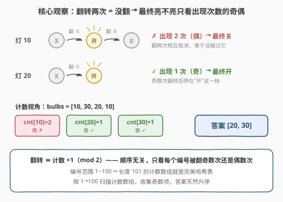
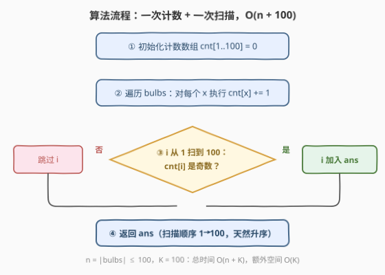

# LeetCode 切换打开灯泡 题解

## 1. 题目概述

- **标题 / 题号**：切换打开灯泡（#3842，easy）
- **链接**：https://leetcode.cn/problems/toggle-light-bulbs/
- **难度**：简单
- **标签**：数组、哈希表、排序、模拟

**题意**：给你一个整数数组 `bulbs`，每个元素的取值范围为 1 到 100。有 100 个灯泡，按 1 到 100 编号，**初始全部关闭**。对数组中的每个元素 `bulbs[i]` 依次执行：

- 如果第 `bulbs[i]` 个灯泡当前是**关闭**状态，将其**打开**；
- 如果第 `bulbs[i]` 个灯泡当前是**打开**状态，将其**关闭**。

返回最终处于打开状态的灯泡编号列表，**按升序排列**；如果没有灯泡打开，返回空列表。

**示例 1**：

```text
输入：bulbs = [10,30,20,10]
输出：[20,30]
解释：灯 10 被翻两次（开→关）相互抵消；灯 20、30 各被翻一次，最终亮着。
```

**示例 2**：

```text
输入：bulbs = [100,100]
输出：[]
解释：灯 100 被翻两次，回到关闭状态。
```

**约束**：

- $1 \le |\text{bulbs}| \le 100$
- $1 \le \text{bulbs}[i] \le 100$

> 💡 **审题关键**：① "关则开、开则关"就是**翻转（toggle）**——写代码时不必真的写成两个分支判断，对状态位取反即可；② 输出要求**升序**，而值域只有 1~100，按编号从小到大扫描天然有序，无需排序；③ 数据规模极小，怎么写都能过，但值得多想一步：**最终状态到底由什么决定**？

## 2. 解题思路

### 2.1 暴力思路（直接模拟）

开一个长度 101 的布尔数组 `on[]`，遍历 `bulbs` 逐个翻转 `on[x] = !on[x]`，最后扫一遍 1~100 收集值为 `true` 的编号。时间 $O(n + 100)$，一次遍历——对这个数据规模而言它已是标答量级。

但顺着"翻转"再多想一步：**顺序重要吗？** `[10, 30, 20, 10]` 换成 `[20, 10, 10, 30]`，结果会变吗？直觉上不会——这个直觉值得说清楚，它能把问题从"时序模拟"降维成"静态计数"。

### 2.2 核心观察：最终态 = 出现次数的奇偶性



**观察一：翻转自消。** 对同一盏灯翻转两次，状态回到原点——灯 $x$ 被翻转偶数次，等价于从未被碰过。

**观察二：顺序无关。** 翻转只在"开/关"两态之间切换，等价于在 $\mathbb{Z}_2$（模 2 整数）上做加法：每出现一次就 $+1 \bmod 2$。加法满足交换律，所以**灯 $x$ 最终亮 $\iff$ $x$ 在 `bulbs` 中出现奇数次**，与元素的排列顺序完全无关。

**观察三：值域 1~100 ⇒ 计数数组就是完美哈希表。** 键稠密且极小，不需要 `unordered_map`/`Counter`，一个长度 101 的 `int` 数组即可；按 1→100 顺序扫描，输出**天然升序**，连排序都省了（与计数排序同源）。

> 💡 **一句话**：把"模拟翻转"翻译成"统计每个编号出现次数的**奇偶性**"——问题从时序模拟退化为一次计数 + 一次扫描，顺序信息可以整体丢弃。

### 2.3 算法流程图



流程只有两步：① 遍历 `bulbs`，对每个 $x$ 执行 `cnt[x]++`；② 从 1 到 100 扫描计数数组，`cnt[i]` 为奇数就把 $i$ 收集进答案。奇偶判断用位运算 `cnt[i] & 1`。

### 2.4 示例演算

**示例 1**（`bulbs = [10,30,20,10]`）：

| 元素 | cnt 变化 | 该灯奇偶（状态） |
|------|----------|------------------|
| 10 | cnt[10] = 1 | 奇（亮） |
| 30 | cnt[30] = 1 | 奇（亮） |
| 20 | cnt[20] = 1 | 奇（亮） |
| 10 | cnt[10] = 2 | 偶（关） |

扫描 1~100：`cnt[20]`、`cnt[30]` 为奇 → 输出 **[20, 30]** ✓

**示例 2**（`bulbs = [100,100]`）：`cnt[100] = 2` 为偶 → 输出 **[]** ✓

## 3. 参考代码

### C++

```cpp
class Solution {
public:
    vector<int> toggleLightBulbs(vector<int>& bulbs) {
        int cnt[101] = {0};                 // 值域 1~100：数组即哈希表
        for (int x : bulbs) cnt[x]++;
        vector<int> ans;
        for (int i = 1; i <= 100; i++)      // 按编号扫描，天然升序
            if (cnt[i] & 1) ans.push_back(i);
        return ans;
    }
};
```

### Python

```python
class Solution:
    def toggleLightBulbs(self, bulbs: list[int]) -> list[int]:
        cnt = [0] * 101
        for x in bulbs:
            cnt[x] += 1
        return [i for i in range(1, 101) if cnt[i] & 1]
```

> 💡 **写法要点**：也可以完全不显式计数——用集合增删（见第 5 节②）或 128 位位掩码（见第 5 节③）。但"计数数组 + 奇偶判断"是值域已知时最直白、最不易错的写法。

## 4. 复杂度分析

| 维度 | 复杂度 | 说明 |
|------|--------|------|
| 时间 | $O(n + K)$ | 计数一遍 $O(n)$，扫描 1~100 一遍 $O(K)$，此处 $K = 100$ |
| 空间 | $O(K)$ | 长度 101 的计数数组（不计输出数组） |
| 对比 | 哈希表版 | 值域未知时改用 `unordered_map` / `Counter`，空间 $O(n)$，还需 $O(n \log n)$ 排序 |

## 5. 扩展：值域放大与 O(1) 空间写法

**① 值域到 $10^9$：** 计数数组放不下，改哈希表统计奇偶，奇数项收集后排序输出，$O(n \log n)$ 时间、$O(n)$ 空间。

**② 集合增删版（隐式计数）：** 遍历 `bulbs`，$x$ 在集合中就移除、不在就加入——留在集合里的恰是出现奇数次的编号，奇偶性隐含在"在/不在"里，与计数版完全等价（最后同样需排序）。

**③ 位掩码 $O(1)$ 空间：** 值域 1~100 恰好压进 128 位：`mask ^= 1 << (x - 1)`，一遍异或后第 $i$ 位为 1 即灯 $i$ 亮（C++ 用两个 `uint64_t` 拼、或 `__int128`）。这就是 2.2"观察二"的位运算化身。

**④ 关联经典：** [319. 灯泡开关](https://leetcode.cn/problems/bulb-switcher/)——$n$ 轮操作，第 $i$ 轮翻转所有 $i$ 的倍数，灯 $x$ 被翻次数 = $x$ 的**因子个数**，最终亮的恰是完全平方数（因子成对出现，只有平方数的因子是奇数个）。同一句口诀：**翻转的最终态看奇偶**。

## 6. 面试要点

**Q1：为什么最终状态与 `bulbs` 的顺序无关？**

> 每次翻转等价于对灯的状态位做模 2 加法，而模 2 加法满足交换律与结合律；无论以什么顺序执行，灯 $x$ 的最终状态只取决于它作为操作对象出现的总次数 mod 2。顺序信息整体可丢。

**Q2：为什么用数组而不是哈希表？**

> 值域 $[1, 100]$ 稠密且极小，数组下标即键值，访问 $O(1)$ 且常数远小于哈希；还能按 1→100 的顺序扫描，天然输出升序结果，省掉排序。哈希表是值域未知或稀疏时的备选。

**Q3：题目要求"按升序排列"，代码里没排序，为什么是对的？**

> 因为按编号从小到大扫描计数数组，收集顺序本身就是升序——**用有序的遍历顺序替代显式排序**，是"值域已知"类问题的标准技巧（计数排序同源）。前提是值域有界且不大。

**Q4：如果灯泡编号范围是 $10^9$、数组长度 $10^5$，怎么做？**

> 计数数组失效。用哈希表统计每个编号出现次数的奇偶，收集奇数项后排序输出，$O(n \log n)$ 时间、$O(n)$ 空间；或用集合增删版，最后同样要排序。

**Q5：`cnt[i] & 1` 与 `cnt[i] % 2` 有区别吗？**

> 非负整数下语义完全相同，位与在多数机器上更快、也更符合"判奇偶"的惯用写法；需要警惕的是负数取模的语言差异——本题值域恒非负，两者等价，按团队习惯选即可。

> 💡 **一句话总结**：翻转 = mod 2 计数——**灯亮 ⇔ 出现奇数次**；值域小就上计数数组，顺带白拿升序输出。

## 同类练习题

| # | 题目 | 与本题的关联 |
|---|------|-------------|
| 319 | [灯泡开关](https://leetcode.cn/problems/bulb-switcher/)（[题解](../0301-0400/319_灯泡开关.md)） | 因子个数的奇偶决定最终态，只有完全平方数亮——"翻转看奇偶"的经典形态 |
| 137 | [只出现一次的数字 II](https://leetcode.cn/problems/single-number-ii/)（[题解](../0101-0200/137_只出现一次的数字II.md)） | 按位统计出现次数 mod 3，计数奇偶思想的位运算升级版 |
| 389 | [找不同](https://leetcode.cn/problems/find-the-difference/)（[题解](../0301-0400/389_找不同.md)） | 计数恰好差 1（奇偶失衡）的那个字符即答案 |
| 540 | [有序数组中的单一元素](https://leetcode.cn/problems/single-element-in-a-sorted-array/)（[题解](../0501-0600/540_有序数组中的单一元素.md)） | 全数组只有一个数出现奇数次，还能用二分进一步加速 |
| 672 | [灯泡开关 II](https://leetcode.cn/problems/bulb-switcher-ii/)（[题解](../0601-0700/672_灯泡开关II.md)） | 翻转操作受限后的状态压缩枚举，翻转家族的进阶版 |
