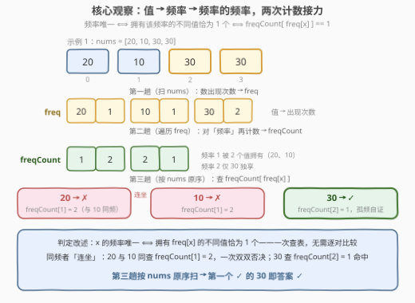
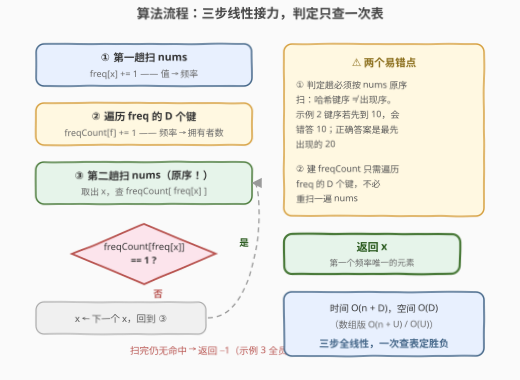

# 频率唯一的第一个元素

- **题目名称**：频率唯一的第一个元素
- **链接**：[3843. 频率唯一的第一个元素](https://leetcode.cn/problems/first-element-with-unique-frequency/)
- **难度**：中等
- **标签**：数组、哈希表、计数

## 1. 题目概述

**题意**：给定整数数组 `nums`，从左到右扫描，返回**第一个出现频率与众不同**的元素——即第一个满足「没有任何其他元素恰好以相同次数出现」的 `nums[i]`。若不存在这样的元素，返回 `-1`。

**示例 1**：

```text
输入：nums = [20,10,30,30]
输出：30
解释：20 出现 1 次，10 出现 1 次，30 出现 2 次。
      20 与 10 同为 1 次，频率不唯一；30 的频率 2 无人共享 → 频率唯一。
```

**示例 2**：

```text
输入：nums = [20,20,10,30,30,30]
输出：20
解释：20 出现 2 次，10 出现 1 次，30 出现 3 次，三者频率互不相同。
      第一个频率唯一的元素是最先出现的 20。
```

**示例 3**：

```text
输入：nums = [10,10,20,20]
输出：-1
解释：10 与 20 都出现 2 次，没有任何元素的频率是唯一的。
```

**约束条件**：

- $1 \le n \le 10^5$
- $1 \le nums[i] \le 10^5$

> 💡 **审题关键**：① 「频率唯一」比较的是**次数**而非值——两个不同的值同频（如示例 1 的 20 与 10）同样互相「否决」；② 要的是**最左边**那个，不是任意一个——判定必须按数组原序扫；③ 与 387「字符串中的第一个唯一字符」形似神异：387 找 $\text{freq}=1$，本题找「freq 无人共享」，$f=1$ 只是孤频的一种可能（示例 1 里 20、10 各出现 1 次却**不**唯一）。

---

## 2. 解题思路

### 2.1 暴力思路：逐对比较频率

先一趟哈希统计每个值的出现次数 `freq`（这步 $O(n)$ 想必都会）；随后从左到右对每个元素 $x$ 判定「是否存在别的值 $y \ne x$ 使 $\text{freq}(y) = \text{freq}(x)$」——内层要把**所有其他值的频率**翻出来逐一比较，最坏 $O(D^2)$（$D$ 为不同值个数，最坏 $= n$），总计 $O(n^2)$；$n = 10^5$ 时约 $10^{10}$ 次比较，必然超时。

瓶颈显而易见：**「我的频率是否唯一」这个判定只依赖 $\text{freq}(x)$ 本身**——频率相同的值，判定结论必然相同，却被逐对重复比较了一遍又一遍。

### 2.2 核心观察：双层计数——「频率的频率」



「有没有别的值与我同频」根本不必逐个比较——把判定**倒过来叙述**：

> **判定改述**：$x$ 的频率唯一 $\iff$ 拥有频率 $\text{freq}(x)$ 的**不同值恰好只有一个**。

于是把计数再做一次接力：

1. **第一趟**（扫 `nums`）：`freq[x]`——值 → 出现次数；
2. **第二趟**（遍历 `freq`）：`freqCount[f]`——频率 → 拥有频率 $f$ 的不同值个数，即把 `freq` 的**值域**当作新表的**键**再数一遍；
3. **第三趟**（再扫 `nums`）：第一个满足 `freqCount[freq[x]] == 1` 的 $x$ 即答案。

用示例 1 演算：`freq = {20:1, 10:1, 30:2}`，接力得 `freqCount = {1:2, 2:1}`。20 与 10 的判定同为 `freqCount[1] = 2`——**同频者互相「连坐」**，一次查表同时否决；30 查 `freqCount[2] = 1`，孤频自证 ✓。

> 💡 这是**计数题的二段接力**定式：当判定条件「卡在中间量」上（本题卡在频率上），就对中间量**再数一次**。1207「独一无二的出现次数」判「全员频率互不相同」用的正是同一张 `freqCount` 表（$\text{freqCount}[f] \le 1$ 恒成立）。

### 2.3 算法流程图



| 步骤 | 操作 | 说明 |
|------|------|------|
| ① 第一趟 | 扫 `nums`：`freq[x] += 1` | 值 → 频率 |
| ② 第二趟 | 遍历 `freq` 的 $D$ 个键：`freqCount[f] += 1` | 频率 → 拥有者个数（**不必重扫 nums**） |
| ③ 第三趟 | 按 `nums` **原序**扫：`freqCount[freq[x]] == 1 ?` | 是 → 返回 `x`；否 → 下一个 |
| ④ 兜底 | 扫完仍无命中 → 返回 `-1` | 如示例 3 全员同频 |

> ⚠️ **第三趟必须按 `nums` 原序扫，不能按 `freq` 的键序扫**：哈希表键序 ≠ 元素出现序。示例 2 中三者频率互不相同、全员频率唯一，若键序先枚举到 10 会错答 10，正确答案是最先出现的 20。按 `nums` 扫天然保序，还省去记录首次出现下标。

### 2.4 示例演算

示例 1 `nums = [20,10,30,30]`（`freq = {20:1, 10:1, 30:2}`，`freqCount = {1:2, 2:1}`）：

| 值 x | freq[x] | freqCount[freq[x]] | 频率唯一？ |
|------|---------|--------------------|-----------|
| 20   | 1       | $\text{freqCount}[1] = 2$（20、10） | ✗ |
| 10   | 1       | $\text{freqCount}[1] = 2$          | ✗ |
| 30   | 2       | $\text{freqCount}[2] = 1$          | ✓ |

从左到右第一个 ✓ 的是 30 → 返回 **30** ✓。

示例 3 `nums = [10,10,20,20]`：`freq = {10:2, 20:2}`，`freqCount = {2:2}`，所有元素查 `freqCount[2] = 2` 全部 ✗ → 返回 **-1** ✓。

---

## 3. 参考代码

值域 $1 \le nums[i] \le 10^5$ 且频率 $\le n \le 10^5$，两张表都可用**普通数组**实现（省哈希常数）；值域大或含负数时换 `unordered_map` / `dict`，骨架不变。

### C++

```cpp
class Solution {
public:
    int firstUniqueFreq(vector<int>& nums) {
        vector<int> freq(100001);              // 值 → 频率
        for (int x : nums) freq[x]++;

        vector<int> freqCount(100001);         // 频率 → 拥有该频率的不同值个数
        for (int x = 1; x <= 100000; ++x)
            if (freq[x] > 0) freqCount[freq[x]]++;

        for (int x : nums)                     // 必须按原数组序扫
            if (freqCount[freq[x]] == 1) return x;
        return -1;
    }
};
```

### Python

```python
class Solution:
    def firstUniqueFreq(self, nums: List[int]) -> int:
        freq = Counter(nums)                    # 值 → 频率
        freq_count = Counter(freq.values())     # 频率 → 拥有者个数
        for x in nums:                          # 按原数组序扫
            if freq_count[freq[x]] == 1:
                return x
        return -1
```

> 💡 **写法要点**：① `Counter(freq.values())` 一行完成第二趟接力；② 判定趟扫 `nums` 而非字典键，天然保「最左」语义；③ 数组版第二趟遍历整个值域 $U$，哈希版只遍历 $D$ 个不同值——值域紧凑时两者皆可。

---

## 4. 复杂度分析

| 维度 | 复杂度 | 说明 |
|------|--------|------|
| **时间** | $O(n + D)$ | 两遍扫 `nums` + 一遍遍历 `freq` 的 $D$ 个键；数组版为 $O(n + U)$（$U = 10^5$ 值域） |
| **空间** | $O(D)$ | 两张计数表；数组版 $O(U)$ |
| **量级 / 值域** | $n \le 10^5$，$1 \le nums[i] \le 10^5$ | 总操作 $3 \times 10^5$ 级，毫秒级 |

---

## 5. 扩展：同表变体清单

- **全员频率互不相同**（即 1207）：判定 $\forall f : \text{freqCount}[f] \le 1$ 恒成立——同一张表换个问法。
- **最后一个 / 第 k 个频率唯一的元素**：第三趟换扫描方向，或带命中计数器，骨架不动。
- **频率唯一的元素个数**：答案 $= \#\{\,f : \text{freqCount}[f] = 1\,\}$——每个孤频恰对应一个值，连第三趟都省了。
- **按频率排序类题**（1636、451）：`freq` 表是共同起点；本题在其上多接一层 `freqCount`，把「比较频率」变成「查频率的频率」。

---

## 6. 面试要点

**Q1：如何把「我的频率是否唯一」从逐对比较降到一次查表？**

> 关键是判定改述：频率唯一 $\iff$ 拥有该频率的不同值恰为 1 个。对 `freq` 的值再数一遍得 `freqCount`，判定变为 `freqCount[freq[x]] == 1`。方法论：判定条件「卡在哪个中间量上」，就「对中间量再计数」。

**Q2：第三趟为什么必须按 nums 原序扫？**

> 答案要「第一个」出现，而哈希表键序与出现序无关。示例 2 全员频率唯一，若键序先枚举到 10 就会错答 10，正确是最先出现的 20。按 `nums` 扫天然保序，且无需额外记录首次出现下标。

**Q3：数组还是哈希表？两张表的长度分别由什么决定？**

> 值域小且非负（本题 $1 \sim 10^5$）→ 定长数组，省哈希常数；值域大、含负数或稀疏 → 哈希表，按不同值个数 $D$ 计空间。注意两张表维度不同：`freq` 以**值域**为长度，`freqCount` 以**最大频率**（$\le n$）为长度。

**Q4：与 387「字符串中的第一个唯一字符」的区别？**

> 387 找第一个 $\text{freq}=1$ 的字符（频率恰为 1）；本题找第一个「频率无人共享」的元素——只出现一次的元素也可能因别的元素也只出现一次而不唯一（示例 1 的 20、10）。判定从「查 `freq[x]`」升级为「查 `freqCount[freq[x]]`」。

**Q5：能压缩成单趟扫描吗？**

> 不能。任何元素的最终频率都可能被**后面**的重复出现改变，`freq` 定型必须先见完所有元素，`freqCount` 又依赖 `freq` 定型——信息的依赖链天然是三段。好在前两段可合并理解为「两遍 `nums` + 一遍 `freq`」，全线性。

> 💡 **一句话总结**：值 → 频率 → 频率的频率，两次计数接力；`freqCount[freq[x]] == 1` 一次查表判「孤频」，再按 `nums` 原序取第一个命中——全线性 $O(n + D)$。

---

## 7. 同类练习题

- [1207. 独一无二的出现次数](https://leetcode.cn/problems/unique-number-of-occurrences/)（[题解](../1201-1300/1207_独一无二的出现次数.md)）：同一张 `freqCount` 表判「全员频率互不相同」，本题的判定前身
- [387. 字符串中的第一个唯一字符](https://leetcode.cn/problems/first-unique-character-in-a-string/)（[题解](../0301-0400/387_字符串中的第一个唯一字符.md)）：同款「先计数、再按原序找第一个」，但判定是 freq == 1 而非频率唯一
- [1636. 按照频率将数组升序排序](https://leetcode.cn/problems/sort-array-by-increasing-frequency/)（[题解](../1601-1700/1636_按照频率将数组升序排序.md)）：`freq` 表的排序用途——本题的第二层 `freqCount` 是它的「频率视角」延伸
- [1394. 找出数组中的幸运数](https://leetcode.cn/problems/find-lucky-integer-in-an-array/)（[题解](../1301-1400/1394_找出数组中的幸运数.md)）：同为「freq 表 + 一次遍历判定」，判定条件换成 freq[x] == x
- [347. 前 K 个高频元素](https://leetcode.cn/problems/top-k-frequent-elements/)（[题解](../0301-0400/347_前K个高频元素.md)）：`freq` 表 + 桶/堆的经典延伸，计数接力的前置技能
