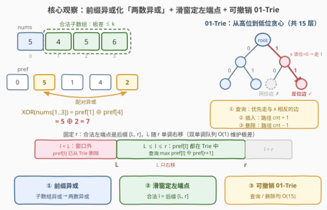

# LeetCode 最大子数组异或值 题解

## 1. 题目概述

- **标题 / 题号**：最大子数组异或值（#3845，hard）
- **链接**：https://leetcode.cn/problems/maximum-subarray-xor-with-bounded-range/
- **难度**：困难
- **标签**：位运算、字典树、队列、数组、前缀和、滑动窗口、单调队列

**题意**：给你一个非负整数数组 `nums` 和一个整数 `k`。

你需要选择 `nums` 的一个**子数组**，使得该子数组中元素的**最大值**与**最小值**之间的差值不超过 `k`。这个子数组的**值**定义为子数组中所有元素按位异或（XOR）的结果。

返回一个整数，表示所选子数组可能获得的**最大值**。

**子数组**是数组中任意连续、**非空**的元素序列。

**示例 1**：

```text
输入：nums = [5,4,5,6], k = 2
输出：7
解释：选择子数组 [5, 4, 5, 6]（加粗部分为 4,5,6）。
该子数组中最大值与最小值的差为 6 - 4 = 2 <= k。
该子数组的值为 4 XOR 5 XOR 6 = 7。
```

**示例 2**：

```text
输入：nums = [5,4,5,6], k = 1
输出：6
解释：选择单元素子数组 [6]，极差为 0 <= k，值为 6。
```

**约束**：

- $1 \le nums.length \le 4 \times 10^4$
- $0 \le nums[i] < 2^{15}$
- $0 \le k < 2^{15}$

> 💡 **审题关键**：① $n \le 4\times10^4$，子数组总数约 $8\times10^8$，$O(n^2)$ 逐个枚举必然超时，目标 $O(n \log V)$ 级别；② $nums[i] < 2^{15}$ ⇒ **值域只有 15 位**，前缀异或值同样小于 $2^{15}$，01-Trie 深度取 15 即可；③ $k \ge 0$ ⇒ **单元素子数组极差为 0、永远合法**，滑动窗口收缩时不会缩空；④ 异或不满足「可减性」，前缀**和**的撤销技巧（减去贡献）在这里失效——但异或有自己的消去律 $a \oplus a = 0$，这正是前缀异或可行的原因。

## 2. 解题思路

### 2.1 暴力思路：枚举所有子数组

固定左端点 $l$ 向右扩张 $r$，边扩边维护 $\max/\min$ 与异或累计值，对每个合法子数组取最大：

```text
for l in 0..n-1:
    mx = mn = nums[l]; v = 0
    for r in l..n-1:
        mx = max(mx, nums[r]); mn = min(mn, nums[r]); v ^= nums[r]
        if mx - mn <= k: ans = max(ans, v)
```

总时间 $O(n^2) \approx 8\times10^8$，超时。瓶颈有二：**枚举量本身是平方级**；且「区间异或的最大值」无法像区间和那样用一个变量增量维护。突破口是把「子数组异或」拆成「两个前缀值之异或」，再用滑动窗口批量圈定候选、用 01-Trie 快速求最大异或配对。

### 2.2 核心观察：前缀异或 + 滑动窗口 + 可撤销 01-Trie



**观察一（前缀异或：子数组异或 → 两数异或）**。定义 $pref[0] = 0$、$pref[i+1] = pref[i] \oplus nums[i]$，由异或的消去律：

$$XOR(nums[l..r]) = pref[l] \oplus pref[r+1]$$

子数组的值只由**两个前缀值**决定——这与「子数组和 = 两前缀和之差」完全同源，只是把减法换成了异或。

**观察二（合法左端点是连续后缀，双指针可行）**。极差对窗口包含关系单调：扩窗时 $\max$ 只增不减、$\min$ 只减不增 ⇒ 极差只增不减。于是固定右端点 $r$ 时，合法的 $l$ 恰构成后缀 $[L(r),\ r]$；又因窗口 $[l, r+1] \supseteq [l, r]$，$L(r)$ 随 $r$ **单调不减**——标准的滑动窗口骨架。窗口 $\max/\min$ 用**双单调队列**均摊 $O(1)$ 维护（同 [239](https://leetcode.cn/problems/sliding-window-maximum/) / [3835](https://leetcode.cn/problems/count-subarrays-with-cost-less-than-or-equal-to-k/)）。

**观察三（最大两数异或 → 01-Trie 贪心）**。固定 $r$ 后问题变成：在集合 $\{pref[l] : l \in [L, r]\}$ 中找与 $pref[r+1]$ 异或最大的数。把候选值逐个插入 01-Trie，查询时**从高位到低位，每层优先走与 $pref[r+1]$ 当前位相反的边**——相反的边能让结果的这一位为 1，逐位贪心即得全局最大（[421](https://leetcode.cn/problems/maximum-xor-of-two-numbers-in-an-array/) 经典模板）。

**观察四（窗口左移 ⇒ Trie 必须支持删除）**。$L$ 右移时 $pref[L]$ 离开候选集，而普通 Trie 只会插入不会删除。给**每个节点加计数 `cnt`**：插入 = 路径上 `cnt+1`，删除 = 路径上 `cnt−1`；查询时只走向 `cnt > 0` 的分支。节点**不物理删除**（惰性撤销），内存安全且实现极简。

> 💡 **一句话**：前缀异或化两数之异或 → 滑窗（双单调队列）把合法 $l$ 圈成后缀 $[L, r]$ → 带计数的 01-Trie 支持一边插入删除一边贪心查询。每个 $r$ 一次查询 $O(15)$，总复杂度 $O(15n)$。

### 2.3 算法流程图

![算法流程：每个 r 依次完成入队、收缩（Trie 删除）、插入 pref[r]、贪心查询、更新答案](../images/p3845_algorithm_flow.svg)

| 步骤 | 操作 | 说明 |
|------|------|------|
| ① 扩窗 | $r$ 右移一格，`nums[r]` 入双单调队列 | `maxDq` 值递减 / `minDq` 值递增，均存下标 |
| ② 收缩 | 极差 $> k$ 时：Trie 删除 `pref[L]`，弹两队列中下标 == `L` 的队头，`L++` | 单元素极差为 0，循环必停在 $L \le r$，窗口不会缩空 |
| ③ 插入 | Trie 插入 `pref[r]`（路径 `cnt+1`） | 此刻 Trie 恰含 `pref[L..r]` |
| ④ 查询 | 用 `pref[r+1]` 贪心查询 | 得 $\max_{l \in [L,r]} pref[l] \oplus pref[r+1]$ |
| ⑤ 更新 | `ans = max(ans, cur)` | 以 $r$ 结尾的最优子数组处理完毕 |

### 2.4 示例演算

以示例 1 `nums = [5,4,5,6], k = 2` 演算，前缀异或 `pref = [0,5,1,4,2]`：

| r | 窗口 [L,r] | 极差 | 收缩 | Trie 内容（pref[l], l∈[L..r]） | 查询 pref[r+1] | 候选值 | ans |
|---|-----------|------|------|-------------------------------|---------------|--------|-----|
| 0 | [0,0] | 0 | 无 | {0} | 5 | 5⊕0 = 5 | 5 |
| 1 | [0,1] | 5−4=1 | 无 | {0, 5} | 1 | max(1, 4) = 4 | 5 |
| 2 | [0,2] | 1 | 无 | {0, 5, 1} | 4 | max(4, 1, 5) = 5 | 5 |
| 3 | [0,3] | 6−4=2 | 无 | {0, 5, 1, 4} | 2 | **max(2, 7, 3, 6) = 7** | 7 |

$r=3$ 时 `pref[4]=2` 与 `pref[1]=5` 配对得 $2 \oplus 5 = 7$，对应子数组 `nums[1..3] = [4,5,6]` ✓。

**示例 2**（$k=1$）：前三步同上；$r=3$ 入窗后极差 $6-4=2>1$，连续删除 `pref[0]=0`、`pref[1]=5`（`L` 移到 2），Trie 只剩 {1, 4}，用 `pref[4]=2` 查询得 $\max(2\oplus1,\ 2\oplus4)=6$ ✓。

## 3. 参考代码

### C++

```cpp
class Solution {
public:
    int maxXor(vector<int>& nums, int k) {
        int n = nums.size(), B = 15;               // nums[i] < 2^15，15 位足够
        vector<int> pre(n + 1);
        for (int i = 0; i < n; ++i) pre[i + 1] = pre[i] ^ nums[i];

        vector<array<int, 2>> ch(1, {0, 0});       // 0 表示空儿子
        vector<int> cnt(1, 0);                     // 节点计数，支持删除

        auto add = [&](int x, int d) {             // d = +1 插入 / -1 删除
            int u = 0;
            for (int b = B - 1; b >= 0; --b) {
                int v = (x >> b) & 1;
                if (!ch[u][v]) {
                    ch[u][v] = ch.size();
                    ch.push_back({0, 0});
                    cnt.push_back(0);
                }
                u = ch[u][v];
                cnt[u] += d;
            }
        };
        auto query = [&](int x) {                  // 返回 max(x ^ y)
            int u = 0, res = 0;
            for (int b = B - 1; b >= 0; --b) {
                int v = (x >> b) & 1, w = ch[u][v ^ 1];
                if (w && cnt[w] > 0) {             // 反位分支存在且有数
                    res |= 1 << b;
                    u = w;
                } else {
                    u = ch[u][v];
                }
            }
            return res;
        };

        int ans = 0, l = 0;
        deque<int> maxDq, minDq;                   // 存下标：maxDq 值递减，minDq 值递增
        for (int r = 0; r < n; ++r) {
            while (!maxDq.empty() && nums[maxDq.back()] <= nums[r]) maxDq.pop_back();
            maxDq.push_back(r);
            while (!minDq.empty() && nums[minDq.back()] >= nums[r]) minDq.pop_back();
            minDq.push_back(r);

            while (nums[maxDq.front()] - nums[minDq.front()] > k) {
                add(pre[l], -1);                   // pref[L] 离开候选集
                if (maxDq.front() == l) maxDq.pop_front();
                if (minDq.front() == l) minDq.pop_front();
                ++l;
            }
            add(pre[r], 1);                        // Trie 恰含 pre[L..r]
            ans = max(ans, query(pre[r + 1]));
        }
        return ans;
    }
};
```

### Python

```python
from collections import deque

class Solution:
    def maxXor(self, nums: List[int], k: int) -> int:
        n, B = len(nums), 15                       # nums[i] < 2^15，15 位足够
        pre = [0] * (n + 1)
        for i, x in enumerate(nums):
            pre[i + 1] = pre[i] ^ x

        ch = [[0, 0]]                              # 0 表示空儿子
        cnt = [0]                                  # 节点计数，支持删除

        def add(x: int, d: int) -> None:           # d = +1 插入 / -1 删除
            u = 0
            for b in range(B - 1, -1, -1):
                v = (x >> b) & 1
                if not ch[u][v]:
                    ch[u][v] = len(ch)
                    ch.append([0, 0])
                    cnt.append(0)
                u = ch[u][v]
                cnt[u] += d

        def query(x: int) -> int:                  # 返回 max(x ^ y)
            u, res = 0, 0
            for b in range(B - 1, -1, -1):
                v = (x >> b) & 1
                w = ch[u][v ^ 1]
                if w and cnt[w] > 0:               # 反位分支存在且有数
                    res |= 1 << b
                    u = w
                else:
                    u = ch[u][v]
            return res

        ans, l = 0, 0
        max_dq, min_dq = deque(), deque()          # 存下标：max_dq 值递减，min_dq 值递增
        for r, x in enumerate(nums):
            while max_dq and nums[max_dq[-1]] <= x:
                max_dq.pop()
            max_dq.append(r)
            while min_dq and nums[min_dq[-1]] >= x:
                min_dq.pop()
            min_dq.append(r)

            while nums[max_dq[0]] - nums[min_dq[0]] > k:
                add(pre[l], -1)                    # pref[L] 离开候选集
                if max_dq[0] == l:
                    max_dq.popleft()
                if min_dq[0] == l:
                    min_dq.popleft()
                l += 1
            add(pre[r], 1)                         # Trie 恰含 pre[L..r]
            ans = max(ans, query(pre[r + 1]))
        return ans
```

> 💡 **写法要点**：① **先收缩、后插入** `pref[r]`：收缩删的都是下标 $< L \le r$ 的旧值，`pref[r]` 不可能被误删，循环结束时 Trie 恰含 `pre[L..r]`；② 查询时必须检查 `cnt[w] > 0` 而非「儿子存在」——删除是惰性的，儿子指针还在但计数已归零，走向它就会拿到窗口外的值；③ Trie 深度取 15 是因为 $nums[i] < 2^{15}$，若值域更大只需改 `B`。

## 4. 复杂度分析

| 维度 | 复杂度 | 说明 |
|------|--------|------|
| 时间复杂度 | $O(15n)$ | 每个 $r$：队列均摊 $O(1)$、插入与查询各 $O(15)$；$L$ 全程至多右移 $n$ 次，每次删除 $O(15)$ |
| 空间复杂度 | $O(15n)$ | Trie 至多 $15n+1$ 个节点（$n = 4\times10^4$ 时约 $6\times10^5$），前缀数组与两个队列 $O(n)$ |
| 量级判断 | $n \sim 4\times10^4$ | $15n \approx 6\times10^5$ 次位步进，远低于暴力 $O(n^2) \approx 8\times10^8$ |

## 5. 扩展

### 5.1 「最大异或 + 集合动态变化」的两种姿势

- **在线滑动窗口（本题）**：候选集随窗口两侧单调整移动，插入/删除交替，用**带计数的 Trie** 惰性撤销即可。
- **离线排序（2935 / 1707 姿势）**：若约束与下标无关（如 2935 的强数对 $|x-y| \le \min(x,y)$、1707 的 $x_i \le m_i$），可把元素/查询**按约束排序**，让 Trie 只插入不删除（或按另一维度离线分组），省去计数与删除逻辑。

### 5.2 值域与深度的关系

Trie 深度 $B$ 直接决定常数：本题 $B=15$；若 $nums[i] < 10^9$ 则 $B=30$，复杂度变 $O(30n)$ 依旧可过。相对地，**值域减半不改变复杂度阶**，只让常数减半——面试中说出这一点能体现对 Trie 求最大异或本质（逐位贪心）的理解。

### 5.3 若把「极差 ≤ k」换成「异或和 ≤ k」

判定量从极差换成子数组异或和，滑动窗口的单调性**失效**（异或不随窗口伸缩单调），需改用前缀异或 + 字典树上数路径（类似 [1803](https://leetcode.cn/problems/count-pairs-with-xor-in-a-range/) 的逐位计数），是本题的一个常见变体方向。

## 6. 面试要点

**Q1：子数组异或为什么能转化成两个数的异或？**

> 前缀异或 $pref[i+1] = pref[i] \oplus nums[i]$ 满足 $XOR(l..r) = pref[l] \oplus pref[r+1]$，本质是异或的消去律 $a \oplus b \oplus b = a$（自逆性），与前缀和的 $sum(l..r) = pref[r+1] - pref[l]$ 同构。

**Q2：凭什么敢用滑动窗口？现场证明单调性。**

> 极差对窗口包含关系单调：扩窗 $\max$ 只增、$\min$ 只减 ⇒ 极差只增。故固定 $r$ 时合法 $l$ 是连续后缀 $[L(r), r]$；又 $[l, r+1] \supseteq [l, r]$ 使 $L(r+1) \ge L(r)$，左指针只右移，双指针成立。窗口 $\max/\min$ 用双单调队列均摊 $O(1)$。

**Q3：Trie 如何支持删除？为什么用计数而不是物理删节点？**

> 每个节点维护 `cnt`：插入沿路径 `+1`，删除沿路径 `−1`；查询只走 `cnt > 0` 的分支。物理删除要管理父子指针回收、且同一前缀可能被多个值共享，既易错又无收益；计数是 $O(B)$ 的惰性撤销。

**Q4：查询时如果只判断「儿子是否存在」、不检查 `cnt`，会出什么错？**

> 删除是惰性的：儿子指针仍在但 `cnt` 已为 0。走向 `cnt = 0` 的分支意味着与一个**已离开窗口**的 `pref[l]` 配对，得到的答案可能大于真实值（答案偏大、错误）。

**Q5：为什么 Trie 深度取 15？取 30 会怎样？**

> 约束 $nums[i] < 2^{15}$ 且异或不进位，所有前缀异或值都小于 $2^{15}$，15 层即可区分全部取值。取 30 只是浪费一倍空间与时间（高位全 0），不影响正确性——但说明没读懂值域约束。

**Q6：本题与 421（数组中两个数的最大异或值）的核心区别是什么？**

> 421 的候选集是**全体元素、静态不变**，Trie 插完直接查；本题候选集 $\{pref[l] : l \in [L, r]\}$ 随窗口**动态伸缩**，必须让 Trie 支持删除（计数），并把极差约束转化为滑动窗口——是「421 + 3835」的组合升级。

## 同类练习题

| # | 题目 | 与本题的关联 |
|---|------|-------------|
| 421 | [数组中两个数的最大异或值](https://leetcode.cn/problems/maximum-xor-of-two-numbers-in-an-array/)（[题解](../0401-0500/421_数组中两个数的最大异或值.md)） | 01-Trie 贪心求最大两数异或的模板题，本题查询部分的直接源头 |
| 2935 | [找出强数对的最大异或值 II](https://leetcode.cn/problems/maximum-strong-pair-xor-ii/)（[题解](../2901-3000/2935_找出强数对的最大异或值II.md)） | 排序转值域滑窗 + 可撤销 Trie，与本题同骨架，可对照「在线滑窗 vs 离线排序」两种姿势 |
| 1707 | [与数组中元素的最大异或值](https://leetcode.cn/problems/maximum-xor-with-an-element-from-array/)（[题解](../1701-1800/1707_与数组中元素的最大异或值.md)） | 离线排序限定候选集后 Trie 查询，约束从「极差」换成「不大于 m」 |
| 1938 | [查询最大基因差](https://leetcode.cn/problems/maximum-genetic-difference-query/)（[题解](../1901-2000/1938_查询最大基因差.md)） | DFS 进出栈天然模拟 Trie 的插入/删除，带计数 Trie 的树上版本 |
| 3835 | [开销小于等于 K 的子数组数目](https://leetcode.cn/problems/count-subarrays-with-cost-less-than-or-equal-to-k/)（[题解](3835_开销小于等于K的子数组数目.md)） | 同款「极差约束 + 双单调队列滑窗」，把窗口骨架单独练熟 |
