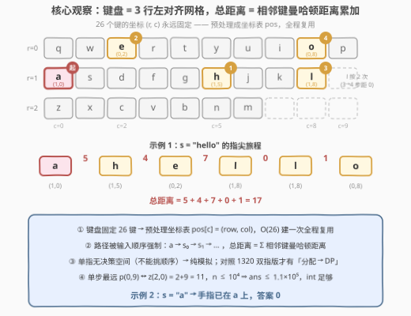
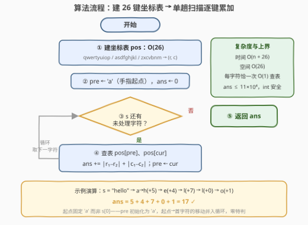

# LeetCode 使用单指输入字符串的总距离 题解

## 1. 题目概述

- **标题 / 题号**：使用单指输入字符串的总距离（#3846，medium）
- **链接**：https://leetcode.cn/problems/total-distance-to-type-a-string-using-one-finger/
- **难度**：中等
- **标签**：哈希表、字符串、模拟

> ⚠️ 本题为 LeetCode 付费题（Plus 会员专享），题意描述根据官方示例用例与 hints 重建并对照社区镜像核对，可能与官方题面有细微出入。

**题意**：有一个特殊的键盘，按键排列成如下**矩形网格**（三行左对齐，每行至多 10 列，空位无按键）：

```text
        c=0  1  2  3  4  5  6  7  8  9
r=0     q   w  e  r  t  y  u  i  o  p
r=1     a   s  d  f  g  h  j  k  l  ␣
r=2     z   x  c  v  b  n  m  ␣  ␣  ␣
```

给定只包含小写英文字母的字符串 `s`，用**仅一根手指**按顺序输入 `s`。手指初始位置在字母键 `'a'`（坐标 `(1, 0)`）上。两个位于 `(r1, c1)` 与 `(r2, c2)` 的按键，距离为**曼哈顿距离** $|r_1 - r_2| + |c_1 - c_2|$。返回输入整个字符串 `s` 的**总距离**。

**示例 1**：

```text
输入：s = "hello"
输出：17
解释：手指从 a(1,0) 出发：
      a → h(1,5)：|1-1| + |0-5| = 5
      h → e(0,2)：|1-0| + |5-2| = 4
      e → l(1,8)：|0-1| + |2-8| = 7
      l → l(1,8)：0
      l → o(0,8)：|1-0| + |8-8| = 1
      总距离 = 5 + 4 + 7 + 0 + 1 = 17。
```

**示例 2**：

```text
输入：s = "a"
输出：0
解释：手指已经停在 'a' 上，无需移动。
```

**约束**：

- $1 \le s.length \le 10^4$
- `s` 只包含小写英文字母

> 💡 **审题关键**：① 键盘是 **QWERTY 布局**，但坐标按**矩形网格左对齐**计算——第二行 `l` 在 `(1,8)`、第三行 `m` 在 `(2,6)`，行首对齐，**不是**真实键盘的错位排列；② 手指起点固定是 `'a'` 而非 `s[0]`——`s[0] != 'a'` 时第一步就要移动；③ 距离是**曼哈顿距离**（横竖两段之和），不是直线距离；④ 字符必须**按顺序**逐个输入，移动路径完全被强制，没有任何「选择」，因此本题是纯模拟。

## 2. 解题思路

### 2.1 暴力思路：逐字符现查坐标

最直接的做法：对每个字符，临时在三个键盘字符串里找它所在的行和列——每次最多扫 $10 + 9 + 7 = 26$ 个字符，总计 $O(26n)$；$n \le 10^4$ 时约 $2.6 \times 10^5$ 次比较，也能通过。

瓶颈在于**重复劳动**：键盘固定只有 26 个键，字符 → 坐标的映射与 `s` 毫无关系，却对每个字符都重新查一遍。把映射**预处理**成一张表（哈希表或 26 槽位数组），每个字符的查询就降到 $O(1)$——这正是「哈希表」标签的由来。

### 2.2 核心观察：坐标表 + 单趟累加



三个关键观察：

1. **键盘 = 固定坐标系**。26 个键的 $(row, col)$ 坐标**永远不变**，与输入无关 → 预处理一次 `pos[c]`，全程复用；
2. **总距离 = 相邻段之和**。输入顺序强制，路径是 $a \to s_0 \to s_1 \to \dots \to s_{n-1}$ 的一条折线，总距离按**望远镜求和**拆成相邻两键距离之和：

$$ans = \sum_{i=0}^{n-1} dist(s_{i-1},\ s_i), \qquad s_{-1} = \text{'a'}$$

3. **没有决策空间**。单指输入每个字符必须逐个按到，不存在「先去哪、后去哪」的选择——这正是它与 1320（两根手指，按键可分配 → DP）的本质区别：**去掉第二根手指，DP 退化成模拟**。

**上界速算**：行号差至多 2、列号差至多 9，单次移动最大距离是 `p(0,9) ↔ z(2,0)` 的 $2 + 9 = 11$，所以 $ans \le 11 \times 10^4 = 1.1 \times 10^5$，`int` 毫无压力。

### 2.3 算法流程图



| 步骤 | 操作 | 说明 |
|------|------|------|
| ① 建表 | `keys = ["qwertyuiop","asdfghjkl","zxcvbnm"]`，`pos[c] ← (i, j)` | 26 键 → 坐标，一次 $O(26)$ |
| ② 初始化 | `pre ← 'a'`，`ans ← 0` | 手指起点是 `'a'`，不是 `s[0]` |
| ③ 循环判定 | `s` 还有未处理字符？ | 否 → 返回 `ans` |
| ④ 累加 | `ans += |r1−r2| + |c1−c2|`，`pre ← cur` | 两次查表 + 一次加法，均摊 $O(1)$ |

### 2.4 示例演算

`s = "hello"`（键盘坐标见 2.2 图）：

| 步 | pre | cur | pre 坐标 | cur 坐标 | 距离 | ans |
|----|-----|-----|----------|----------|------|-----|
| 起点 | — | a | — | (1,0) | — | 0 |
| 1 | a | h | (1,0) | (1,5) | $\|1-1\|+\|0-5\| = 5$ | 5 |
| 2 | h | e | (1,5) | (0,2) | $\|1-0\|+\|5-2\| = 4$ | 9 |
| 3 | e | l | (0,2) | (1,8) | $\|0-1\|+\|2-8\| = 7$ | 16 |
| 4 | l | l | (1,8) | (1,8) | $0$ | 16 |
| 5 | l | o | (1,8) | (0,8) | $\|1-0\|+\|8-8\| = 1$ | 17 |

得 `ans = 17` ✓；`s = "a"` 时首步 $dist(\text{'a'}, \text{'a'}) = 0$，答案 `0` ✓。

## 3. 参考代码

### C++

```cpp
class Solution {
public:
    int totalDistance(string s) {
        array<pair<int, int>, 26> pos{};
        vector<string> keys = {"qwertyuiop", "asdfghjkl", "zxcvbnm"};
        for (int i = 0; i < (int)keys.size(); ++i)
            for (int j = 0; j < (int)keys[i].size(); ++j)
                pos[keys[i][j] - 'a'] = {i, j};          // 建表 O(26)

        auto [r, c] = pos['a' - 'a'];                    // 手指起点 'a'
        int ans = 0;
        for (char cur : s) {
            auto [nr, nc] = pos[cur - 'a'];
            ans += abs(r - nr) + abs(c - nc);
            r = nr; c = nc;
        }
        return ans;
    }
};
```

### Python

```python
class Solution:
    def totalDistance(self, s: str) -> int:
        keys = ["qwertyuiop", "asdfghjkl", "zxcvbnm"]
        pos = {ch: (i, j) for i, row in enumerate(keys)
                       for j, ch in enumerate(row)}      # 建表 O(26)

        r, c = pos['a']                                  # 手指起点 'a'
        ans = 0
        for cur in s:
            nr, nc = pos[cur]
            ans += abs(r - nr) + abs(c - nc)
            r, c = nr, nc
        return ans
```

> 💡 **写法要点**：① `pre` 初始化为 `'a'` 而非 `s[0]`——把「起点 → 第一个字符」的移动并入统一循环，**零特判**；② C++ 用 `array<pair<int,int>, 26>` 直接下标寻址比 `unordered_map` 更快（缓存友好、无哈希开销），Python 用字典即可；③ 距离上界 $1.1 \times 10^5$，`int` 足够，无需 `long long`。

## 4. 复杂度分析

| 维度 | 复杂度 | 说明 |
|------|--------|------|
| **时间** | $O(n + 26) = O(n)$ | 建表 $O(26)$；每个字符恰一次查表 + 一次累加，均摊 $O(1)$ |
| **空间** | $O(26) = O(1)$ | 坐标表只存 26 个键（哈希表口径为 $O(\|\Sigma\|)$，$\Sigma$ 为字符集） |
| **量级** | $n \le 10^4$ | 总距离 $\le 11 \times 10^4$，毫秒级完成，无溢出风险 |

## 5. 扩展：从单指到双指，从网格到单行

**双指版（1320）**：再加一根手指后，每个按键**归属哪根手指**成为决策——手指停留位置影响后续距离，子问题互相耦合，需要 DP：$dp[i][j][k]$ 表示输完前 $i$ 个字符、两指分别停在 $j$、$k$ 位置的最小总距离。本题（单指）正是「只有一根手指」的退化情形：**无决策 ⟹ 无 DP，只剩模拟**。对照两题能看清「DP 的维度来自哪里」。

**单行版（1165）**：键盘退化成一行（顺序还给定），曼哈顿距离退化成 $|i - j|$，模板不变只换距离函数——「位置表 + 相邻累加」的骨架完全复用。

**字母板版（1138）**：网格是 `abcde / fghij / klmno / pqrst / uvwxy / z`，同样建坐标系，但 `z` 独占末行带来**移动越界陷阱**（从 `z` 出发必须先上后右），且输出的是移动序列而非距离——坐标思想相同，工程细节更多。

**距离函数替换**：若手指可八方向移动（切比雪夫距离 $\max(|\Delta r|, |\Delta c|)$）或对角步代价另算，只改第 ④ 步的距离公式，骨架不动。

## 6. 面试要点

**Q1：手指初始位置为什么要单独处理？如何避免特判？**

> 初始位置是 `'a'` 而非第一个字符。把 `pre` 初始化为 `'a'`，让「起点 → $s_0$」的移动与后续移动走同一个循环体，**零特判**；若单独处理第一步，代码分叉且容易把 `s[0] == 'a'` 的情形算错。

**Q2：坐标表用哈希表还是数组？**

> 字符集固定 26 个小写字母，用 `pos[ch - 'a']` 的定长数组最快（缓存友好、无哈希开销）；哈希表写法更通用（字符集大或不确定时）。「哈希表」标签的本质是**预处理映射**这一思想，不绑定具体容器。

**Q3：答案上界是多少？需要担心溢出吗？**

> 单次移动最远是 `p(0,9) ↔ z(2,0)`：$2 + 9 = 11$；$n \le 10^4$ 故 $ans \le 1.1 \times 10^5$，`int`（上限约 $2.1 \times 10^9$）绰绰有余。面试中主动报出上界是展示边界意识的好机会。

**Q4：本题与 1320「二指输入的最小距离」差在哪？**

> 决策自由度。单指时每个键必须按顺序按到，路径是唯一折线，答案唯一、直接求和；双指时每个键可分配给任一手指，两指停留位置互相影响，必须 DP 取最小值。**优化类问题的「可优化性」来自决策空间**——判断一道题该模拟还是该 DP，先看「有没有得选」。

**Q5：如果键盘像真实 QWERTY 那样行错位排列，怎么改？**

> 只是坐标定义变了：给第二、三行加水平偏移（如 +0.5、+1.75 列），`col` 不再是整数下标而要按偏移修正，距离公式与流程不变；偏移非整数时还需与面试官对齐距离的取整口径。**先对齐坐标定义再写码**，这类题最容易栽在题意细节上。

> 💡 **一句话总结**：键盘是固定 3×10 左对齐网格 → 预处理 26 键坐标表；`pre` 初始化为 `'a'` 免特判；单趟扫描累加相邻键曼哈顿距离，$O(n)$ 时间 / $O(26)$ 空间，纯模拟。

## 同类练习题

| # | 题目 | 与本题的关联 |
|---|------|-------------|
| 1165 | [单行键盘](https://leetcode.cn/problems/single-row-keyboard/)（[题解](../1101-1200/1165_单行键盘.md)） | 一维版——自定义单行键盘 + $\|i-j\|$ 距离，同一「位置表 + 相邻累加」骨架 |
| 1320 | [二指输入的最小距离](https://leetcode.cn/problems/minimum-distance-to-type-a-word-using-two-fingers/)（[题解](../1301-1400/1320_二指输入的最小距离.md)） | 双指版——按键归属成为决策，从模拟升级为 DP，反衬本题「无决策」的本质 |
| 1138 | [字母板上的路径](https://leetcode.cn/problems/alphabet-board-path/)（[题解](../1101-1200/1138_字母板上的路径.md)） | 同款字母网格坐标系，但 `z` 独占一行带来移动越界陷阱，输出移动序列 |
| 2810 | [故障键盘](https://leetcode.cn/problems/faulty-keyboard/)（[题解](../2801-2900/2810_故障键盘.md)） | 另一道键盘模拟题——`i` 键反转已输入部分，考察模拟中的序列反转技巧 |
