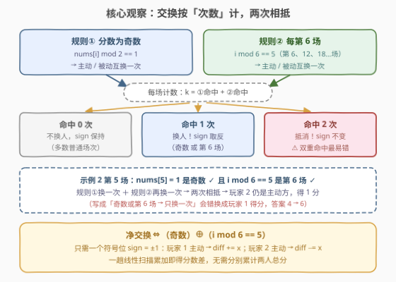
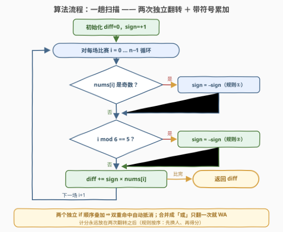

# LeetCode 计算比赛分数差 题解

## 1. 题目概述

- **标题 / 题号**：计算比赛分数差（#3847，medium）
- **链接**：https://leetcode.cn/problems/find-the-score-difference-in-a-game/
- **难度**：中等
- **标签**：数组、模拟

**题意**：给你一个整数数组 `nums`，其中 `nums[i]` 表示在第 `i` 场比赛中获得的分数。

恰好有两位玩家。初始时，第一位玩家为**主动玩家**，第二位玩家为**被动玩家**。

**按顺序**将下述规则应用于每场比赛 `i`：

1. 如果 `nums[i]` 是**奇数**，主动玩家和被动玩家互换角色；
2. 在**每第 6 场**比赛（即比赛索引为 5, 11, 17, ... 的比赛）中，主动玩家和被动玩家互换角色；
3. 主动玩家参与第 `i` 场比赛，并获得 `nums[i]` 分。

返回**分数差**：第一位玩家的总分减去第二位玩家的总分。

**示例 1**：

```text
输入：nums = [1,2,3]
输出：0
解释：第 0 场分数为奇数，玩家 2 成为主动方得 1 分；第 1 场不换，玩家 2 得 2 分；第 2 场奇数换回，玩家 1 得 3 分。差为 3 − 3 = 0。
```

**示例 2**：

```text
输入：nums = [2,4,2,1,2,1]
输出：4
解释：前 3 场玩家 1 得 2+4+2 = 8 分；第 3 场奇数换人，玩家 2 得 1 分；第 4 场不换，玩家 2 得 2 分；第 5 场「奇数换一次 + 第 6 场再换一次」相抵消，玩家 2 得 1 分。差为 8 − 4 = 4。
```

**示例 3**：

```text
输入：nums = [1]
输出：-1
解释：第 0 场分数为奇数，玩家 2 成为主动方得 1 分。差为 0 − 1 = −1。
```

**约束**：

- $1 \le \text{nums.length} \le 1000$
- $1 \le \text{nums}[i] \le 1000$

> 💡 **审题关键**：① 规则是**按顺序逐条应用**的——奇数交换、第 6 场交换、然后才计分，两次交换都发生在**计分之前**；② 同一场比赛两条交换规则**可以同时命中**（如示例 2 第 5 场），交换两次等于没换；③ 问的是**差值**而非两人各自的总分，天然适合带符号累加。

## 2. 解题思路

### 2.1 直白模拟与它的坑

- 最直白的做法是老老实实模拟：维护「当前主动方是谁」与两个累计分 $s_1$、$s_2$，每场先按规则换人、再给主动方加分，最后返回 $s_1 - s_2$。这本身已是 $O(n)$ / $O(1)$，正确且够快；
- 真正的坑在**换人逻辑**：若把两条规则合并成「`nums[i]` 是奇数**或**是第 6 场就交换**一次**」，则在「既是奇数又是第 6 场」的比赛中只交换一次，而正确语义是**交换两次（相互抵消）**——示例 2 的第 5 场（`nums[5] = 1`）恰好踩中，答案会从 4 变成 6；
- 结论：交换必须**按次数计数**，而不是按「是否命中任一规则」的布尔值——这是本题唯一的思维门槛。

### 2.2 核心观察：交换计数与符号翻转



三个层层递进的观察：

**观察一：交换是「对合」，次数的奇偶决定净效果。** 主动 ↔ 被动互换执行两次等于恒等。设

$$k = [\,\text{nums}[i] \bmod 2 = 1\,] + [\,i \bmod 6 = 5\,]$$

则发生净交换当且仅当 $k$ 为奇数，即两条件**异或**：

$$\text{净交换} \iff (\text{nums}[i] \text{ 为奇数}) \oplus (i \bmod 6 = 5)$$

**观察二：只求差值，无需分别记账。** 返回值是「玩家 1 总分 − 玩家 2 总分」，引入符号位 $\text{sign} = +1$（玩家 1 主动）/ $-1$（玩家 2 主动），每场做 $\text{diff} \mathrel{+}= \text{sign} \times \text{nums}[i]$，两个累计变量合并成一个。

**观察三：边界天然安全。** $n \le 1000$、$\text{nums}[i] \le 1000$，故 $|\text{diff}| \le 10^6$，32 位 `int` 毫无压力；$\text{nums}[i] \ge 1$ 无负数奇偶陷阱。

> 💡 **一句话**：状态只有 1 个 bit（谁主动），两条规则各自把这个 bit 异或一次；分数差 $= \sum \text{sign} \cdot \text{nums}[i]$。

### 2.3 算法流程图



流程只有一条主轴：**逐场扫描 → 两次独立判定（各自可能翻转 sign）→ 带符号累加**。注意流程图里两次翻转是**两个顺序执行的独立 `if`**，而不是 if–else 或「或」合并——这正是「双重交换抵消」能被正确处理的原因；同时计分步永远放在两次翻转**之后**，对应规则「先换人、再得分」的顺序。

### 2.4 示例演算

**示例 2**：`nums = [2,4,2,1,2,1]`：

| $i$ | nums[i] | 奇数？ | $i \bmod 6 = 5$？ | 净交换 | 主动方 | diff |
|---|---|---|---|---|---|---|
| 0 | 2 | 否 | 否 | 无 | 玩家 1 | $+2$ |
| 1 | 4 | 否 | 否 | 无 | 玩家 1 | $+6$ |
| 2 | 2 | 否 | 否 | 无 | 玩家 1 | $+8$ |
| 3 | 1 | **是** | 否 | 换人 | 玩家 2 | $+7$ |
| 4 | 2 | 否 | 否 | 无 | 玩家 2 | $+5$ |
| 5 | 1 | **是** | **是** | **抵消** | 玩家 2 | $+4$ |

答案 $\text{diff} = 4$ ✓（若第 5 场错按「只交换一次」处理，会换成玩家 1 得分，得 6）。

**示例 3**：`nums = [1]`：第 0 场奇数换人 → 玩家 2 得 1 分，$\text{diff} = -1$ ✓。

## 3. 参考代码

### C++

```cpp
class Solution {
public:
    int scoreDifference(vector<int>& nums) {
        int diff = 0;
        int sign = 1;                              // +1: 玩家1主动, -1: 玩家2主动
        for (int i = 0; i < (int)nums.size(); i++) {
            if (nums[i] % 2 == 1) sign = -sign;    // 规则①
            if (i % 6 == 5)      sign = -sign;     // 规则②：与①独立叠加
            diff += sign * nums[i];                // 计分放在两次翻转之后
        }
        return diff;
    }
};
```

### Python

```python
from typing import List

class Solution:
    def scoreDifference(self, nums: List[int]) -> int:
        diff = 0
        sign = 1                            # +1: 玩家1主动, -1: 玩家2主动
        for i, x in enumerate(nums):
            if x % 2:                       # 规则①
                sign = -sign
            if i % 6 == 5:                  # 规则②：两个独立 if，天然处理双重抵消
                sign = -sign
            diff += sign * x
        return diff
```

> 💡 **写法要点**：
> - **两个独立 `if`，绝不能合并成 `or` 或 if–else**：`if (nums[i] % 2 || i % 6 == 5) sign = -sign;` 在双重命中的场次只翻一次，示例 2 直接错成 6；
> - **先交换后计分**：规则按序应用，`diff += ...` 必须放在两次翻转之后；
> - 若嫌 `sign` 绕，等价写法是维护 `bool firstActive` 加 $s_1$、$s_2$ 两个和、最后 `return s1 - s2`，只是多一个变量。

## 4. 复杂度分析

| 维度 | 复杂度 | 说明 |
|------|--------|------|
| 时间 | $O(n)$ | 每场常数次判断加一次乘加，$n \le 1000$ 绰绰有余 |
| 空间 | $O(1)$ | 仅 `diff`、`sign` 两个变量 |
| 量级判断 | $|\text{diff}| \le 1000 \times 1000 = 10^6$ | 32 位 `int` 安全，无需 `long long` |

## 5. 扩展

**① 规则再多几条怎么办？** 设规则扩成「素数分交换、每第 4 场交换、每第 7 场交换……」——每条规则独立判定、各自对状态位异或一次，净交换仍由**命中次数的奇偶**决定。把每条规则抽象成命中函数 $f_j(i, \text{nums}[i]) \to \{0,1\}$，状态位 $b \mathrel{\oplus}= f_j$，模拟骨架完全不变。

**② 能否 $O(1)$ 回答「前 $i$ 场的分数差」？** 可以。第 $j$ 场的符号 $\text{sign}(j) = (-1)^{F(j)}$，其中 $F(j)$ 是前 $j$ 场（含第 $j$ 场自身）的累计翻转次数——翻转计数可前缀化，于是 $\text{diff}(i) = \sum_{j \le i} \text{sign}(j) \cdot \text{nums}[j]$ 一趟预处理出前缀和后 $O(1)$ 查询。本题只问总量，无需这层优化。

**③ 若分数可为负数或零？** C++ 中 `-3 % 2 == -1`，判奇得写 `((x % 2) + 2) % 2 == 1` 或直接 `x & 1`（补码下对负数同样正确）；零是偶数不触发规则①。本题 $1 \le \text{nums}[i]$ 无此虞，但面试口述时值得主动提一句。

## 6. 面试要点

**Q1：这道题最核心的坑是什么？**

> 两条交换规则在同一场比赛**同时命中**时要**交换两次**（相互抵消），而不是合并成一次。正确写法是两个顺序执行的独立 `if`（或显式按计数奇偶翻转）；`if (奇数 || 第 6 场) 翻转一次` 在示例 2 第 5 场（值为 1 的第 6 场）出错，答案 4 → 6。

**Q2：为什么一个 `sign` 变量就够了？**

> 所求是**差值**（玩家 1 − 玩家 2），把「玩家 1 得 $x$ 分」记 $+x$、「玩家 2 得 $x$ 分」记 $-x$，两个累计量合并为一个带符号和；`sign` 本质是「当前主动方」这一个 bit 的 $\pm 1$ 编码。

**Q3：两条规则的先后顺序影响结果吗？**

> 就两条交换规则之间的先后而言不影响——它们是同一个对合（主动 ↔ 被动互换），对合彼此可交换，且连续执行偶数次相互抵消；但**计分必须放在两次交换之后**（规则按序 1→2→3），若计分插在两次交换中间，得分者就换了人。

**Q4：数据范围上有什么要注意的？**

> $n \le 1000$、$\text{nums}[i] \le 1000$ ⇒ $|\text{diff}| \le 10^6$，32 位整型安全；若把两者放大到 $10^5$ 级（乘积 $\approx 10^{10}$），C++ 才需要 `long long`。另外 $\text{nums}[i] \ge 1$，无负数取模的奇偶陷阱。

**Q5：如果规则改成「每第 k 场」或再叠加奇偶类规则呢？**

> 骨架不变：每条规则独立判定、对状态位各异或一次，净交换由命中次数的奇偶决定。模拟类题的通用心法——**先找状态（这里是 1 个 bit），再找转移（每场的翻转事件），最后找要累计的量（带符号的分数）**。

> 💡 **一句话总结**：3847 =「1 bit 状态 + 两条独立翻转规则 + 带符号累加」。带走三点：交换按**次数**算（两次相抵）；求差值用 **sign = ±1** 合并记账；独立 `if` 顺序叠加是处理多重规则的标准姿势。

## 同类练习题

| # | 题目 | 与本题的关联 |
|---|------|-------------|
| 2894 | [分类求和并作差](https://leetcode.cn/problems/divisible-and-non-divisible-sums-difference/)（[题解](../2801-2900/2894_分类求和并作差.md)） | 同样是「带符号遍历累加求差」的最简模拟 |
| 1342 | [将数字变成 0 的操作次数](https://leetcode.cn/problems/number-of-steps-to-reduce-a-number-to-zero/)（[题解](../1301-1400/1342_将数字变成0的操作步骤数.md)） | 奇偶性驱动状态转移的逐事件模拟 |
| 922 | [按奇偶排序数组 II](https://leetcode.cn/problems/sort-array-by-parity-ii/)（[题解](../0901-1000/922_按奇偶排序数组II.md)） | 数值奇偶与下标取模的联动判定 |
| 860 | [柠檬水找零](https://leetcode.cn/problems/lemonade-change/)（[题解](../0801-0900/860_柠檬水找零.md)） | 按序逐事件模拟并维护少量状态 |
| 1041 | [困于环中的机器人](https://leetcode.cn/problems/robot-bounded-in-circle/)（[题解](../1001-1100/1041_困于环中的机器人.md)） | 方向状态在指令下反复翻转的过程模拟 |
