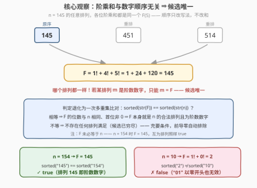
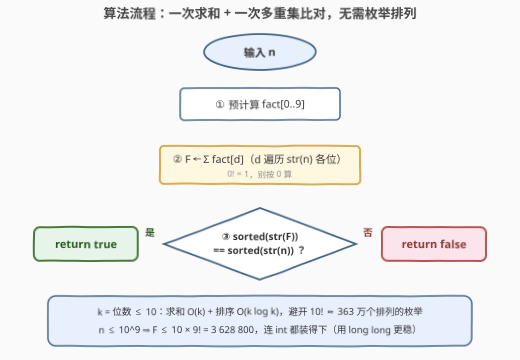

# 阶数数字排列

- **题目名称**：阶数数字排列
- **链接**：[3848. 阶数数字排列](https://leetcode.cn/problems/check-digitorial-permutation/)
- **难度**：中等
- **标签**：数学、计数

## 1. 题目概述

**题意**：给你一个整数 $n$。如果一个数字的所有位数的**阶乘之和**等于数字本身，则称其为**阶数数字**（digitorial）。判断 $n$ 的**任意排列**（包括原始顺序，但不能以零开头）能否形成一个阶数数字。能则返回 `true`，否则返回 `false`。

**示例 1**：

```text
输入：n = 145
输出：true
解释：145 本身是阶数数字，因为 1! + 4! + 5! = 1 + 24 + 120 = 145。
```

**示例 2**：

```text
输入：n = 10
输出：false
解释：10 不是阶数数字（1! + 0! = 2 ≠ 10）；排列 "01" 以零开头，无效。
```

**约束条件**：

- $1 \le n \le 10^9$（至多 10 位）

> 💡 **审题关键**：① 阶数数字 = 各位阶乘之和等于自身（$145 = 1!+4!+5!$）；② 问的不是 $n$ 本身，而是 $n$ 的**某个排列**是否为阶数数字——排列由全部数字重排而成、位数不变、**不能以 0 开头**；③ $0! = 1$ 而不是 $0$，这是最常见的手滑点；④ $n \le 10^9$ 意味着最多 10 位，但千万不要因此去枚举 $10!$ 个排列——见 2.2 的顺序无关观察。

---

## 2. 解题思路

### 2.1 暴力思路：枚举全部排列

最直接的想法：生成 $n$ 的所有数字排列（去重、跳过前导零），逐个检查「各位阶乘之和是否等于排列本身」。

$n$ 至多 10 位，无重复数字时排列数高达 $10! \approx 3.6 \times 10^6$，每个再花 $O(10)$ 求阶乘和——总量约 $3.6 \times 10^7$，勉强可过但极其浪费。瓶颈在于：**把「数字顺序」也当成待搜索的信息**，而阶乘和根本不在乎顺序。

### 2.2 核心观察：阶乘和与顺序无关，候选唯一



设 $n$ 的数字**多重集**为 $S$（例如 $n=145$ 时 $S=\{1,4,5\}$）。对 $S$ 的**任何**排列 $m$，其各位阶乘和都等于

$$
F(S) = \sum_{d \in S} d!
$$

——加法交换律，**与顺序无关**。于是产生一条决定性推理：

> 若 $n$ 的某个合法排列 $m$ 是阶数数字，则 $m = \sum_{d \in m} d! = F(S)$——**候选唯一**，就是 $F(S)$ 本身。

所以问题坍缩为一次判定：**$F(S)$ 的十进制表示是否恰是 $n$ 的一个排列**，即

$$
\texttt{sorted(str(}F\texttt{))} == \texttt{sorted(str(}n\texttt{))}
$$

**充要性**：

- **充分**：若多重集相等，则 $F$ 与 $n$ 位数相同、数字相同，且 $F$ 作为数值其十进制表示**首位非零**——$F$ 本身就是 $n$ 的一个合法排列，且它满足 $F = \sum d!$，是阶数数字；
- **必要**：若存在合法排列 $m$ 为阶数数字，则 $m = F(S)$，故 $F$ 的数字多重集 $= m$ 的 $= S$。

**前导零自动排除**：$F$ 是数值、无前导零；多重集相等时它天然是一个不以零开头的排列。反过来，以零开头的排列本就不在候选之列（候选只有 $F$ 一个），无需特判——示例 2 的 $n=10$：$F = 1!+0! = 2$，`sorted("2") = "2"` ≠ `sorted("10") = "01"`，直接 `false`。

**注意 $F$ 未必等于 $n$**：$n = 154$ 时 $F = 145 \ne 154$，但两者互为排列，照样 `true`（排列 $145$ 是阶数数字）。判定对象是「多重集」，不是「数值相等」。

### 2.3 算法流程图



| 步骤 | 操作 | 说明 |
|------|------|------|
| ① 预计算 | `fact[0..9]`，`fact[0] = 1` | 打表 10 个阶乘；注意 $0! = 1$ |
| ② 求和 | `F ← Σ fact[d]`，$d$ 遍历 `str(n)` 各位 | 顺序无关，遍历原数即可 |
| ③ 比对 | `sorted(str(F)) == sorted(str(n)) ?` | 多重集相等 ⇒ `true`，否则 `false` |

### 2.4 示例演算

| $n$ | 各位阶乘和 $F$ | `sorted(str(F))` | `sorted(str(n))` | 结果 |
|-----|---------------|------------------|------------------|------|
| 145 | $1!+4!+5! = 145$ | `145` | `145` | `true`（$F=n$，原序即成立） |
| 154 | $1!+5!+4! = 145$ | `145` | `145` | `true`（$F \ne n$ 但互为排列） |
| 40585 | $4!+0!+5!+8!+5! = 40585$ | `04558` | `04558` | `true`（七位阶数数字之一） |
| 10 | $1!+0! = 2$ | `2` | `01` | `false`（位数都不够） |
| 15 | $1!+5! = 121$ | `112` | `15` | `false`（候选 121 非其排列） |

---

## 3. 参考代码

### C++

```cpp
class Solution {
public:
    bool isDigitorialPermutation(int n) {
        long long fact[10];
        fact[0] = 1;
        for (int i = 1; i <= 9; ++i) fact[i] = fact[i - 1] * i;

        string s = to_string(n);
        long long sum = 0;
        for (char c : s) sum += fact[c - '0'];

        string t = to_string(sum);
        sort(s.begin(), s.end());
        sort(t.begin(), t.end());
        return s == t;
    }
};
```

### Python

```python
class Solution:
    def isDigitorialPermutation(self, n: int) -> bool:
        fact = [1] * 10
        for i in range(1, 10):
            fact[i] = fact[i - 1] * i

        s = str(n)
        total = sum(fact[int(c)] for c in s)
        return sorted(s) == sorted(str(total))
```

> 💡 **写法要点**：① 多重集比对用排序最短（10 个字符排序零开销），也可以用 10 桶计数 `cnt[d]` 增减比较；② $F \le 10 \times 9! = 3\,628\,800$，`int` 即可装下，`long long` 只是求稳；③ `fact[0] = 1` 别写成 `0`——$0! = 1$ 是本题最大的隐形陷阱。

---

## 4. 复杂度分析

| 维度 | 复杂度 | 说明 |
|------|--------|------|
| **时间** | $O(k)$，$k$ 为位数（$\le 10$） | 一趟求和 $O(k)$ + 两次排序 $O(k \log k)$，常数极小 |
| **空间** | $O(k)$ | 字符串副本与阶乘表（10 项） |
| **量级对比** | 暴力 $10! \approx 3.6 \times 10^6$ 个排列 → 本解法约 10 步 | 顺序无关性把排列搜索坍缩成一次多重集比对 |

---

## 5. 扩展：十进制下的阶数数字（factorion）只有 4 个

各位阶乘和等于自身的数叫 **factorion**，十进制下恰好只有 $1,\ 2,\ 145,\ 40585$ 四个：

- **上界**：$k$ 位数的阶乘和 $\le k \cdot 9! = 362880k$；当 $k \ge 8$ 时 $362880k < 10^{k-1}$，位数跟不上自身增长，故 factorion 至多 7 位；
- **穷举**：在 $[1, 10^7)$ 内（按数字多重集枚举更快）验证，只有上述 4 个。

由此得到另一等价解法：判断 $n$ 的数字多重集是否属于 $\big\{\{1\},\ \{2\},\ \{1,4,5\},\ \{0,4,5,5,8\}\big\}$。但「阶乘和顺序无关」的一行判定**不依赖 factorion 清单**——换进制、换位运算（如各位平方和的快乐数变体）时同一骨架仍然成立，面试中更值得讲的是这条通用推理。

顺带一提：本题返回 `true` 的 $n \le 10^7$ 恰有 56 个——$1$、$2$、$145$ 的 6 个排列、$40585$ 的 48 个不以零开头的排列，与上述清单完全吻合。

---

## 6. 面试要点

**Q1：为什么不枚举排列？本题最关键的观察是什么？**

> 各位阶乘之和**与数字顺序无关**（加法交换律）：$n$ 的任何排列，阶乘和都是同一个 $F(S)$。于是「存在某个排列是阶数数字」⟺ 那个排列等于 $F(S)$——候选从 $10!$ 个坍缩到 1 个，只剩一次多重集比对。

**Q2：`sorted(str(F)) == sorted(str(n))` 为什么是充要条件？**

> 充分：多重集相等 ⇒ $F$ 与 $n$ 数字相同、位数相同，且 $F$ 首位非零，故 $F$ 是合法排列且为阶数数字。必要：若合法排列 $m$ 是阶数数字，则 $m = F(S)$，其数字多重集既等于 $S$ 又等于 $F$ 的，故比对成立。

**Q3：前导零的限制需要特判吗？**

> 不需要。候选唯一（$F$ 本身），而 $F$ 是数值、十进制表示无前导零；多重集比对通过时 $F$ 自动是合法排列。反例方向：$n=10$ 时 $F=2$，多重集不等直接 `false`——以零开头的 "01" 从未进入候选。

**Q4：本题最容易翻车的细节是什么？**

> $0! = 1$（不是 $0$）。$n=10$ 的阶乘和是 $1!+0! = 2$；$n=40585$ 里那个 $0$ 贡献的是 $1$。打表时 `fact[0] = 1` 写错会让所有含零的样例全错。

**Q5：$F$ 会不会溢出？复杂度是多少？**

> $n \le 10^9$ 至多 10 位，$F \le 10 \times 9! = 3\,628\,800$，远在 `int` 范围内。时间 $O(k)$（$k \le 10$）、空间 $O(k)$——相对于暴力枚举 $10! \approx 3.6 \times 10^6$ 个排列是断崖式简化。

> 💡 **一句话总结**：阶乘和与顺序无关 ⇒ 阶数数字排列若存在则只能是 $F(S) = \sum d!$ 本身 ⇒ `sorted(str(F)) == sorted(str(n))` 一次比对定真伪；$0! = 1$ 别写错。

---

## 7. 同类练习题

- [202. 快乐数](https://leetcode.cn/problems/happy-number/)（[题解](../0201-0300/202_快乐数.md)）：各位**平方和**的数字性质判定——把本题的阶乘换成平方，同样吃「位运算与顺序无关」的直觉
- [507. 完美数](https://leetcode.cn/problems/perfect-number/)（[题解](../0501-0600/507_完美数.md)）：真因数之和等于自身——factorion 的「因数版孪生」，都是自指型数字性质
- [242. 有效的字母异位词](https://leetcode.cn/problems/valid-anagram/)（[题解](../0201-0300/242_有效的字母异位词.md)）：排序/计数比对多重集——本题一行核心判定的原型
- [172. 阶乘后的零](https://leetcode.cn/problems/factorial-trailing-zeroes/)（[题解](../0101-0200/172_阶乘后的零.md)）：阶乘的数论性质分析，与本题共享阶乘预备知识
- [31. 下一个排列](https://leetcode.cn/problems/next-permutation/)（[题解](../0001-0100/31_下一个排列.md)）：排列枚举的经典工具——本题暴力版思路的基础构件
