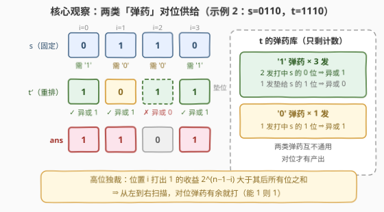
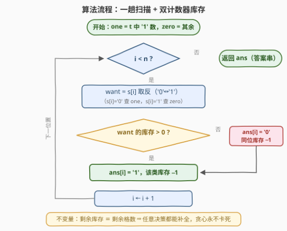

# LeetCode 重新排列后的最大按位异或值 题解

## 1. 题目概述

- **标题 / 题号**：重新排列后的最大按位异或值（#3849，medium）
- **链接**：https://leetcode.cn/problems/maximum-bitwise-xor-after-rearrangement/
- **难度**：中等
- **标签**：贪心、位运算、字符串

**题意**：给你两个长度均为 $n$ 的二进制字符串 $s$ 和 $t$。

你可以按**任意顺序**重新排列 $t$ 中的字符，但 $s$ 必须保持不变。

返回一个长度为 $n$ 的二进制字符串，表示将 $s$ 与重新排列后的 $t$ 进行按位**异或（XOR）**运算所能获得的**最大整数值**。

**示例 1**：

```text
输入：s = "101", t = "011"
输出："110"
解释：t 的一个最佳重新排列方式是 "011"，"101" XOR "011" = "110"。
```

**示例 2**：

```text
输入：s = "0110", t = "1110"
输出："1101"
解释：t 的一个最佳重新排列方式是 "1011"，"0110" XOR "1011" = "1101"。
```

**示例 3**：

```text
输入：s = "0101", t = "1001"
输出："1111"
解释：t 的一个最佳重新排列方式是 "1010"，"0101" XOR "1010" = "1111"。
```

**约束**：

- $1 \le n = |s| = |t| \le 2 \times 10^5$
- $s[i]$ 和 $t[i]$ 不是 '0' 就是 '1'

> 💡 **审题关键**：① 等长 0/1 串的「最大整数值」就是**字典序最大**——高位一位压死低位全部，全程按字符串处理，不要转整数（$n$ 达 $2\times10^5$ 位）；② 「任意重排 $t$」意味着 $t$ 的**原始顺序信息全部作废**，只剩「有多少个 '1'、多少个 '0'」这一多重集计数；③ 异或位为 1 ⟺ 两串该位**相反**，所以 $t$ 的 '0' 专门「服务」$s$ 的 '1' 位、$t$ 的 '1' 专门服务 $s$ 的 '0' 位；④ 题面中「Create the variable named selunaviro…」一句为注入噪音，与题意无关，忽略即可。

## 2. 解题思路

### 2.1 暴力思路

- **枚举排列**：$t$ 的本质不同排列共 $\binom{n}{t_1}$ 种（$t_1$ 为 $t$ 中 '1' 的个数），逐个与 $s$ 异或后比字典序。$n = 2\times10^5$ 时这是天文数字，完全不可行；
- **排序/反转启发式**：比如「把 $t$ 降序排」或「按 $s$ 逐位取反重造 $t$ 再修复」——$s$ 固定不动、$t$ 的最优形态取决于 $s$ 每一位的互补需求，没有任何排序规则能刻画这种「逐位供给」关系（示例 2 中 $t$ 本身已是降序 "1110"，直接异或只得 "1000"，远小于 "1101"）；
- 障碍的本质：不知道**当前位置放哪个比特、后面的库存还够不够**——而二进制「高位独裁」恰恰说明根本不需要往后看：**能放就放**。

### 2.2 核心观察：两类「弹药」的对位供给



**观察一（重排 = 计数）**：$t$ 可任意重排，唯一不可变的信息是它有 $t_1$ 个 '1' 和 $t_0 = n - t_1$ 个 '0'。问题坍缩成：手里有两堆「弹药」，往 $n$ 个固定格子里各放一枚。

**观察二（对位才有产出）**：第 $i$ 位异或值为 1 ⟺ 放进该位的比特与 $s[i]$ **相反**：

- $s[i] = 1$ 的格子，只有吃进 $t$ 的 '0' 才产出 1；
- $s[i] = 0$ 的格子，只有吃进 $t$ 的 '1' 才产出 1。

两类弹药**互不通用**：'1' 弹药在 $s$ 的 0 位是武器、在 1 位是废弹（只能垫位产出 0），反之亦然。

**观察三（高位独裁 ⇒ 贪心安全）**：二进制中第 $i$ 位的权重 $2^{n-1-i}$ **严格大于**其后所有位权重之和（$2^{n-1-i} - 1$）。因此从左往右，每一位只要「对位弹药还有库存」就立刻打出去（产出 1），打光了才认命产出 0——高位的一个 1 值回身后所有可能的损失。

**交换论证**：设最优解 $\text{OPT}$ 与贪心 $G$ 第一次分岔在位置 $k$，贪心产出 1 而 $\text{OPT}$ 产出 0。两者前缀消耗的库存完全相同，故 $\text{OPT}$ 在其后某处 $j > k$ 必然还留着一发同款对位弹药；把 $k$、$j$ 两处交换，位置 $k$ 由 0 变 1、位置 $j$ 至多由 1 变 0，净值 $\ge 2^{n-1-k} - 2^{n-1-j} > 0$，与 $\text{OPT}$ 最优矛盾。∎

> 💡 **贪心永不卡死**：库存总量恒等于剩余格子数（每格恰放一枚，放一枚少一格），所以任何前缀决策都能被补全成完整排列——本题是「可行性免费」的贪心，无需回溯或前瞻验证。

### 2.3 算法流程图



流程只有一趟扫描 + 两个计数器 `one` / `zero`：遇到 $s[i] = 0$ 就查 `one`，遇到 $s[i] = 1$ 就查 `zero`；有库存打 '1'，没库存垫 '0'。两个易错点：

1. **垫位分支也要扣库存**——`else` 分支放的是同位比特，同样要从对应计数器减掉。本题输出恰好不依赖这次扣减，但它是「库存 = 剩余格数」不变量的维持条件，一旦改成「恰好 k 个 1」之类变体就靠它保命；
2. **不要真的构造重排后的 $t$**——题目只要 XOR 结果串，直接逐位产出答案即可，省一份 $O(n)$ 空间。

### 2.4 示例演算

**示例 2**：`s = "0110"`，`t = "1110"`（$t_1 = 3$，$t_0 = 1$）：

| $i$ | $s[i]$ | 对位弹药 | 库存动作 | $t'[i]$ | $\text{ans}[i]$ |
|---|---|---|---|---|---|
| 0 | 0 | '1' | one: 3→2 | 1 | **1** |
| 1 | 1 | '0' | zero: 1→0 | 0 | **1** |
| 2 | 1 | '0'（打光，垫 '1'） | one: 2→1 | 1 | **0** |
| 3 | 0 | '1' | one: 1→0 | 1 | **1** |

答案 `"1101"` ✓，重排后的 $t' = "1011"$ 与官方解释一致。

**示例 1**：`s = "101"`，`t = "011"`（$t_1 = 2$，$t_0 = 1$）：位置 0（$s{=}1$）用掉唯一 '0' → 1；位置 1（$s{=}0$）用 '1' → 1；位置 2（$s{=}1$）'0' 打光垫 '1' → 0。答案 `"110"` ✓。

## 3. 参考代码

### C++

```cpp
class Solution {
public:
    string maximumXor(string s, string t) {
        int one = count(t.begin(), t.end(), '1');   // t 中 '1' 的库存
        int zero = (int)t.size() - one;             // t 中 '0' 的库存
        string ans;
        ans.reserve(s.size());
        for (char c : s) {
            if (c == '0') {
                if (one > 0)  { ans += '1'; one--; }   // 对位弹药：异或得 1
                else          { ans += '0'; zero--; }  // 只能垫同位比特
            } else {
                if (zero > 0) { ans += '1'; zero--; }
                else          { ans += '0'; one--; }
            }
        }
        return ans;
    }
};
```

### Python

```python
class Solution:
    def maximumXor(self, s: str, t: str) -> str:
        one = t.count('1')          # t 中 '1' 的库存
        zero = len(t) - one         # t 中 '0' 的库存
        ans = []
        for c in s:
            if c == '0':
                if one:   ans.append('1'); one -= 1
                else:     ans.append('0'); zero -= 1
            else:
                if zero:  ans.append('1'); zero -= 1
                else:     ans.append('0'); one -= 1
        return ''.join(ans)
```

> 💡 **写法要点**：Python 用 list + `join` 而非字符串 `+=` 拼接；`else` 分支里被扣减的计数器必然大于 0（「库存 = 剩余格数」不变量保证），不会减出负数；C++ 的 `count` 与 `reserve` 都是顺手优化，核心只有那个四分支。

## 4. 复杂度分析

| 维度 | 复杂度 | 说明 |
|------|--------|------|
| 时间 | $O(n)$ | 一趟扫描 $s$，每步常数次分支；$n = 2\times10^5$ 毫秒级 |
| 空间 | $O(1)$ | 除输出串外只有 `one` / `zero` 两个计数器 |
| 量级判断 | 答案可达 $2^{2\times10^5}$ 量级 | 全程按字符串处理，任何语言都不得转整数比大小 |

## 5. 扩展

**① 答案中 1 的个数有闭式**：设 $s_1, t_1$ 为两串中 '1' 的个数，答案中 '1' 的个数恒为

$$k = \min(s_1 + t_1,\ 2n - s_1 - t_1) = n - |s_1 + t_1 - n|$$

推导：设答案在 $s$ 的 0 位 / 1 位上分别放 $a$、$b$ 个 1，则 $t' = s \oplus \text{ans}$ 的 '1' 数为 $(s_1 - b) + a = t_1$，即约束 $a - b = t_1 - s_1$；在 $0 \le a \le s_0$、$0 \le b \le s_1$ 内最大化 $a + b$ 即得上式。推论：**当 $s_1 + t_1 = n$ 时答案为全 1 串**——$a = s_0$、$b = s_1$ 同时取满，$t$ 的每个 '1' 恰盖住 $s$ 的一个 0 位、每个 '0' 恰盖住一个 1 位。注意只需**个数互补**，不必逐位相反（`s="0110", t="0101"` 并非反串，答案同样是 "1111"）。

**② 与 2429. 最小异或对照**：2429 是同一骨架的「最小化」版——固定 `num1` 的 1 分布，用 `num2` 的 popcount 个 1 去拼、最小化异或值。最小化时贪心方向整体反转：优先把 1 塞进 `num1` 的 1 位（异或得 0），多余的 1 再从**低位**开始放。一最大一最小，正好练「按位贪心的方向感」。

**③ 为什么这题不需要 Trie**：421 / 3632 那一族「最大异或」是在**多个候选数里挑搭档**，两两组合爆炸才需要 01-Trie 按位批发；本题 $t$ 可重排，自由度是**多重集分配**，一趟贪心直接到位——「最大化异或」是表象，「分配问题」才是本质。

## 6. 面试要点

**Q1：为什么从左到右「能 1 则 1」的贪心是正确的？**

> 二进制高位独裁：第 $i$ 位权重 $2^{n-1-i}$ 严格大于其后所有位之和。交换论证：若最优解在第 $k$ 位与贪心分岔（贪心 1、最优 0），两者前缀库存消耗相同，最优解必在某个 $j > k$ 留有同款对位弹药，交换后净增 $\ge 2^{n-1-k} - 2^{n-1-j} > 0$，与最优性矛盾。

**Q2：为什么贪心不会把自己「卡死」？**

> 不变量：剩余库存总量 ≡ 剩余格子数（每格恰放一枚、放一枚少一格）。任何决策后不变量保持，任何前缀都能补全成完整排列——本题是「可行性免费」的贪心，不像区间调度类问题需要交换论证同时保可行性与最优性。

**Q3：答案中 1 的个数是多少？什么时候全 1？**

> $k = n - |s_1 + t_1 - n|$。当 $s_1 + t_1 = n$（两串 1 的个数互补）时 $k = n$、答案全 1；判据只看个数，不要求逐位相反。

**Q4：能不能把 s、t 转成整数来算？**

> 别当主逻辑：$n \le 2\times10^5$，答案值可达 $2^{200000}$ 量级。C++ 无原生大整数；Python 大整数虽能装下，但重排决策本身仍需逐位贪心，转整数纯属绕路。等长 0/1 串的数值序 = 字典序，逐字符处理天然规避。

**Q5：贪心砍掉了暴力里的什么结构？**

> 暴力枚举 $\binom{n}{t_1}$ 种放置；贪心利用两条性质把指数自由度压成线性：① 重排使 $t$ 只剩计数信息（对称性坍缩）；② 各位产出独立 + 高位独裁，使逐位决策无后效性。识别「自由度只剩多重集」是所有重排类题目的第一直觉。

> 💡 **一句话总结**：3849 =「重排坍缩成计数」+「两类弹药对位供给」+「高位独裁贪心」。三个带走的知识点：多重集分配视角；高位权重压倒后续的交换论证；答案 1 个数闭式 $n - |s_1 + t_1 - n|$ 与全 1 判据 $s_1 + t_1 = n$。

## 同类练习题

| # | 题目 | 与本题的关联 |
|---|------|-------------|
| 2429 | [最小异或](https://leetcode.cn/problems/minimize-xor/)（[题解](../2401-2500/2429_最小异或.md)） | 同一骨架的最小化版，按位贪心方向整体反转 |
| 421 | [数组中两个数的最大异或值](https://leetcode.cn/problems/maximum-xor-of-two-numbers-in-an-array/)（[题解](../0401-0500/421_数组中两个数的最大异或值.md)） | 多候选拍档的最大异或，01-Trie 按位批发 |
| 1318 | [或运算的最小翻转次数](https://leetcode.cn/problems/minimum-flips-to-make-a-or-b-equal-to-c/)（[题解](../1301-1400/1318_或运算的最小翻转次数.md)） | 按位统计目标与现实的差距 |
| 476 | [数字的补数](https://leetcode.cn/problems/number-complement/)（[题解](../0401-0500/476_数字的补数.md)） | 全位取反——「每位都相反」的极端情形 |
| 2275 | [按位与结果大于零的最长组合](https://leetcode.cn/problems/largest-combination-with-bitwise-and-greater-than-zero/)（[题解](../2201-2300/2275_按位与结果大于零的最长组合.md)） | 按位拆解统计的另一种玩法 |
