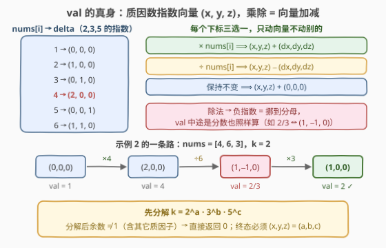
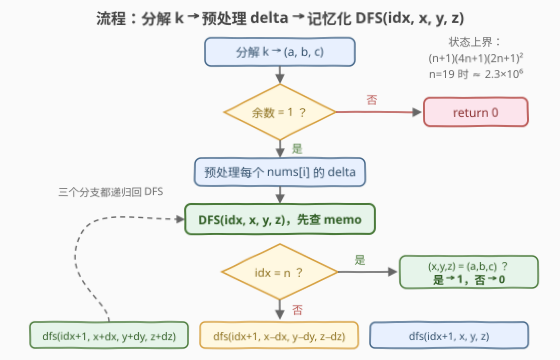

# 统计结果等于 K 的序列数目

- **题目名称**：统计结果等于 K 的序列数目
- **链接**：[3850. 统计结果等于 K 的序列数目](https://leetcode.cn/problems/count-sequences-to-k/)
- **难度**：困难
- **标签**：记忆化搜索、数组、数学、动态规划、数论

## 1. 题目概述

给你一个整数数组 `nums` 和一个整数 `k`。从初始值 `val = 1` 开始，从左到右处理 `nums`。在每个下标 `i` 处，你必须**恰好选择**以下操作之一：

- 将 `val` **乘以** `nums[i]`；
- 将 `val` **除以** `nums[i]`；
- **保持** `val` 不变。

处理完所有元素后，当且仅当 `val` 的最终**有理数值**恰好等于 `k` 时才认为 `val == k`。返回生成 `val == k` 的**不同选择序列**的数量。注意：除法是**有理数除法**（精确除法）而非整数除法，例如 $2 / 4 = 1 / 2$。

**示例 1**：

```text
输入：nums = [2,3,2], k = 6
输出：2
解释：① ×2 → ×3 → 保持（1→2→6→6）；② 保持 → ×3 → ×2（1→1→3→6）。
```

**示例 2**：

```text
输入：nums = [4,6,3], k = 2
输出：2
解释：① ×4 → ÷6 → ×3（1→4→2/3→2）；② 保持 → ×6 → ÷3（1→1→6→2）。
```

**示例 3**：

```text
输入：nums = [1,5], k = 1
输出：3
解释：对 nums[0]=1 的三种操作（×1 / ÷1 / 保持）效果全同但算不同序列；nums[1]=5 只能「保持」。
```

**约束条件**：

- $1 \le nums.length \le 19$
- $1 \le nums[i] \le 6$
- $1 \le k \le 10^{15}$

> 💡 **审题关键**：① $nums[i] \le 6$——元素只含质因数 $2, 3, 5$，乘除**不引入新质因子**，整个游戏发生在 $\{2,3,5\}$ 的指数空间里；② 除法是**精确有理除法**——`val` 中途可以是分数（示例 2 的 $2/3$），这提示「指数可以为负」；③ $n \le 19$——朴素枚举 $3^{19} \approx 1.16\times10^9$ 条序列，C++ 勉强、Python 必超时，但真实**状态空间**其实极小，记忆化直接秒杀；④ 答案上界 $3^{19} = 1{,}162{,}261{,}467 < 2^{31}-1$，恰好装进 `int32`（但很贴边，C++ 留意）；⑤ $k \le 10^{15}$ 需要 64 位（函数签名已给 `long long`）。

---

## 2. 解题思路

### 2.1 暴力思路：枚举全部 3ⁿ 条操作序列

每个下标三种选择，DFS 维护当前 `val`（用分数或有理数类），到叶子判断 `val == k`：

```text
def dfs(idx, val):
    if idx == n: return val == k
    return dfs(idx+1, val*nums[idx]) + dfs(idx+1, val/nums[idx]) + dfs(idx+1, val)
```

复杂度 $O(3^n)$：$n = 19$ 时约 $1.16\times10^9$ 个叶子，且每步还要做分数运算，必然超时。瓶颈在于**把「序列」当成独立个体逐条判定**——但仔细看：两条不同的前缀若把 `val` 带到同一个值，它们**后续的可行选择完全一致**。决定未来的不是「怎么走到这里」，而只有「当前在哪」。这正是记忆化的入口：找到那个刻画「当前在哪」的小状态空间。

### 2.2 核心观察：质因数指数向量 + 记忆化搜索



**观察一（val 的值域看似无穷，本质是三维格点）**：初始 `val = 1` 不含任何质因子，$nums[i] \in [1,6]$ 只含质因数 $2,3,5$，乘除又只增减指数——所以 `val` 永远是**5-smooth 有理数**，与三元组 $(x, y, z) \in \mathbb{Z}^3$ 按下式**一一对应**（唯一分解定理保证）：

$$val = 2^x \cdot 3^y \cdot 5^z, \qquad x, y, z \text{ 可为负（负指数 = 分母）}$$

于是三种操作统一成**向量加减**：乘 `nums[i]` 即加上其指数向量 $\delta_i$，除即减去，保持即加零向量。各元素的 $\delta$ 换算表：

| $nums[i]$ | 1 | 2 | 3 | 4 | 5 | 6 |
|---|---|---|---|---|---|---|
| $\delta = (d_2, d_3, d_5)$ | $(0,0,0)$ | $(1,0,0)$ | $(0,1,0)$ | $(2,0,0)$ | $(0,0,1)$ | $(1,1,0)$ |

示例 2 中 $4 \to 4/6 \to 2$ 的过程即 $(0,0,0) \xrightarrow{+（2,0,0)} (2,0,0) \xrightarrow{-(1,1,0)} (1,-1,0) \xrightarrow{+(0,1,0)} (1,0,0)$——中途的分数 $2/3$ 就是负指数 $(1,-1,0)$，**有理数除法在这套表示下免费获得**。

**观察二（终态判定与提前出局）**：终值等于 $k$ 当且仅当 $(x,y,z)$ 等于 $k$ 的质因数分解 $(a,b,c)$。先把 $k$ 的 $2,3,5$ 除干净，**若余数 $\ne 1$（含其它质因子），永远凑不出，直接返回 0**。

**观察三（状态范围是多项式而非指数）**：$|x| \le 2n \le 38$（只有 $4 = 2^2$ 单个元素就贡献指数 2），$|y|, |z| \le n \le 19$。状态 $(idx, x, y, z)$ 总数上界 $(n+1)(4n+1)(2n+1)^2 \approx 2.3\times10^6$（$n=19$），实际可达状态远小于此上界。对比暴力 $3^{19} \approx 1.16\times10^9$，**状态共享把指数级压成多项式级**。

> 💡 **一句话**：把有理数 `val` 翻译成指数向量 $(x,y,z)$，乘除变加减；记忆化 `dfs(idx, x, y, z)` = 处理完前 `idx` 个元素、指数停在 $(x,y,z)$ 的方案数，三分支转移，$idx = n$ 时比对 $k$ 的分解。

### 2.3 算法流程图



| 步骤 | 操作 | 说明 |
|------|------|------|
| ① 分解 | 把 $k$ 的 $2,3,5$ 除尽，得目标 $(a,b,c)$ | 余数 $\ne 1$ → 含其它质因子，`return 0` |
| ② 预处理 | 逐个算出 $nums[i]$ 的 $\delta_i = (dx, dy, dz)$ | $nums[i] \in [1,6]$ 保证除尽后余 1 |
| ③ 记忆化 | `dfs(idx, x, y, z)`，memo 未命中则三分支求和 | 乘：$+\delta_{idx}$；除：$-\delta_{idx}$；保持：不变；均 `idx+1` |
| ④ 边界 | $idx = n$ 时返回 $[(x,y,z) = (a,b,c)]$ | 目标指数超出可达范围时 DP 自然得 0 |

### 2.4 示例演算

以示例 2 `nums = [4,6,3], k = 2 = 2^1` 演算，目标向量 $(a,b,c) = (1,0,0)$，$\delta$ 依次为 $(2,0,0), (1,1,0), (0,1,0)$。两条合法路径：

| 步骤 | 操作 | 向量变化 | $(x,y,z)$ | val |
|------|------|---------|-----------|-----|
| 初始 | — | — | $(0,0,0)$ | $1$ |
| $i=0$ | $\times 4$ | $+(2,0,0)$ | $(2,0,0)$ | $4$ |
| $i=1$ | $\div 6$ | $-(1,1,0)$ | $(1,-1,0)$ | $2/3$ |
| $i=2$ | $\times 3$ | $+(0,1,0)$ | $(1,0,0)$ ✓ | $2$ |

| 步骤 | 操作 | 向量变化 | $(x,y,z)$ | val |
|------|------|---------|-----------|-----|
| 初始 | — | — | $(0,0,0)$ | $1$ |
| $i=0$ | 保持 | $+(0,0,0)$ | $(0,0,0)$ | $1$ |
| $i=1$ | $\times 6$ | $+(1,1,0)$ | $(1,1,0)$ | $6$ |
| $i=2$ | $\div 3$ | $-(0,1,0)$ | $(1,0,0)$ ✓ | $2$ |

第一条路径中途出现分数 $2/3$（指数 $-1$）——这正是「有理数除法」在向量表示下的自然产物。**示例 3** 则揭示了另一面：$nums[i] = 1$ 的 $\delta$ 是零向量，三种操作效果相同但**算不同序列**，每个 $1$ 独立贡献 $\times 3$ 倍 ($3 \times 1 = 3$ ✓)。

---

## 3. 参考代码

### C++

```cpp
class Solution {
    inline static int memo[20][80][40][40];   // x ∈ [-38,38] 偏移 40；y,z ∈ [-19,19] 偏移 20
    int n, tx, ty, tz;                        // k = 2^tx · 3^ty · 5^tz
    int dx[19], dy[19], dz[19];               // 各元素的质因数指数增量

    long long dfs(int idx, int x, int y, int z) {
        if (idx == n) return (x == tx && y == ty && z == tz);
        int &res = memo[idx][x + 40][y + 20][z + 20];
        if (res != -1) return res;
        return res = int(dfs(idx + 1, x + dx[idx], y + dy[idx], z + dz[idx])   // × nums[idx]
                       + dfs(idx + 1, x - dx[idx], y - dy[idx], z - dz[idx])   // ÷ nums[idx]
                       + dfs(idx + 1, x, y, z));                               // 保持不变
    }
public:
    int countSequences(vector<int>& nums, long long k) {
        tx = ty = tz = 0;
        while (k % 2 == 0) { k /= 2; ++tx; }
        while (k % 3 == 0) { k /= 3; ++ty; }
        while (k % 5 == 0) { k /= 5; ++tz; }
        if (k != 1) return 0;                 // 含 2,3,5 以外的质因子，永远凑不出

        n = nums.size();
        for (int i = 0; i < n; ++i) {
            int v = nums[i];
            dx[i] = dy[i] = dz[i] = 0;
            while (v % 2 == 0) { v /= 2; ++dx[i]; }
            while (v % 3 == 0) { v /= 3; ++dy[i]; }
            while (v % 5 == 0) { v /= 5; ++dz[i]; }
        }
        memset(memo, -1, sizeof memo);
        return int(dfs(0, 0, 0, 0));
    }
};
```

### Python

```python
from functools import lru_cache

class Solution:
    def countSequences(self, nums: List[int], k: int) -> int:
        target = [0, 0, 0]
        for i, p in enumerate((2, 3, 5)):
            while k % p == 0:
                k //= p
                target[i] += 1
        if k != 1:                            # 含 2,3,5 以外的质因子，凑不出来
            return 0

        deltas = []
        for v in nums:
            d = [0, 0, 0]
            for i, p in enumerate((2, 3, 5)):
                while v % p == 0:
                    v //= p
                    d[i] += 1
            deltas.append(tuple(d))

        n, (tx, ty, tz) = len(nums), target

        @lru_cache(None)
        def dfs(idx, x, y, z):
            if idx == n:
                return 1 if (x, y, z) == (tx, ty, tz) else 0
            dx, dy, dz = deltas[idx]
            return (dfs(idx + 1, x + dx, y + dy, z + dz)    # × nums[idx]
                  + dfs(idx + 1, x - dx, y - dy, z - dz)    # ÷ nums[idx]
                  + dfs(idx + 1, x, y, z))                  # 保持不变

        return dfs(0, 0, 0, 0)
```

> 💡 **写法要点**：① 数组偏移量宁大勿小：`x+40`、`y+20`、`z+20` 保证 $[-38,38] \times [-19,19]$ 全覆盖不越界；② 答案上界 $3^{19} \approx 1.16\times10^9$ 贴着 `int32` 上限，C++ 中间求和用 `long long` 再收窄更稳妥；③ 分解 $k$ 后余数 $\ne 1$ 要**立即返回 0**，这是唯一的提前出局分支；④ Python 递归深度仅 $n+1 = 20$，无栈深顾虑。

---

## 4. 复杂度分析

| 维度 | 复杂度 | 说明 |
|------|--------|------|
| **时间** | $O\big(n \cdot (4n+1)(2n+1)^2\big) \approx O(n^4)$ | 每个状态 $(idx, x, y, z)$ 只算一次，3 个转移；$n = 19$ 时状态上界 $\approx 2.3\times10^6$，实际可达状态远小于此（各维范围由同一组元素共同约束） |
| **空间** | $O\big(n \cdot (4n+1)(2n+1)^2\big)$ | 记忆化表：C++ 约 10 MB（`int` 数组），Python 为 `lru_cache` 实际可达状态数 |
| **量级判断** | 对比暴力 $3^{19} \approx 1.16\times10^9$ | 状态共享带来约 3 个数量级的压缩；$O(n^4)$ 对 $n \le 19$ 毫无压力 |

---

## 5. 扩展

### 5.1 状态压缩 DP vs 折半搜索的取舍

本题状态空间是**多项式级** $O(n^4)$，远小于序列空间 $3^n$，DP 完胜。但这依赖于「质因子只有 3 种」——若 $nums[i]$ 上界增大（如 $\le 10^5$，涉及 10 种质因数），指数向量变成 10 维，状态空间 $O\big(n \cdot (2n+1)^{10}\big)$ 指数级爆炸，此时**折半搜索**（meet in the middle）反超：把数组劈成两半，各自枚举 $3^{n/2}$ 条半程序列的指数和，用哈希表配平两半使总和等于目标，复杂度 $O(3^{n/2})$。两条路线的取舍本质是比较**状态空间大小**与**序列空间大小**：谁小走谁。

### 5.2 变体速查

- **目标改为分数**（如 `val == 2/3`）：目标指数允许为负即可，把 $(a,b,c)$ 换成 $2/3$ 的分解 $(1,-1,0)$，代码零改动。
- **要求输出具体方案**：在 DP 表上记录每个状态的转移来源，命中后回溯输出操作序列。
- **答案对大质数取模**：在转移处加 `% MOD`，其余不变（注意此时 C++ 溢出顾虑消失，可用 `int`）。
- **`nums[i]` 允许为 1 的退化情形**：每个 $1$ 的 $\delta$ 为零向量、三操作同效不同序列，独立贡献 $\times 3$——这也是自检小技巧：构造全 1 数组时答案必为 $3^n \bmod$ 上限内的 $3^n$。

---

## 6. 面试要点

**Q1：为什么可以用指数向量 $(x,y,z)$ 代替 `val`？会丢信息吗？**

> 不会。`val` 从 $1$ 出发只被 $[1,6]$ 内的整数乘除，永远是只含质因数 $2,3,5$ 的有理数；由唯一分解定理，$val = 2^x 3^y 5^z$ 与 $(x,y,z) \in \mathbb{Z}^3$ **双射**（负指数对应分母）。分数、大数都不需要显式表示，比较 `val == k` 变成向量相等判断。

**Q2：记忆化的状态为什么选 $(idx, x, y, z)$？无后效性怎么保证？**

> 处理完前 `idx` 个元素后，后续可行性只取决于当前指数向量，与「以何种操作组合到达」无关——前缀的具体选择不影响后缀转移函数，即无后效性。$(idx, x, y, z)$ 是刻画这一最小充分信息的完备状态；直接拿 `val` 当状态则值域无界且做 key 昂贵。

**Q3：哪些情形可以直接返回 0，不用跑 DP？**

> ① $k$ 含 $2,3,5$ 以外的质因子（分解后余数 $\ne 1$）——乘除不引入新质因子，永远凑不出；② 剪枝：目标指数超过理论上界，$a > 2n$ 或 $b > n$ 或 $c > n$（各元素贡献的指数之和封顶）。不剪也对，DP 会自然算出 0。

**Q4：中途出现分数怎么办？需要分数类吗？**

> 不需要。有理数除法 $=$ 负指数，向量表示下「分数」免费获得：$2/3$ 就是 $(1,-1,0)$。这正是本题把「有理数」翻译成「整数向量」的最大红利——既避免精度问题，又让状态空间有界。

**Q5：答案会溢出 `int` 吗？**

> 上界 $3^{19} = 1{,}162{,}261{,}467 < 2^{31}-1 = 2{,}147{,}483{,}647$，恰好安全但**很贴边**（若 $n$ 上界改成 20，$3^{20} \approx 3.49\times10^9$ 就爆了）。工程上 C++ 用 `long long` 中间量再收窄更稳；Python 无此虑。另外 $k \le 10^{15}$ 本身就需要 64 位。

**Q6：`nums[i] = 1` 的元素为什么天然贡献 ×3？**

> 它的 $\delta$ 是零向量，乘、除、保持对指数的影响**完全相同**，但按题意是三个**不同的选择序列**。这提醒我们：计数对象是「操作序列」而非「最终值」——若误把「效果相同的操作」合并，示例 3 就会错算成 1。

> 💡 **一句话总结**：3850 =「有理数 val ↔ 质因数指数向量，乘除变向量加减」+「除法 = 负指数，分数免费」+「$(idx, x, y, z)$ 记忆化，多项式状态空间」。带走的知识点：**把无界值域翻译成小状态空间的表示变换，是计数 DP 的第一生产力**。

---

## 7. 同类练习题

- [494. 目标和](https://leetcode.cn/problems/target-sum/)（[题解](../0401-0500/494_目标和.md)）：每元素 ± 二选一使总和恰为目标——「逐元素选择 + 计数 DP」的最简形态，本题是它的有理数版（三选一 + 指数向量）
- [1735. 生成乘积数组的方案数](https://leetcode.cn/problems/count-ways-to-make-array-with-product/)（[题解](../1701-1800/1735_生成乘积数组的方案数.md)）：乘积约束 + 质因数分解计数，把「乘积」翻译成「指数组合」的思路与本题同源
- [1269. 停在原地的方案数](https://leetcode.cn/problems/number-of-ways-to-stay-in-the-same-place-after-some-steps/)（[题解](../1201-1300/1269_停在原地的方案数.md)）：状态范围远小于朴素枚举的计数 DP，状态剪枝与空间压缩可互相印证
- [2400. 恰好移动 k 步到达某一位置的方法数目](https://leetcode.cn/problems/number-of-ways-to-reach-a-position-after-exactly-k-steps/)：固定步数内到达目标的路径计数，可用组合数学闭式解对照 DP 结果验证
