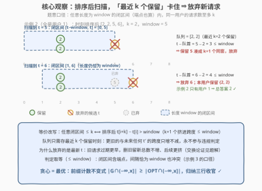
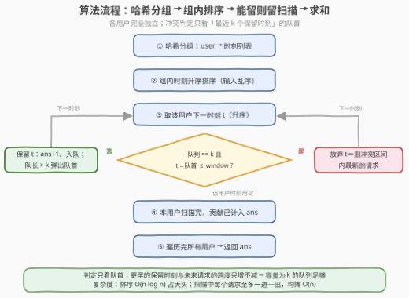

# 不违反限制的最大请求数

- **题目名称**：不违反限制的最大请求数
- **链接**：[3851. 不违反限制的最大请求数](https://leetcode.cn/problems/maximum-requests-without-violating-the-limit/)
- **难度**：中等
- **标签**：贪心、数组、哈希表、排序、滑动窗口

## 1. 题目概述

> ⚠️ 本题为 LeetCode 付费题，题意描述根据官方示例用例与 hints 重建，可能与官方题面有出入。

**题意**：给定数组 `requests` 和整数 `k`、`window`，其中 `requests[i] = [user_id, time]` 表示用户 `user_id` 在时刻 `time` 发起了一次请求。请求的给出顺序**不一定按时间升序**，同一用户也可能在同一时刻发起多次请求（见示例 2）。

限额规则：对**每个用户**，任何**长度为 `window` 的闭区间**（即形如 $[a, a+\text{window}]$、两端都算在内的区间）内的请求数不得超过 $k$。

现在可以移除若干请求，使剩下的请求全部满足限额规则。返回能保留的**最大请求数**。

函数签名（来自官方接口 `metaData`，实测可得）：`int maxRequests(vector<vector<int>>& requests, int k, int window)`。

**重建依据**（官方 hints 原文，共 3 条）：

1. Use a sliding-window approach.
2. For each user, maintain a sorted list (array) of their request times.
3. For each user, slide a window over their times; if the count inside any **inclusive** interval of length `window` exceeds `k`, remove the **most recent** request(s) in that interval until the count <= `k`.

hint 2 的「sorted list」说明请求**乱序给入**、需组内排序；hint 3 的「inclusive interval」说明**闭区间含端点**——两个请求恰好相隔 `window` 也算同窗冲突；「remove the most recent」给出贪心方向：冲突时删区间内**最新**的请求。

**示例 1**：

```text
输入：requests = [[1,1],[2,1],[1,7],[2,8]], k = 1, window = 4
输出：4
解释：用户 1 的两次请求间隔 7−1 = 6 > 4，用户 2 间隔 8−1 = 7 > 4，
      任何长度 4 的闭区间都装不下同一用户的两个请求 → 全部保留。
```

**示例 2**：

```text
输入：requests = [[1,2],[1,5],[1,2],[1,6]], k = 2, window = 5
输出：2
解释：四个请求都来自用户 1，时刻排序后为 [2,2,5,6]。任取 3 个请求，
      最早与最晚的间隔至多 6−2 = 4 ≤ 5，必被某个长度 5 的闭区间一网打尽，
      超过 k = 2 → 至多保留 2 个（如 {2,2} 或 {5,6}）。
```

**示例 3**：

```text
输入：requests = [[1,1],[2,5],[1,2],[3,9]], k = 1, window = 1
输出：3
解释：用户 1 在时刻 1、2 各有一次请求，闭区间 [1,2] 长度恰为 1 且同时包含
      两者，超过 k = 1，必须删掉一个；用户 2、3 各只有一个请求 → 保留 3 个。
```

**约束条件**（付费题原文不可见，按题意与同类题惯例推定）：

- $1 \le requests.length \le 10^5$
- $1 \le requests[i][0] \le 10^5$，$1 \le requests[i][1] \le 10^9$（时刻上界不影响算法，只影响取值类型）
- $1 \le k \le requests.length$，$1 \le window \le 10^9$

> 💡 **审题关键**：① 限额按**用户**计——不同用户互不干扰，可分组独立求解再求和；② 请求**乱序**给入（示例 2、3 的时刻都不是升序），必须先组内排序；③ 冲突口径是「长度为 `window` 的**闭**区间」，间隔**恰好等于** `window` 也冲突（示例 3），判定条件是 $t - \text{队首} \le window$ 而非 $<$；④ 同一用户同一时刻可以有多个请求（示例 2 的两个 2），间隔 0 必然同窗。

---

## 2. 解题思路

### 2.1 暴力思路

先看清楚问题的结构：限额按用户统计，**用户之间没有任何共享约束**，所以总答案 = 各用户独立最优之和。单个用户的问题是：从它的 $m$ 个请求时刻中选一个最大子集，使任何长度 `window` 的闭区间至多含 $k$ 个——子集枚举 $O(2^m)$，$m$ 稍大即不可行。

这里还有一个更隐蔽的陷阱——**按给定顺序模拟「先到先得」的在线限流器是错的**。拿示例 2 按原顺序模拟「到达时查 $[t-\text{window}, t]$ 内已接受数是否 $< k$」：请求 $(1,2)$、$(1,5)$、$(1,2)$ 依次被接受，只有 $(1,6)$ 被拒，计数 3——但被接受的集合 $\{2,2,5\}$ 本身就违规（3 个挤在跨度 3 的闭区间里）！原因是在乱序输入下，到达时刻的「回看窗口」看不到**未来**才出现的更早时刻。这从反面印证了 hint 2：**必须先排序，再谈贪心**。

### 2.2 核心观察：分组独立 + 排序扫描 + 「能留则留」贪心



**观察一：各用户完全独立。** 哈希表按 `user_id` 分组，每组独立求解后求和。这是「可分解性」信号：先拆独立子问题，再对每个子问题上贪心。

**观察二：全局区间条件可以坍缩成局部跨度条件。** 把某用户保留的请求时刻排序为 $t_1 \le t_2 \le \cdots \le t_m$，则

$$\text{「任何长度 window 的闭区间至多含 k 个」} \iff t_{i+k} - t_i > \text{window 对所有 } i \text{ 成立}$$

证明：若 $t_{i+k} - t_i \le \text{window}$，闭区间 $[t_i,\ t_i + \text{window}]$ 一网打尽 $t_i, \dots, t_{i+k}$ 这 $k+1$ 个；反之，若某个闭区间 $[a, a+\text{window}]$ 含 $k+1$ 个，设其中最小的保留时刻为 $s$，则这 $k+1$ 个全落在 $[s, s+\text{window}]$ 内，即最小跨度 $\le \text{window}$。**「任意区间计数 $\le k$」这种全局条件，就此变成「排序后相隔 $k$ 的时刻对跨度 $> \text{window}$」这种相邻式局部条件**——这正是滑动窗口能处理的结构。

**观察三：能留则留，冲突时放弃最新的 $t$。** 按升序扫描，用一个双端队列只维护**最近保留的至多 $k$ 个时刻**。处理新时刻 $t$：

- 若队列恰有 $k$ 个且 $t - \text{队首} \le \text{window}$：保留 $t$ 就凑成「$k+1$ 个挤在跨度 $\le \text{window}$ 内」，违反观察二 → **放弃 $t$**。这正是 hint 3 的「remove the most recent」——$t$ 恰是冲突区间里**最新**的请求；
- 否则**保留 $t$**：计数 $+1$，$t$ 入队；队长超过 $k$ 就弹出队首。

弹出队首为何安全？队首是被挤到第 $k+1$ 旧的保留时刻，它与**任何未来** $t' \ge t$ 的跨度只会更大，永远不会再触发违规判定——判定时无需再看它。

**为什么放弃新 $t$、而不是删旧换新（交换论证）**？直觉：旧请求比 $t$「过期」更早、占位影响更短；删旧换新总数不变，却让整条队列后移、后续更容易被卡。严格地说，设 $G$ 为贪心保留集、$OPT$ 为任意可行解，归纳可证对**任意**时刻 $x$ 都有 $|G \cap (-\infty, x]| \ge |OPT \cap (-\infty, x]|$：唯一非平凡的情形是贪心放弃 $t$ 而 $OPT$ 保留 $t$——此时贪心在 $[t-\text{window}, t]$ 内恰有 $k$ 个保留（即整个队列），而 $OPT$ 要可行，在含端点的 $[t-\text{window}, t]$ 内至多 $k$ 个（含 $t$ 本身），于是

$$|G \cap (-\infty, t]| = |G \cap (-\infty, t-w]| + k \;\ge\; |OPT \cap (-\infty, t-w]| + k \;\ge\; |OPT \cap (-\infty, t]|$$

（第一步用归纳假设，第二步用 $OPT$ 的可行性；其余情形平凡）。取 $x = +\infty$ 得 $|G| \ge |OPT|$，贪心即最优。

### 2.3 算法流程图



| 步骤 | 操作 | 说明 |
|------|------|------|
| ① 分组 | `byUser[user].append(time)` | 限额按用户计，各组独立 |
| ② 排序 | 组内时刻升序排序 | 输入乱序，排序是正确性前提 |
| ③ 扫描 | 逐个取时刻 $t$，查队列 | 判定：`len(dq) == k and t - dq[0] <= window` |
| ④ 计数 | 不冲突则 `ans++`、入队；队长 `> k` 弹队首 | 冲突则放弃 $t$，队列不动 |
| ⑤ 汇总 | 所有用户贡献累加，返回 `ans` | — |

### 2.4 示例演算

**示例 2**（用户 1，时刻排序后 $[2,2,5,6]$，$k=2$，$\text{window}=5$）：

| $t$ | 队列（最近 $k=2$ 个保留） | $t-\text{队首}$ | 判定 | 动作 |
|---|------|------|------|------|
| 2 | $[\,]$（$0 < k$） | — | 队列不满，无冲突 | 保留，队列 $[2]$ |
| 2 | $[2]$（$1 < k$） | — | 队列不满 | 保留，队列 $[2,2]$ |
| 5 | $[2,2]$ | $5-2=3 \le 5$ | 保留会凑成 3 个同窗 | **放弃** |
| 6 | $[2,2]$ | $6-2=4 \le 5$ | 同上 | **放弃** |

用户 1 保留 $\{2,2\}$ 共 2 个；示例 2 只有用户 1，总答案 **2** ✓。

**示例 1**：用户 1 的 $[1,7]$：处理 7 时队首为 1，$7-1=6 > 4$ → 保留；用户 2 的 $[1,8]$ 同理 → 答案 **4** ✓。

**示例 3**：用户 1 的 $[1,2]$：$2-1=1 \le 1$（**取等也冲突**）→ 放弃 2；用户 2、3 各 1 个 → 答案 **3** ✓。

---

## 3. 参考代码

### C++

```cpp
class Solution {
public:
    int maxRequests(vector<vector<int>>& requests, int k, int window) {
        unordered_map<int, vector<int>> byUser;          // ① 分组：限额按用户计
        for (auto& r : requests) byUser[r[0]].push_back(r[1]);

        int ans = 0;
        for (auto& [u, ts] : byUser) {
            sort(ts.begin(), ts.end());                  // ② 输入乱序，必须排序
            deque<int> dq;                               //    最近 k 个保留时刻
            for (int t : ts) {
                if ((int)dq.size() == k && t - dq.front() <= window)
                    continue;                            // ③ 撞限额：放弃最新的 t
                ans++;
                dq.push_back(t);                         // ④ 保留 t
                if ((int)dq.size() > k) dq.pop_front();  //    挤出第 k+1 旧的
            }
        }
        return ans;                                      // ⑤ 各用户贡献求和
    }
};
```

### Python

```python
from collections import defaultdict, deque


class Solution:
    def maxRequests(self, requests, k, window):
        by_user = defaultdict(list)                 # ① 分组：限额按用户计
        for uid, t in requests:
            by_user[uid].append(t)

        ans = 0
        for ts in by_user.values():
            ts.sort()                               # ② 输入乱序，必须排序
            dq = deque()                            #    最近 k 个保留时刻
            for t in ts:
                if len(dq) == k and t - dq[0] <= window:
                    continue                        # ③ 撞限额：放弃最新的 t
                ans += 1
                dq.append(t)                        # ④ 保留 t
                if len(dq) > k:
                    dq.popleft()                    #    挤出第 k+1 旧的
        return ans                                  # ⑤ 各用户贡献求和
```

> 💡 **写法要点**：
> - **判定取等**：`t - dq.front() <= window`——闭区间含端点，间隔**恰好等于** `window` 也冲突（示例 3 的口径），写成 `<` 会在边界用例翻车；
> - **先排序再贪心**：乱序输入直接模拟限流器会接受违规集合（见 2.1 的示例 2 反例）；
> - **队列容量 $k$ 足够**：判定只与最近 $k$ 个保留时刻有关，更旧的与未来跨度只增不减；
> - $k \ge$ 该用户请求数时队列永远不满，全部保留，无需特判。

---

## 4. 复杂度分析

| 维度 | 复杂度 | 说明 |
|------|--------|------|
| 时间 | $O(n \log n)$ | 哈希分组 $O(n)$；所有用户组内排序合计 $O(n \log n)$；扫描阶段每个请求至多一次入队、一次出队，均摊 $O(n)$ |
| 空间 | $O(n)$ | 哈希表与各组时刻列表 $O(n)$；每组双端队列容量 $\le k$，合计 $\le n$ |
| 量级判断 | $n = 10^5$ ⇒ 排序约 $1.7 \times 10^6$ 次比较 | 排序占绝对大头；时刻差 $\le 10^9$ 用 `int` 即可，无溢出风险 |

---

## 5. 扩展：在线限流、口径变体与镜像问题

**① 在线限流器视角。** 工程上的固定窗口限流器按到达顺序「先到先得」：请求到达时查 $[t-\text{window}, t]$ 内已接受数是否 $< k$。有趣的是：若把本题的请求**排序后**喂给这个在线限流器，得到的正是离线最优解——最优性恰恰来自「按时间顺序处理、总是成全更早的请求」。而 2.1 的反例说明乱序喂入连**可行性**都保证不了，这是离线与在线的本质分界。

**② 删最少 vs 留最多。** 若题目改问「最少删几个请求」，答案即 $n - \text{maxRequests}(\cdots)$，一体两面。

**③ 边界口径变体。** 若把闭区间改成半开区间 $[a, a+\text{window})$（间隔恰为 `window` 不冲突），判定条件把 `<=` 改成 `<` 即可，一行之差；若「窗口」定义为「`window` 个连续整数秒」（即 $[a, a+\text{window}-1]$），同样是 `<`。

**④ $k=1$ 特例。** 同一用户任意两次请求间隔必须 $> \text{window}$——与 [219. 存在重复元素 II](https://leetcode.cn/problems/contains-duplicate-ii/) 的「同值下标距离 $\le k$」结构同源，只是把下标轴换成了时间轴。

---

## 6. 面试要点

**Q1：为什么可以按用户分组独立求解？**

> 限额规则按用户统计，用户之间不存在任何共享约束；总答案 = 各用户独立最优之和。这是「可分解性」的典型信号——先找独立子问题，再对每个子问题上贪心，避免把所有请求混在一个时间轴上处理。

**Q2：冲突时为什么放弃新请求 $t$，而不是删掉某个旧请求换 $t$ 进来？**

> 直觉：旧请求比 $t$ 过期更早、占位影响更短；删旧换新总数不变，却让队列整体后移、后续更容易被卡。严格地用前缀计数不变式：$|G \cap (-\infty, x]| \ge |OPT \cap (-\infty, x]|$ 对一切 $x$ 归纳成立，关键一步是「贪心被卡说明队列里恰 $k$ 个、$OPT$ 在同一闭窗内至多 $k$ 个（含 $t$）」，三行不等式链收官（见 2.2）。

**Q3：双端队列为什么只需保留最近 $k$ 个时刻？**

> 由观察二的等价条件，保留 $t$ 是否违规只与**最近 $k$ 个保留时刻**的最小值有关。比队首更旧的保留时刻与任何未来 $t' \ge t$ 的跨度只增不减，永远不会再参与违规判定，弹出是安全的——这正是「滑动窗口」只滑不回的体现。

**Q4：「任意闭区间 $\le k$」怎么等价成「$t_{i+k} - t_i > \text{window}$」？**

> 正向：$k+1$ 个请求若挤在跨度 $\le \text{window}$ 内，取最小时刻 $s$，闭区间 $[s, s+\text{window}]$ 全收。反向：违规闭区间 $[a, a+\text{window}]$ 内的 $k+1$ 个请求，其最小时刻 $s$ 满足它们全部落在 $[s, s+\text{window}]$ 内。全局任意区间条件坍缩为排序后相隔 $k$ 的局部条件，这是滑动窗口/双指针能上线的前提。

**Q5：有哪些 corner case？**

> ① 乱序输入必须先排序（示例 2、3 都不是升序）；② 同一时刻多次请求：间隔 0，$k$ 不够必冲突；③ 间隔恰好等于 `window`：闭区间含端点，仍冲突（判定用 `<=`）；④ $k \ge$ 该用户请求数：全部保留；⑤ 每个用户一个请求：答案即 $n$。

---

## 7. 同类练习题

- [1604. 警告一小时内使用相同员工卡大于等于三次的人](https://leetcode.cn/problems/alert-using-same-key-card-three-or-more-times-in-a-one-hour-period/)（[题解](../1601-1700/1604_警告一小时内使用相同员工卡大于等于三次的人.md)）：按人分组 + 排序 + 固定长度窗口计数，本题的「判定」近亲
- [219. 存在重复元素 II](https://leetcode.cn/problems/contains-duplicate-ii/)（[题解](../0201-0300/219_存在重复元素II.md)）：$k=1$ 的「窗口内至多一个同值元素」，把本题时间轴换成下标轴
- [435. 无重叠区间](https://leetcode.cn/problems/non-overlapping-intervals/)（[题解](../0401-0500/435_无重叠区间.md)）：同款「排序后能留则留」的交换论证贪心
- [253. 会议室 II](https://leetcode.cn/problems/meeting-rooms-ii/)（[题解](../0201-0300/253_会议室II.md)）：时间轴排序 + 滑动统计的姊妹套路
