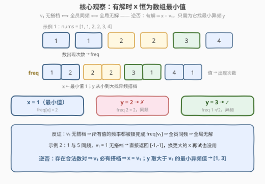
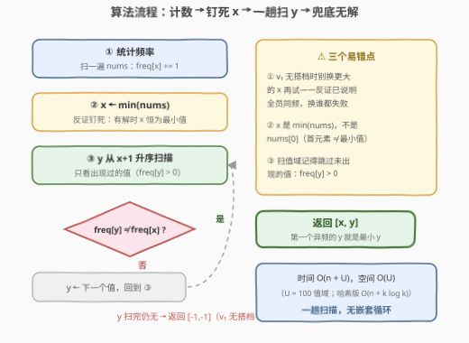

# 不同频率的最小数对

- **题目名称**：不同频率的最小数对
- **链接**：[3852. 不同频率的最小数对](https://leetcode.cn/problems/smallest-pair-with-different-frequencies/)
- **难度**：简单
- **标签**：数组、哈希表、计数

## 1. 题目概述

**题意**：给定整数数组 `nums`，从中找出两个**互不相同**的值 $x$ 和 $y$，满足 $x < y$ 且二者在 `nums` 中的**频率不同**。在所有合法数对中，先取 $x$ 尽可能小的；$x$ 相同时再取 $y$ 尽可能小的。返回 `[x, y]`；不存在合法数对时返回 `[-1, -1]`。

**示例 1**：

```text
输入：nums = [1,1,2,2,3,4]
输出：[1,3]
解释：最小的值是 1，频率为 2。比 1 大且频率与 1 不同的最小值是 3（频率 1）。
      注意 2 虽然比 3 小，但频率也是 2，与 1 同频，不合法。
```

**示例 2**：

```text
输入：nums = [1,5]
输出：[-1,-1]
解释：1 和 5 都只出现 1 次，频率相同，不存在合法数对。
```

**示例 3**：

```text
输入：nums = [7]
输出：[-1,-1]
解释：数组中只有一个值，凑不出数对。
```

**约束条件**：

- $1 \le n \le 100$
- $1 \le nums[i] \le 100$

> 💡 **审题关键**：① 数对取的是**不同的值**而非不同的下标——`[1,1]` 里值 `1` 只算一个候选；② 比较的是**频率**而非值的大小关系，$x<y$ 只约束值序；③ 「$x$ 尽可能小」优先级**高于**「$y$ 尽可能小」——是字典序最小数对，不是随便一个合法数对。

---

## 2. 解题思路

### 2.1 暴力思路：排序去重 + 双重循环枚举数对

先用哈希表（或值域数组）统计频率 `freq`；再把**不同值**升序排列得到 $v_1 < v_2 < \dots < v_k$；双重循环枚举 $i < j$，外层 $x$ 从小到大、内层 $y$ 从小到大，**第一个**满足 $\text{freq}(v_i) \ne \text{freq}(v_j)$ 的 $(v_i, v_j)$ 就是字典序最小的合法数对，直接返回。

复杂度 $O(n + k^2)$。本题 $k \le 100$（值域 $1 \sim 100$），最多约 $5000$ 对，暴力已然通过。但枚举显然做了重复功：同一个 $x$ 与一串同频的 $y$ 比了一遍又一遍，而「换更大的 $x$ 能否得救」这个问题，其实从一开始就有确定答案——见下。

### 2.2 核心观察：有解时 $x$ 恒为数组最小值



**反证**：设 $v_1$ 为最小值。假设 $v_1$ 找不到任何搭档——即**所有** $v > v_1$ 都满足 $\text{freq}(v) = \text{freq}(v_1)$。那么任取一个数对 $(a, b)$，$a \ge v_1$：无论 $a$ 是不是 $v_1$ 本身，$a$ 与 $b$ 的频率都被「钳」在 $\text{freq}(v_1)$ 上，必然同频、必然不合法。也就是说：

> **$v_1$ 无搭档 $\iff$ 全员同频 $\iff$ 整个数组无解。**

逆否即得：只要存在任意一个合法数对，$v_1$ 就必有搭档；而 $x$ 要尽量小，所以 **$x = v_1$ 是唯一候选**，根本轮不到更大的值。剩下的任务只有一件：从 $v_1$ 出发，找**大于它**且**异频**的最小值作 $y$。

用示例 1 演算：$\text{freq} = \{1{:}2,\ 2{:}2,\ 3{:}1,\ 4{:}1\}$，$x = 1$（频率 2）；$y$ 依次尝试 $2$（频率 2，同频 ✗）$\to 3$（频率 1，异频 ✓）→ 答案 `[1, 3]`。示例 2 中 $1$ 与 $5$ 同频，$v_1 = 1$ 无搭档 → 由上述等价性直接判无解，返回 `[-1,-1]`。

> 💡 这是「**字典序最小 + 判定只依赖局部信息**」类题的通用思路：最优解的某个分量若能被**结构性论证**钉死（本题钉死 $x = v_1$），搜索空间就从二维枚举坍缩成一维扫描。

### 2.3 算法流程图



| 步骤 | 操作 | 说明 |
|------|------|------|
| ① 计数 | 扫 `nums` 统计 `freq` | 值域 $1 \sim 100$，可用定长数组 |
| ② 定 x | $x \leftarrow \min(nums)$ | 2.2 已证：有解时 $x$ 恒为最小值 |
| ③ 扫 y | $y$ 从 $x+1$ 到 $100$ 升序，跳过未出现的值 | 查 $\text{freq}[y] > 0$ 且 $\text{freq}[y] \ne \text{freq}[x]$ |
| ④ 命中 | 第一个满足的 $y$ → 返回 `[x, y]` | $y$ 升序扫描天然保证「$y$ 尽量小」 |
| ⑤ 兜底 | 扫完仍无 → 返回 `[-1,-1]` | 等价于「$v_1$ 无搭档 ⇒ 全员同频无解」 |

> ⚠️ **不要把「$x$ 无搭档就换更大的 $x$ 再试」写进代码**——由 2.2 的等价性，$v_1$ 无搭档时换谁都没用，直接返回 `[-1,-1]`。若写成多重循环里「continue 换下一个 $x$」，逻辑上仍正确（后面的 $x$ 也全会失败），但暴露了没想透反证，面试中容易被追问。

### 2.4 示例演算

示例 1 `nums = [1,1,2,2,3,4]`（$\text{freq} = \{1{:}2, 2{:}2, 3{:}1, 4{:}1\}$）：

| 候选 y | freq[y] | 与 freq[x]=2 比较 | 结果 |
|--------|---------|-------------------|------|
| 2      | 2       | 相同               | ✗ 继续 |
| 3      | 1       | 不同               | ✓ 返回 `[1, 3]` |

示例 2 `nums = [1,5]`：$x = 1$（频率 1），唯一候选 $y = 5$ 频率也是 1 → 无搭档 → 全员同频 → `[-1,-1]` ✓。示例 3 `nums = [7]`：不同值只有 $7$ 一个，扫不到任何 $y$ → `[-1,-1]` ✓。

---

## 3. 参考代码

值域 $1 \le nums[i] \le 100$，C++ 用长度 101 的定长数组计数；Python 直接用 `Counter` + 排序键。

### C++

```cpp
class Solution {
public:
    vector<int> minDistinctFreqPair(vector<int>& nums) {
        int freq[101] = {};                          // 值域 1~100：值 → 频率
        for (int x : nums) freq[x]++;

        int x = *min_element(nums.begin(), nums.end());
        for (int y = x + 1; y <= 100; ++y)           // y 升序扫值域
            if (freq[y] > 0 && freq[y] != freq[x])   // 出现过 且 异频
                return {x, y};
        return {-1, -1};                             // v1 无搭档 ⇒ 全员同频无解
    }
};
```

### Python

```python
class Solution:
    def minDistinctFreqPair(self, nums: list[int]) -> list[int]:
        freq = Counter(nums)
        vals = sorted(freq)              # 不同值升序，vals[0] 即最小值
        x = vals[0]
        for y in vals[1:]:
            if freq[y] != freq[x]:       # vals 已升序，第一个异频者即最小 y
                return [x, y]
        return [-1, -1]
```

> 💡 **写法要点**：① Python 版对 `freq` 的键排序后，`vals[0]` 就是 $x$，其余天然升序，连 `y > x` 的判断都省了；② C++ 版扫值域要带上 `freq[y] > 0`（值必须出现过），Python 版遍历的本来就是出现过的键；③ 数组非空（$n \ge 1$），`vals[0]` 必然存在，无需特判。

---

## 4. 复杂度分析

| 维度 | 复杂度 | 说明 |
|------|--------|------|
| **时间** | $O(n + U)$ | 一遍计数 $O(n)$ + 一趟扫值域 $O(U)$，$U = 100$；哈希版为 $O(n + k\log k)$（$k$ 为不同值个数） |
| **空间** | $O(U)$ | 频率表；哈希版 $O(k)$ |
| **量级 / 值域** | $n \le 100$，$1 \le nums[i] \le 100$ | 总操作数百次，微秒级；暴力 $O(k^2) \le 5000$ 对同样能过，但不如观察版干净 |

---

## 5. 扩展：如果数据规模放大？

把约束改成 $n \le 10^5$、$nums[i] \le 10^9$：计数仍是 $O(n)$；$x$ 依旧是最小值（反证与值域无关）；找 $y$ 时把不同值排序后线性扫描，总复杂度 $O(n + k \log k)$——观察版直接平移，暴力 $O(k^2)$ 最坏 $10^{10}$ 对则彻底不可行。这说明「钉死 $x$」的论证不只是常数优化，而是把复杂度从平方降到线性。

---

## 6. 面试要点

**Q1：为什么 $x$ 一定是数组的最小值？**

> 反证：若最小值 $v_1$ 找不到异频搭档，则所有值频率都等于 $\text{freq}(v_1)$，即全员同频，任何数对都不合法。逆否命题：只要有解，$v_1$ 必有搭档；而 $x$ 要尽量小，故 $x = v_1$。一句话——「$v_1$ 无搭档」与「全局无解」是同一件事。

**Q2：「$v_1$ 无搭档」为什么等价于「全员同频」，而不是「$v_1$ 孤立无援但别人可能异频」？**

> 「无搭档」的定义就是所有 $v > v_1$ 都与 $v_1$ 同频，再加上 $v_1$ 自己，**全部**不同值的频率被锁死成同一个数——别的值之间也不可能异频。这正是等价性的来源。

**Q3：暴力双重循环也能过，为什么还要这个观察？**

> 一是干净：一趟扫描、无嵌套；二是本质：观察版在 $n \le 10^5$、值域 $10^9$ 下依然是 $O(n + k\log k)$，暴力则退化到 $O(k^2)$。面试官把约束放大一万倍，就是想看你会不会结构性论证。

**Q4：字典序最小数对问题的一般处理套路是什么？**

> 优先级从高到低逐维确定：先论证最高优先级的分量（本题的 $x$）能被钉死，再按次优先级（本题的 $y$）升序扫描取第一个命中。切忌一上来就枚举所有数对再比较——先问「最优解的某个维度是否可以论证唯一」。

**Q5：边界情况有哪些？**

> ① 只有一个不同值（示例 3）：内层循环为空，直接 `[-1,-1]`；② 全员同频（示例 2）：$v_1$ 扫不到搭档，同样 `[-1,-1]`——两种情况在代码里自然合并，无需特判；③ 注意 `x = min(nums)` 与 `x = nums[0]` 不同，别把「最小值」写成「首元素」。

> 💡 **一句话总结**：计数定频率，反证钉死 $x = $ 最小值——「$v_1$ 无搭档 $\iff$ 全员同频无解」；$y$ 从 $x+1$ 升序找第一个异频值，一趟扫描 $O(n + U)$。

---

## 7. 同类练习题

- [1207. 独一无二的出现次数](https://leetcode.cn/problems/unique-number-of-occurrences/)（[题解](../1201-1300/1207_独一无二的出现次数.md)）：同样以「频率」为比较对象，判定全员频率互不相同
- [3843. 频率唯一的第一个元素](https://leetcode.cn/problems/first-element-with-unique-frequency/)（[题解](../3801-3900/3843_频率唯一的第一个元素.md)）：姊妹题——本题找「与最小值异频的最小搭档」，3843 找「频率无人共享的第一个元素」，都是 freq 表上的线性判定
- [1394. 找出数组中的幸运数](https://leetcode.cn/problems/find-lucky-integer-in-an-array/)（[题解](../1301-1400/1394_找出数组中的幸运数.md)）：freq 表 + 按值序扫描取最优，骨架同款
- [2206. 将数组划分成相等数对](https://leetcode.cn/problems/divide-array-into-equal-pairs/)（[题解](../2201-2300/2206_将数组划分成相等数对.md)）：计数 + 值域数组的直接应用，练值域数组计数手感
- [1636. 按照频率将数组升序排序](https://leetcode.cn/problems/sort-array-by-increasing-frequency/)（[题解](../1601-1700/1636_按照频率将数组升序排序.md)）：freq 表 + 排序的经典延伸，本题「升序扫不同值」是其退化版
