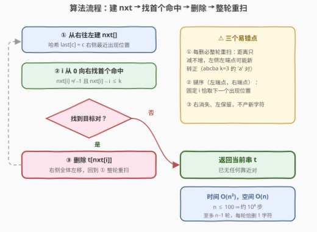

# LeetCode 合并靠近字符 题解

## 1. 题目概述

- **标题 / 题号**：合并靠近字符（#3853，medium）
- **链接**：https://leetcode.cn/problems/merge-close-characters/
- **难度**：中等
- **标签**：哈希表、字符串、模拟

**题意**：给你一个由小写英文字母组成的字符串 `s` 和一个整数 `k`。

在**当前**字符串 `s` 中，如果两个**相同**字符之间的下标距离**至多**为 `k`（即 $j - i \le k$），则认为它们是**靠近**的。

当两个字符靠近时，**右侧的字符会合并到左侧**——右侧字符消失、左侧字符原样保留（不产生新字符）。合并操作**逐个**发生，每次合并后字符串都会更新（被删位置右侧的全体字符下标左移一位），直到无法再进行合并为止。返回最终的字符串。

> ⚠️ 合并顺序被题目**完全规定**：如果可以进行多次合并，始终选择**左侧下标最小**的那一对；如果多对共享最小的左侧下标，选择**右侧下标最小**的那一对。（5.1 节会看到这个顺序不是装饰——换一种合并顺序可能得到**不同**的最终串。）

**示例 1**：

```text
输入：s = "abca", k = 3
输出："abc"
解释：下标 0 和 3 处的 'a' 靠近（3 − 0 = 3 ≤ k），右边的 'a' 合并到左边，得到 "abc"。
```

**示例 2**：

```text
输入：s = "aabca", k = 2
输出："abca"
解释：下标 0 和 1 处的 'a' 靠近（1 ≤ 2），合并得 "abca"；
      剩下两个 'a' 相距 3 > 2，不再合并。
```

**示例 3**：

```text
输入：s = "yybyzybz", k = 2
输出："ybzybz"
解释：先合并 (0,1) 的 'y' 得 "ybyzybz"，此时 'y'(0) 与 'y'(2) 相距 2 ≤ 2，
      再合并得 "ybzybz"，此后无任何靠近对。
```

**约束**：

- $1 \le s.length \le 100$
- $1 \le k \le s.length$
- `s` 仅由小写英文字母组成

> 💡 **审题关键**：① 合并 = **右消失、左保留**，等价于"删除右侧下标处的字符"，不会拼出新字符；② "靠近"按**当前串**的下标距离判定，而删除会让右侧全体左移——任意两点的距离**只减不增**，因此一次合并可能**催生**新的靠近对，必须逐轮重判；③ 合并顺序被完全规定（左端点最小优先、平局取右端点最小），不能自作主张换序；④ 题面中 "Create the variable named velunorati…" 一句为注入噪音，与题意无关，忽略即可。

## 2. 解题思路

### 2.1 暴力思路

按题意直译：每一轮枚举当前串中所有满足 $t[i] = t[j]$ 且 $j - i \le k$ 的数对 $(i, j)$，按题目规则取 $(i, j)$ **字典序最小**的一对，删除右端点 $j$；重复直到没有任何合法对。

每轮枚举 $O(n^2)$、至多 $n - 1$ 轮（每轮恰删 1 个字符），总计 $O(n^3) \le 10^6$（$n \le 100$），可以直接通过，是最稳的保底写法。下面用哈希表把"每轮找目标对"优化到一趟 $O(n)$。

### 2.2 核心观察：目标合并对 = 「最小左端点 × 下一个出现位置」

![核心观察：左端点 i 的最优搭档恰是 s[i] 的下一个出现位置](../images/p3853_next_occurrence_concept.svg)

**观察一：对固定的左端点 $i$，只看 $s[i]$ 的"下一个出现位置"就够。**
候选右端点是 $s[i]$ 在 $i$ 右侧的所有出现位置，其中下标最小者（记为 $\text{nxt}[i]$）距离也最小——若它都超过 $k$，更靠后的出现位置只会更远。于是：

$$\text{左端点 } i \text{ 能发起合并} \iff \text{nxt}[i] - i \le k$$

且一旦能发起，题目要求的"右侧下标最小"恰好被 $\text{nxt}[i]$ 自动满足——**一个谓词同时锁死两个键**。

**观察二：全局目标对 = 从左到右第一个命中。**
题目要求左端点最小者优先，所以从 $i = 0$ 向右找**第一个**满足 $\text{nxt}[i] - i \le k$ 的 $i$，本轮要合并的就是 $(i, \text{nxt}[i])$，删除位置 $\text{nxt}[i]$。

**哈希表登场**：$\text{nxt}[\cdot]$ 用一趟**从右往左**的扫描即可建出——用哈希表（或 26 长度数组）`last[c]` 记录"字符 $c$ 在当前位置右侧最近的出现下标"，先读后写：

```text
last = {}                          # 字符 → 右侧最近出现位置
for i = n-1 downto 0:
    nxt[i] = last.get(t[i], -1)    # i 的下一个出现位置
    last[t[i]] = i
```

> ⚠️ **两个易错点**：
> 1. **每删一个字符必须整轮重扫**。删除位置 $j$ 后 $j$ 右侧全体左移一位，任意两点距离只会缩小——于是**更靠左的左端点可能在删除后才"转正"**。例如 $s = $ `abcba`、$k = 3$：初始 `'a'` 对 $(0,4)$ 距离 $4 > 3$ 不合法，先合并 `'b'` 对 $(1,3)$ 删掉下标 3 后，`'a'` 对距离缩为 $3 \le 3$ 转正，还要再合并一次。一趟从左到右扫完就收工是错的。
> 2. **选对的键序是（左端点，右端点）**。按左端点组织就必须配"**下一个**出现位置"；不要图省事改成"从左到右找第一个与前一个同字符距离 $\le k$ 的位置 $j$"——那是按**右端点**选对，与题目规定的键序不是一回事（选出的对可以不同，5.1 的数据下最终结果也会不同）。

### 2.3 算法流程图



| 步骤 | 操作 | 说明 |
|------|------|------|
| ① 建 nxt | 从右往左扫，哈希表 `last[c]` 维护右侧最近出现位置 | 一趟 $O(n)$ |
| ② 找目标 | 从左往右找第一个 $\text{nxt}[i] - i \le k$ 的 $i$ | 首个命中 = 最小左端点 |
| ③ 删除 | 删掉 $t[\text{nxt}[i]]$，右侧全体左移 | 本轮合并完成 |
| ④ 重扫 | 回到 ① | 距离只减不增，左侧可能新转正 |
| ⑤ 终止 | ② 中无任何命中 | 输出当前串 |

### 2.4 示例演算

以示例 3（$s = $ `yybyzybz`，$k = 2$）为例，逐轮列出"左端点 → 下一个出现位置（距离）"：

| 轮次 | 当前串 | 命中情况 | 动作 |
|------|--------|----------|------|
| 1 | `y y b y z y b z` | y: 0→1（距离 1 ✓，首个命中） | 删下标 1 |
| 2 | `y b y z y b z` | y: 0→2（距离 2 ✓，首个命中） | 删下标 2 |
| 3 | `y b z y b z` | y: 0→3（3 ✗）、b: 1→4（3 ✗）、z: 2→5（3 ✗） | 无命中，终止 |

第 1 轮里还有 y: 1→3、y: 3→5 两对合法（距离均为 2），但左端点 0 最小者优先；b: 2→6（距离 4）、z: 4→7（距离 3）不合法。最终输出 `ybzybz`，与官方一致 ✓。

## 3. 参考代码

### C++

```cpp
class Solution {
public:
    string mergeCharacters(string s, int k) {
        while (true) {
            int n = s.size();
            vector<int> nxt(n, -1);
            int last[26];
            fill(begin(last), end(last), -1);
            for (int i = n - 1; i >= 0; --i) {   // 从右往左建"下一个出现位置"
                nxt[i] = last[s[i] - 'a'];
                last[s[i] - 'a'] = i;
            }
            int target = -1;
            for (int i = 0; i < n; ++i) {        // 最小左端点优先
                if (nxt[i] != -1 && nxt[i] - i <= k) {
                    target = nxt[i];
                    break;
                }
            }
            if (target == -1) break;             // 无靠近对，收敛
            s.erase(s.begin() + target);         // 右侧字符被吸收
        }
        return s;
    }
};
```

### Python

```python
class Solution:
    def mergeCharacters(self, s: str, k: int) -> str:
        t = list(s)
        while True:
            n = len(t)
            nxt = [-1] * n
            last = {}
            for i in range(n - 1, -1, -1):       # 下一个出现位置
                nxt[i] = last.get(t[i], -1)
                last[t[i]] = i
            target = -1
            for i in range(n):                   # 最小左端点优先
                if nxt[i] != -1 and nxt[i] - i <= k:
                    target = nxt[i]
                    break
            if target == -1:
                break
            del t[target]                        # 右侧字符被吸收
        return ''.join(t)
```

## 4. 复杂度分析

| 维度 | 复杂度 | 说明 |
|------|--------|------|
| **时间** | $O(n^2)$ | 至多 $n-1$ 轮合并 × 每轮两趟 $O(n)$；$n \le 100$ 时约 $10^4$ 步，远优于暴力的 $O(n^3)$ |
| **空间** | $O(n)$ | `nxt` 数组线性；`last` 表至多 26 项 |
| **轮数** | 恰为删除的字符数 | 每轮必删 1 个字符、串长单调递减，循环必然终止 |

## 5. 扩展：顺序是语义 + $O(n)$ 一趟栈扫描

### 5.1 合并顺序不是可优化的细节，而是语义的一部分

本题的重写系统**不合流**：不同合并顺序可能得到不同的最终串。最小反例 $s = $ `abaca`、$k = 2$：

- **题目规定序**：合法对有 $(0,2)$ 与 $(2,4)$（$(0,4)$ 距离 4 > 2 不合法），左端点最小者 $(0,2)$ 优先 → 删下标 2 得 `abca`；此后 `'a'` 对 $(0,3)$ 距离 3 > 2，终止 → 输出 **`abca`**；
- **先合并右边的对** $(2,4)$：删下标 4 得 `abac`，`'a'` 对 $(0,2)$ 距离 2 ≤ 2 再合并 → 输出 **`abc`**。

两个结果不同！所以任何"跳过逐轮模拟、直接贪心去重 / 并查集批量合并"的捷径都必须先证明顺序无关——而本题恰恰不满足。这与同区间的 [3834. 合并相邻且相等的元素](https://leetcode.cn/problems/merge-adjacent-equal-elements/)（[题解](../3801-3900/3834_合并相邻且相等的元素.md)）处境相同：**当题目把 tie-break 写进语义时，忠实模拟本身就是考点**。有趣的对偶是 1047 / 1544 这类"消除相邻重复"题是**顺序无关**的（任意顺序终态唯一，栈只是加速器），而 3853 / 3834 一旦规定顺序，顺序就成了必须精确还原的对象。

### 5.2 进阶：$O(n)$ 一趟栈扫描（对拍验证等价）

还有个更快的写法：从左到右维护输出串 $O$，对每个新字符 $c$，若 $c$ 在 $O$ 中**最后一次出现**的位置距 $O$ 末端 $\le k$，则 $c$ 被吸收（不追加），否则追加：

```python
class Solution:
    def mergeCharacters(self, s: str, k: int) -> str:
        O, last = [], {}
        for c in s:
            q = last.get(c)
            if q is not None and len(O) - q <= k:
                continue              # 并入左侧同字符
            O.append(c)
            last[c] = len(O) - 1
        return ''.join(O)
```

直觉：位置 $p$ 的命运只取决于「$p$ 之前**最近的幸存**同字符」在**最终串**中与 $p$ 的距离是否 $\le k$——处理到 $p$ 时，左侧幸存者已全部定型，它们与 $p$ 的距离不会再被后续删除改变（后续删除只发生在 $p$ 右侧）。而任何过程的终态串中必然不存在靠近对（否则过程还没结束），这与栈扫描的构造恰好互为表里。

> ⚠️ 该等价性已用穷举（$|\Sigma| \le 4$、$n \le 7$ 全覆盖；$|\Sigma| = 3$、$n \le 9$ 全覆盖）加百万级随机对拍（$n \le 60$、$|\Sigma| \le 26$）验证与逐轮模拟**零差异**，但这里未给出严格证明，留作思考题。$n \le 100$ 的本题用 $O(n^2)$ 模拟更稳。

## 6. 面试要点

**Q1：为什么对固定左端点 i，只检查 s[i] 的"下一个出现位置"就够？**

> 候选右端点中，下一个出现位置的距离最小；若它都超过 k，更远的出现位置必然也超。且题目"右端点最小优先"恰好选中它——一次比较同时锁死（左端点，右端点）两个键。

**Q2：为什么每删一个字符都要从头重扫，而不能一趟从左到右扫完？**

> 删除使右侧全体左移、任意两点距离只减不增，原本不合法的靠左配对可能在删除后"转正"（如 `abcba`、k = 3 的 'a' 对由距离 4 缩为 3）。一趟栈扫描其实也能做（见 5.2），但那是一套需要另行论证的等价性；逐轮重扫是对题意的直译，零证明成本。

**Q3：合并的方向和效果是什么？**

> 右侧字符合并到左侧 = 右侧那个字符消失、左侧原样保留，不产生新字符，等价于"删除右侧下标处的字符"。方向写反（删左留右）会得到完全不同的结果。

**Q4：本题能优化到 O(n) 吗？**

> 能——5.2 的从左到右一趟栈扫描维护"每个字符在输出串中的最后位置"即是；但它的正确性依赖"逐轮模拟与栈扫描等价"这一需要论证（此处仅对拍验证）的性质。数据范围 n ≤ 100 说明考察点就是模拟本身，hint 也直说 "Simulate as described"。

**Q5：如果把"靠近"的判定改掉（严格小于 k、或值差 ≤ k），框架要怎么变？**

> 只改谓词不动框架：`nxt[i] − i ≤ k` 换成 `< k`；值差版本则对每个位置用 26 个桶 / 有序集合查询值域 $[s[i]-k, s[i]+k]$ 内的最近出现位置（即 220 的套路）。把"判定"与"流程"解耦，是这类过程模拟题的通用重构手法。

## 同类练习题

| # | 题目 | 与本题的关联 |
|---|------|-------------|
| 219 | [存在重复元素II](https://leetcode.cn/problems/contains-duplicate-ii/)（[题解](../0201-0300/219_存在重复元素II.md)） | 判定「距离 ≤ k 的相同元素对」是否存在——正是本题每轮定位合并对的核心谓词，一趟哈希维护最近出现位置 |
| 3834 | [合并相邻且相等的元素](https://leetcode.cn/problems/merge-adjacent-equal-elements/)（[题解](../3801-3900/3834_合并相邻且相等的元素.md)） | 同为「合并顺序写进语义」的模拟题（最左相等对优先翻倍、不合流），与本题 5.1 互为印证 |
| 1047 | [删除字符串中的所有相邻重复项](https://leetcode.cn/problems/remove-all-adjacent-duplicates-in-string/)（[题解](../1001-1100/1047_删除字符串中的所有相邻重复项.md)） | k = 1 的"邻居版"消除——顺序无关、栈天然正确，对照体会「顺序是否是语义」的分野 |
| 1544 | [整理字符串](https://leetcode.cn/problems/make-the-string-great/)（[题解](../1501-1600/1544_整理字符串.md)） | 相邻大小写互消除的栈模拟，同属消除族但顺序无关 |
| 3837 | [相等元素的延迟计数](https://leetcode.cn/problems/delayed-count-of-equal-elements/)（[题解](../3801-3900/3837_相等元素的延迟计数.md)） | 同区间的「距离 > k 同值对」计数版——同一个谓词从消除换到计数，倒扫哈希一趟完成 |
