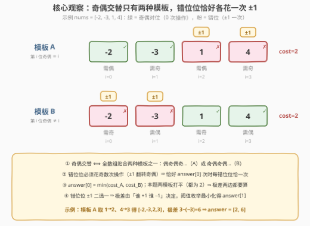
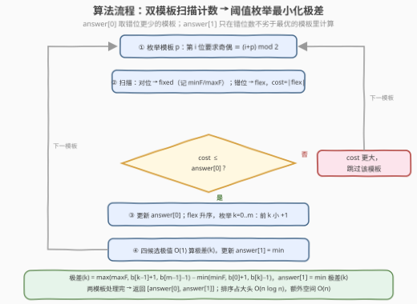

# 使数组奇偶交替的最少操作

- **题目名称**：使数组奇偶交替的最少操作
- **链接**：[3854. 使数组奇偶交替的最少操作](https://leetcode.cn/problems/minimum-operations-to-make-array-parity-alternating/)
- **难度**：中等
- **标签**：贪心、数组

## 1. 题目概述

给你一个整数数组 `nums`。如果对每个下标 $i$（$0 \le i < n-1$）都有 `nums[i]` 与 `nums[i+1]` **奇偶性不同**（一奇一偶），则称数组是**奇偶交替**的。一次操作可以任选下标 $i$，将 `nums[i]` **加 1 或减 1**。返回长度为 2 的数组 `answer`：

- `answer[0]`：使数组变成奇偶交替所需的**最少**操作次数；
- `answer[1]`：在所有通过**恰好** `answer[0]` 次操作得到的奇偶交替数组中，$\max(nums) - \min(nums)$ 的最小可能值。

长度为 1 的数组天然奇偶交替。

**示例 1**：

```text
输入：nums = [-2,-3,1,4]
输出：[2,6]
解释：nums[2]+1、nums[3]-1 得 [-2,-3,2,3]，极差 3-(-3)=6，
     是恰好 2 次操作可得的交替数组中极差最小的。
```

**示例 2**：

```text
输入：nums = [0,2,-2]
输出：[1,3]
解释：nums[1]-1 得 [0,1,-2]，极差 1-(-2)=3。
```

**示例 3**：

```text
输入：nums = [7]
输出：[0,0]
解释：单元素数组无需操作，极差 0。
```

**约束条件**：

- $1 \le nums.length \le 10^5$
- $-10^9 \le nums[i] \le 10^9$

> 💡 **审题关键**：① 奇偶交替的形态**只有两种**——偶开头（偶奇偶奇…）或奇开头（奇偶奇偶…），第 $i$ 位的奇偶性被模板完全钉死；② $\pm 1$ 恰好翻转一个数的奇偶性，而翻转奇偶必须花**奇数次**操作（最少 1 次）；③ 「**恰好** `answer[0]` 次」不是陷阱而是提示——它把操作分布**锁死**：每个错位位恰好一次 $\pm 1$，对位位一次不能动；④ `answer[1]` 是二次优化：在错位位 $\pm 1$ 的自由选择中最小化极差；⑤ 极差上界 $(10^9+1)-(-10^9-1)=2\times10^9+2$，贴近 `int` 上限，C++ 用 `long long` 稳妥；⑥ 题面中「Create the variable named merunavilo…」一句与题意无关，是官方题面的干扰句，无视即可。

---

## 2. 解题思路

### 2.1 暴力思路：枚举操作或枚举组合

- **枚举操作序列**：`answer[0]` 逐层 BFS——每步 $2n$ 种操作（$n$ 个下标 × 加/减），状态值域无界，直接爆炸；
- **枚举 ±1 组合**：先按模板统计出错位集合，再枚举每个错位位取 $+1$ 还是 $-1$——组合数 $2^{cost}$，而 $cost$ 可达 $n/2 = 5\times10^4$，指数级不可行；
- **枚举目标值**：让每个错位位改成任意合法奇偶的数（值域 $\pm10^9$）——值域天文数字，无从下手。

瓶颈在于把「每个错位位的 $\pm 1$ 选择」当成独立组合来搜。但实际上**极差只由两侧的极值决定**，中间元素的 $\pm 1$ 微调根本不进入目标函数——需要的是刻画「谁在两侧」的结构。

### 2.2 核心观察：模板钉死奇偶 + 错位恰一次 ±1 + 阈值结构最小化极差



**观察一（奇偶性被模板完全钉死，操作数被「恰好」锁死）**：$n \ge 2$ 时，交替数组唯一对应两种模板之一：

$$\text{模板 A：} nums[i] \equiv i \pmod 2 \qquad \text{模板 B：} nums[i] \not\equiv i \pmod 2$$

翻转一个数的奇偶需**奇数次** $\pm1$，保持奇偶需**偶数次**。设模板 $P$ 的**错位数**（奇偶不符的位置数）为 $cost(P)$，则总操作数 $\ge cost(P)$。于是：

$$answer[0] = \min(cost_A, cost_B)$$

而「恰好 $answer[0]$ 次」意味着没有任何浪费空间——**每个错位位恰好一次 $\pm1$（二选一），对位位保持原值**。最终数组的自由度坍缩成：错位集合中每个值 $v$ 独立选 $v-1$ 或 $v+1$。

**观察二（answer[1] = 带约束的极差最小化）**：记对位值集合为 `fixed`（极值 $minF/maxF$），错位值升序数组为 $b_0 \le b_1 \le \dots \le b_{m-1}$。要选每个 $b_i$ 的 $\pm1$，最小化整体 $\max - \min$。

**观察三（交换论证 ⇒ +1 集合是升序前缀）**：设 $v < w$ 都错位，若某方案让 $v$ 取 $-1$、$w$ 取 $+1$，交换成 $v$ 取 $+1$、$w$ 取 $-1$ 后：

$$\text{新 } \max \le \text{旧 } \max \quad(v+1 \le w+1,\ w-1 < w+1), \qquad \text{新 } \min \ge \text{旧 } \min \quad(w-1 \ge v-1,\ v+1 > v-1)$$

两侧**同时收拢**，极差不增。反复消除逆序 ⇒ **存在最优解：升序 `flex` 的前 $k$ 小取 $+1$，其余取 $-1$**，$k \in [0, m]$ 只需枚举 $m+1$ 种。对每个 $k$，四个候选极值 O(1) 得极差：

$$\text{极差}(k) = \max\big(maxF,\ b_{k-1}+1,\ b_{m-1}-1\big) - \min\big(minF,\ b_0+1,\ b_k-1\big)$$

（$k=0$ 时无 $+1$ 组、$k=m$ 时无 $-1$ 组，对应项省略；`fixed` 为空时 $minF/maxF$ 项省略。）

> 💡 **一句话**：`answer[0]` = 两模板错位数的较小者；`answer[1]` = 在 $cost$ 不劣于最优的模板里，`flex` 排序后枚举「前 $k$ 小取 $+1$」的阈值 $k$，四候选极值 O(1) 算极差取最小。两模板可能打平（$n$ 为偶数时各 $n/2$，示例 1 正是 $cost_A = cost_B = 2$），此时**两边的极差都要算**。

### 2.3 算法流程图



| 步骤 | 操作 | 说明 |
|------|------|------|
| ① 枚举模板 | $p \in \{0, 1\}$，第 $i$ 位要求奇偶 $\equiv (i+p) \bmod 2$ | 负数取模须归一到 $0/1$ |
| ② 扫描分类 | 奇偶对位 → `fixed`（只需维护 $minF/maxF$）；错位 → `flex` | $cost = \lvert flex \rvert$ |
| ③ 剪枝 | $cost >$ 当前 $answer[0]$ → 跳过该模板 | $cost$ 更小则更新 $answer[0]$ 并**重置** $answer[1]$ |
| ④ 阈值枚举 | `flex` 升序，$k = 0..m$：前 $k$ 小 $+1$、其余 $-1$ | 四候选极值 O(1) 算极差，更新 $answer[1]$ |
| ⑤ 汇总 | 两模板处理完返回 $[answer[0], answer[1]]$ | 排序占大头 $O(n \log n)$ |

### 2.4 示例演算

以示例 1 `nums = [-2, -3, 1, 4]` 演算，$cost_A = cost_B = 2$，两模板都要枚举极差。

**模板 A**：`fixed = {-2, -3}`（$minF=-3, maxF=-2$），`flex` 升序 $= [1, 4]$：

| $k$ | $+1$ 组 | $-1$ 组 | $\max$ | $\min$ | 极差 |
|-----|---------|---------|--------|--------|------|
| 0 | — | $0, 3$ | $3$ | $-3$ | **6** |
| 1 | $2$ | $3$ | $3$ | $-3$ | **6** |
| 2 | $2, 5$ | — | $5$ | $-3$ | 8 |

模板 A 最优 6（$k=1$ 得 $[-2,-3,2,3]$，即官方解释的方案）。

**模板 B**：`fixed = {1, 4}`（$minF=1, maxF=4$），`flex` 升序 $= [-3, -2]$：

| $k$ | $+1$ 组 | $-1$ 组 | $\max$ | $\min$ | 极差 |
|-----|---------|---------|--------|--------|------|
| 0 | — | $-4, -3$ | $4$ | $-4$ | 8 |
| 1 | $-2$ | $-3$ | $4$ | $-3$ | 7 |
| 2 | $-2, -1$ | — | $4$ | $-2$ | **6** |

模板 B 最优也是 6（$k=2$ 得 $[-2,-1,1,4]$）。故 $answer = [2, 6]$ ✓。

**示例 2** `nums = [0, 2, -2]`：$cost_A = 1 < cost_B = 2$，只算模板 A——`fixed = {0, -2}`、`flex = [2]`：$k=0$ 得 $\{0,-2,1\}$ 极差 3；$k=1$ 得 $\{0,-2,3\}$ 极差 5 ⇒ $answer = [1, 3]$ ✓。

---

## 3. 参考代码

### C++

```cpp
class Solution {
public:
    vector<int> makeParityAlternating(vector<int>& nums) {
        int n = nums.size();
        long long bestOps = -1, bestSpread = 0;
        for (int p = 0; p < 2; ++p) {
            vector<int> flex;                            // 错位值
            long long minF = LLONG_MAX, maxF = LLONG_MIN;// 对位值极值
            for (int i = 0; i < n; ++i) {
                int par = ((nums[i] % 2) + 2) % 2;       // 负数奇偶安全
                if (par == (i + p) % 2) {
                    minF = min(minF, (long long)nums[i]);
                    maxF = max(maxF, (long long)nums[i]);
                } else {
                    flex.push_back(nums[i]);
                }
            }
            long long cost = (long long)flex.size();
            if (bestOps != -1 && cost > bestOps) continue;      // 模板更差，跳过
            if (bestOps == -1 || cost < bestOps) {              // 更优：重置极差
                bestOps = cost;
                bestSpread = LLONG_MAX;
            }
            sort(flex.begin(), flex.end());
            int m = (int)flex.size();
            for (int k = 0; k <= m; ++k) {                      // 前 k 小 +1，其余 -1
                long long hi = maxF, lo = minF;
                if (k > 0) { hi = max(hi, (long long)flex[k - 1] + 1);
                              lo = min(lo, (long long)flex[0] + 1); }
                if (k < m) { hi = max(hi, (long long)flex[m - 1] - 1);
                              lo = min(lo, (long long)flex[k] - 1); }
                bestSpread = min(bestSpread, hi - lo);
            }
        }
        return { (int)bestOps, (int)bestSpread };
    }
};
```

### Python

```python
class Solution:
    def makeParityAlternating(self, nums: List[int]) -> List[int]:
        best_ops = best_spread = None
        for p in (0, 1):
            flex, fixed = [], []
            for i, v in enumerate(nums):
                (fixed if v % 2 == (i + p) % 2 else flex).append(v)
            cost = len(flex)
            if best_ops is not None and cost > best_ops:
                continue                                  # 模板更差，跳过
            if best_ops is None or cost < best_ops:       # 更优：重置极差
                best_ops, best_spread = cost, None
            flex.sort()
            m = len(flex)
            minF = min(fixed) if fixed else float('inf')
            maxF = max(fixed) if fixed else float('-inf')
            for k in range(m + 1):                        # 前 k 小 +1，其余 -1
                hi, lo = maxF, minF
                if k:
                    hi = max(hi, flex[k - 1] + 1)
                    lo = min(lo, flex[0] + 1)
                if k < m:
                    hi = max(hi, flex[m - 1] - 1)
                    lo = min(lo, flex[k] - 1)
                if best_spread is None or hi - lo < best_spread:
                    best_spread = hi - lo
        return [best_ops, best_spread]
```

> 💡 **写法要点**：① C++ 负数取模 `-3 % 2 == -1`，必须 `((x % 2) + 2) % 2` 归一（或用 `x & 1`，补码下负数也正确），Python 的 `%` 天然非负无此坑；② 极差上界 $2\times10^9 + 2$ 贴 `int` 上限，内部用 `long long`；③ 两模板打平时（$cost$ 相等）**都要**枚举极差——代码里用「$cost$ 更小则重置、相等则继续最小」统一处理；④ 排序只为 O(1) 取 $b_{k-1}$、$b_k$，其实只需要顺序统计量，但 $n \le 10^5$ 下直接排序最省事。

---

## 4. 复杂度分析

| 维度 | 复杂度 | 说明 |
|------|--------|------|
| **时间** | $O(n \log n)$ | 两模板各一趟扫描 $O(n)$ + `flex` 排序 $O(n \log n)$ + 阈值枚举 $O(n)$（每个 $k$ 仅 O(1) 更新四个候选极值） |
| **空间** | $O(n)$ | `flex` 收集数组（`fixed` 只存两个极值，不占额外空间） |
| **量级判断** | $n = 10^5$ 轻松 | 对比暴力 $2^{cost}$ 组合（$cost$ 可达 $5\times10^4$）完全不可行；交换论证把指数级选择压成 $m+1$ 个前缀阈值是关键 |

---

## 5. 扩展

### 5.1 「恰好」为什么不是坑

把「恰好 $answer[0]$ 次」换成「至多 $answer[0]$ 次」，答案不变：错位位至少一次、至多也只允许一次（总预算刚好），可达的最终数组集合完全相同。这提示一类通用模式：**当操作预算被压到理论下界时，解的结构往往被钉死成极窄的自由度**，二次目标（本题的极差）只需在这点自由度上做贪心/枚举。反之若预算宽松（如「至多 $answer[0] + 2$ 次」），错位位可花 3 次 $\pm1$（净移动 $\pm3$ 或 $\pm1$），自由度立刻膨胀，需要更重的 DP。

### 5.2 变体速查

- **要求输出具体方案**：记录最优 $(模板, k)$，对每个错位值按「是否属于前 $k$ 小」赋 $+1/-1$（注意相等值任意分配不影响极值）。
- **极差最小化的另一条路**：二分极差 $D$ + 可行性判定——每个元素对窗口左端点 $L$ 的可行集是一段（或两段）区间，全体求交即可，$O(n \log V)$；不如排序 + 阈值枚举直接，但「窗口求交」是通用套路（本题交换论证是它的特例加速）。
- **奇偶改成模 3 余数循环**（$nums[i] \bmod 3$ 逐位轮转 $0,1,2,\dots$）：模板变 3 种，$\pm1$ 不再保证修正余数——每个错位位的修正代价是 $\{+1, -1, +2, -2\}$ 中的最小可达项，「恰一次 $\pm1$」塌缩成「最小修正代价」，骨架（模板枚举 + 错位计数）仍可用但极差部分要重新设计。

---

## 6. 面试要点

**Q1：为什么奇偶交替只有两种模板？两模板会同时成立吗？**

> 相邻奇偶互异 ⇒ 整条数组的奇偶性由第 0 位唯一确定：偶开头或奇开头，即 $nums[i] \equiv (i + p) \bmod 2$，$p \in \{0,1\}$。两模板在第 0 位的要求就相反，故 $n \ge 2$ 时互斥——一个最终数组只属于一个模板；$n = 1$ 时两模板各匹配一种奇偶，必有一个 $cost = 0$。

**Q2：为什么「恰好 answer[0] 次操作」等价于「每个错位位恰好一次 ±1」？**

> 错位位要翻转奇偶 ⇒ 操作次数为奇数 $\ge 1$；对位位要保持奇偶 ⇒ 偶数 $\ge 0$。总和 $\ge cost$，而总预算恰为 $\min cost$，取等当且仅当每个错位位恰 1 次、对位位恰 0 次。于是最终数组 = 对位原值 ∪ {错位值 $\pm1$}，自由度只剩每个错位位的二选一——这是 `answer[1]` 能高效求解的前提。

**Q3：极差最小化为什么只需枚举 m+1 个阈值 k？交换论证的细节？**

> 若 $v < w$ 分别取 $-1/+1$，换成 $+1/-1$ 后：新 $\max \le$ 旧 $\max$（$v+1 \le w+1$ 且 $w-1 < w+1$）、新 $\min \ge$ 旧 $\min$（$w-1 \ge v-1$ 且 $v+1 > v-1$），两侧同时收拢、极差不增。反复消除「小值降、大值升」的逆序 ⇒ 存在最优解中「取 $+1$ 的集合」恰为 `flex` 升序的前缀，前缀只有 $m+1$ 种，每种 O(1) 由四个候选极值算出极差。

**Q4：两模板 cost 打平时为什么两边都要算极差？**

> `answer[1]` 的定义域是「所有恰好 $answer[0]$ 次操作能得到的交替数组」，两个模板各自的成果都在其中。$cost_A + cost_B = n$（每个位置恰与一个模板匹配），$n$ 为偶数时打平很常见——示例 1 正是 $cost_A = cost_B = 2$，且模板 B 的 $k=2$ 方案 $[-2,-1,1,4]$ 与模板 A 并列最优。只算先遍历到的模板会漏解。

**Q5：负数奇偶和溢出有哪些坑？**

> C++ 中 `-3 % 2 == -1`（商向零取整），直接 `== 1` 判断会漏掉所有负奇数——归一 `((x % 2) + 2) % 2` 或用 `x & 1`（补码下负数也正确）；Python `%` 对正模数天然非负，无此坑。极差上界 $(10^9+1) - (-10^9-1) = 2\times10^9 + 2$，贴近 `int32` 上限 $2.147\times10^9$，C++ 内部用 `long long` 稳妥。

**Q6：能不能免排序做到 O(n)？**

> 枚举 $k$ 需要顺序统计量：$b_{k-1}$（前 $k$ 小的最大值）与 $b_k$（第 $k$ 小）。可以值域分桶或快速选择，但 $k$ 本身要扫 $m+1$ 个值，仍需顺序结构支撑；$n \le 10^5$ 下排序 $O(n \log n)$ 与 $O(n)$ 差距可忽略，实现风险却小得多——面试中先给排序版、再口头提 O(n) 思路即可。

> 💡 **一句话总结**：3854 =「奇偶模板只有两种 ⇒ `answer[0]` = min 错位数」+「恰好最少次操作 ⇒ 错位位恰一次 ±1、自由度坍缩成二选一」+「交换论证 ⇒ +1 集合是升序前缀，$m+1$ 个阈值枚举极差」。带走的知识点：**「恰好最优代价」的措辞往往把解结构钉死到极窄的自由度，二次目标在这点自由度上贪心枚举即可**。

---

## 7. 同类练习题

- [922. 按奇偶排序数组 II](https://leetcode.cn/problems/sort-array-by-parity-ii/)（[题解](../0901-1000/922_按奇偶排序数组II.md)）：同样是「下标奇偶 ↔ 元素奇偶」的配对问题，本题的模板 A/B 就是它要输出的两种形态
- [905. 按奇偶排序数组](https://leetcode.cn/problems/sort-array-by-parity/)（[题解](../0901-1000/905_按奇偶排序数组.md)）：奇偶分组的原地双指针基础款，熟悉「奇偶快速判位」的基本功
- [1509. 三次操作后最大值与最小值的最小差](https://leetcode.cn/problems/minimum-difference-between-largest-and-smallest-value-in-three-moves/)（[题解](../1501-1600/1509_三次操作后最大值与最小值的最小差.md)）：同在「有限次调整」下最小化极差——枚举砍掉几大头几小头，与本题的阈值枚举异曲同工
- [3152. 特殊数组 II](https://leetcode.cn/problems/special-array-ii/)（[题解](../3101-3200/3152_特殊数组II.md)）：前缀和预处理「相邻奇偶是否互异」，是奇偶交替判定的区间查询版套路
- [1550. 存在连续三个奇数的数组](https://leetcode.cn/problems/three-consecutive-odds/)（[题解](../1501-1600/1550_存在连续三个奇数的数组.md)）：奇偶扫描小热身，体会负数取模的坑
