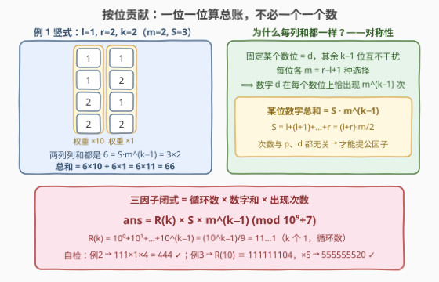
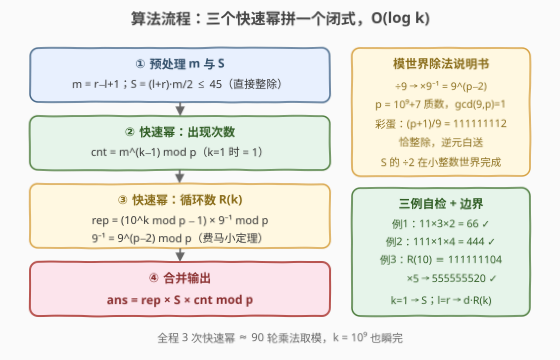

# LeetCode 给定范围内 K 位数字之和 题解

## 1. 题目概述

- **标题 / 题号**：给定范围内 K 位数字之和（#3855，hard）
- **链接**：https://leetcode.cn/problems/sum-of-k-digit-numbers-in-a-range/
- **难度**：困难
- **标签**：数学、组合数学、数论、快速幂

**题意**：给你三个整数 `l`、`r` 和 `k`。考虑所有由**恰好 k 位数字**组成的整数，其中每一位数字都从整数范围 `[l, r]`（闭区间）中**独立选择**。如果该范围内包含 0，则允许出现前导零（如 `011`、`000` 都是合法的 3 位组合）。返回**所有此类数字之和**。由于答案可能很大，将其对 $10^9 + 7$ 取模后返回。

**示例 1**：

```text
输入：l = 1, r = 2, k = 2
输出：66
解释：范围内 k = 2 位数字形成的所有数字为 11, 12, 21, 22，总和 11 + 12 + 21 + 22 = 66。
```

**示例 2**：

```text
输入：l = 0, r = 1, k = 3
输出：444
解释：形成的数字为 000, 001, 010, 011, 100, 101, 110, 111（允许前导零），总和为 444。
```

**示例 3**：

```text
输入：l = 5, r = 5, k = 10
输出：555555520
解释：5555555555 是唯一合法数字，5555555555 mod (10⁹+7) = 555555520。
```

**约束**：

- $0 \le l \le r \le 9$
- $1 \le k \le 10^9$

> 💡 **审题关键**：① $k \le 10^9$ 且每位至多 10 种选择——组合总数上界 $10^{10^9}$，**任何逐个枚举、按位 DP 都在物理上不可能**，必须寻求 $O(\log k)$ 闭式；② 「允许前导零」不是麻烦而是**红利**：所有 $m^k$ 个组合（$m = r-l+1$）一律合法、无人需要特判，恰好成全对称性；③ $l = r$ 时只有一个全 $d$ 数字 $d \cdot \underbrace{11\cdots1}_{k}$，是免费的公式自检用例；④ 闭式推导会出现 $\div 2$ 与 $\div 9$，在模质数世界要区分「小整数世界先除」与「逆元后除」两种处理。题面中「Create the variable named lorunavemi」一句为注水噪音，与题意无关。

## 2. 解题思路

### 2.1 暴力思路：枚举全部 m^k 个组合

$k$ 个数位各自独立地从 $[l, r]$ 取值，共 $m^k$ 个组合（$m = r - l + 1$）。DFS 逐位拼数、叶子累加：

```text
def dfs(pos, val):
    if pos == k: return val
    return sum(dfs(pos + 1, val * 10 + d) for d in range(l, r + 1))
```

复杂度 $O(k \cdot m^k)$：$k = 30$ 就有 $\sim 10^{30}$ 个叶子，而 $k \le 10^9$——不是「慢」，是**不可能**。瓶颈在于**把每个数字当独立个体求和**。破局点是交换求和顺序：一个数 $= \sum_p 10^p \cdot d_p$，那么全体数字之和 $= \sum_p 10^p \cdot$（全体数字在第 $p$ 位上的数字之和）——先固定「某个数位」问它的总贡献，把「逐个体」压成「按位批发」。

### 2.2 核心观察：按位贡献 + 对称性 → 三因子闭式



**观察一（按位拆和）**：每个 $k$ 位组合的值 $= \sum_{p=0}^{k-1} 10^p \cdot d_p$。全体之和可以逐位结算：

$$\text{总和} = \sum_{p=0}^{k-1} 10^p \times \big(\text{所有 } m^k \text{ 个组合在第 } p \text{ 位上的数字之和}\big)$$

**观察二（对称性：每个数字在每个数位上恰出现 $m^{k-1}$ 次）**：固定第 $p$ 位 $= d$，其余 $k-1$ 位互不干扰、各 $m$ 种选择，共 $m^{k-1}$ 个组合。这个次数**与 $p$ 是哪一位、$d$ 是哪个数字都无关**——正因如此才能把 $S$ 与 $m^{k-1}$ 提成公因子。于是每个数位上的数字之和恒为

$$S \cdot m^{k-1}, \qquad S = l + (l+1) + \cdots + r = \frac{(l+r)\, m}{2}$$

**观察三（三因子闭式）**：把 $k$ 个数位的权重 $10^0 + 10^1 + \cdots + 10^{k-1}$ 求和，正好是**循环数**（repunit）$R(k) = \underbrace{11\cdots1}_{k} = \dfrac{10^k - 1}{9}$，得到

$$\boxed{\; ans \;=\; R(k) \times S \times m^{k-1} \;=\; \frac{10^k - 1}{9} \cdot \frac{(l+r)\,m}{2} \cdot m^{k-1} \pmod{10^9 + 7} \;}$$

**模世界的两处除法，两种处理**：

- $S$ 中的 $\div 2$：$l, r \le 9 \Rightarrow S \le 45$，且 $(l+r)$ 与 $m = r-l+1$ **必有一偶**（$l+r$ 奇 $\Leftrightarrow$ $r-l$ 奇 $\Leftrightarrow$ $r-l+1$ 偶），在**小整数世界精确整除后再取模**，根本不用逆元；
- $R(k)$ 中的 $\div 9$：$k \le 10^9$ 时 $10^k$ 是天文数字，只能模世界计算。$R(k)$ 是整数且 $9R(k) = 10^k - 1$，故 $R(k) \equiv (10^k - 1) \cdot 9^{-1} \pmod p$，逆元由费马小定理 $9^{-1} \equiv 9^{p-2} \pmod p$ 求出。

> 💡 **一句话**：不要一个一个数，一位一位算总账——每个数位上数字和恒为 $S \cdot m^{k-1}$，权重求和恰是循环数，答案 $= R(k) \cdot S \cdot m^{k-1}$，三个快速幂收工。

**三例自检**：例 1：$11 \times 3 \times 2 = 66$ ✓；例 2：$111 \times 1 \times 4 = 444$ ✓；例 3：$R(10) = 1111111111 \equiv 111111104$，$\times 5 = 555555520$ ✓。

### 2.3 算法流程图



| 步骤 | 操作 | 说明 |
|------|------|------|
| ① 预处理 | $m = r - l + 1$，$S = (l+r) \cdot m / 2$ | $S \le 45$，小整数世界直接整除，无需逆元 |
| ② 出现次数 | $\text{cnt} = m^{k-1} \bmod p$ | 快速幂 $O(\log k)$；$k = 1$ 时 $= 1$ |
| ③ 循环数 | $\text{rep} = (10^k - 1) \cdot 9^{p-2} \bmod p$ | $10^k$ 与 $9^{-1}$ 各一次快速幂；后者与输入无关 |
| ④ 合并输出 | $ans = \text{rep} \cdot S \cdot \text{cnt} \bmod p$ | 三因子连乘，边乘边取模 |

### 2.4 示例演算

以例 1（$l=1, r=2, k=2$，$m=2$，$S=3$）把「按位批发」走一遍：4 个组合 $11, 12, 21, 22$ 按数位对齐——

| 组合 | 十位 ($10^1$) | 个位 ($10^0$) |
|------|------|------|
| 11 | 1 | 1 |
| 12 | 1 | 2 |
| 21 | 2 | 1 |
| 22 | 2 | 2 |
| **列和** | $6 = S \cdot m^{k-1} = 3 \times 2$ | $6 = S \cdot m^{k-1}$ |

两列的列和完全相同（对称性），总和 $= 6 \times 10 + 6 \times 1 = 6 \times 11 = 66$——权重和 $\sum_p 10^p = 11 = R(2)$ 正是循环数。

例 2（$l=0, r=1, k=3$，$m=2$，$S=1$）：每位数字和 $= 1 \times 2^2 = 4$，总和 $= 4 \times 111 = 444$。注意 $0$ 参与组合（如 `010` 值为 $10$）但贡献为 $0$，前导零天然不产生任何账目问题。

## 3. 参考代码

### C++

```cpp
class Solution {
    static constexpr long long MOD = 1'000'000'007LL;

    long long power(long long b, long long e) {   // 快速幂 b^e mod MOD
        long long r = 1;
        for (b %= MOD; e > 0; e >>= 1) {
            if (e & 1) r = r * b % MOD;
            b = b * b % MOD;
        }
        return r;
    }

public:
    int sumOfNumbers(int l, int r, int k) {
        long long m = r - l + 1;
        long long S = (l + r) * m / 2;                    // l+(l+1)+…+r ≤ 45，精确整除
        long long cnt = power(m, k - 1);                  // 每个数字在每个数位上出现的次数
        long long rep = (power(10, k) - 1 + MOD) % MOD    // R(k) = (10^k − 1) / 9
                      * power(9, MOD - 2) % MOD;          // ÷9 → ×费马逆元 9^(p−2)
        return int(rep * S % MOD * cnt % MOD);
    }
};
```

### Python

```python
class Solution:
    def sumOfNumbers(self, l: int, r: int, k: int) -> int:
        MOD = 1_000_000_007
        m = r - l + 1
        S = (l + r) * m // 2                     # 数字和 l+(l+1)+…+r，≤ 45
        cnt = pow(m, k - 1, MOD)                 # 每个数字在每个数位上的出现次数
        rep = (pow(10, k, MOD) - 1) * pow(9, MOD - 2, MOD) % MOD   # R(k) = (10^k−1)/9
        return rep * S % MOD * cnt % MOD
```

> 💡 **写法要点**：① C++ 中 `power(10, k) - 1` 理论上非负（$p \nmid 10$，结果落在 $[1, p-1]$），`+ MOD` 是防御性写法，顺手保平安；② $k = 1$ 时 $\text{cnt} = m^0 = 1$、$R(1) = 1$，答案自然退化为 $S$（如 $l=0, r=9, k=1 \to 45$），无需特判；③ $l = r$ 时答案 $= d \cdot R(k) \bmod p$，例 3 即此；④ Python 用三参数 `pow` 内建快速幂，`(l + r) * m // 2` 中 $(l+r)$ 与 $m$ 必有一偶，整除精确。

## 4. 复杂度分析

| 维度 | 复杂度 | 说明 |
|------|--------|------|
| **时间** | $O(\log k)$ | 三次快速幂：$m^{k-1}$、$10^k$、$9^{p-2}$（最后一次与输入无关可视为 $O(1)$）；$k = 10^9$ 时 $\log_2 k \approx 30$，仅约 90 轮乘法取模 |
| **空间** | $O(1)$ | 常数个变量，无任何数据结构 |
| **量级判断** | 对比暴力 $O(k \cdot m^k)$ | $m^k$ 上界 $10^{10^9}$，从「宇宙级不可能」压到「纳秒级瞬完」——闭式把指数降到对数的唯一出路 |

## 5. 扩展

### 5.1 另两条推导路线：递推拆解与对称配对

**递推拆解**（官方 Divide and Conquer 标签的思路）：设 $G(k)$ 为 $k$ 位组合之和，按「首位 + 其余 $k-1$ 位」拆解，首位 $d$ 与后缀 $y$ 独立：

$$G(k) = \underbrace{m \cdot G(k-1)}_{\text{首位 } d \text{ 对 } y \text { 求和放大 } m \text{ 倍}} + \underbrace{S \cdot m^{k-1} \cdot 10^{k-1}}_{\text{首位自身贡献}}\,,$$

结合 $G(1) = S$ 展开即得主闭式（例 1 自检：$G(2) = 2 \times 3 + 3 \times 2 \times 10 = 66$ ✓）。

**对称配对**：把每个数字 $d$ 映射为补位 $\bar{d} = (l+r) - d$，任一组合 $x$ 与其补组合 $\bar{x}$ 成对且每位和恒为 $l + r$，故 $x + \bar{x} = (l+r) \cdot R(k)$。$m$ 为偶数时恰 $m^k / 2$ 对，总和 $= \frac{m^k}{2}(l+r) R(k)$，与主闭式一致（$S \cdot m^{k-1} = \frac{(l+r)m}{2} \cdot m^{k-1}$）。但 $m$ 为奇数时存在自配对组合（全中位数 $(l+r)/2$ 的数），需要打补丁单独结算——**按位贡献法全程无特判，是更稳的主路线**；配对法则适合作为面试中的第二视角互相印证。

### 5.2 变体速查

- **数字集合任意化**：每位从任意集合 $D \subseteq \{0,\cdots,9\}$ 取值，$S$ 换成 $\sum_{d \in D} d$、$m$ 换成 $|D|$，公式原封不动。
- **不允许前导零**：当 $0 \in [l, r]$ 时，首位为 $0$ 的组合的值恰是后 $k-1$ 位的组合值之和 $G(k-1)$，答案改为 $G(k) - G(k-1)$，一行补丁。
- **求所有数的平方和**：按位贡献不够用，需数字二阶矩 $E[d^2]$ 与跨位交叉项，升维成矩阵/二阶矩递推，难度跃升——可作为「贡献法的边界」教学例。
- **指数更狠**（$k \le 10^{18}$）：快速幂指数本身用 64 位承载即可，仍是 $O(\log k)$，本题解法直接免疫。

## 6. 面试要点

**Q1：为什么每个数字在每个数位上恰好出现 $m^{k-1}$ 次？**

> 固定第 $p$ 位 $= d$ 后，其余 $k-1$ 位互不干扰、各 $m = r-l+1$ 种选择，共 $m^{k-1}$ 个组合。这个计数只看「其余位的自由度」，与 $p$ 是哪一位、$d$ 是哪个数字**都无关**——正是这种均匀性允许把 $S \cdot m^{k-1}$ 提成公因子，$k$ 个数位共享同一份「列和」。

**Q2：$(10^k - 1)/9$ 在模意义下怎么算？为什么乘 $9$ 的逆元是对的？**

> $R(k) = \underbrace{11\cdots1}_{k}$ 是整数且满足 $9R(k) = 10^k - 1$，两边取模得 $R(k) \equiv (10^k - 1) \cdot 9^{-1} \pmod p$。$p = 10^9+7$ 是质数且 $\gcd(9, p) = 1$，费马小定理给 $9^{-1} \equiv 9^{p-2}$。常见错误是对 `(pow(10,k) - 1) % p` 做整数除以 9——模过之后的数未必还是 9 的倍数，必须走逆元。

**Q3：$S$ 里的 $\div 2$ 为什么不用逆元？**

> $l, r \le 9$，$S = (l+r)(r-l+1)/2 \le 45$，可以在小整数世界**先精确整除再取模**（$(l+r)$ 与 $r-l+1$ 必有一偶，整除无余数）。教训是：能在小整数世界完成的除法就别搬进模世界——逆元只留给「被除数本身大到必须取模」的场景（如 $10^k - 1$）。

**Q4：$k \le 10^9$ 体现在复杂度的哪里？**

> 三个大指数量 $m^{k-1}$、$10^k$、$9^{p-2}$ 全部走快速幂（反复平方 + 取模），指数按二进制拆位，$O(\log k) \approx 30$ 轮。整体 $O(\log k)$ 时间、$O(1)$ 空间。凡是「全体组合的聚合量」（总和、计数、异或和）都应先问：能否换序求和/计数，把逐个体压成按贡献批发。

**Q5：前导零允许/禁止分别怎么处理？**

> 允许（本题）：所有 $m^k$ 个组合一视同仁，零数字贡献为 0，天然无特判。禁止且 $0 \in [l, r]$：首位为 0 的组合值之和恰为 $G(k-1)$（后缀自由组合），答案 $= G(k) - G(k-1)$。也可以在公式层面改首位可用数字集合，殊途同归。

> 💡 **一句话总结**：3855 =「按位拆和换求和顺序」+「对称性给出 $S \cdot m^{k-1}$ 的均匀列和」+「权重求和恰是循环数 $R(k)$，模世界 $\div 9$ 走费马逆元」。带走的知识点：**贡献法把 $O(m^k)$ 的枚举压成 $O(\log k)$ 的闭式，是「全体组合聚合量」的统一杀手锏**。

## 同类练习题

| # | 题目 | 与本题的关联 |
|---|------|-------------|
| 372 | [超级次方](https://leetcode.cn/problems/super-pow/)（[题解](../0301-0400/372_超级次方.md)） | 快速幂 + 指数巨大时的逐位拆解，本题 $10^k \bmod p$ 的近亲 |
| 2719 | [统计整数数目](https://leetcode.cn/problems/count-of-integers/)（[题解](../2701-2800/2719_统计整数数目.md)） | 数位 DP 数区间整数，对照本题「自由组合直接闭式」的另一个极端 |
| 3519 | [统计逐位非递减的整数](https://leetcode.cn/problems/count-numbers-with-non-decreasing-digits/)（[题解](../3501-3600/3519_统计逐位非递减的整数.md)） | 数位约束坍缩成隔板法闭式计数，同款「不建 DP 表直接公式」的味道 |
| 129 | [求根节点到叶节点数字之和](https://leetcode.cn/problems/sum-root-to-leaf-numbers/) | 路径拼数字求和，按位贡献思想的树形版 |
| 233 | [数字 1 的个数](https://leetcode.cn/problems/number-of-digit-one/) | 按位统计数字出现次数的教科书，观察二「固定一位数其余」的 counting 版原型 |
