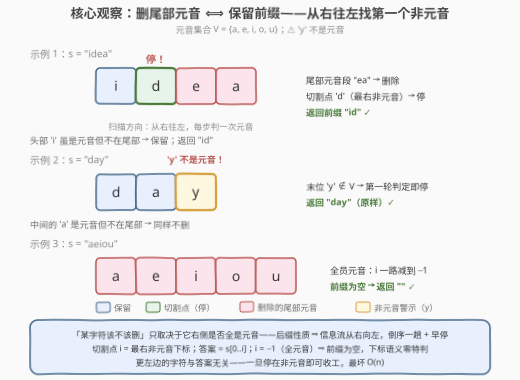
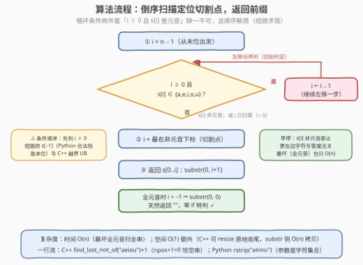

# LeetCode 移除尾部元音字母 题解

## 1. 题目概述

- **标题 / 题号**：移除尾部元音字母（#3856，easy）
- **链接**：https://leetcode.cn/problems/trim-trailing-vowels/
- **难度**：简单
- **标签**：字符串、倒序扫描

**题意**：给定一个由小写英文字母组成的字符串 `s`，返回移除 `s` **尾部所有元音字母**后得到的字符串。元音字母包括 `'a'`、`'e'`、`'i'`、`'o'`、`'u'`。

**示例 1**：

```text
输入：s = "idea"
输出："id"
解释：尾部元音段是 "ea"，移除后得到 "id"。
```

**示例 2**：

```text
输入：s = "day"
输出："day"
解释：末尾字符 'y' 不是元音，尾部没有可删的元音。
```

**示例 3**：

```text
输入：s = "aeiou"
输出：""
解释：整个字符串都是元音，全部移除后为空串。
```

**约束**：

- $1 \le s.length \le 100$
- `s` 仅由小写英文字母组成

> 💡 **审题关键**：① 只删**尾部**——头部的 'i'（示例 1）虽是元音但必须保留，答案不是 "d"；② 尾部元音是**从末位起连续**的一段，从右往左遇到第一个非元音就停，中间的元音（"day" 的 'a'）不动；③ **'y' 不算元音**（示例 2 的陷阱）；④ 全元音串要能正确返回空串。

## 2. 解题思路

### 2.1 暴力思路：逐个弹出末尾元音

官方 hint 给的直接模拟：只要 `s` 非空且末位是元音，就把末位删掉，重复直到末位非元音：

```python
while s and s[-1] in "aeiou":
    s = s[:-1]      # ⚠️ 每轮切片整串拷贝，一次 O(n)
```

判定本身没问题，但 Python 的 `s = s[:-1]` 每轮**整串重建**，删 $k$ 个尾部元音共 $O(nk)$（本题 $n \le 100$ 无所谓，放到 $10^6$ 就是坏习惯）；C++ `pop_back` 虽是 $O(1)$，但一刀一刀试不如换视角——

> 删除「若干个末尾字符」不必逐个试，**一次算出从哪里切**。

### 2.2 核心观察：删后缀 ⟺ 保前缀，切割点由「最右非元音」唯一确定



被删的永远是一段**后缀** $s[i+1..n-1]$，它由切割点 $i$ 唯一确定——

$$i = \text{最右侧非元音字符的下标（全元音时约定 } i = -1\text{）}$$

$s[i+1..n-1]$ 恰是「极长全元音后缀」，答案就是前缀 $s[0..i]$。于是算法变成一趟**倒序扫描**：`i` 从 $n-1$ 出发向左走，只要 `s[i]` 是元音就继续左移，**一旦遇到非元音（或越过 0）立即停止**，返回 `s[0..i]`。

为什么倒序天然占优？「某字符该不该删」只取决于**它右侧是否全是元音**——这是后缀性质，信息流从右往左传播，倒序一趟即可；且一旦停在非元音处，**更左边的字符无论是什么都与答案无关**，可以早停。正序扫描则没法单趟判断：扫到中间某个元音时，并不知道右边还有没有非元音。

> 💡 `i = -1`（全元音串一路扫穿）时前缀长度为 0，`substr(0, 0)` / `s[:0]` 天然返回空串——**下标语义自动消化边界**，零 if 特判。

### 2.3 算法流程图



| 步骤 | 操作 | 说明 |
|------|------|------|
| ① 初始化 | `i = n - 1` | 从末位出发 |
| ② 循环判定 | `i ≥ 0` 且 `s[i] ∈ {a,e,i,o,u}` ？ | **两条件缺一不可**，且 `i ≥ 0` 必须在前（短路求值） |
| ③ 左移 | 是 → `i -= 1`，回到 ② | 至多 $n$ 轮 |
| ④ 收工 | 否 → 返回 `s[0..i]` | `i = -1` 时恰为空串 |

> ⚠️ **条件顺序坑**：若把元音判定写在前面，`i = -1` 时 Python 的 `s[-1]` **合法但取到末位字符**（语义错位、判定对象整个错），C++ 则直接越界未定义行为。循环条件务必先判 `i ≥ 0`。

### 2.4 示例演算

| 示例 | 倒序扫描过程 | 停在 | 返回 |
|------|--------------|------|------|
| `"idea"` | 'a' 元音→左移，'e' 元音→左移，'d' 非元音 | `i = 1`（'d'） | `"id"` |
| `"day"` | 'y' 非元音，第一轮即停 | `i = 2` | `"day"` |
| `"aeiou"` | 五个字符全是元音，一路扫穿 | `i = -1` | `""` |

## 3. 参考代码

### C++

```cpp
class Solution {
public:
    string trimTrailingVowels(string s) {
        auto isVowel = [](char c) {
            return c == 'a' || c == 'e' || c == 'i' || c == 'o' || c == 'u';
        };
        int i = (int)s.size() - 1;
        while (i >= 0 && isVowel(s[i])) --i;   // 倒序找第一个非元音
        return s.substr(0, i + 1);             // i = -1 时返回空串
    }
};
```

### Python

```python
class Solution:
    def trimTrailingVowels(self, s: str) -> str:
        i = len(s)
        while i > 0 and s[i - 1] in "aeiou":   # 先判 i > 0，短路防 s[-1]
            i -= 1
        return s[:i]
```

> 💡 **一行流对照**（语义等价，面试可口述加分）：
> - C++：`return s.substr(0, s.find_last_not_of("aeiou") + 1);`——`find_last_not_of` 返回最后一个非元音下标，全元音时返回 `npos`，而 `npos + 1 == 0` 恰好落回空串，边界同样自动消化；
> - Python：`return s.rstrip("aeiou")`——`rstrip` 的参数是**字符集合**而非子串，语义正是「删掉尾部所有属于该集合的字符」。
>
> ⚠️ **经典错误**：`s.strip("aeiou")` 会**双端齐删**，`"idea".strip("aeiou")` 得 `"d"`；`removesuffix` 只删一段精确匹配的后缀，也都不是本题语义。

## 4. 复杂度分析

| 维度 | 复杂度 | 说明 |
|------|--------|------|
| **时间** | $O(n)$ | 最坏（全元音）扫完整串；遇到非元音即早停 |
| **空间** | $O(1)$ 额外 | 倒序只动下标；返回值本身占 $O(n)$（C++ 可 `s.resize(i + 1)` 原地收尾） |
| **量级** | $n \le 100$ | 至多 100 步判定，微秒级 |

## 5. 扩展：谓词泛化一族

把「是元音」换成任意**字符谓词**，骨架一个字不用改：

- **删前缀元音**：倒序改正序，`find_first_not_of("aeiou")` / `lstrip("aeiou")`；
- **删两侧元音**：`strip("aeiou")`（注意本题不能用它）；
- **删尾部其它类别**：尾部数字、尾部空格（`rstrip()` 无参即删空白）、尾部任意指定字符集——谓词参数化即可；
- **变体问法**：尾部元音**个数** $= n - 1 - i$（切割点右侧长度）；「恰好删 $k$ 个尾部元音」= 切割点再左移……都是先定位切割点，再自由裁剪。

## 6. 面试要点

**Q1：为什么从右往左扫，而不是从左往右？**

> 「该不该删」只取决于字符右侧是否全是元音——后缀性质，信息从右往左传播。倒序单趟 + 遇非元音早停；正序单趟无法判断（扫到中间的元音时不知右边情况），至少要两趟或先定位切割点。

**Q2：全元音串、单字符、尾部无元音，边界分别怎么落地？**

> 统一由下标语义消化：全元音时 `i` 走到 `-1`，`substr(0, 0)` / `s[:0]` 返回空串；尾部无元音时 `i` 停在 `n-1`，返回原串；单字符是两者的特例。**零 if 特判**。

**Q3：循环条件为什么 `i ≥ 0` 必须写在元音判定之前？**

> 短路求值。`i = -1` 时若先取 `s[i]`：Python `s[-1]` 合法但取到末位字符（判定对象错位），C++ 越界是未定义行为。Python 版用 `i > 0` 配 `s[i-1]` 的写法从根上规避负下标。

**Q4：`rstrip("aeiou")` 为什么恰好正确？`strip` / `removesuffix` 为什么错？**

> `strip` 家族的参数是**字符集合**：从指定端开始删，直到遇到不属于集合的字符为止——与「删尾部连续元音段」语义逐字对应。`strip` 双端齐删会把头部元音也删掉（`"idea"` → `"d"`）；`removesuffix` 只删一段**精确匹配**的后缀且只删一次。

**Q5：能比 $O(n)$ 更快吗？**

> 不能。最坏情形（全元音）每个字符都必须读过才能确认「右边全是元音」——任何一个没读的字符都可能是非元音，$\Omega(n)$ 是信息论下界，$O(n)$ 已最优。

> 💡 **一句话总结**：删后缀 ⟺ 保前缀；切割点 = 最右非元音下标，倒序一趟 + 早停定位，返回 `s[0..i]`，边界由下标语义天然消化。

## 同类练习题

| # | 题目 | 与本题的关联 |
|---|------|-------------|
| 125 | [验证回文串](https://leetcode.cn/problems/valid-palindrome/)（[题解](../0101-0200/125_验证回文串.md)） | 同款「按字符谓词跳过」的双指针扫描，谓词从元音换成「非字母数字」 |
| 520 | [检测大写字母](https://leetcode.cn/problems/detect-capital/)（[题解](../0101-0200/520_检测大写字母.md)） | 单字符谓词分类判定的入门练习 |
| 541 | [反转字符串 II](https://leetcode.cn/problems/reverse-string-ii/)（[题解](../0501-0600/541_反转字符串II.md)） | 按位置条件切割字符串再分段处理 |
| 3813 | [元音辅音得分](https://leetcode.cn/problems/vowel-consonant-score/)（[题解](../3801-3900/3813_元音辅音得分.md)） | 同一张元音集合判定表的正向计数用法 |
| 1839 | [所有元音按顺序排布的最长子字符串](https://leetcode.cn/problems/longest-substring-of-all-vowels-in-order/)（[题解](../1801-1900/1839_所有元音按顺序排布的最长子字符串.md)） | 元音序列上的线性扫描进阶 |
