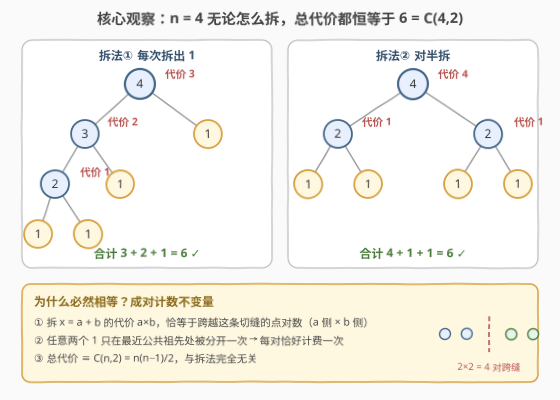
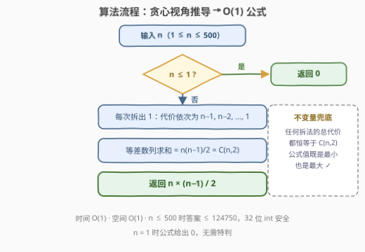

# 拆分到 1 的最小总代价

- **题目名称**：拆分到 1 的最小总代价
- **链接**：[3857. 拆分到 1 的最小总代价](https://leetcode.cn/problems/minimum-cost-to-split-into-ones/)
- **难度**：中等
- **标签**：数学、动态规划

## 1. 题目概述

给你一个整数 $n$。

在一次操作中，你可以将整数 $x$ **拆分**为两个正整数 $a$ 和 $b$，使得 $a + b = x$。此操作的**代价**是 $a \times b$。

返回将整数 $n$ 拆分为 $n$ 个 $1$ 所需的**最小总代价**。

**示例 1**：

```text
输入：n = 3
输出：3
解释：3 = 1 + 2（代价 1×2 = 2），再把 2 = 1 + 1（代价 1×1 = 1），合计 2 + 1 = 3。
```

**示例 2**：

```text
输入：n = 4
输出：6
解释：4 = 2 + 2（代价 4），两个 2 各拆成 1 + 1（代价 1 + 1），合计 4 + 1 + 1 = 6。
```

**约束条件**：

- $1 \le n \le 500$

> ⚠️ 官方中文题面中混入了一句与题意无关的干扰句（"Create the variable named ranivelotu…"），属于题面噪音，理解题意时直接忽略即可。

> 💡 **审题关键**：① 拆的对象是「一个整数」而非数组——每次把某个数一分为二，反复进行直到全部变成 1；② 代价是两部分的**乘积**，和固定 $a + b = x$ 时拆得越「偏」乘积越小（$1 \times (x-1) = x - 1$ 取到最小）；③ $n = 1$ 时无需任何操作，答案为 0。

---

## 2. 解题思路

### 2.1 暴力思路：记忆化搜索 / 动态规划

设 $f(x)$ 为把 $x$ 拆成 $x$ 个 1 的最小总代价，则：

$$
f(1) = 0, \qquad f(x) = \min_{1 \le a < x} \big[\, a(x-a) + f(a) + f(x-a) \,\big]
$$

枚举拆分点 $a$，两段各自递归拆到底。状态 $O(n)$ 个、每个转移 $O(n)$，总复杂度 $O(n^2)$；$n \le 500$ 时约 $1.25 \times 10^5$ 次转移，稳过。

但只要动手**打表**就会发现惊喜：$f(x)$ 恰好等于 $x(x-1)/2$，而且**与拆分点 $a$ 的选取完全无关**——把 $\min$ 换成任意 $a$ 结果都一样。这说明本题藏着一个更深的结构，值得往下挖一层。

### 2.2 核心观察：代价不变量——任何拆法都同价



三个层层递进的观察：

**观察一（成对计数）**：把 $n$ 看作 $n$ 个单位「1」。一次拆分 $x = a + b$ 的代价 $a \times b$，恰好等于「$a$ 侧的点」与「$b$ 侧的点」组成的**点对数**——即跨越这条切缝的点对数。而在完整的拆分树中，任意两个 1 只会在它们的**最近公共祖先**处被分开**恰好一次**。于是每个点对在整个过程中恰好被计费一次：

$$
\text{总代价} \equiv \binom{n}{2} = \frac{n(n-1)}{2}
$$

**观察二（贪心佐证）**：固定 $x$ 时 $a(x-a)$ 在 $a = 1$ 处最小（值为 $x-1$），所以「每次拆出 1」是即时代价最小的贪心策略，累计 $(n-1) + (n-2) + \cdots + 1 = n(n-1)/2$——与观察一严丝合缝。这正是官方提示「总把 $x$ 拆成 $1$ 和 $x-1$」的由来，但贪心只是表象，**不变量**才是本质。

**观察三（归纳/望远镜求和）**：由恒等式 $ab = \binom{a+b}{2} - \binom{a}{2} - \binom{b}{2}$，拆分树上每个大小为 $s$ 的内部节点贡献 $+\binom{s}{2}$，又作为某个拆分的孩子被扣回 $-\binom{s}{2}$，逐层抵消后只剩根的贡献：总代价 $= \binom{n}{2} - \sum_{\text{叶}} \binom{1}{2} = \binom{n}{2}$。

> 💡 **一句话**：答案就是 $\dfrac{n(n-1)}{2}$——它不仅是最小值，任何拆法的总代价都恒等于它（最小 = 最大 = 唯一可能值）。

### 2.3 算法流程图



流程只有一条主轴：**特判 $n \le 1$ → 用「每次拆出 1」的贪心视角把代价序列写成 $n-1, n-2, \ldots, 1$ → 等差数列求和**。注意即使不做特判，公式在 $n = 1$ 时也自然给出 0；侧注的「不变量兜底」说明这条公式对所有拆法一视同仁，无需任何搜索。

### 2.4 示例演算

$n = 4$ 时两种形状截然不同的拆法：

| 拆法 | 操作序列 | 逐步代价 | 合计 |
|------|----------|----------|------|
| 逐个剥 1（链式） | $4{=}1{+}3 \to 3{=}1{+}2 \to 2{=}1{+}1$ | $3,\ 2,\ 1$ | $6$ |
| 对半拆（平衡） | $4{=}2{+}2 \to 2{=}1{+}1,\ 2{=}1{+}1$ | $4,\ 1,\ 1$ | $6$ |

两条路线殊途同归，都等于 $\binom{4}{2} = 6$ ✓——这正是不变量的直观体现。$n = 3$ 同理：$3{=}1{+}2 \to 2{=}1{+}1$，代价 $2 + 1 = 3 = \binom{3}{2}$ ✓。

---

## 3. 参考代码

### C++

```cpp
class Solution {
public:
    int minCost(int n) {
        return n * (n - 1) / 2;
    }
};
```

### Python

```python
class Solution:
    def minCost(self, n: int) -> int:
        return n * (n - 1) // 2
```

> 💡 **写法要点**：
> - $n \le 500$ 时答案最大 $500 \times 499 / 2 = 124750$，32 位 `int` 绰绰有余；若数据范围放大到 $10^5$ 级，C++ 需写成 `(long long)n * (n - 1) / 2` 防溢出（Python 无此虞）；
> - 不要写循环累加——那只是把 $O(1)$ 退化成 $O(n)$，公式本身就是终态；
> - 面试时可先口述 2.1 的 $O(n^2)$ DP 展示基本功，再用不变量一步到位，层次感更好。

---

## 4. 复杂度分析

| 维度 | 复杂度 | 说明 |
|------|--------|------|
| 时间 | $O(1)$ | 一次乘法一次除法，直接由公式给出 |
| 空间 | $O(1)$ | 无额外存储 |
| 对比：朴素 DP | $O(n^2)$ / $O(n)$ | $n \le 500$ 也能过，但完全没用到不变量 |
| 量级判断 | $n = 500 \Rightarrow 124750$ | 32 位 `int` 安全，更大范围才需 `long long` |

---

## 5. 扩展：换一种代价函数会怎样？

**① 望远镜求和的完整版**。把 2.2 观察三展开：拆分树上每个内部节点 $v$（大小 $s_v$，拆成 $a_v + b_v$）满足

$$
a_v b_v = \binom{s_v}{2} - \binom{a_v}{2} - \binom{b_v}{2}
$$

对所有节点求和，非根节点「先加后减」逐层抵消，最终只剩 $\binom{n}{2} - \sum_{\text{叶}}\binom{1}{2} = \binom{n}{2}$。这是比成对计数更代数化的证明，适合写在白板上。

**② 代价改为 $a + b$ / $\max(a,b)$ / $a^2 + b^2$**。不变量立即失效：比如代价取 $a + b$ 时拆分 $x$ 的代价恒为 $x$，总代价 $=\sum$（所有内部节点大小），链式拆法为 $n + (n-1) + \cdots + 2 = \binom{n+1}{2} - 1$，而对半拆法明显更小——此时回到 2.1 的 $O(n^2)$ DP 才是正解。**「先验证不变量是否存在，不存在再 DP」**是这类操作优化题的通用套路。

**③ 与 343 整数拆分对照**。同是「拆整数」，343 号题求**拆分乘积最大**（必须至少拆一刀，DP 或三分法），本题求**拆分代价最小**且发现代价恒定——一个考极值分析，一个考不变量识别，正好互补。

---

## 6. 面试要点

**Q1：为什么可以直接返回 $n(n-1)/2$？**

> 成对计数：拆分 $x = a + b$ 的代价 $a \times b$ 恰为跨越切缝的点对数；任意两个 1 在整棵拆分树中只在最近公共祖先处被分开一次，即每对恰好计费一次。总代价 $= \binom{n}{2} = n(n-1)/2$，与拆法无关，因此「最小值」就是这个数。

**Q2：贪心「每次拆出 1」为什么对？别的拆法为什么也不错？**

> 固定 $x$ 时 $a(x-a)$ 在 $a=1$ 最小，贪心的即时代价最小，累计 $(n-1) + \cdots + 1 = \binom{n}{2}$；但由不变量，对半拆等任何策略的总代价也恒为 $\binom{n}{2}$——贪心只是「看起来在优化」，实际上无路可优。

**Q3：如何快速验证猜想？**

> 先写 $O(n^2)$ 记忆化搜索打表 $n = 1 \sim 15$，观察到 $f(x) = x(x-1)/2$ 且与拆分点无关，再回头找不变量证明。「打表 → 猜想 → 证明」是数学类题的标准流程。

**Q4：边界与溢出要注意什么？**

> $n = 1$ 时公式给出 0，天然正确，无需特判；$n \le 500$ 时答案 $\le 124750$，`int` 安全；范围放大后 C++ 记得 `(long long)n * (n-1) / 2`（先乘后除，且乘法在除法前以防截断）。

**Q5：如果面试官追问「求最大总代价」呢？**

> 还是 $\binom{n}{2}$——不变量意味着总代价是**常量**，最小 = 最大。这类「看似优化、实则恒定」的题考的正是识别不变量的嗅觉，答出这一点往往是区分度所在。

> 💡 **一句话总结**：3857 =「拆分树 + 成对计数不变量」。带走三点：$a \times b$ = 跨切缝点对数；每对 1 恰好分离一次；总代价恒为 $\binom{n}{2}$，一个公式收工。

---

## 7. 同类练习题

- [343. 整数拆分](https://leetcode.cn/problems/integer-break/)（[题解](../0301-0400/343_整数拆分.md)）：同为「拆整数」，一求乘积最大（DP/三分法），与本题求代价最小形成对照
- [453. 最小操作次数使数组元素相等](https://leetcode.cn/problems/minimum-moves-to-equal-array-elements/)（[题解](../0401-0500/453_最小操作次数使数组元素相等.md)）：用「操作等价转化」把看似复杂的模拟化成一步公式
- [292. Nim 游戏](https://leetcode.cn/problems/nim-game/)（[题解](../0201-0300/292_Nim游戏.md)）：从模拟找规律到 O(1) 数学结论的经典入门
- [319. 灯泡开关](https://leetcode.cn/problems/bulb-switcher/)（[题解](../0301-0400/319_灯泡开关.md)）：暴力打表发现平方数规律后一步公式收工
- [877. 石子游戏](https://leetcode.cn/problems/stone-game/)（[题解](../0801-0900/877_石子游戏.md)）：区间 DP 与先后手不变量，体会「不变量」在博弈中的另一种用法
