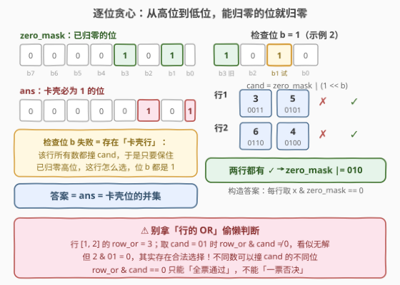
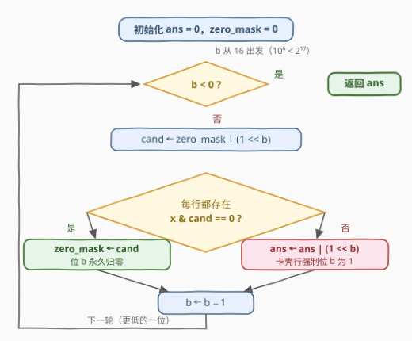
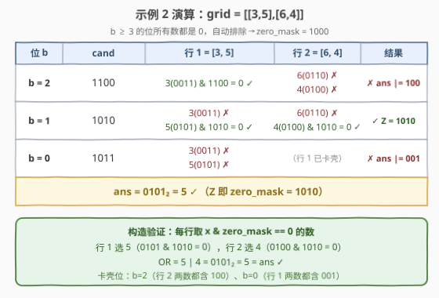

# LeetCode 按位或的最小值 题解

## 1. 题目概述

- **标题 / 题号**：按位或的最小值（#3858，medium）
- **链接**：https://leetcode.cn/problems/minimum-bitwise-or-from-grid/
- **难度**：中等
- **标签**：位运算、贪心、数组

**题意**：给定 $m \times n$ 的二维整数数组 `grid`，必须**从每一行中恰好选出一个整数**。返回所选 $m$ 个整数的**按位或**（bitwise OR）的**最小可能值**。

**示例 1**：

```text
输入：grid = [[1,5],[2,4]]
输出：3
解释：第一行选 1、第二行选 2，1 | 2 = 3，为最小可能值。
```

**示例 2**：

```text
输入：grid = [[3,5],[6,4]]
输出：5
解释：第一行选 5、第二行选 4，5 | 4 = 5，为最小可能值。
```

**示例 3**：

```text
输入：grid = [[7,9,8]]
输出：7
解释：只有一行，选 7 即得最小按位或值。
```

**约束**：

- $1 \le m = \text{grid.length} \le 10^5$
- $1 \le n = \text{grid[i].length} \le 10^5$
- $m \times n \le 10^5$
- $1 \le \text{grid[i][j]} \le 10^5$

> 💡 **审题关键**：① 每行**恰好选一个**，行与行之间唯一的耦合就是 OR 的按位叠加；② $m \times n \le 10^5$ 要求算法近似线性，任何带上 $2^B$ 因子的做法都会爆；③ 值域 $10^5 < 2^{17}$，答案至多 17 个二进制位——「位很少」正是破局点。

## 2. 解题思路

### 2.1 暴力思路

最朴素的做法是枚举每行的选择，共 $\prod_i n_i$ 种组合——10 行每行 10 个数就是 $10^{10}$，指数级不可行。

稍作改进的 DP：设 $S_i$ 为「前 $i$ 行可达的 OR 值集合」，转移 $S_{i+1} = \{\, v \mid x : v \in S_i,\ x \in \text{row}_{i+1} \,\}$。但 $|S_i|$ 最坏可达 $2^{17} = 131072$，总代价 $O(2^B \cdot mn)$ 约二十亿级，同样不可行。DP 的瓶颈在于把 OR 值当**整体**看待——要破局，必须利用 **OR 的按位独立性**。

### 2.2 核心观察：位独立 + 从高到低「能零则零」



**观察一：OR 按位独立。** 把选出的数记为 $x_1, \dots, x_m$，OR 结果的第 $b$ 位为 0 当且仅当**每个 $x_i$ 的第 $b$ 位都是 0**。位与位之间互不干扰——「最小化一个 17 位的 OR」可以拆成「逐位决定」。

**观察二：数值大小 = 位字典序。** $2^b > \sum_{i=0}^{b-1} 2^i = 2^b - 1$：高位上一个 1 的代价超过所有低位之和。因此最小化 OR 的第一优先级是**让最高位为 0**，其次是次高位……这是标准的**逐位贪心**范式。

**观察三：可行性检查是纯存在性判断。** 维护 `zero_mask`（已确定可为 0 的位集合），处理位 $b$ 时令 $\text{cand} = \text{zero\_mask} \mid 2^b$：

$$\text{位 } b \text{ 能连同已归零高位一起保持为 } 0 \iff \text{每行都存在 } x \text{ 使得 } x \,\&\, \text{cand} = 0$$

- 检查**通过** → `zero_mask = cand`，位 $b$ **永久排除**；
- 检查**失败** → 存在「卡壳行」：该行**所有**数都与 `cand` 相交。于是只要还保得住 `zero_mask` 中的高位，这一行无论怎么选，位 $b$ 都是 1 → `ans |= 2^b`。

> ⚠️ **不能用「行的 OR」偷懒**：`row_or & cand == 0` 能推出「该行全票通过」（可作快速路径），但 `row_or & cand != 0` **不能一票否决**——不同的数可以撞 `cand` 的不同位。反例：行 $[1, 2]$ 的 `row_or` $= 3$，取 `cand` $= 01$ 时 `row_or & cand` $\ne 0$ 看似无解，但 $2\,\&\,01 = 0$ 其实合法。

**正确性**（两句话）：

1. **可达**：算法始终维持「每行存在 $x\,\&\,\text{zero\_mask} = 0$」这一不变式（每次排除成功时正是这样验证的）。终态时每行任取一个这样的 $x$，则 OR 与 `zero_mask` 不交，即 OR $\subseteq \text{ans}$；又对每个卡壳位 $b$：处理它时 `zero_mask` 只会更大不会变小，该卡壳行最终选出的数仍在当时的 `cand` 之外的地方为 0，于是命中只能落在位 $b$ 上——OR $\supseteq \text{ans}$。两边夹逼，**构造出的 OR 恰等于 ans**。
2. **最优**：设 $OPT$ 为最优值，归纳可证 $OPT$ 与 `ans` 逐位相同——若贪心在位 $b$ 成功而 $OPT$ 的位 $b$ 为 1，用检查通过的那组选择可把位 $b$ 归零且高位不变，得到严格更小的值，矛盾；若贪心失败，任何解想保住高位归零就必然在卡壳行撞上位 $b$ 的 1。故 $\text{OPT} = \text{ans}$。

### 2.3 算法流程图



| 步骤 | 操作 | 说明 |
|------|------|------|
| ① 初始化 | `ans = 0`，`zero_mask = 0` | 值域 $10^5 < 2^{17}$，位 $b$ 从 16 到 0 |
| ② 构造 | `cand = zero_mask \| (1 << b)` | 把位 $b$ 与已归零高位捆绑检查 |
| ③ 检查 | 每行是否存在 `x & cand == 0` | 行内找到即短路、行间失败即短路 |
| ④ 成功 | `zero_mask = cand` | 位 $b$ 永久归零 |
| ⑤ 失败 | `ans \|= (1 << b)` | 卡壳行强制位 $b$ 为 1 |
| ⑥ 收尾 | 所有位处理完，返回 `ans` | — |

### 2.4 示例演算

**示例 2**（`grid = [[3,5],[6,4]]`，其中 $3 = 0011_2$、$5 = 0101_2$、$6 = 0110_2$、$4 = 0100_2$；$b \ge 3$ 的位所有数都是 0，直接排除得 `zero_mask = 1000`）：



| $b$ | cand | 行 1 = [3, 5] | 行 2 = [6, 4] | 结果 |
|---|---|---|---|---|
| 2 | `1100` | $0011$ ✓ | $0110$ ✗、$0100$ ✗ | **卡壳**：`ans = 0100` |
| 1 | `1010` | $0011$ ✗、$0101$ ✓ | $0110$ ✗、$0100$ ✓ | 成功：`zero_mask = 1010` |
| 0 | `1011` | $0011$ ✗、$0101$ ✗ | （行 1 已卡壳） | **卡壳**：`ans = 0101` |

最终 `ans = 0101₂ = 5`。验证：每行取 `x & zero_mask == 0` 的数——行 1 选 5、行 2 选 4，$5 \mid 4 = 5$ ✓。

**示例 1**：`[[1,5],[2,4]]`（$1 = 001$、$5 = 101$、$2 = 010$、$4 = 100$）：位 2 检查 `cand = 100`，行 1 的 1 ✓、行 2 的 2 ✓ → 归零；位 1 检查 `cand = 110`：行 2 的 2、4 全撞 → `ans = 010`；位 0 检查 `cand = 101`：行 1 的 1、5 全撞 → `ans = 011 = 3` ✓。

**示例 3**：单行 `[7,9,8]`：位 3 时 7(0111) ✓ → `zero_mask = 1000`；位 2 时 `cand = 1100`，7、9(1001)、8(1000) 全撞 → `ans = 100`；位 1 时 `cand = 1010` 全撞 → `ans = 110`；位 0 时 `cand = 1001` 全撞 → `ans = 111 = 7` ✓（单行时答案 = 行内最小值，贪心退化依然正确）。

## 3. 参考代码

### C++

```cpp
class Solution {
public:
    int minimumOR(vector<vector<int>>& grid) {
        int ans = 0, zeroMask = 0;
        for (int b = 16; b >= 0; --b) {              // ① 值域 1e5 < 2^17，共 17 位
            int cand = zeroMask | (1 << b);          // ② 位 b 与已归零高位捆绑
            bool ok = true;
            for (const auto& row : grid) {           // ③ 每行找一个 x & cand == 0
                bool found = false;
                for (int x : row) {
                    if ((x & cand) == 0) { found = true; break; }
                }
                if (!found) { ok = false; break; }   //    卡壳行：位 b 无法排除
            }
            if (ok) zeroMask = cand;                 // ④ 成功：位 b 永久归零
            else    ans |= (1 << b);                 // ⑤ 失败：位 b 必为 1
        }
        return ans;
    }
};
```

### Python

```python
class Solution:
    def minimumOR(self, grid: List[List[int]]) -> int:
        ans, zero_mask = 0, 0
        for b in range(16, -1, -1):                      # ① 值域 1e5 < 2^17，共 17 位
            cand = zero_mask | (1 << b)                  # ② 位 b 与已归零高位捆绑
            if all(any(x & cand == 0 for x in row)       # ③ 每行找一个 x & cand == 0
                   for row in grid):
                zero_mask = cand                         # ④ 成功：位 b 永久归零
            else:
                ans |= 1 << b                            # ⑤ 失败：位 b 必为 1
        return ans
```

> 💡 **写法要点**：
> - **位上限取 17**：$10^5 < 2^{17} = 131072$，从 bit 16 扫到 bit 0；
> - **双层短路**：行内找到即 `break`、某行找不到整体即 `break`，实际运行远快于最坏上界；
> - **别用行 OR 判断**（见 2.2 反例）；若要加速，只允许 `row_or & cand == 0` 的「快速通过」方向。

## 4. 复杂度分析

| 维度 | 复杂度 | 说明 |
|------|--------|------|
| 时间 | $O(mn \cdot B)$，$B = 17$ | 每个位最坏把全表扫一遍；$mn \le 10^5$ ⇒ 至多约 $1.7 \times 10^6$ 次 `&` |
| 空间 | $O(1)$ | 只维护 `ans` / `zero_mask` / `cand` 三个整数 |
| 量级判断 | $1.7 \times 10^6$ 次位运算 | 远低于时限；答案 $< 2^{17}$，`int` 足够，无溢出风险 |

## 5. 扩展：快速路径与同族变体

**① `row_or` 快速通过路径。** 预处理每行的 `row_or[i]`；检查 `cand` 时若 `row_or[i] & cand == 0`，则该行**必然**通过（所有数与 `cand` 都不相交），免去行内扫描；不相等时仍须逐数检查（可能各撞不同的位）。最坏复杂度不变，常数更小——这是把 2.2 的单向性用对方向的工程化。

**② 值域放大。** 若 `grid[i][j] ≤ 10^9`，只需把 $B$ 换成 30，复杂度 $O(30 \cdot mn)$ 依旧线性系；本题真正的约束是 $mn$，不是值域。

**③ 一族同款贪心。** [3022](https://leetcode.cn/problems/minimize-or-of-remaining-elements-using-operations/) 把「每行选数」换成「至多 $k$ 次把一个数 AND 进相邻数」，仍是「从高到低逐位尝试消零 + 扫描判可行性」的同一范式；[421](https://leetcode.cn/problems/maximum-xor-of-two-numbers-in-an-array/) 则是**最大化**方向的镜像——逐位从高到低确认答案位能否为 1，存在性检查交给 01-Trie。

## 6. 面试要点

**Q1：为什么从最高位开始贪心是正确的？**

> 二进制数值比较就是字典序：$2^b$ 大于所有低位之和，高位一个 1 的代价压倒一切。最小化 OR 必须优先保证高位为 0——「逐位从高到低 + 每位做一次存在性检查」是位运算最值问题的通用范式（对照 421 的最大化方向）。

**Q2：「无法排除的位」为什么最终一定为 1？**

> 检查失败意味着存在卡壳行：该行所有数都撞 `cand`。终态构造时每行选出的数满足 `x & zero_mask == 0`，而当时的 `cand` ⊆ 终态 `zero_mask`（zero_mask 只增不减），于是该数在 `cand` 上的命中只能落在位 $b$ 本身——位 $b$ 必为 1。

**Q3：能不能用每行的 OR 来加速判断？**

> 只能做「快速通过」：`row_or & cand == 0` ⟹ 该行全票通过。不能做「一票否决」：行 $[1,2]$ 的 `row_or` $= 3$，`cand` $= 01$ 时相交，但 $2\,\&\,01 = 0$ 合法——不同的数可以撞 `cand` 的不同位，行 OR 把它们叠在一起虚张声势。

**Q4：复杂度是多少？位上限怎么取？**

> $O(mnB)$：每个位最坏全表扫一遍。$10^5 < 2^{17}$ 故 $B = 17$（bit 16 到 bit 0）；值域 $10^9$ 则 $B = 30$。$mn \le 10^5$ ⇒ 约 $1.7 \times 10^6$ 次位运算，轻松通过。

**Q5：有哪些 corner case？**

> ① 单行（$m = 1$）：答案 = 行内最小值，贪心自然退化正确；② 每行一个数（$n = 1$）：无选择余地，答案 = 全体 OR；③ 全部数都是 2 的幂、或全 1 等特殊位模式，无需特判，检查逻辑天然覆盖。

## 同类练习题

| # | 题目 | 与本题的关联 |
|---|------|-------------|
| 3022 | [给定操作次数内使剩余元素的或值最小](https://leetcode.cn/problems/minimize-or-of-remaining-elements-using-operations/)（[题解](../3001-3100/3022_给定操作次数内使剩余元素的或值最小.md)） | 同款「从高到低逐位消零」的 OR 最小化，把「每行选数」换成 AND 替换操作 |
| 421 | [数组中两个数的最大异或值](https://leetcode.cn/problems/maximum-xor-of-two-numbers-in-an-array/)（[题解](../0401-0500/421_数组中两个数的最大异或值.md)） | 逐位贪心的最大化方向，存在性检查交给 01-Trie |
| 898 | [子数组按位或操作](https://leetcode.cn/problems/bitwise-ors-of-subarrays/)（[题解](../0801-0900/898_子数组按位或操作.md)） | 体会 OR 的位「只增不减」与子数组 OR 值集合的按位坍缩 |
| 2571 | [将整数减少到零需要的最少操作数](https://leetcode.cn/problems/minimum-operations-to-reduce-an-integer-to-0/)（[题解](../2501-2600/2571_将整数减少到零需要的最少操作数.md)） | 按二进制位结构做贪心决策的轻量练习 |
| 2401 | [最长优雅子数组](https://leetcode.cn/problems/longest-nice-subarray/) | 「任意两数按位与为 0」= 二进制位互斥，位独立约束的滑动窗口版 |
