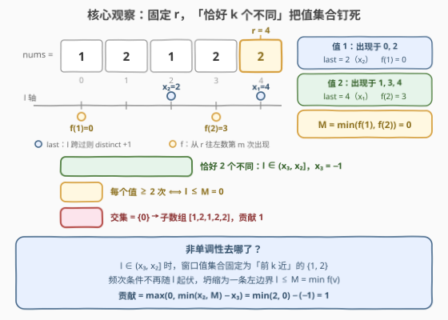
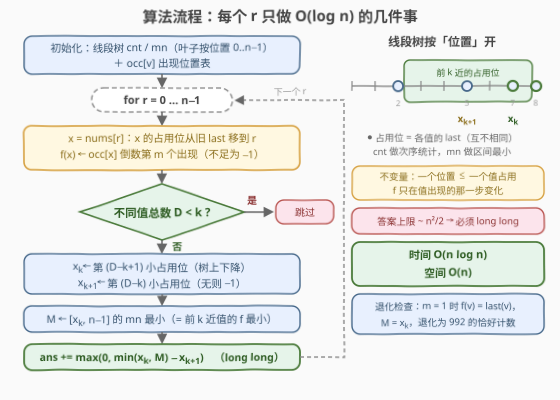

# 统计包含K个不同整数的子数组

- **题目名称**：统计包含K个不同整数的子数组
- **链接**：[3859. 统计包含K个不同整数的子数组](https://leetcode.cn/problems/count-subarrays-with-k-distinct-integers/)
- **难度**：困难
- **标签**：数组、哈希表、计数、滑动窗口

## 1. 题目概述

**题意**：给定整数数组 `nums` 与两个整数 `k`、`m`，返回同时满足以下条件的**子数组**（连续非空序列）的数目：

1. 子数组**恰好**包含 $k$ 个**不同**整数；
2. 子数组中每个出现过的整数都**至少出现 $m$ 次**。

**示例 1**：

```text
输入：nums = [1,2,1,2,2], k = 2, m = 2
输出：2
解释：[1,2,1,2]（1×2、2×2）与 [1,2,1,2,2]（1×2、2×3）满足条件。
```

**示例 2**：

```text
输入：nums = [3,1,2,4], k = 2, m = 1
输出：3
解释：[3,1]、[1,2]、[2,4] 满足条件。
```

**约束条件**：

- $1 \le \text{nums.length} \le 10^5$
- $1 \le \text{nums[i]} \le 10^5$
- $1 \le k, m \le \text{nums.length}$

> 💡 **审题关键**：① 答案上限约 $n^2/2 \approx 5 \times 10^9$，必须用 64 位整数；② 「每个不同整数至少 $m$ 次」随窗口伸缩**不单调**——窗口扩进一个新值会破坏条件、继续扩又可能修复——经典双指针滑窗直接失效，这是本题压轴困难的根源；③ 官方提示走 $\text{atMost}(k) - \text{atMost}(k-1)$ 化归，但只要抓住「**恰好 $k$ 个不同**把窗口值集合钉死」这一结构，「恰好」版可以一步到位。

## 2. 解题思路

### 2.1 暴力思路

枚举全部 $O(n^2)$ 个子数组：左端点固定、右端点右移时用哈希表 $O(1)$ 维护频次，检查「不同值个数 $= k$ 且最小频次 $\ge m$」。$n = 10^5$ 时约 $10^{10}$ 次操作，不可行。

更糟的是，「每个值 $\ge m$ 次」让经典的**滑动窗口**也失灵。反例：`nums = [1,1,2,2]`，$m = 2$：

```text
[1,1]     → 1 出现 2 次 ✓
[1,1,2]   → 2 出现 1 次 ✗（扩张反而变非法）
[1,1,2,2] → 1×2、2×2 ✓（再扩张又变回合法）
```

合法性既不随扩张单调、也不随收缩单调——固定右端点 $r=3$ 时满足频次条件的左端点是 $\{0, 2\}$，**根本不是一段连续区间**，双指针「左端点单调移动」的前提被摧毁。要破局，必须换一个视角：先固定住窗口里**有哪些值**。

### 2.2 核心观察：固定右端点，「恰好 k 个不同」把值集合钉死



固定右端点 $r$。对每个在 $[0, r]$ 内出现过的值 $v$，记 $\text{last}(v)$ 为 $v$ 最右的出现位置；把这些 last 从大到小排成 $x_1 > x_2 > \cdots > x_D$（$D$ 为 $[0, r]$ 内不同值总数），并约定 $x_{D+1} = -1$。

**观察一：不同值个数是 $l$ 的「阶梯」，「恰好 k」⟺ $l$ 落在一个区间。**

值 $v$ 在 $[l, r]$ 中出现 $\iff \text{last}(v) \ge l$。于是 $l$ 从 $r$ 向左滑动时，每跨过一个 $x_j$，窗口就多收一个值：

$$\text{distinct}(l..r) = j \iff l \in (x_{j+1},\, x_j]$$

「恰好 $k$ 个不同」$\iff l \in (x_{k+1},\, x_k]$——一个**连续区间**。

**观察二：在这个区间里，「每个都 ≥ m 次」坍缩成一条左边界。**

当 $l \in (x_{k+1}, x_k]$ 时，窗口内的值集合**恰好固定**为「按 last 从近到远的前 $k$ 个值」$v_1, \dots, v_k$：$l$ 再往左才会引进第 $k+1$ 个值，往右移则丢值。对其中任意 $v_i$，它在 $[l, r]$ 中出现 $\ge m$ 次 $\iff$ 从 $r$ 往左数的第 $m$ 次出现仍在窗口内。定义

$$f(v) = v \text{ 从右往左数的第 } m \text{ 次出现位置（不足 } m \text{ 次记 } -1\text{）}$$

则该条件就是 $l \le f(v_i)$——一个与 $l$ 不再纠缠的静态量。于是固定 $r$ 时：

$$\text{合法 } l = (x_{k+1},\, \min(x_k,\, M)]， \qquad M = \min_{i=1}^{k} f(v_i)$$

$$\text{贡献} = \max\bigl(0,\ \min(x_k, M) - x_{k+1}\bigr)$$

> 💡 **这正是官方提示 $\text{atMost}(k) - \text{atMost}(k-1)$ 的直接版**：$\text{atMost}(K)$ 的合法 $l$ 按 distinct 值分层为 $\bigcup_{j \le K}\,(x_{j+1},\, \min(x_j, M_j)]$（$M_j$ 为前 $j$ 近值的 $f$ 前缀最小），两层相减后 $j \le k-1$ 的部分全部抵消，剩下的正是 $(x_{k+1}, \min(x_k, M_k)]$。既然如此，不如直接刻画「恰好 $k$」，连减法都省了。

> ⚠️ **非单调性去哪了？** 单看某个 $l$，合法性确实随 $r$ 起伏；但本解法不去追踪「每个 $l$ 是否合法」，而是先按「窗口里有哪些值」把 $l$ 分层、每层值集合固定，再用静态量 $f(v)$ 判界——把「频次的动态」转嫁成「值集合的静态」。

### 2.3 算法流程：一棵按「位置」开的线段树



剩下的问题是：$r$ 每右移一格，如何 $O(\log n)$ 拿到 $x_k$、$x_{k+1}$、$M$？

**摆放方式**：把每个值 $v$ 放在「位置 $\text{last}(v)$」上——不同值的 last 互不相同，**一个位置至多被一个值占用**。以位置 $0 \dots n-1$ 为下标建线段树，叶子存：

- `cnt` $\in \{0, 1\}$：该位置是否被占用 → 支持「**第 $j$ 小占用位置**」的次序统计（求 $x_k$、$x_{k+1}$）；
- `mn`：占用该位置的值的 $f$（未占用为 $+\infty$）→ 支持**区间最小**（求 $M$）。

由于「位置 $\ge x_k$ 的占用叶子恰是最大的 $k$ 个」，$M = \min f$ 就是一次区间查询 $[x_k, n-1]$，无需单独维护 top-$k$ 集合。

**增量维护**：处理 $r$（设 $x = \text{nums}[r]$）时，只有 $x$ 的信息会变——

- $x$ 的占用位从旧 last **移到** $r$（一次删除 + 一次插入，两者位置必然不同）；
- $f(x)$ 更新为「出现位置表 $\text{occ}[x]$ 的倒数第 $m$ 个」：把 $r$ 追加进表后取 $\text{occ}[x][c - m]$（$c$ 为当前出现次数），不足 $m$ 个为 $-1$，$O(1)$ 查表。

| 步骤 | 操作 | 说明 |
|------|------|------|
| ① 初始化 | 线段树 `cnt` / `mn` 全空；`occ[v]` 出现位置表 | 叶子按位置 $0..n-1$ 开 |
| ② 移位 | 删除 $x$ 的旧 last 叶子；在 $r$ 插入，`mn = f(x)` | $f(x) = \text{occ}[x]$ 倒数第 $m$ 个，不足为 $-1$ |
| ③ 查总数 | $D = $ 根的 `cnt` | $D < k$ 则贡献为 0，跳过 |
| ④ 次序统计 | $x_k \leftarrow$ 第 $(D-k+1)$ 小占用位；$x_{k+1} \leftarrow$ 第 $(D-k)$ 小（无则 $-1$） | 树上下降 $O(\log n)$ |
| ⑤ 区间最小 | $M \leftarrow [x_k,\, n-1]$ 上占用叶子的 `mn` 最小值 | $=$ 前 $k$ 近值的 $f$ 最小 |
| ⑥ 累加 | $\text{ans} \mathrel{+}= \max(0,\ \min(x_k, M) - x_{k+1})$ | 记得 64 位整数 |

### 2.4 示例演算

**示例 1**（`nums = [1,2,1,2,2]`，$k = 2$，$m = 2$）：

| $r$ | 各值状态（last / f） | $x_2$ | $x_3$ | $M$ | 贡献 $\max(0, \min(x_2, M) - x_3)$ | 命中子数组 |
|---|---|---|---|---|---|---|
| 0 | 1: 0 / −1 | — | — | — | $D = 1 < k$，跳过 | — |
| 1 | 1: 0 / −1；2: 1 / −1 | 0 | −1 | −1 | $\max(0, -1+1) = 0$ | — |
| 2 | 1: 2 / 0；2: 1 / −1 | 1 | −1 | −1 | $\max(0, -1+1) = 0$ | — |
| 3 | 1: 2 / 0；2: 3 / 1 | 2 | −1 | 0 | $\min(2, 0) + 1 = 1$ | $[1,2,1,2]$（$l=0$） |
| 4 | 1: 2 / 0；2: 4 / 3 | 2 | −1 | 0 | $\min(2, 0) + 1 = 1$ | $[1,2,1,2,2]$（$l=0$） |

合计 $2$ ✓。注意 $r = 4$：值 2 的 $f = 3$ 并不生效，**起作用的是前 $k$ 近值中 $f$ 的最小值** $M = \min(0, 3) = 0$——值 1 的倒数第 2 次出现（位置 0）卡死了左边界。

**示例 2**（`[3,1,2,4]`，$k = 2$，$m = 1$）：$m = 1$ 时 $f(v) = \text{last}(v)$，故 $M = x_k$ 恒成立，合法区间退化为 $(x_{k+1}, x_k]$——即经典「恰好 $k$ 个不同」计数：$r = 1, 2, 3$ 各贡献 1（$[3,1]$、$[1,2]$、$[2,4]$），合计 $3$ ✓。

## 3. 参考代码

### C++

```cpp
class Solution {
    int sz;
    vector<int> cnt, mn;   // 叶子按位置 0..n-1：cnt=是否被占用，mn=占用值的 f

    void setLeaf(int p, int c, int val) {        // 位置 p 置占用(c=1)/腾空(c=0)
        p += sz;
        cnt[p] = c;
        mn[p] = c ? val : INT_MAX;
        for (p >>= 1; p; p >>= 1) {
            cnt[p] = cnt[2 * p] + cnt[2 * p + 1];
            mn[p] = min(mn[2 * p], mn[2 * p + 1]);
        }
    }

    int kth(int j) {                             // 第 j 小的占用位置（1-indexed）
        int p = 1;
        while (p < sz) {
            p <<= 1;
            if (cnt[p] < j) { j -= cnt[p]; ++p; }
        }
        return p - sz;
    }

    int rangeMin(int ql, int qr) {               // [ql, qr] 内占用叶子的 mn 最小值
        int res = INT_MAX;
        for (int l = ql + sz, r = qr + sz + 1; l < r; l >>= 1, r >>= 1) {
            if (l & 1) res = min(res, mn[l++]);
            if (r & 1) res = min(res, mn[--r]);
        }
        return res;
    }

public:
    long long countSubarrays(vector<int>& nums, int k, int m) {
        int n = nums.size();
        sz = 1;
        while (sz < n) sz <<= 1;
        cnt.assign(2 * sz, 0);
        mn.assign(2 * sz, INT_MAX);

        vector<vector<int>> occ(100001);         // 各值的出现位置表
        long long ans = 0;
        for (int r = 0; r < n; ++r) {
            auto& o = occ[nums[r]];
            if (!o.empty()) setLeaf(o.back(), 0, INT_MAX);  // 旧 last 腾空
            o.push_back(r);
            int c = (int)o.size();
            int f = (c >= m) ? o[c - m] : -1;    // 倒数第 m 次出现，不足为 -1
            setLeaf(r, 1, f);                    // 新 last = r

            int D = cnt[1];                      // 当前不同值总数
            if (D < k) continue;
            int xk  = kth(D - k + 1);            // 第 k 大 last
            int xk1 = (D >= k + 1) ? kth(D - k) : -1;   // 第 k+1 大 last
            int M   = rangeMin(xk, n - 1);       // 前 k 近值的 f 最小
            ans += max(0, min(xk, M) - xk1);
        }
        return ans;
    }
};
```

### Python

```python
from math import inf

class Solution:
    def countSubarrays(self, nums: List[int], k: int, m: int) -> int:
        n = len(nums)
        sz = 1
        while sz < n:
            sz <<= 1
        cnt = [0] * (2 * sz)      # 叶子/区间：占用位置计数
        mn = [inf] * (2 * sz)     # 叶子/区间：占用值的 f 最小值

        def set_leaf(p, c, val):  # 位置 p 置占用(c=1, 值 val)/腾空(c=0)
            p += sz
            cnt[p], mn[p] = c, (val if c else inf)
            p >>= 1
            while p:
                l, r = p + p, p + p + 1
                cnt[p] = cnt[l] + cnt[r]
                mn[p] = mn[l] if mn[l] < mn[r] else mn[r]
                p >>= 1

        def kth(j):               # 第 j 小的占用位置
            p = 1
            while p < sz:
                p <<= 1
                if cnt[p] < j:
                    j -= cnt[p]
                    p += 1
            return p - sz

        def range_min(ql, qr):    # [ql, qr] 内占用值的 f 最小
            res = inf
            l, r = ql + sz, qr + sz + 1
            while l < r:
                if l & 1:
                    if mn[l] < res: res = mn[l]
                    l += 1
                if r & 1:
                    r -= 1
                    if mn[r] < res: res = mn[r]
                l >>= 1
                r >>= 1
            return res

        occ = {}
        ans = 0
        for r, x in enumerate(nums):
            o = occ.setdefault(x, [])
            if o:
                set_leaf(o[-1], 0, inf)                    # 旧 last 腾空
            o.append(r)
            f = o[len(o) - m] if len(o) >= m else -1       # 倒数第 m 次出现
            set_leaf(r, 1, f)                              # 新 last = r
            D = cnt[1]                                     # 不同值总数
            if D < k:
                continue
            xk = kth(D - k + 1)                            # 第 k 大 last
            xk1 = kth(D - k) if D >= k + 1 else -1         # 第 k+1 大 last
            M = range_min(xk, n - 1)                       # 前 k 近值的 f 最小
            ans += max(0, min(xk, M) - xk1)
        return ans
```

> 💡 **写法要点**：
> - 线段树按**位置**开而不是按值域开：占用位天然互异，`cnt` 才能做次序统计；
> - $f(x)$ 只在 $x$ 出现的那一步更新，用出现位置表 $O(1)$ 直取倒数第 $m$ 个；
> - 「$\ge x_k$ 的占用位恰是前 $k$ 近」让 $M$ 复用一次区间最小查询，免去维护 top-$k$ 集合。

## 4. 复杂度分析

| 维度 | 复杂度 | 说明 |
|------|--------|------|
| 时间 | $O(n \log n)$ | 每个 $r$：2 次点更新 + 2 次树上下降 + 1 次区间最小，均为 $O(\log n)$ |
| 空间 | $O(n)$ | 线段树 $2 \cdot 2^{\lceil \log n \rceil}$；出现位置表合计 $n$ 个位置 |
| 量级判断 | $n = 10^5 \Rightarrow$ 约 $3 \times 10^6$ 次树节点访问 | 答案上限 $\approx n^2/2 \approx 5 \times 10^9$，必须 64 位整数 |

## 5. 扩展：atMost 化归与退化方向

**① 官方提示的 atMost 化归。** $\text{atMost}(K) = \sum_r \sum_{j \le K} \max(0, \min(x_j, M_j) - x_{j+1})$，其中 $M_j$ 是前 $j$ 近值的 $f$ **前缀最小**——比直接算「恰好 $k$」要多维护一层前缀最小（可用同一棵树查 $[x_j, n-1]$ 逐层给出）。$\text{atMost}(k) - \text{atMost}(k-1)$ 与本文的直接刻画**逐点相等**：固定的 $r$ 下，$\text{atMost}(K)$ 的合法 $l$ 集合随 $K$ 嵌套（$K$ 越大集合越大），相减恰留下 distinct $= k$ 的那一层。

**② $m = 1$：退化成 992。** 此时 $f(v) = \text{last}(v)$、$M = x_k$ 恒成立，合法 $l \equiv (x_{k+1}, x_k]$——正是「恰好 $k$ 个不同整数」的经典计数。[992](https://leetcode.cn/problems/subarrays-with-k-different-integers/) 还能写成 $O(n)$ 双指针，因为 $m = 1$ 时「每个值至少出现 1 次」恒真、可行性恢复单调。

**③ $k = 1$：退化成同值游程。** 合法子数组 = 单值游程内长度 $\ge m$ 的子段，逐游程贡献 $\dfrac{(L - m + 1)(L - m + 2)}{2}$（$L$ 为游程长），$O(n)$ 秒杀。

**④ 值域很小时（如字符集 26）**：可按 [2953](https://leetcode.cn/problems/count-complete-substrings/) 的套路分段后暴力统计，但本题值域 $10^5$，必须依赖次序统计树——「值域大小」决定了这道题与 2953 的分野。

## 6. 面试要点

**Q1：为什么经典滑动窗口在这题失效？**

> 「每个值至少 $m$ 次」不满足窗口伸缩的单调性：`[1,1] → [1,1,2] → [1,1,2,2]`（$m=2$）经历 ✓ → ✗ → ✓。固定 $r$ 时满足频次条件的左端点可以是 $\{0, 2\}$ 这样的非连续集合，双指针「左端点只进不退」的前提不成立。

**Q2：「恰好 k 个不同」为什么能驯服非单调条件？**

> 它把 $l$ 限制在 $(x_{k+1}, x_k]$ 内，此时窗口值集合**固定**为前 $k$ 近的值——「每个出现的值 $\ge m$ 次」不再依赖 $l$ 的具体位置，坍缩为 $l \le M = \min_i f(v_i)$ 一条左边界，合法 $l$ 重新成为区间。

**Q3：$f(v)$ 是什么？为什么 $l \le f(v)$ 等价于频次 $\ge m$？**

> $f(v)$ 是 $v$ 从右端点往左数的第 $m$ 次出现位置。$v$ 在 $[l, r]$ 出现 $\ge m$ 次 $\iff$ 这第 $m$ 次出现位置 $\ge l$。维护时在 $v$ 出现的位置查出现位置表倒数第 $m$ 个即可，$O(1)$。

**Q4：线段树为什么按位置开？`cnt` 和 `mn` 各负责什么？**

> 每个值占用「自己的 last 位置」：位置互异且只会右移。`cnt` 做「第 $j$ 小占用位置」的次序统计（得 $x_k$、$x_{k+1}$）；`mn` 做 $[x_k, n-1]$ 的区间最小（得 $M$，因为 $\ge x_k$ 的占用位恰是前 $k$ 近的值）。一次移位 = 删旧叶 + 插新叶。

**Q5：有哪些易错点？**

> ① 不同值不足 $k+1$ 个时 $x_{k+1} = -1$（允许 $l$ 伸到 0），别写成 0；② $f$ 不足 $m$ 次出现时取 $-1$，会被 $\max(0, \cdot)$ 自然归零，无需特判；③ 答案上限约 $5 \times 10^9$，C++ 用 `long long`；④ 先删旧 last 叶子再插 $r$（两者位置必然不同，顺序颠倒会在重算路径上漏更新）。

## 7. 同类练习题

- [992. K 个不同整数的子数组](https://leetcode.cn/problems/subarrays-with-k-different-integers/)（[题解](../0901-1000/992_K个不同整数的子数组.md)）：本题 $m = 1$ 的特例，经典 $\text{atMost}$ 差分双指针
- [2799. 统计完全子数组的数目](https://leetcode.cn/problems/count-complete-subarrays-in-an-array/)（[题解](../2701-2800/2799_统计完全子数组的数目.md)）：「不同值个数 = 全局值个数」的另一类「恰好」，体会值集合固定思想
- [2953. 统计完全子字符串](https://leetcode.cn/problems/count-complete-substrings/)（[题解](../2901-3000/2953_统计完全子字符串.md)）：每个字符恰好出现 $k$ 次——值域只有 26 时的分段滑窗对照
- [2958. 最多K个重复元素的最长子数组](https://leetcode.cn/problems/length-of-longest-subarray-with-at-most-k-frequency/)（[题解](../2901-3000/2958_最多K个重复元素的最长子数组.md)）：频次条件取「至多」方向，单调性完好，标准双指针
- [2461. 长度为K子数组中的最大和](https://leetcode.cn/problems/maximum-sum-of-distinct-subarrays-with-length-k/)（[题解](../2401-2500/2461_长度为K子数组中的最大和.md)）：定长窗口 + 恰好 $k$ 个不同的轻量练习
