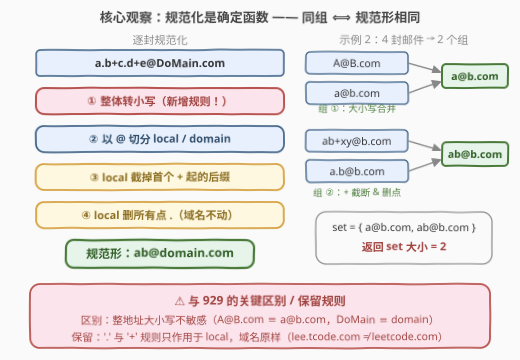
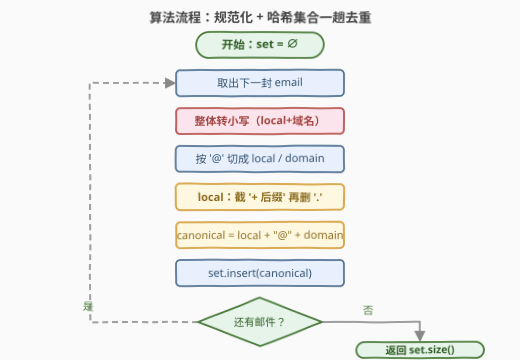

# LeetCode 不同邮件组 题解

## 1. 题目概述

- **标题 / 题号**：不同邮件组（#3860，medium）
- **链接**：https://leetcode.cn/problems/unique-email-groups/
- **难度**：中等
- **标签**：数组、哈希表、字符串

> ⚠️ 本题为 LeetCode 付费题，题意描述根据官方示例用例与 hints 重建，可能与官方题面有出入。

**题意**：每个电子邮件地址由「本地名 `local`」和「域名 `domain`」组成，二者以 `@` 分隔。在投递邮件时，按以下规则对地址做**规范化**：

1. **大小写不敏感**：整个地址（`local` 和 `domain` 都算）中字母的大小写视为相同，规范化时统一转为小写——这是本题相对经典题 [929. 独特的电子邮件地址](https://leetcode.cn/problems/unique-email-addresses/) 的**新增规则**（由示例中的 `A@B.com`、`DoMain.com` 推断）；
2. **首个 `+` 后内容忽略**：`local` 中从第一个 `+`（含其本身）到 `@` 之间的所有字符全部丢弃；
3. **忽略所有点 `.`**：`local` 中的 `.` 视作不存在，直接删去；
4. **`domain` 原样保留**：上述 2、3 两条规则**只作用于 `@` 左侧**，`domain` 中的 `.`（如 `lee.tcode.com`）有实际意义，不能删。

规范化后**相同**的地址属于同一个「组」。给定字符串数组 `emails`，返回不同组的数目。

**示例 1**：

```text
输入：emails = ["test.email+alex@leetcode.com","test.e.mail+bob.cathy@leetcode.com","testemail+david@lee.tcode.com"]
输出：2
解释：
"test.email+alex@leetcode.com"        → "testemail@leetcode.com"
"test.e.mail+bob.cathy@leetcode.com"  → "testemail@leetcode.com"（与上者同组）
"testemail+david@lee.tcode.com"       → "testemail@lee.tcode.com"（域名中的点保留，独立一组）
共 2 个组。
```

**示例 2**：

```text
输入：emails = ["A@B.com","a@b.com","ab+xy@b.com","a.b@b.com"]
输出：2
解释：
"A@B.com"     → 小写 → "a@b.com"
"a@b.com"     →        "a@b.com"（与上者同组：大小写合并）
"ab+xy@b.com" → 截断 + → "ab@b.com"
"a.b@b.com"   → 删点  → "ab@b.com"（与上者同组）
组① = {A@B.com, a@b.com}，组② = {ab+xy@b.com, a.b@b.com}，共 2 个组。
```

**示例 3**：

```text
输入：emails = ["a.b+c.d+e@DoMain.com","ab+xyz@domain.com","ab@domain.com"]
输出：1
解释：
"a.b+c.d+e@DoMain.com" → 小写（域名 DoMain → domain）+ 截断 + 删点 → "ab@domain.com"
"ab+xyz@domain.com"    → 截断 → "ab@domain.com"
"ab@domain.com"        → "ab@domain.com"
三封邮件全部同组，共 1 个组。
```

**约束条件**（按题意重建，具体以官方为准）：`emails[i]` 仅由大小写英文字母、`'.'`、`'+'` 和 `'@'` 组成；每个 `emails[i]` 恰好包含一个 `'@'`；`local` 与 `domain` 均非空。数据规模为常规量级（数组长度与单地址长度均为十到百级），线性解法远在安全范围内。

> 💡 **审题关键**：① 与 929 的**唯一区别**是大小写不敏感——`A@B.com` 与 `a@b.com` 同组、`DoMain.com` 与 `domain.com` 同组，规范化第一步先整地址转小写；② `.` 与 `+` 的规则**只作用于 `local`**，`@` 右侧一字不动——域名里的点不能删（否则示例 1 会把 `lee.tcode.com` 错并进 `leetcode.com`）；③ 「组」的定义就是**规范形相同**，答案 = 不同规范形的个数，提示也直说了：用哈希集合去重。

## 2. 解题思路

### 2.1 朴素思路：全部规范化，再两两比较

朴素做法分两步：

1. 对每封邮件按四条规则求出**规范形**——这步没法省，任何解法都要做；
2. 不用哈希，统计规范形列表中不同字符串的个数：对每个 `i` 检查 `canonical[0..i-1]` 中是否出现过 `canonical[i]`，未出现则计数加一。

第 2 步是 $O(n^2 \cdot L)$ 的双重循环（$n$ 为邮件数、$L$ 为单地址平均长度），$n = 10^4$ 时约 $10^8$ 次字符比较，会超时；改用「排序后扫相邻」可降到 $O(nL \log n)$，但要动整个数组。数据规模小怎么写都能过，**考点是把「同组判断」转化为「规范形相等」后的去重手段**。

### 2.2 核心观察：规范化是确定函数，哈希集合一趟去重



三个要点：

1. **规范化是确定函数**：$f(\text{email}) \mapsto \text{canonical}$，同一封邮件无论何时规范化结果唯一。「$x$ 与 $y$ 同组」$\iff f(x) = f(y)$，这是一个**等价关系**（自反、对称、传递），每组恰好对应一个规范形——所以**无需并查集**，直接以规范形为 key 去重即可；
2. **四步流水线顺序宽松**：整体小写化与「切 `@` / 截 `+` / 删 `.`」**可交换**——`tolower` 不会产生或消灭 `'+'`、`'.'`、`'@'`，先转小写再切分，或先切分再分别转小写，结果相同。实践中推荐**先 `lower()` 再处理**，代码最短；而「截 `+`」与「删 `.`」之间也可交换（截断后剩下的点全删 = 删点后在首个 `+` 处截断）；
3. **一趟循环清洗 local**：C++ 里不必先 `substr`、再 `find('+')`、再 `erase('.')` 三次扫描——对 `local` 段一趟循环：遇 `+` 直接 `break`（后面整段丢弃）、遇 `.` 跳过、其余字符小写后追加，一次遍历完成全部三条规则。

把每个规范形插入 `unordered_set`，答案即 `set.size()`。原问题的「组计数」被降维成「字符串去重」。

> 💡 **与 929 对照**：把本题代码里的 `tolower` 全部删掉就是 929 的解。示例 2 是分水岭——无大小写规则答案为 3（`A@B.com` 与 `a@b.com` 各成一组），有则为 2；示例 3 同理（`DoMain.com` 若敏感则答案为 2，不敏感为 1）。两道题的示例设计都在精确地「卡」这条规则。

### 2.3 算法流程图



| 步骤 | 操作 | 说明 |
|------|------|------|
| ① 初始化 | `seen = ∅` | 哈希集合收集规范形 |
| ② 取邮件 | 依次遍历每个 `email` | 共 $n$ 轮 |
| ③ 小写化 | 整地址转小写 | **本题新增**，local 与域名都要转 |
| ④ 切分 | 按 `@` 分成 `local` / `domain` | 约束保证恰一个 `@` |
| ⑤ 清洗 local | 首个 `+` 截断 + 删所有 `.` | 一趟循环可同时完成 |
| ⑥ 入集合 | `seen.insert(local + "@" + domain)` | 重复插入自动去重 |
| ⑦ 收尾 | 返回 `seen.size()` | 即不同组的数目 |

### 2.4 示例演算

官方示例 2 逐封走一遍流水线：

| 原始邮件 | ① 小写 | ② local 截 `+` | ③ local 删 `.` | 规范形 |
|----------|--------|---------------|----------------|--------|
| `A@B.com` | `a@b.com` | `a` | `a` | `a@b.com` |
| `a@b.com` | `a@b.com` | `a` | `a` | `a@b.com` |
| `ab+xy@b.com` | `ab+xy@b.com` | `ab` | `ab` | `ab@b.com` |
| `a.b@b.com` | `a.b@b.com` | `a.b` | `ab` | `ab@b.com` |

`seen = { a@b.com, ab@b.com }`，返回 $2$ ✓。示例 3 中 `a.b+c.d+e@DoMain.com` 经小写化后域名为 `domain.com`，与后两封同归 `ab@domain.com` 一组，返回 $1$；示例 1 则复刻 929 的经典结果：域名 `lee.tcode.com` 的点保留，与 `leetcode.com` 分庭抗礼，返回 $2$。

## 3. 参考代码

### C++

```cpp
class Solution {
public:
    int uniqueEmailGroups(vector<string>& emails) {
        unordered_set<string> seen;
        for (const string& e : emails) {
            size_t at = e.find('@');                 // 约束保证恰有一个 '@'
            string key;
            key.reserve(e.size());
            for (size_t i = 0; i < at; ++i) {        // local：一趟清洗
                char c = e[i];
                if (c == '+') break;                 // 首个 '+' 起全部丢弃
                if (c == '.') continue;              // '.' 直接删
                key += tolower((unsigned char)c);    // 小写化（防御性 cast）
            }
            key += '@';
            for (size_t i = at + 1; i < e.size(); ++i)   // domain：只小写化
                key += tolower((unsigned char)e[i]);
            seen.insert(move(key));
        }
        return seen.size();
    }
};
```

### Python

```python
class Solution:
    def uniqueEmailGroups(self, emails: List[str]) -> int:
        seen = set()
        for e in emails:
            local, domain = e.lower().split('@')      # 整体小写 + 按 @ 切分
            local = local.split('+')[0].replace('.', '')  # 截 '+' 后缀，删所有 '.'
            seen.add(local + '@' + domain)
        return len(seen)
```

> 💡 **写法要点**：① C++ 的 `tolower` 入参必须是 `unsigned char`——`char` 为负值（非 ASCII 字节）时是**未定义行为**，本题字符集虽是 ASCII，防御性 cast 成本为零；② local 的截断与删点在一趟循环里同时完成，无需三次扫描、无需临时 `substr`；③ Python 链式调用注意顺序——`lower()` 要先做（`split('@')` 之后 `local`/`domain` 分别小写亦可，等价），而 `split('+')[0]` 与 `replace('.','')` 谁先谁后结果相同；④ 约束保证恰一个 `@`，`split('@')` 恰好解包成两段；若放宽约束（允许多个 `@`），应改用 `rfind('@')` 以最后一个 `@` 为界。

## 4. 复杂度分析

| 维度 | 复杂度 | 说明 |
|------|--------|------|
| **时间** | $O(L)$ | $L$ 为所有地址总字符数：每字符常数次处理；`set` 插入需哈希整个 key，摊还 $O(\lvert key \rvert)$，总计仍线性 |
| **空间** | $O(L)$ | 最坏情形所有规范形互不相同，集合存下全部 $n$ 个 key |
| **量级判断** | $L \le 10^6$ 量级 | 线性直译绰绰有余；每个字符至少读一次，$O(L)$ 已是下界 |

## 5. 扩展：真实世界的邮件规则与变体追问

- **RFC 怎么说**：按 RFC 5321，`local` 理论上**大小写敏感**、`domain` 不敏感；但实践中几乎所有邮件服务商（Gmail、Outlook 等）对整地址都不区分大小写，Gmail 还额外忽略 `local` 中的点。本题 = 929 + 「现实世界的 case 规则」，题面规则其实比 RFC 更贴近大众认知；
- **变体一：返回最大组的元素个数**——把集合换成 `dict` 计数，`max(counter.values())` 即得，规范化部分一字不改；
- **变体二：每组保留第一个出现的原始地址**——`map<canonical, first_raw>`，插入前先查 key 是否存在；
- **变体三：域名也删点（错误理解的自检）**——若把 `lee.tcode.com` 的点也删掉，示例 1 会错误地返回 1；官方用例专门守着这条边界，这也是 929 系列最经典的坑。

## 6. 面试要点

**Q1：本题与 929 的核心区别是什么？**

> 唯一新增规则：**整地址大小写不敏感**（含域名），规范化第一步统一转小写。示例 2 是分水岭——`A@B.com` 与 `a@b.com` 在 929 里是两个地址、在本题里同组；示例 3 用 `DoMain.com` 单独卡域名的大小写。其余规则（`+` 截断、`local` 删点、域名原样）与 929 完全一致。

**Q2：域名里的 `.` 为什么不能删？**

> `.` 与 `+` 的规则**只作用于 `@` 左侧的 `local`**。`lee.tcode.com` 与 `leetcode.com` 是两个不同的域名，删点会把示例 1 的答案从 2 错成 1。切分 `@` 是所有处理的第一步，切完只对左半边动刀。

**Q3：`local` 里有多个 `+` 怎么办？**

> 只看**第一个**：从首个 `+`（含）到 `@` 的整段全部丢弃，后面的 `+` 随整段一起消失，无需再扫描。示例 3 的 `a.b+c.d+e` 正是为此设计的——截断得 `a.b`，删点得 `ab`。

**Q4：C++ 写 `tolower` 有什么坑？**

> 入参必须经 `unsigned char` 转换：标准规定传给 `tolower` 的值必须能表示为 `unsigned char` 或 `EOF`，`char` 为负（高位字节）时是**未定义行为**。本题字符集是 ASCII 不会触发，但防御性写法 `(unsigned char)c` 应成为肌肉记忆。另外注意 `std::tolower`（`<locale>`，带 locale 参数）与全局 `::tolower`（`<cctype>`）的区分。

**Q5：为什么用哈希集合而不是两两比较或排序？**

> 两两比较 $O(n^2 L)$、排序去重 $O(nL \log n)$、哈希集合一趟 $O(L)$ 摊还。核心思想是：规范化函数把「等价判断」降维成「字符串相等」，相等判断交给哈希桶均摊——这是**规范化 + 哈希**套路的标准形态（同构字符串、字母异位词判定同理）。

> 💡 **一句话总结**：3860 = 929 + 整地址小写化。四步流水线「小写 → 切 `@` → 截 `+` → 删点」求规范形，哈希集合数一数，线性收工。

## 同类练习题

| # | 题目 | 与本题的关联 |
|---|------|-------------|
| 929 | [独特的电子邮件地址](https://leetcode.cn/problems/unique-email-addresses/)（[题解](../0901-1000/929_独特的电子邮件地址.md)） | 本题母题，无大小写规则，`local` 清洗的手感完全相同 |
| 205 | [同构字符串](https://leetcode.cn/problems/isomorphic-strings/)（[题解](../0201-0300/205_同构字符串.md)） | 把任意结构映射成规范 key 再比较相等，同为本题的「规范化 + 比较」套路 |
| 242 | [有效的字母异位词](https://leetcode.cn/problems/valid-anagram/)（[题解](../0201-0300/242_有效的字母异位词.md)） | 另一种规范形——26 维计数向量，判定等价的经典视角 |
| 217 | [存在重复元素](https://leetcode.cn/problems/contains-duplicate/)（[题解](../0201-0300/217_存在重复元素.md)） | 哈希集合去重的基本功，本题第⑥步的最小原型 |
| 819 | [最常见的单词](https://leetcode.cn/problems/most-common-word/)（[题解](../0801-0900/819_最常见的单词.md)） | 字符串清洗（标点、大小写）+ 哈希计数，清洗规则比本题更绕 |
