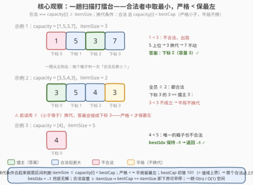
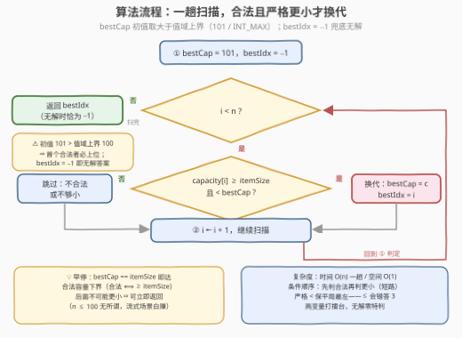

# 容量最小的箱子

- **题目名称**：容量最小的箱子
- **链接**：[3861. 容量最小的箱子](https://leetcode.cn/problems/minimum-capacity-box/)
- **难度**：简单
- **标签**：数组

## 1. 题目概述

**题意**：给定整数数组 `capacity`（`capacity[i]` 为第 $i$ 个箱子的容量）与整数 `itemSize`（物品大小）。若 `capacity[i] >= itemSize` 则第 $i$ 个箱子**可以存放**该物品。要求返回**可存放该物品的容量最小**的箱子的**下标**；若有多个这样的箱子，返回**下标最小**的一个；若没有箱子能存放，返回 `-1`。

**示例 1**：

```text
输入：capacity = [1,5,3,7], itemSize = 3
输出：2
解释：下标为 2 的箱子容量为 3，是可以存放该物品的容量最小的箱子。
```

**示例 2**：

```text
输入：capacity = [3,5,4,3], itemSize = 2
输出：0
解释：可以存放该物品的最小容量为 3，出现在下标 0 和 3。下标 0 更小，因此答案是 0。
```

**示例 3**：

```text
输入：capacity = [4], itemSize = 5
输出：-1
解释：没有任何箱子的容量足够存放该物品。
```

**约束条件**：

- $1 \le \text{capacity.length} \le 100$
- $1 \le \text{capacity[i]} \le 100$
- $1 \le \text{itemSize} \le 100$

> 💡 **审题关键**：① 答案是**下标**不是容量——比较键是「容量最小」，**平局键是「下标最小」」，双关键字；② 「不合法」与「不够小」是两个独立的淘汰理由，扫描时缺一不可；③ 无合法箱子时返回 $-1$，初值哨兵可以天然兜底。

## 2. 解题思路

### 2.1 暴力思路

最朴素的做法是对每个下标 $i$ 都重新扫一遍全数组，验证它是否是「合法且容量最小且最左」的箱子——$O(n^2)$。

更常见的「半暴力」是**排序法**：把 $(\text{capacity}[i], i)$ 二元组按容量升序、容量相同按下标升序排序，从头找到第一个容量 $\ge \text{itemSize}$ 的二元组，其下标即答案；若排序后首位容量都 $< \text{itemSize}$（即最大容量也放不下），返回 $-1$。正确性没问题，但 $O(n \log n)$ 的排序对一道「求最小值」的题是杀鸡用牛刀——**最小值问题不需要全局有序，只需要一趟擂台**。

还有**两趟线性法**：第一趟求出合法箱子的最小容量 $m$，第二趟找 $m$ 首次出现的下标。$O(n)$ 但扫两遍，且要处理「无合法箱子」的特判——一趟打擂台可以把两个量（最小容量、其最左下标）**同时**维护掉。

### 2.2 核心观察：一趟扫描打擂台 + 严格小于保最左



**观察一：合法性是逐元素的独立谓词。** `capacity[i] >= itemSize` 只与第 $i$ 个箱子自己有关，与其它箱子的存在与否无关。因此「判合法」和「选最优」可以在同一趟扫描里完成——这正是打擂台（锦标赛）结构：每个元素上台前先验资格，再与现任擂主比大小。

**观察二：换代条件 = 一个区间判断，严格 `<` 是平局取最左的全部秘密。** 擂主换代当且仅当

$$\text{itemSize} \le \text{capacity}[i] < \text{bestCap}$$

左边保证合法、右边保证严格更小。**严格小于**意味着容量**相等**时不换代：先登台的擂主保住王座，而先登台恰是下标更小——示例 2 中 `[3,5,4,3]`，下标 3 的 `3` 与擂主 `3` 相等，`3 < 3` 不成立不换代，答案自然是下标 0。若误写成 `<=`，答案会错成下标 3。

**观察三：初值哨兵一举两得。** 把 `bestCap` 初始化为大于值域上界的数（题面 `capacity[i] <= 100`，取 `101` 或 `INT_MAX`），则**第一个合法箱子必然上位**（合法容量 $\le 100 < 101$）；`bestIdx` 初始化为 $-1$，全程没人上位时它就是答案——示例 3（`[4]`, `itemSize = 5`）直接返回 $-1$，**零特判**。

**正确性**（归纳一句话）：维护不变式「扫描完前缀 $[0..i]$ 后，`bestIdx` 是该前缀中合法箱子里容量最小者中的最左下标」。归纳步：新来的 `capacity[i+1]` 若不合法或 $\ge \text{bestCap}$，不变式显然保持；若合法且严格更小，它就是前缀 $[0..i+1]$ 的唯一最小容量（严格小于排除了平局），换代后不变式成立。终态即全局结论。

### 2.3 算法流程图



| 步骤 | 操作 | 说明 |
|------|------|------|
| ① 初始化 | `bestCap = 101`，`bestIdx = -1` | 初值大于值域上界 ⇒ 首个合法者必上位；`-1` 兜底无解 |
| ② 扫描判定 | `capacity[i] >= itemSize && capacity[i] < bestCap` | 先判合法再判更小（短路：不合法就不必比大小） |
| ③ 换代 | `bestCap = capacity[i]`，`bestIdx = i` | 平局（相等）不换代 ⇒ 自动保最左下标 |
| ④ 推进 | `i++`，回到 ② | 一趟到底，无回看 |
| ⑤ 收尾 | 返回 `bestIdx` | 从未换代则恰为 `-1` |

### 2.4 示例演算

**示例 1**（`capacity = [1,5,3,7]`，`itemSize = 3`，`bestCap` 初值 101）：

| $i$ | capacity[i] | 合法（$\ge$ 3）？ | $<$ bestCap？ | 动作 | bestCap / bestIdx |
|---|---|---|---|---|---|
| 0 | 1 | ✗（1 < 3） | — | 跳过 | 101 / −1 |
| 1 | 5 | ✓ | ✓（5 < 101） | 换代 | 5 / 1 |
| 2 | 3 | ✓ | ✓（3 < 5） | 换代 | 3 / 2 |
| 3 | 7 | ✓ | ✗（7 ≥ 3） | 跳过 | 3 / 2 |

返回 `bestIdx = 2` ✓。

**示例 2**（`capacity = [3,5,4,3]`，`itemSize = 2`）：下标 0 的 `3` 首位上位（`3/0`）；下标 1 的 `5`、下标 2 的 `4` 都不小于 3，跳过；下标 3 的 `3` 合法但 `3 < 3` 不成立，**平局不换代**——返回 `0` ✓。若条件误写为 `<=`，擂主会在下标 3 被顶替，错答 `3`。

**示例 3**（`capacity = [4]`，`itemSize = 5`）：唯一的箱子 `4 < 5` 不合法，擂台空置，返回初值 `−1` ✓。

## 3. 参考代码

### C++

```cpp
class Solution {
public:
    int minimumIndex(vector<int>& capacity, int itemSize) {
        int bestCap = 101, bestIdx = -1;                    // ① 101 > 值域上界 100；-1 兜底无解
        for (int i = 0; i < (int)capacity.size(); ++i) {
            if (capacity[i] >= itemSize && capacity[i] < bestCap) {  // ② 合法且严格更小
                bestCap = capacity[i];
                bestIdx = i;                                // ③ 平局不换代 ⇒ 自动保最左
            }
        }
        return bestIdx;
    }
};
```

### Python

```python
class Solution:
    def minimumIndex(self, capacity: list[int], itemSize: int) -> int:
        best_cap, best_idx = 101, -1                        # ① 101 > 值域上界 100
        for i, c in enumerate(capacity):
            if itemSize <= c < best_cap:                    # ② 链式比较：合法且严格更小
                best_cap, best_idx = c, i                   # ③ 平局不换代 ⇒ 保最左
        return best_idx
```

> 💡 **写法要点**：
> - Python 的链式比较 `itemSize <= c < best_cap` 恰好把「合法 + 更小」写成一个区间判断，与 2.2 的观察二一一对应；
> - 条件顺序**先合法再更小**：不合法的箱子根本不必进入大小比较（短路求值省一次比较，更重要的是逻辑上两条件职责分明）；
> - `bestCap` 初值任何大于 $\max(\text{capacity})$ 的数都对（`101`、`INT_MAX` 均可），不必纠结具体取值。

## 4. 复杂度分析

| 维度 | 复杂度 | 说明 |
|------|--------|------|
| 时间 | $O(n)$ | 每个箱子恰好判一次，$n \le 100$ 至多 100 次比较 |
| 空间 | $O(1)$ | 只维护 `bestCap` / `bestIdx` 两个变量 |
| 量级判断 | $O(n)$ 已达下界 | 不读完每个箱子就无法排除「后面有更小合法值」的可能（$\Omega(n)$ 信息论下界），一趟扫描即最优 |

## 5. 扩展：早停、有序特化与多查询

**① 早停观察。** 合法容量 $\ge \text{itemSize}$ 意味着 `bestCap` 的理论下界就是 `itemSize`。一旦某次换代后 `bestCap == itemSize`，**后面不可能再出现更小的合法容量**（要更小就得 $< \text{itemSize}$，而那是非法的），且首个达到者的下标已最小——可立即 `return bestIdx`。$n \le 100$ 时无关痛痒，但在**流式/在线**场景（箱子逐个到达、无法回看）是白赚的优化。

**② 有序特化：二分。** 若题目保证 `capacity` **已按升序排序**，答案就是「首个 $\ge \text{itemSize}$ 的位置」——`lower_bound` 一发入魂，$O(\log n)$。这正是 [35. 搜索插入位置](https://leetcode.cn/problems/search-insert-position/) 与 [744. 寻找比目标字母大的最小字母](https://leetcode.cn/problems/find-smallest-letter-greater-than-target/) 的一族；本题的无序版本退化为线性扫描，两相对照正好体会「有序性换对数复杂度」。

**③ 多查询变体。** 若要对**很多个不同的 `itemSize`** 反复查询：预处理时把 `(capacity[i], i)` 按容量升序稳定排序（稳定排序天然保平局最左），并记录前缀最小下标……实际上直接二分「首个容量 $\ge \text{itemSize}$ 的位置」即可——预处理 $O(n \log n)$，单次查询 $O(\log n)$。单次查询时当然还是一趟扫描最划算。

## 6. 面试要点

**Q1：为什么更新条件用严格小于 `<` 而不是 `<=`？**

> 题面要求容量并列时返回**下标最小**的箱子。相等时若换代，擂主会换成**后来者**（下标更大），恰好违反平局语义——示例 2 `[3,5,4,3]` 用 `<=` 会错答 3。严格 `<` 让先登台者（下标小）守住擂主，平局取最左无需任何额外判断。

**Q2：`bestCap` 的初值怎么选？为什么 `bestIdx = -1` 可以兜底无解？**

> 初值只需大于一切可能容量：题面值域 $\le 100$ 故取 `101`（或 `INT_MAX`），保证**第一个合法箱子必然触发换代**。`bestIdx` 初值 `-1`，若全程无人上位（示例 3），循环结束返回的正是 `-1`——无解情形零特判。

**Q3：什么时候可以提前退出？**

> `bestCap == itemSize` 时：合法容量 $\ge \text{itemSize}$，`itemSize` 就是合法容量的下界，后续不可能出现严格更小的合法值；且当前擂主已是首个达到下界者，下标最小。可直接返回。这是「理论下界 + 首达即最优」的常见早停范式。

**Q4：一趟扫描、两趟扫描、排序三种做法怎么取舍？**

> 都是正确做法：排序 $O(n \log n)$ 最贵但思路直白；两趟线性（先求最小合法容量、再找首现下标）要处理无解特判；一趟打擂台 $O(n)$ / $O(1)$ 同时维护两个量、无特判，是本题标准答案。面试时能主动从排序优化到一趟扫描是加分点。

**Q5：如果把「返回下标」改成「返回最小容量本身」或「返回最右下标」，代码怎么变？**

> 返回容量本身：返回 `bestCap <= 100 ? bestCap : -1`（或单独判 `bestIdx == -1`）。返回**最右**下标：把严格 `<` 换成 `<=` 即可——相等也换代，擂主总是同一容量的最后登台者。一符号之差对应平局语义翻转，务必想清楚。

## 7. 同类练习题

- [747. 至少是其他数字两倍的最大数](https://leetcode.cn/problems/largest-number-at-least-twice-of-others/)（[题解](../0701-0800/747_至少是其他数字两倍的最大数.md)）：同款一趟打擂台找最值下标，最大化方向 + 平局同样取最左
- [1299. 将每个元素替换为右侧最大元素](https://leetcode.cn/problems/replace-elements-with-greatest-element-on-right-side/)（[题解](../1201-1300/1299_将每个元素替换为右侧最大元素.md)）：倒序一趟打擂台维护后缀最大值，擂台法换个扫描方向
- [3502. 到达每个位置的最小费用](https://leetcode.cn/problems/minimum-cost-to-reach-every-position/)（[题解](../3501-3600/3502_到达每个位置的最小费用.md)）：前缀最小值一遍扫描——「每个位置都要答案」版的擂台
- [35. 搜索插入位置](https://leetcode.cn/problems/search-insert-position/)（[题解](../0001-0100/35_搜索插入位置.md)）：本题的有序特化版，`lower_bound` 找首个 $\ge$ target 的下标
- [744. 寻找比目标字母大的最小字母](https://leetcode.cn/problems/find-smallest-letter-greater-than-target/)（[题解](../0701-0800/744_寻找比目标字母大的最小字母.md)）：有序数组上「大于目标的最小字母」，二分边界条件的进阶练习
