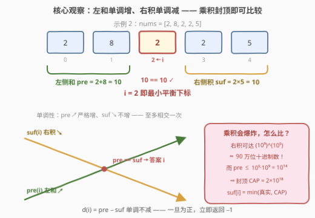
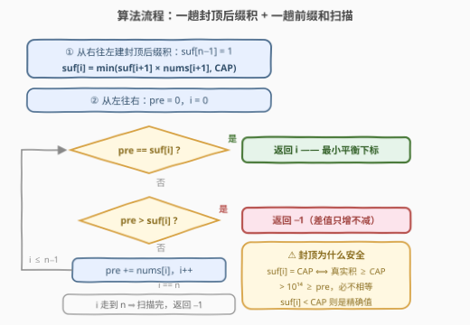

# 找出最小平衡下标

- **题目名称**：找出最小平衡下标
- **链接**：[3862. 找出最小平衡下标](https://leetcode.cn/problems/find-the-smallest-balanced-index/)
- **难度**：中等
- **标签**：数组、前缀和

## 1. 题目概述

给定整数数组 $nums$。若下标 $i$ 满足：**$i$ 左侧所有元素之和等于 $i$ 右侧所有元素之积**，则称 $i$ 为**平衡下标**。左侧没有元素时总和视为 $0$；右侧没有元素时乘积视为 $1$。返回最小的平衡下标；不存在则返回 $-1$。

**示例 1**：

```text
输入：nums = [2,1,2]
输出：1
解释：i = 1 时左侧和 = nums[0] = 2，右侧积 = nums[2] = 2，相等；没有更小的平衡下标。
```

**示例 2**：

```text
输入：nums = [2,8,2,2,5]
输出：2
解释：i = 2 时左侧和 = 2 + 8 = 10，右侧积 = 2 × 5 = 10，相等。
```

**示例 3**：

```text
输入：nums = [1]
输出：-1
解释：i = 0 时左侧为空（和 0），右侧为空（积 1），0 ≠ 1，不存在平衡下标。
```

**约束条件**：$1 \le nums.length \le 10^5$，$1 \le nums[i] \le 10^9$。

> 💡 **审题关键**：① 两侧**量纲不对称**——一侧加法、一侧乘法：左侧和至多 $10^5 \times 10^9 = 10^{14}$，而右侧积可达 $(10^9)^{10^5}$（约 90 万位十进制数字），64 位整数乘两三次就溢出，这才是本题真正的考点；② **元素全 $\ge 1$** 是一切单调性的命脉（见 2.2）；③ 空侧约定「左和 0 / 右积 1」直接决定 $n = 1$ 时答案必为 $-1$（示例 3）。

---

## 2. 解题思路

### 2.1 暴力思路：逐下标现算两侧

对每个下标 $i$：左侧和可以随 $i$ 递推维护；右侧积则需从 $i+1$ 一路乘到 $n-1$。总代价 $O(n^2)$ 次乘法，$n = 10^5$ 时约 $10^{10}$ 次运算，必然超时。

更致命的是**溢出**：真实右积是天文数字，C++ 的 `long long` 乘到第三个 $10^9$ 就爆；Python 的大整数虽不溢出，但每个后缀积可达约 $3 \times 10^6$ bit，逐个增量相乘的总代价是 $O(n \cdot \text{位数})$ 量级——数十亿次字操作，同样不可接受。两个困难指向同一个出路：**右积不能「真算」，只能「带封顶地算」**。

### 2.2 核心观察：封顶后缀乘积 + 差值单调



记 $pre(i) = \sum_{0 \le k < i} nums[k]$（左侧和）、$suf(i) = \prod_{i < k \le n-1} nums[k]$（右侧积），目标是找最小的 $i$ 使 $pre(i) = suf(i)$。四个要点：

1. **前缀和白送**：$pre(i)$ 随扫描递推维护即可，$O(n)$；
2. **后缀积封顶**：$pre(i) \le 10^{14}$，于是取 $CAP = 2 \times 10^{18}$（远大于 $10^{14}$，又远低于 `long long` 上限 $9.2 \times 10^{18}$），只维护 $suf[i] = \min(\text{真实右积},\ CAP)$。**从右往左递推** $suf[i] = \min(suf[i+1] \times nums[i+1],\ CAP)$ 恰好逐下标等于这个 $\min$——因为从右往左真实乘积**只增不减**（元素 $\ge 1$），封顶只发生在「继续变大」的方向，永远不需要「撤销封顶」；
3. **比较语义完好**：$suf[i] < CAP$ 时它是**精确值**，直接与 $pre$ 比较；$suf[i] = CAP$ 时真实右积 $\ge CAP > 10^{14} \ge pre(i)$，该下标**必不平衡**——封顶没有污染任何一次判定；
4. **差值单调，提前判负**：元素 $\ge 1$ 保证 $pre(i)$ 单调不减、$suf(i)$ 随 $i$ 增大单调不增（右移一步，右侧少乘一个 $\ge 1$ 的因子），因此 $d(i) = pre(i) - suf(i)$ 单调不减。从左往右扫，**第一个** $pre = suf[i]$ 就是最小答案；而一旦 $pre > suf[i]$（$d > 0$），此后只增不减、永不再相等，**立即返回 $-1$**。更进一步：$d$ 每步至少增加 $nums[i] \ge 1$，是**严格**递增的——平衡下标至多一个，命中即是唯一解。

> 💡 **一句话**：和用前缀、积用**封顶后缀**、判负靠**单调性**——三次「免单」之后，整题只剩两趟线性扫描。

### 2.3 算法流程图



| 步骤 | 操作 | 说明 |
|------|------|------|
| ① 建后缀积 | 从右往左：$suf[n-1] = 1$，$suf[i] = \min(suf[i+1] \times nums[i+1],\ CAP)$ | 右侧空的积约定为 1；封顶防溢出 |
| ② 初始化 | $pre = 0$，$i = 0$ | 左侧空的和约定为 0 |
| ③ 相等判定 | $pre = suf[i]$？ | 是 → 返回 $i$（最小平衡下标） |
| ④ 判负剪枝 | $pre > suf[i]$？ | 是 → 返回 $-1$（差值单调不减，不会再相等） |
| ⑤ 递推前进 | `pre += nums[i]`，`i++` | 回到 ③ |
| ⑥ 扫描收尾 | $i$ 走到 $n$ | 返回 $-1$ |

### 2.4 示例演算

**示例 2**（$nums = [2,8,2,2,5]$）：先从右往左建封顶后缀积（本例数值小，未触顶）：

| $i$ | 4 | 3 | 2 | 1 | 0 |
|-----|---|---|----|----|-----|
| $suf[i]$ | $1$（右空） | $5$ | $2\times5=10$ | $2\times10=20$ | $8\times20=160$ |

再从左往右扫：

| $i$ | $pre$（左和） | $suf[i]$（右积） | 判定 |
|-----|--------------|------------------|------|
| 0 | $0$ | $160$ | $pre < suf$ → `pre += 2` |
| 1 | $2$ | $20$ | $pre < suf$ → `pre += 8` |
| 2 | $10$ | $10$ | 相等 → **返回 2** ✓ |

**再看一个触顶的例子**（$nums = [10^9, 10^9, 10^9, 7, 1]$）：$suf = [CAP,\ 7\times10^9,\ 7,\ 1,\ 1]$（$suf[0]$ 真实值为 $7 \times 10^{18} > CAP$，被封顶）。扫描：$i=0$ 时 $0 < CAP$ 继续；$i=1$ 时 $10^9 < 7\times10^9$ 继续；$i=2$ 时 $pre = 2\times10^9 > suf[2] = 7$，**单调性触发，直接返回 $-1$**——无需扫完剩余元素，且真实答案确为 $-1$（逐下标验证无一相等）。

---

## 3. 参考代码

### C++

```cpp
class Solution {
public:
    int smallestBalancedIndex(vector<int>& nums) {
        const long long CAP = 2000000000000000000LL;   // 2e18：> 最大和 1e14，< LLONG_MAX
        int n = nums.size();
        vector<long long> suf(n);                      // suf[i] = min(右侧真实乘积, CAP)
        suf[n - 1] = 1;                                // 右侧为空，乘积约定为 1
        for (int i = n - 2; i >= 0; --i) {
            long long r = suf[i + 1];
            // 用除法预判溢出，杜绝中间结果超出 long long
            suf[i] = (r >= CAP || nums[i + 1] > CAP / r) ? CAP : r * nums[i + 1];
        }
        long long pre = 0;                             // 左侧元素和，空侧约定为 0
        for (int i = 0; i < n; ++i) {
            if (pre == suf[i]) return i;               // 第一个相等即最小平衡下标
            if (pre > suf[i])  return -1;              // 差值单调不减：不会再相等
            pre += nums[i];
        }
        return -1;
    }
};
```

### Python

```python
class Solution:
    def smallestBalancedIndex(self, nums: List[int]) -> int:
        CAP = 2 * 10 ** 18                    # 封顶：> 最大和 1e14 即可
        n = len(nums)
        suf = [1] * n                         # suf[i] = min(右侧真实乘积, CAP)
        for i in range(n - 2, -1, -1):
            suf[i] = min(suf[i + 1] * nums[i + 1], CAP)
        pre = 0
        for i in range(n):
            if pre == suf[i]:
                return i                      # 最小平衡下标
            if pre > suf[i]:
                return -1                     # 单调性：差值只增不减
            pre += nums[i]
        return -1
```

> 💡 **写法要点**：① C++ 的溢出预判用**除法** `nums[i+1] > CAP / r` 而非「乘完再比」——后者的中间结果本身就可能溢出，属于未定义行为；② `r >= CAP` 短路在前，已封顶的值直接续封顶，语义是「真实 $\ge CAP$ 的值乘上 $\ge 1$ 的因子仍然 $\ge CAP$」；③ **Python 也要封顶**：不是为了防溢出（大整数不会溢出），而是防性能塌方——不封顶时右积可达约 90 万位，增量相乘的总代价是 $O(n \times \text{位数})$；封顶后每次乘法都是 64 位量级的小数字运算；④ $n = 1$ 时第一个循环不执行、$suf[0] = 1$，扫描得 $0 \ne 1$ 且 $0 < 1$，循环结束返回 $-1$，与示例 3 一致。

---

## 4. 复杂度分析

| 维度 | 复杂度 | 说明 |
|------|--------|------|
| **时间** | $O(n)$ | 两趟线性扫描：建后缀积一趟、判定一趟，每个元素常数次 64 位运算；判负剪枝在典型输入上更快 |
| **空间** | $O(n)$ | 后缀积数组 $suf$；前缀和只需 $O(1)$ 的滚动变量 |
| **量级判断** | $n \le 10^5$ | 对比暴力 $O(n^2) \approx 10^{10}$ 次运算必超时；线性解每个元素至少读一次，$O(n)$ 已是下界 |

---

## 5. 扩展：O(1) 空间变体与约束的边界

- **$O(1)$ 空间变体**：平衡下标处必有 $suf(i) = pre(i) \le 10^{14}$，即**答案右侧的乘积不超 $10^{14}$**。先从右往左用一个变量连乘，停在乘积即将越过 $10^{14}$ 的位置 $p$——所有候选下标必然 $\ge p$；再从 $p$ 向右扫，此后乘积全程 $\le 10^{14}$、**精确可除**（每右移一位，`suf /= nums[i+1]`，必整除），边除边与递增的 $pre$ 比较。两趟扫描、常数空间；代价是两处边界索引容易写错，工程上不如数组版清爽；
- **为什么不二分**：$d(i)$ 单调理论上可二分找零点，但**单点求 $d(i)$ 本身就要 $O(n)$ 次封顶乘法**，总代价 $O(n \log n)$ 反而更差；
- **若元素可能为 0**：右移时若「丢掉」的恰好是那个 0，右积会从 $0$ 跳回正数，$suf$ 不再单调不增——提前判负失效，只能全程精确比较（且除法技巧因除零报废）；
- **若元素可能为负数**：乘积符号来回震荡，单调性彻底瓦解，封顶比较也失去意义——本题的优雅完全建立在 $nums[i] \ge 1$ 之上。

---

## 6. 面试要点

**Q1：右侧乘积高达 $(10^9)^{10^5}$，凭什么敢封顶？**

> 因为比较的另一方——左侧和——至多 $10^5 \times 10^9 = 10^{14}$。取 $CAP = 2 \times 10^{18}$ 后：$suf[i] < CAP$ 意味着它是精确值，可直接比较；$suf[i] = CAP$ 意味着真实积 $\ge CAP > 10^{14} \ge pre$，该下标必不平衡。两种情形的判定语义都完好，封顶没有丢失任何信息。CAP 的选取区间是 $(10^{14},\ \text{LLONG\_MAX}]$，取 $2 \times 10^{18}$ 两头都留足余量。

**Q2：从右往左递推时一旦封顶，误差会不会「传染」后续的值？**

> 不会。归纳可证 $suf[i] = \min(\text{真实}_i,\ CAP)$ 对**每个**下标独立成立：若 $suf[i+1]$ 精确，乘上 $nums[i+1]$ 后要么仍 $\le CAP$（精确），要么封顶（真实 $> CAP$）；若 $suf[i+1]$ 已是 $CAP$（真实 $\ge CAP$），乘上 $\ge 1$ 的因子后真实值仍 $\ge CAP$，继续封顶正确。关键在**方向**：从右往左真实乘积只增不减，封顶只发生在增大方向；而扫描时（从左往右）$suf$ 递减，能正确「落回」精确值。

**Q3：为什么 $pre > suf[i]$ 时敢直接返回 $-1$？**

> $pre$ 单调不减、$suf$ 单调不增（都依赖 $nums[k] \ge 1$），故 $d(i) = pre(i) - suf(i)$ 单调不减。$d(i) > 0$ 之后对所有 $j > i$ 都有 $d(j) \ge d(i) > 0$，等式永不再成立。封顶值不影响该论证：$pre < CAP$，故 $pre > suf[i]$ 只可能发生在 $suf[i]$ 为精确值时。实际上 $d$ 每步至少 $+1$、严格递增，平衡下标至多一个。

**Q4：Python 有任意精度整数，还需要封顶吗？**

> 需要，但理由不同：不是防溢出，是防**性能塌方**。不封顶时后缀积可达约 $3 \times 10^6$ bit（90 万位十进制），从右往左增量相乘要做 $n$ 次大数乘小数，总代价 $O(n \times \text{位数})$，约数十亿次字操作，必然超时。封顶后所有中间数都在 64 位量级内，线性扫过毫无压力。

**Q5：空侧约定和边界用例怎么处理？**

> 左空和为 $0$、右空积为 $1$，代码里体现为 `pre` 初值 0、`suf[n-1] = 1`。由此 $n = 1$ 时 $0 \ne 1$ 且 $0 < 1$，返回 $-1$（示例 3）；全 1 数组 $[1,1,\dots]$ 中 $i = 1$ 处左和 $1$ = 右积 $1$，答案是 $1$ 而非 $0$（$i=0$ 时 $0 < 1$）。写完代码拿这两个用例过一遍，空侧约定是否落对位置一目了然。

> 💡 **一句话总结**：前缀和管左、**封顶后缀积**管右、**单调性**管提前判负——三件套把 $O(n^2)$ 的天文数字问题压成两趟 $O(n)$ 的 64 位运算。

---

## 7. 同类练习题

- [724. 寻找数组的中心下标](https://leetcode.cn/problems/find-pivot-index/)（[题解](../0701-0800/724_寻找数组的中心下标.md)）：本题的「全加法」母题，左和 == 右和，前缀和套路的原型
- [1991. 找到数组的中间位置](https://leetcode.cn/problems/find-the-middle-index-in-array/)（[题解](../1901-2000/1991_找到数组的中间位置.md)）：724 的换皮题，练「总和维护 + 左和推导右和」的手感
- [238. 除自身以外数组的乘积](https://leetcode.cn/problems/product-of-array-except-self/)（[题解](../0201-0300/238_除自身以外数组的乘积.md)）：前缀积 × 后缀积的经典载体，本题第 ① 步的最小原型
- [152. 乘积最大子数组](https://leetcode.cn/problems/maximum-product-subarray/)（[题解](../0101-0200/152_乘积最大子数组.md)）：体会乘法相较加法的爆炸式增长与负号陷阱，理解本题为何必须封顶
- [303. 区域和检索 - 数组不可变](https://leetcode.cn/problems/range-sum-query-immutable/)：前缀和的裸模板，$O(1)$ 查询区间和的基本功
