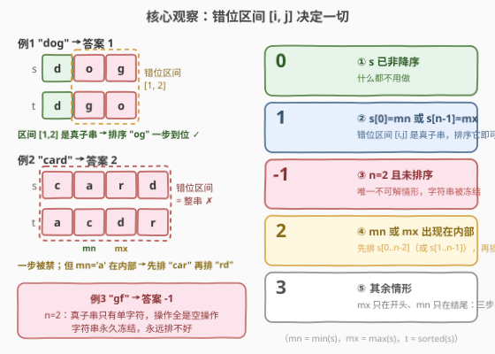
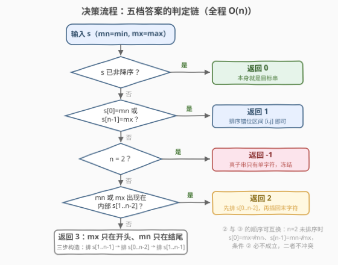

# 将一个字符串排序的最小操作次数

- **题目名称**：将一个字符串排序的最小操作次数
- **链接**：[3863. 将一个字符串排序的最小操作次数](https://leetcode.cn/problems/minimum-operations-to-sort-a-string/)
- **难度**：中等
- **标签**：字符串、贪心、排序

## 1. 题目概述

**题意**：给定由小写字母组成的字符串 `s`。一次操作可以选择 `s` 的任意**子字符串**（但**不能**是整个字符串），将其按**非降序**排序。返回使 `s` 变为非降序所需的**最小**操作次数；无法做到则返回 `-1`。

**示例 1**：

```text
输入：s = "dog"
输出：1
解释：将子字符串 "og" 排序为 "go"，得 s = "dgo"，已升序。
```

**示例 2**：

```text
输入：s = "card"
输出：2
解释：将 "car" 排序为 "acr" 得 "acrd"；再将 "rd" 排序为 "dr" 得 "acdr"。
```

**示例 3**：

```text
输入：s = "gf"
输出：-1
解释：无法完成排序。
```

**约束条件**：

- $1 \le s.length \le 10^5$
- `s` 仅由小写英文字母组成

> 💡 **审题关键**：① 操作对象是**任意真子串**——「不能排整个字符串」这一条限制是全题的灵魂，若无它则任何输入一步搞定；② 排序只重排字符、不增删字符，**字符多重集不变**，目标串 $t = \text{sorted}(s)$ 全程固定；③ $n$ 可达 $10^5$，提示我们答案不是搜出来的，而是**判定**出来的——事实上答案只有 $0 / 1 / 2 / 3 / -1$ 五种取值。

## 2. 解题思路

### 2.1 暴力思路

把字符串本身看作状态，每条有向边对应一次合法操作（选一个真子串排序），从 `s` 出发 BFS，最先到达 $t = \text{sorted}(s)$ 的层数即答案。状态空间最坏是全体多重排列，数量指数级（"cba" 的重排就有 $3! = 6$ 个状态，长度 100 的串直接天文数字），$n = 10^5$ 完全不可行。

正解的姿势是反过来：**不去搜索最少几步，而是刻画「一步/两步能做到什么」，把答案直接判定出来**。下面用 $n = |s|$、$mn = \min(s)$、$mx = \max(s)$、$t = \text{sorted}(s)$，并记 $i, j$ 为 $s$ 与 $t$ 第一个、最后一个不同的位置（**错位区间** $[i, j]$；$s$ 已有序时约定 $i > j$）。

### 2.2 核心观察：错位区间 + 五档分类判定



**观察一（多重集不变）**：每次操作只是把一段字符重排，$s$ 的字符多重集永远不变，因此目标 $t$ 全程固定，且任意时刻 $\min = mn$、$\max = mx$ 不变。

**观察二（一次操作的充要条件）**：把子串 $[l, r]$ 排序后，区间**之外**的位置原封不动。要想一步变成 $t$，$[l, r]$ 之外的每个位置必须**已经**与 $t$ 对齐——即窗口必须覆盖全部错位位置，$[l, r] \supseteq [i, j]$。反过来，若窗口之外全对齐，则 $s[l..r]$ 与 $t[l..r]$ 的多重集自动相同（整体多重集相等，减去相等的前后缀），所以**最小的错位区间 $[i, j]$ 本身排序后恰好就是 $t$**。于是：

$$\text{一次可行} \iff [i, j] \text{ 是真子串} \iff i > 0 \text{ 或 } j < n-1 \iff s[0] = mn \text{ 或 } s[n-1] = mx$$

最后一步等价是因为 $i > 0 \iff s[0] = t[0] = mn$，$j < n-1 \iff s[n-1] = t[n-1] = mx$。示例 1 里 `"dog"` 的错位区间是 $[1, 2]$（首位的 `d` 已对齐），排序 `"og"` 即到位；而 `"card"` 的错位区间是 $[0, 3]$ = 整串，一步被禁。

**观察三（唯一的不可解情形）**：$n = 2$ 且未排序时，真子串只剩**单字符**，排序单字符是空操作——字符串永久冻结，返回 $-1$。除此之外永远可解：$n \ge 3$ 时下面给出 2 步或 3 步的显式构造。

**观察四（两步 vs 三步）**：在排除 $0 / 1 / -1$ 之后（此时必有 $s[0] \ne mn$ 且 $s[n-1] \ne mx$）：

- **若 $mn$ 或 $mx$ 出现在内部 $s[1..n-2]$ → 答案 2**。以 $mn$ 在内部为例：第一步排 $s[0..n-2]$（真子串），得到 $A + c$，其中 $A = \text{sorted}(s[0..n-2])$ 以 $mn$ 开头、$c = s[n-1]$；第二步把 $c$ 插回 $A$ 中正确的位置 $q$——由于 $A$ 里已经有 $mn$，总可取 $q \ge 1$，于是排序 $s'[q..n-1]$（仍是真子串）恰把 $c$ 送到位。$mx$ 在内部时对称：先排 $s[1..n-1]$，再排序 $s''[0..q]$（$q \le n-2$）插回首字符。示例 2 `"card"` 正是这条路径：排 `"car"` 得 `"acrd"`，再排 `"rd"` 得 `"acdr"`。
- **否则（$mx$ 只出现在开头、$mn$ 只出现在结尾，即 $s = mx + M + mn$，$M$ 中不含 $mn/mx$）→ 答案 3**。三步构造：① 排 $s[1..n-1]$，$M + mn$ 排完变成 $mn + \text{sorted}(M)$；② 排 $s[0..n-2]$，把 $mx$ 换到倒数第二位；③ 排 $s[1..n-1]$ 收尾，得 $mn + \text{sorted}(M) + mx = t$。

> ⚠️ **三步的下界（为什么两步必不够）**：要想两步完成，第一步之后必须落在「再一次就能排完」的状态，由观察二即 $s'[0] = mn$ 或 $s'[n-1] = mx$。但对 $s = mx + M + mn$ 做任何一次操作：
> - 动了位置 0（$l = 0$，则必有 $r \le n-2$）：$s'[0] = \min(mx + M\text{ 的前缀}) > mn$，且位置 $n-1$ 未动仍是 $mn \ne mx$；
> - 没动位置 0（$l \ge 1$）：$s'[0] = mx \ne mn$；若 $r < n-1$ 则 $s'[n-1] = mn$，若 $r = n-1$ 则 $s'[n-1] = \max(M \cup \{mn\}) < mx$。
>
> 两种情况都两个条件全不满足 ⇒ 任何第一步都通向「至少还需两步」的状态 ⇒ 答案恰为 3。

### 2.3 算法流程图



| 步骤 | 判定 | 为真时返回 | 依据 |
|------|------|-----------|------|
| ① | `s` 已非降序 | `0` | 无需操作 |
| ② | `s[0] == mn` 或 `s[n-1] == mx` | `1` | 错位区间 $[i,j]$ 是真子串 |
| ③ | `n == 2` | `-1` | 真子串全是单字符，状态冻结 |
| ④ | `mn` 或 `mx` 出现在 `s[1..n-2]` | `2` | 先排前缀（或后缀）再插回端点字符 |
| ⑤ | 其余情形 | `3` | $mx$ 只在头、$mn$ 只在尾，三步构造 |

### 2.4 示例演算

| `s` | $t$ | 错位区间 | 判定路径 | 答案 |
|---|---|---|---|---|
| `"dog"` | `"dgo"` | $[1,2]$，真子串 | ②：$s[0]=$ `d` $= mn$ | **1** |
| `"card"` | `"acdr"` | $[0,3]$，整串 | ②✗ → ④：`a`(mn) 在内部 | **2** |
| `"gf"` | `"fg"` | $[0,1]$，整串 | ②✗ → ③：$n=2$ | **-1** |
| `"cba"` | `"abc"` | $[0,2]$，整串 | ②✗③✗ → ④✗（mn/mx 都不在内部） | **3** |

**三步构造演示（`"cba"`）**：

```text
cba  --排 s[1..2]="ba"-->  cab   (M+mn 排成 mn+sorted(M))
cab  --排 s[0..1]="ca"-->  acb   (把 mx 换到倒数第二位)
acb  --排 s[1..2]="cb"-->  abc ✓
```

**两步构造演示（`"card"`，$mn=$ `a` 在内部位置 1）**：排 $s[0..2]=$ `"car"` → `"acr"`，得 `"acrd"`；末字符 $c=$ `d` 插回位置 $q=2$，排 `s[2..3]`=`"rd"` → `"acdr"` ✓——与官方示例的解释完全一致。

## 3. 参考代码

### C++

```cpp
class Solution {
public:
    int minOperations(string s) {
        int n = s.size();
        bool sortedOk = true;
        for (int k = 1; k < n; ++k)
            if (s[k] < s[k - 1]) { sortedOk = false; break; }
        if (sortedOk) return 0;                          // ① 已非降序

        char mn = *min_element(s.begin(), s.end());
        char mx = *max_element(s.begin(), s.end());
        if (s[0] == mn || s[n - 1] == mx) return 1;      // ② 错位区间是真子串

        if (n == 2) return -1;                           // ③ 操作全是空操作

        for (int k = 1; k <= n - 2; ++k)                 // ④ 看 mn/mx 是否在内部
            if (s[k] == mn || s[k] == mx) return 2;
        return 3;                                        // ⑤ mx 只在头、mn 只在尾
    }
};
```

### Python

```python
class Solution:
    def minOperations(self, s: str) -> int:
        n = len(s)
        if all(s[k] <= s[k + 1] for k in range(n - 1)):
            return 0                                  # ① 已非降序
        mn, mx = min(s), max(s)
        if s[0] == mn or s[-1] == mx:
            return 1                                  # ② 错位区间是真子串
        if n == 2:
            return -1                                 # ③ 操作全是空操作
        if mn in s[1:-1] or mx in s[1:-1]:
            return 2                                  # ④ mn/mx 出现在内部
        return 3                                      # ⑤ mx 只在头、mn 只在尾
```

> 💡 **写法要点**：
> - **不必真的排序**：判定只用到「是否有序 + $mn/mx$ + 内部扫描」，全程线性；写 `sorted(s)` 也行（$O(n \log n)$），但没有必要。
> - Python 的 `mn in s[1:-1]` 会切出一份子串（$O(n)$ 额外空间），介意的话可换成 `s.find(mn, 1, n - 1) != -1` 做到 $O(1)$ 额外空间。
> - ② 与 ③ 的先后可互换：$n=2$ 未排序时 $s[0] = mx \ne mn$、$s[1] = mn \ne mx$，②的条件必然不成立，不会误判。

## 4. 复杂度分析

| 维度 | 复杂度 | 说明 |
|------|--------|------|
| 时间 | $O(n)$ | 判有序、求 $mn/mx$、扫内部各一遍，常数个线性扫描 |
| 空间 | $O(1)$ | 只需常数个变量（避免 Python 切片拷贝后） |
| 量级判断 | $n \le 10^5$，约 4 遍扫描 | 远低于时限；无排序、无数据结构，常数极小 |

## 5. 扩展：限制即难度

**① 「禁排整串」制造了全部难度。** 若允许排整个字符串，任何未排序的输入答案都是 1，问题瞬间退化。正是这条禁令让「错位区间恰为整串」的串（如 `card`、`cba`）必须绕道：先用一次操作在头或尾**腾出一个对齐位**（利用内部的 $mn/mx$），再收尾。改动操作限制（禁前缀、禁后缀、只能排长度 $\ge k$ 的子串……）是同族题的常见出题手法。

**② 同族变体 1585。** 同样的「子串排序」操作，问的是**可达性**（能否变成给定 $t$）而非最少次数。每次排序可把某字符左移、且被跨越的字符必须不小于它，判定标准转化为每个数字的「前方更大字符计数」用桶维护——体会同一操作下「判定可达」与「判定最少步数」的视角差异。

**③ 单遍扫描合并。** 判有序、记录 $mn/mx$、标记内部是否出现 $mn/mx$ 可以合并进同一次 `for` 循环（先跑完有序性检查再回头扫内部即可），竞赛中减少代码量的同时也减少一次遍历的常数。

## 6. 面试要点

**Q1：答案为什么只有 0/1/2/3/-1 五种？各档的充要条件是什么？**

> ① 已有序 → 0；② $s[0]=mn$ 或 $s[n-1]=mx$ → 1；③ $n=2$ 未排序 → -1；④ $mn$ 或 $mx$ 出现在内部 $s[1..n-2]$ → 2；⑤ 其余（$mx$ 只在开头且 $mn$ 只在结尾）→ 3。②④⑤ 的依据见 Q2、Q4，③ 是唯一不可解情形。

**Q2：为什么「一次操作可行 ⟺ $s[0]=mn$ 或 $s[n-1]=mx$」？**

> 排序 $[l,r]$ 后区间外位置不动，故赢的窗口必须覆盖所有错位位置 $[i,j]$；而窗口外全对齐时 $s[l..r]$ 与 $t[l..r]$ 多重集自动相同，$[i,j]$ 本身排序即到位。所以一次可行 ⟺ $[i,j]$ 是真子串 ⟺ $i>0$ 或 $j<n-1$ ⟺ 首位或末位已与 $t$ 对齐，即 $s[0]=mn$ 或 $s[n-1]=mx$。

**Q3：为什么 $n=2$ 是唯一的 -1？**

> $n=2$ 未排序时真子串只有单字符，排序是恒等变换，状态永久冻结。$n \ge 3$ 时观察四给出 2 步（$mn/mx$ 在内部）或 3 步的显式构造，永远可解。

**Q4：2 和 3 怎么区分？三步的下界为什么成立？**

> $mn$ 或 $mx$ 在内部 → 2：先排 $s[0..n-2]$（或 $s[1..n-1]$）把主体排好、端点字符悬在末尾，再排一段真子串把它插回正确位置（插入点可保证避开整串）。否则 $s = mx + M + mn$：任何一次操作后 $s'[0] \ne mn$ 且 $s'[n-1] \ne mx$（分类讨论操作是否触及位置 0 / $n-1$），由 Q2 的判据知还需至少两步，故下界 3；配合三步构造恰为 3。

**Q5：有哪些 corner case？**

> $n=1$（有序 → 0）；全同字符如 `"aaa"`（→ 0）；$n=2$ 三态 `"ab"`/`"aa"`/`"ba"`（0/0/-1）；`"a...ab"` 型（$s[0]=mn$ → 1）；`"bab"`（$s[n-1]=mx$ → 1）；`"baba"`（$mn$ 在内部 → 2）；`"cba"`（→ 3）。写完不妨用小规模 BFS 对拍验证五档判定。

## 7. 同类练习题

- [1585. 检查字符串是否可以通过排序子字符串得到另一个字符串](https://leetcode.cn/problems/check-if-string-is-transformable-with-substring-sort-operations/)（[题解](../1501-1600/1585_检查字符串是否可以通过排序子字符串得到另一个字符串.md)）：同一「子串排序」操作改问可达性，不变量换成前方更大字符的桶计数
- [1460. 通过反转子数组使两个数组相等](https://leetcode.cn/problems/make-two-arrays-equal-by-reversing-subarrays/)：受限操作下的多重集不变性判可达——与本题「$t$ 恒为 $\text{sorted}(s)$」同款思想
- [1051. 高度检查器](https://leetcode.cn/problems/height-checker/)（[题解](../1001-1100/1051_高度检查器.md)）：与有序序列逐位比较数错位个数，本题「错位区间」概念的入门版
- [969. 煎饼排序](https://leetcode.cn/problems/pancake-sorting/)（[题解](../0901-1000/969_煎饼排序.md)）：受限操作（前缀反转）下构造排序步骤的方案
- [926. 将字符串翻转到单调递增](https://leetcode.cn/problems/flip-string-to-monotone-increasing/)（[题解](../0901-1000/926_将字符串翻转到单调递增.md)）：「前缀 + 后缀」分解目标结构的轻量练习
