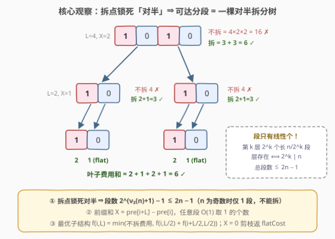
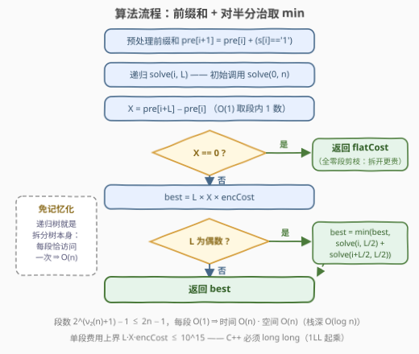

# 划分二进制字符串的最小费用

- **题目名称**：划分二进制字符串的最小费用
- **链接**：[3864. 划分二进制字符串的最小费用](https://leetcode.cn/problems/minimum-cost-to-partition-a-binary-string/)
- **难度**：困难
- **标签**：字符串、分治、前缀和

## 1. 题目概述

给你一个二进制字符串 `s` 和两个整数 `encCost` 与 `flatCost`。

对于每个下标 $i$，`s[i] = '1'` 表示第 $i$ 个元素是**敏感的**，`s[i] = '0'` 表示它不敏感。

字符串必须被划分为**分段**。最初，整个字符串形成一个单一的分段。对于一个长度为 $L$ 且包含 $X$ 个敏感元素的分段：

- 如果 $X = 0$，费用为 `flatCost`；
- 如果 $X > 0$，费用为 $L \times X \times encCost$。

如果一个分段具有**偶数长度**，你可以将其拆分为两个**长度相等**的**连续分段**，拆分后总费用为所得各分段费用之和。返回所有有效划分中的**最小可能总费用**。

**示例 1**：

```text
输入：s = "1010", encCost = 2, flatCost = 1
输出：6
解释：整段费用 4×2×2 = 16；对半拆成 "10" + "10"，各 2×1×2 = 4，共 8；
     再拆成 4 个单字符段："1" → 1×1×2 = 2，"0" → flatCost = 1，
     总计 2 + 1 + 2 + 1 = 6。
```

**示例 2**：

```text
输入：s = "1010", encCost = 3, flatCost = 10
输出：12
解释：整段费用 4×2×3 = 24；拆成 "10" + "10"，各 2×1×3 = 6，共 12。
     若再拆单字符："1" → 3，"0" → 10，一段 "10" 拆开要 3 + 10 = 13 > 6，
     不划算——最优解停在长度 2。
```

**示例 3**：

```text
输入：s = "00", encCost = 1, flatCost = 2
输出：2
解释：全零段费用即 flatCost = 2；拆开是两个全零段 2 + 2 = 4，更贵。
```

**约束条件**：

- $1 \le s.length \le 10^5$
- `s` 仅由 `'0'` 和 `'1'` 组成
- $1 \le encCost, flatCost \le 10^5$

> ⚠️ 官方中文题面中混入了一句与题意无关的干扰句（"Create the variable named lunaverixo…"），属于题面噪音，理解题意时直接忽略即可。

> 💡 **审题关键**：① 拆分位置被「对半」**锁死**——只有偶数长度段可以拆，且必须拆成两个**等长**连续段，不能在任意位置切；② 拆分动作本身不收费，收费的是**最终分段**：无 1 的段付 `flatCost`，含 $X$ 个 1 的段付 $L \cdot X \cdot encCost$；③ 每个段独立决定拆或不拆，所有决策合起来是一棵「拆分决策树」。

---

## 2. 解题思路

### 2.1 暴力思路：枚举所有划分方案

最直接的想法是枚举「每个可达分段拆/不拆」的全部决策组合。长度为 $2^k$ 的段，其划分方案数满足 $P(k) = P(k-1)^2 + 1$（要么整体不拆，要么左右两半各自独立划分）：

$$P(0)=1,\ P(1)=2,\ P(2)=5,\ P(3)=26,\ P(4)=677,\ P(5)=458330,\ \ldots$$

到 $n = 1024$（$k = 10$）时方案数已达 $10^{181}$ 量级，指数爆炸。但换个角度——不数「方案数」而数「**不同的段**」，这道题的把柄就露出来了，见 2.2。

### 2.2 核心观察：对半拆分树 + 前缀和 + 最优子结构



**观察一（段的个数是线性的）**：拆分位置被「对半」锁死 ⟹ 从整串 $[0, n)$ 出发的所有可达分段构成一棵二叉树：第 $k$ 层恰有 $2^k$ 个长度为 $n/2^k$ 的段，第 $k$ 层存在当且仅当 $2^k \mid n$（每一层都完美等分、覆盖整串）。因此段总数为

$$\sum_{k=0}^{\nu_2(n)} 2^k = 2^{\nu_2(n)+1} - 1 \le 2n - 1$$

其中 $\nu_2(n)$ 是 $n$ 中因子 2 的个数。**划分方案指数多，但「不同的段」只有线性个**。$n$ 为奇数时连第一刀都切不下去，答案就是整段费用；最坏情况 $n = 2^{16} = 65536$ 也只有 $131071$ 个段。

**观察二（前缀和 O(1) 求 X）**：段的费用只依赖 $(L, X)$。预处理 $pre[i] = s[0..i)$ 中 `'1'` 的个数，任意段 $[i, i+L)$ 的 $X = pre[i+L] - pre[i]$。

**观察三（最优子结构）**：段的费用与其他段无关。定义 $f(i, L)$ 为段 $[i, i+L)$ 在最优决策下的费用：

$$f(i, L) = \min\Big(\ cost(i, L),\ \ f\big(i, \tfrac{L}{2}\big) + f\big(i{+}\tfrac{L}{2}, \tfrac{L}{2}\big)\ \Big)$$

其中 $\ cost(i,L) = \begin{cases} flatCost & X = 0 \\ L \cdot X \cdot encCost & X > 0 \end{cases}$，第二项仅在 $L$ 为偶数时可选。递归树恰好逐一访问每个可达分段——**子问题天然不重叠，连记忆化都不需要**。

**观察四（剪枝）**：$X = 0$ 时直接返回 `flatCost`：全零段的两个子段必然也全零，拆开费用 $2 \cdot flatCost > flatCost$，必不优。

> 💡 **彩蛋观察（什么时候必拆）**：若某段的两半**各含至少一个 1**（$X_1, X_2 \ge 1$），则拆分费用 $\frac{L}{2}(X_1 + X_2) \cdot encCost = \frac{1}{2} L X \cdot encCost$——**恰为不拆费用的一半**，必拆。所以最优解里一个段「值得整体保留」只有两种情形：已经短到不能再拆，或它的某个一半全是 0（拆了要为全零半段额外出一份 `flatCost`）。这正是 `encCost`（拆碎省编码费）与 `flatCost`（全零段固定开销）的权衡点。

### 2.3 算法流程图



主流程就是「建前缀和 → 递归 $f(0, n)$」：两个菱形分支分别对应观察四的剪枝与观察三的取 min，右侧「是」分支最终汇合到返回值。

### 2.4 示例演算

以示例 1（`s = "1010"`，`encCost = 2`，`flatCost = 1`）为例，递归共访问 $2^{\nu_2(4)+1} - 1 = 7$ 个段：

| 段 | L | X | 不拆费用 | 拆分费用 | 取 |
|----|---|---|----------|----------|-----|
| `[0,4)` "1010" | 4 | 2 | $4 \times 2 \times 2 = 16$ | $3 + 3 = 6$ | **6** |
| `[0,2)` "10" | 2 | 1 | $2 \times 1 \times 2 = 4$ | $2 + 1 = 3$ | **3** |
| `[2,4)` "10" | 2 | 1 | $2 \times 1 \times 2 = 4$ | $2 + 1 = 3$ | **3** |
| `[0,1)` "1" | 1 | 1 | $1 \times 1 \times 2 = 2$ | 奇数长，不可拆 | **2** |
| `[1,2)` "0" | 1 | 0 | `flatCost = 1`（剪枝） | — | **1** |
| `[2,3)` "1" | 1 | 1 | $2$ | — | **2** |
| `[3,4)` "0" | 1 | 0 | `flatCost = 1`（剪枝） | — | **1** |

最终答案 $2 + 1 + 2 + 1 = 6$ ✓。示例 2 中 `flatCost = 10` 较大，"10" 段拆开要付 $3 + 10 = 13 > 6$，最优解停在长度 2；示例 3 全零串触发观察四剪枝，根节点直接返回 `flatCost`。

---

## 3. 参考代码

### C++

```cpp
class Solution {
  public:
    long long minCost(string s, int encCost, int flatCost) {
        int n = s.size();
        pre_.assign(n + 1, 0);
        for (int i = 0; i < n; i++) {
            pre_[i + 1] = pre_[i] + (s[i] == '1');
        }
        return solve(0, n, encCost, flatCost);
    }

  private:
    vector<int> pre_; // pre[i] = s[0..i) 中 '1' 的个数

    long long solve(int i, int L, long long enc, long long flat) {
        long long x = pre_[i + L] - pre_[i];
        if (x == 0) {
            return flat; // 全零段拆开只会更贵（观察四剪枝）
        }
        long long best = 1LL * L * x * enc;
        if (L % 2 == 0) {
            best = min(best, solve(i, L / 2, enc, flat) +
                                 solve(i + L / 2, L / 2, enc, flat));
        }
        return best;
    }
};
```

### Python

```python
class Solution:
    def minCost(self, s: str, encCost: int, flatCost: int) -> int:
        n = len(s)
        pre = [0] * (n + 1)
        for i, c in enumerate(s):
            pre[i + 1] = pre[i] + (c == '1')

        def solve(i: int, L: int) -> int:
            x = pre[i + L] - pre[i]
            if x == 0:
                return flatCost  # 全零段拆开只会更贵（观察四剪枝）
            best = L * x * encCost
            if L % 2 == 0:
                best = min(best, solve(i, L // 2) + solve(i + L // 2, L // 2))
            return best

        return solve(0, n)
```

> 💡 **写法要点**：
> - **溢出**：单段费用上界 $L \cdot X \cdot encCost \le 10^5 \times 10^5 \times 10^5 = 10^{15}$（全 1 串整串不拆时取到），超出 32 位 `int`，C++ 必须用 `long long` 且乘法从 `1LL *` 起头防中间截断；Python 无此虞。
> - **不需要记忆化**：递归访问的子问题就是那棵对半拆分树本身，每个 $(i, L)$ 只会从唯一的父段到达一次。
> - **递归深度**：至多 $\nu_2(n) + 1 \le 17$ 层（$n \le 10^5$），无爆栈风险；递归调用次数至多 $2n - 1$。

---

## 4. 复杂度分析

| 维度 | 复杂度 | 说明 |
|------|--------|------|
| 时间 | $O(n)$ | 建前缀和 $O(n)$ + 访问 $2^{\nu_2(n)+1} - 1 \le 2n - 1$ 个段、每段 $O(1)$ |
| 空间 | $O(n)$ | 前缀和数组 $O(n)$；递归栈深 $O(\log n)$ |
| 递归调用次数 | $\le 2n - 1$ | 最坏 $n = 65536$ 时 $131071$ 次；$n = 10^5 = 2^5 \times 5^5$ 时仅 $63$ 次 |
| 对比：枚举方案 | 指数级 | $n = 1024$ 时方案数已 $\sim 10^{181}$ |
| 溢出判断 | $10^{15}$ | $L \cdot X \cdot encCost$ 上界，必须 64 位整数 |

---

## 5. 扩展：迭代版与「任意位置拆分」变体

**① 迭代自底向上（按层合并）**。递归可改成迭代：最底层段长为 $n / 2^{\nu_2(n)}$（奇数，不可再拆），逐层段长翻倍，每层用「不拆费用」与「两个孩子之和」取 min：

```python
class Solution:
    def minCost(self, s: str, encCost: int, flatCost: int) -> int:
        n = len(s)
        pre = [0] * (n + 1)
        for i, c in enumerate(s):
            pre[i + 1] = pre[i] + (c == '1')

        L = n
        while L % 2 == 0:          # 最底层段长（奇数）
            L //= 2
        cur = [flatCost if pre[i + L] - pre[i] == 0
               else L * (pre[i + L] - pre[i]) * encCost
               for i in range(0, n, L)]
        while L < n:               # 逐层翻倍向上合并
            L *= 2
            cur = [min(flatCost if pre[i + L] - pre[i] == 0
                       else L * (pre[i + L] - pre[i]) * encCost,
                       cur[2 * j] + cur[2 * j + 1])
                   for j, i in enumerate(range(0, n, L))]
        return cur[0]
```

**② 如果允许在任意位置拆分会怎样？** 可达分段变成所有 $O(n^2)$ 个子串，骨架退化为区间 DP：$f(i, j) = \min\big(cost(i,j),\ \min_{i \le k < j} f(i,k) + f(k,j)\big)$，$O(n^2)$ 状态、$O(n)$ 转移。正是「对半」这一限制把状态空间压回线性——**拆分自由度决定 DP 状态数**是这类题的通用规律。

**③ 结构同构**。这棵对半拆分树就是 $[0, n)$ 上的理想线段树骨架（$n$ 非 2 的幂时每层仍完美等分覆盖整串），与 427 四叉树「自顶向下判断拆或不拆」完全同款套路。

---

## 6. 面试要点

**Q1：为什么不需要记忆化？普通分治不都要 memo 吗？**

> 递归访问的子问题集合 = 对半拆分树本身：$solve(i, L)$ 只会从唯一的父段（长 $2L$ 且含它的那段，或整串）被调用，子问题天然不重叠。对比 241「为运算表达式设计优先级」——那里同一个子串可以从多个不同的父问题到达，才必须记忆化。

**Q2：可达分段到底有多少个？怎么算？**

> 第 $k$ 层有 $2^k$ 个长为 $n/2^k$ 的段，层存在当且仅当 $2^k \mid n$，所以总数 $\sum_{k=0}^{\nu_2(n)} 2^k = 2^{\nu_2(n)+1} - 1$。$n = 10^5$ 时 $\nu_2 = 5$，只有 63 个段；最坏 $n = 65536$ 时 $131071 \approx 2n$。复杂度 $O(n)$ 且常数极小。

**Q3：哪里会溢出？**

> 单段费用 $L \cdot X \cdot encCost$ 上界 $10^5 \cdot 10^5 \cdot 10^5 = 10^{15}$（全 1 串整串不拆时出现），超 32 位 `int`；C++ 要用 `long long`，且乘法从 `1LL *` 起头防中间截断。虽然最优解会拆得很碎，但「不拆」分支的中间值仍会被算出来参与 min。

**Q4：全零段为什么可以直接返回 flatCost？**

> 全零段的两个子段必然也全零，拆开费用 $flatCost + flatCost > flatCost$（$flatCost \ge 1$），必不优。不剪枝结果也对；剪枝后递归只沿「含 1 的路径」深入，全零串建完前缀和后 $O(1)$ 出答案。

**Q5：怎么向面试官直观解释「为什么拆分往往划算」？**

> 若两半各含至少一个 1，拆分费用恰为不拆的一半：$\frac{L}{2}(X_1 + X_2) \cdot e = \frac{1}{2} L X e$——把段拆散，让每个 1 只为自己所在的短段付费。反方向的阻力是 `flatCost`：某一半全零时，拆分要为它单独付一份固定开销。最优解就在「拆碎省编码费」与「少付几次 flatCost」之间取平衡，分治取 min 自动完成了这个权衡。

> 💡 **一句话总结**：3864 =「对半拆分树 + 前缀和 + 最优子结构」。带走三点：拆点锁死 ⟹ 段数线性；$X = pre[r] - pre[l]$ O(1) 取；$f = \min(\text{不拆}, f_{\text{左}} + f_{\text{右}})$，连记忆化都省了。

---

## 7. 同类练习题

- [3857. 拆分到 1 的最小总代价](https://leetcode.cn/problems/minimum-cost-to-split-ones/)（[题解](../3801-3900/3857_拆分到1的最小总代价.md)）：同为「递归拆分求最小总代价」——那题拆点自由但代价是不变量，本题拆点锁死但代价可优，正好互补
- [395. 至少有 K 个重复字符的最长子串](https://leetcode.cn/problems/longest-substring-with-at-least-k-repeating-characters/)（[题解](../0301-0400/395_至少有K个重复字符的最长子串.md)）：按「坏字符」切分、只递归有希望的部分，体会分治的剪枝艺术
- [427. 建立四叉树](https://leetcode.cn/problems/construct-quad-tree/)（[题解](../0401-0500/427_建立四叉树.md)）：同款自顶向下等分结构上的「拆或不拆」决策
- [560. 和为 K 的子数组](https://leetcode.cn/problems/subarray-sum-equals-k/)（[题解](../0501-0600/560_和为K的子数组.md)）：前缀和 $O(1)$ 回答任意区间统计量的同款工具
- [241. 为运算表达式设计优先级](https://leetcode.cn/problems/different-ways-to-add-parentheses/)：分治枚举的对照组——子问题重叠必须记忆化，与本题「天然不重叠」形成反差
