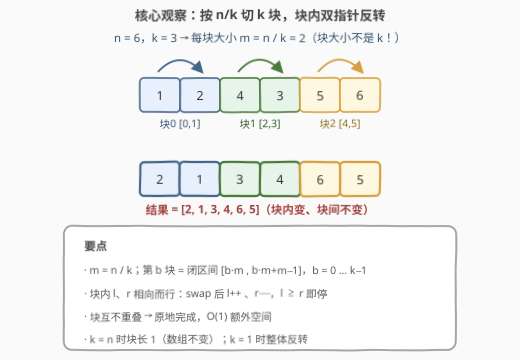
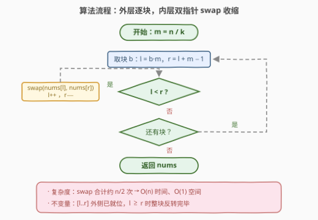

# LeetCode 反转 K 个子数组 题解

## 1. 题目概述

- **标题 / 题号**：反转 K 个子数组（#3865，medium）
- **链接**：https://leetcode.cn/problems/reverse-k-subarrays/
- **难度**：中等
- **标签**：数组、双指针

> ⚠️ 本题为 LeetCode 付费题，题意描述根据官方示例用例与 hints 重建，可能与官方题面有出入。

**题意**：给定一个长度为 $n$ 的整数数组 `nums` 和一个整数 $k$（$k$ 整除 $n$）。将数组切分成 **$k$ 个长度均为 $n/k$ 的连续子数组（块）**，把**每个块内部反转**，返回结果数组。

官方 hint 原文："Reverse each subarray of size $n / k$."——直接点明块的大小是 $n/k$ 而不是 $k$。

**示例 1**：

```text
输入：nums = [1,2,4,3,5,6], k = 3
输出：[2,1,3,4,6,5]
解释：n = 6，块大小 m = n/k = 2，切成 [1,2] [4,3] [5,6] 三块；
     每块内部反转得 [2,1] [3,4] [6,5]，顺序拼接即 [2,1,3,4,6,5]。
```

**示例 2**：

```text
输入：nums = [5,4,4,2], k = 1
输出：[2,4,4,5]
解释：n = 4，块大小 m = n/k = 4，整个数组是一块，整体反转。
```

**约束条件**（按题意重建，具体以官方为准）：$1 \le k \le n$ 且 $k \mid n$；数组元素为常规整数，规模为常规量级，线性解法远在安全范围内。

> 💡 **审题关键**：① 块**数量**是 $k$、块**大小**是 $n/k$——标题"反转 K 个子数组"说的是数量，hint 补的是大小，两个示例（$6/3=2$、$4/1=4$）都精确卡住了这一点。把块大小当成 $k$ 会把示例 1 切成 6 个单元素块，反转无效果，直接输出原数组，答案错误；② 块与块**互不重叠、顺序拼接**——第 $b$ 块反转后仍留在原位，块间顺序不变，这与"反转后重新排列块"（如 189 旋转数组的思路）有本质区别；③ 两个边界自检用例：$k = n$ 时块长 1，数组不变；$k = 1$ 时整块反转，退化为整体 `reverse`。

## 2. 解题思路

### 2.1 朴素思路：逐块开临时数组倒序拷贝

最直接的模拟：对每个块 `[b \cdot m,\ b \cdot m + m)` 开一个长度 $m$ 的临时数组，倒序拷回 `nums`，或干脆每块调用一次库函数 `reverse`。时间已经是 $O(n)$，但朴素版暴露两个可以抠掉的点：

1. **额外空间**：逐块倒序拷贝要 $O(m)$ 临时数组；块内反转本可**原地**完成，$O(1)$ 额外空间；
2. **边界计算**：块区间的定界（左端 $b \cdot m$、右端 $b \cdot m + m - 1$）是本题唯一容易出错的地方，半开/闭区间混用会差一。

本题真正的考点就是**切块定界 + 块内原地双指针反转**这套基本功的组合。

### 2.2 核心观察：m = n/k 定界，块内双指针原地反转



三个要点：

1. **定界公式**：块大小 $m = n / k$，第 $b$ 块（$b = 0, \dots, k-1$）占据**闭区间** $[b \cdot m,\ b \cdot m + m - 1]$。由于 $k \mid n$，$k$ 个块恰好无缝覆盖整个数组，无余数处理；
2. **块内反转就是 344 的基本功**：设 $l$ 指向块左端、$r$ 指向块右端，只要 $l < r$ 就 `swap(nums[l], nums[r])` 并令 $l{+}{+},\ r{-}{-}$——$l \ge r$ 时块长偶数则擦肩（$l = r + 1$）、奇数则正中元素自转（$l = r$），两种情况统一收敛。每块恰做 $m/2$ 次交换（向下取整）；
3. **块互不重叠 ⇒ 原地、顺序无关**：第 $b$ 块的写操作只落在自己的区间内，处理块的先后顺序不影响结果，全程不需要额外数组，$O(1)$ 额外空间。

还有一个**下标直写**视角（不切块也能算）：结果数组位置 $j$ 落在第 $b = \lfloor j/m \rfloor$ 块、块内偏移 $r = j \bmod m$，其值为 $\text{nums}[b \cdot m + (m - 1 - r)]$——即"块内镜像、块间保序"。一遍循环直接填结果数组，同样 $O(n)$，适合输入不可写的场景。

> 💡 **为何标中等**：算法本身是签到级模拟，但约束下要一次写对**块大小方向（$n/k$ 而非 $k$）与区间边界**，且 $n \cdot k$ 规模放大后要求 $O(n)$ 原地实现——考察的是边界计算与双指针的肌肉记忆，而非算法设计。

### 2.3 算法流程图



| 步骤 | 操作 | 说明 |
|------|------|------|
| ① 初始化 | $m = n / k$ | 块大小 |
| ② 取块 | $b = 0 \dots k-1$ | 共 $k$ 块 |
| ③ 定界 | $l = b \cdot m$，$r = l + m - 1$ | 闭区间双指针 |
| ④ 判断 | $l < r$ ? | 否则本块已反转完 |
| ⑤ 交换 | `swap(nums[l], nums[r])` | 首尾对称交换 |
| ⑥ 收缩 | $l{+}{+}$，$r{-}{-}$ | 回到 ④ |
| ⑦ 收尾 | $b$ 走完返回 `nums` | 原地修改，直接返回 |

### 2.4 示例演算

官方示例 1（`nums = [1,2,4,3,5,6]`，`k = 3`，$m = 2$）逐块走一遍：

| 块 $b$ | 闭区间 | 原内容 | 内层双指针过程 | 反转后 |
|--------|--------|--------|----------------|--------|
| 0 | $[0, 1]$ | `[1, 2]` | $l=0, r=1$：swap 一次后 $l=1, r=0$，停 | `[2, 1]` |
| 1 | $[2, 3]$ | `[4, 3]` | $l=2, r=3$：swap 一次后相遇，停 | `[3, 4]` |
| 2 | $[4, 5]$ | `[5, 6]` | $l=4, r=5$：swap 一次后相遇，停 | `[6, 5]` |

三块顺序拼接得 `[2,1,3,4,6,5]` ✓。示例 2 中 $k = 1$、$m = 4$，唯一一块 $[0, 3]$：$l=0, r=3$ 交换得 `[2,4,4,...]`，$l=1, r=2$ 交换得 `[2,4,4,...]`（中间两个 4 互换无感），$l=2, r=1$ 停，结果 `[2,4,4,5]` ✓。

## 3. 参考代码

### C++

```cpp
class Solution {
public:
    vector<int> reverseKSubarrays(vector<int>& nums, int k) {
        int n = nums.size(), m = n / k;              // 块大小 = n / k（不是 k！）
        for (int b = 0; b < k; ++b) {
            int l = b * m, r = l + m - 1;            // 第 b 块闭区间 [l, r]
            while (l < r) swap(nums[l++], nums[r--]); // 原地首尾交换，相向收拢
        }
        return nums;
    }
};
```

### Python

```python
class Solution:
    def reverseKSubarrays(self, nums: List[int], k: int) -> List[int]:
        n, m = len(nums), len(nums) // k             # 块大小 = n / k（不是 k！）
        for b in range(k):
            l, r = b * m, b * m + m - 1              # 第 b 块闭区间 [l, r]
            while l < r:
                nums[l], nums[r] = nums[r], nums[l]
                l, r = l + 1, r - 1
        return nums
```

> 💡 **写法要点**：① 函数签名按题名推断（付费题无官方代码骨架），核心是「数组 + 整数 k、返回数组」；② 内层 `while (l < r)` 把偶数块长（擦肩 $l = r + 1$）与奇数块长（正中自转 $l = r$）统一处理，无需分支；③ `swap(nums[l++], nums[r--])` 一行完成交换加收缩，是 C++ 双指针反转的惯用紧凑写法；④ 若放宽约束允许 $k \nmid n$，需与出题方澄清口径（见第 5 节扩展），按当前题意无需处理余数。

## 4. 复杂度分析

| 维度 | 复杂度 | 说明 |
|------|--------|------|
| **时间** | $O(n)$ | 每块 $\lfloor m/2 \rfloor$ 次交换，$k$ 块合计约 $n/2$ 次 swap；每个元素至多被写一次 |
| **空间** | $O(1)$ | 原地双指针，仅 $l, r, m, b$ 等常数变量（不计返回值） |
| **量级判断** | 任意规模 | 每元素常数次操作；反转类问题每个位置至少要被写一次，$O(n)$ 已是理论下界 |

## 5. 扩展：不整除、下标直写与套路关联

- **$k \nmid n$ 怎么办**：本题约束保证整除。若放宽，常见两种口径——前 $k-1$ 块长 $\lfloor n/k \rfloor$、最后一块吃掉余数（块大小不均）；或余数部分单独留在末尾不反转。这是典型的"需求含糊先澄清"场景，面试中应主动追问而非擅自假设；
- **下标直写版（函数式风格）**：`res[j] = nums[j//m*m + (m - 1 - j%m)]`，一遍循环填新数组，$O(n)$ 时间 / $O(n)$ 空间。牺牲原地性换来不可变输入的适用性，Python 里等价于对每块切片 `nums[b*m:(b+1)*m][::-1]` 后拼接的一行解；
- **与 189 旋转数组的关系**：189 的三段反转法（整体反转 → 前 $k$ 反转 → 后 $n-k$ 反转）正是"分块反转"技能的反向应用——用若干次区间反转**拼出**轮转效果；本题则是按固定宽度切块、各自反转，二者共享同一份双指针代码；
- **进阶变体**：若把题意改成"**至多**选 $k$ 个**任意**子数组反转，使数组字典序最小/有序"，就从模拟升级为区间决策问题（贪心或区间 DP），与本题仅有名字上的相似。

## 6. 面试要点

**Q1：块大小到底是 $k$ 还是 $n/k$？**

> $n/k$。标题"反转 K 个子数组"说的是**数量**为 $k$，hint 明示"size $n/k$"。示例 1 中 $n=6, k=3$，按 $m=2$ 切出 `[1,2][4,3][5,6]` 恰好三块；若误按块大小 $k=3$ 切，会得到 `[1,2,3][4,5,6]` 两块且数量对不上，各处细节全崩。做题第一步先在草稿上算 $n/k$。

**Q2：内层循环为什么停在 $l \ge r$，两种奇偶块长如何统一？**

> 块长 $m$ 为偶数时，$l$、$r$ 在正中间擦肩而过（$l = r + 1$）；为奇数时，正中元素 $l = r$ 自身无需交换。两种情况都由 `while (l < r)` 正确终止，不需要单独的奇偶分支——这是双指针反转的标准写法。

**Q3：$k = n$ 和 $k = 1$ 分别是什么效果？为什么值得自测？**

> $k = n$ 时块长 1，单元素块反转无效果，数组原样返回——专治"块大小当 $k$"的误读（误读版此时也恰好不变，需配合示例 1 一起测）；$k = 1$ 时整块 $[0, n-1]$ 反转，退化为整体 `reverse`，验证定界公式在端点不越界。写完用这两个边界加示例对拍，一次通过率极高。

**Q4：能否不显式切块，一遍写出结果？**

> 可以。输出位置 $j$ 的值来自 $\text{nums}[\lfloor j/m \rfloor \cdot m + (m - 1 - j \bmod m)]$——块内镜像、块间保序。一遍循环填结果即可，$O(n)$ 时间但 $O(n)$ 空间。适合输入不可写（函数式风格/并发共享数据）的场景；追求 $O(1)$ 空间仍以原地双指针为首选。

**Q5：这题为什么值得练？**

> 它是「**区间定界 + 双指针反转**」的最小完整闭环：切块训练边界计算（$b \cdot m$ 的乘法、闭/半开区间的统一），块内反转是 344/541 的基本功，组合起来正是 189 三段反转法的零件。把这道题写到零 off-by-one，上述整族题的手感就都有了。

> 💡 **一句话总结**：$m = n/k$ 定块界，块内双指针首尾 swap 相向收拢，$k$ 块原地反转一遍收工——$O(n)$ 时间、$O(1)$ 空间。

## 同类练习题

| # | 题目 | 与本题的关联 |
|---|------|-------------|
| 344 | [反转字符串](https://leetcode.cn/problems/reverse-string/) | 块内双指针反转的基本功，本题每一块就是一道 344 |
| 541 | [反转字符串 II](https://leetcode.cn/problems/reverse-string-ii/) | 按固定周期分块反转的直系亲属，只是块大小由 $2k$ 周期决定 |
| 189 | [旋转数组](https://leetcode.cn/problems/rotate-array/) | 三段反转法拼出轮转效果，分块反转技能的反向组合应用 |
| 151 | [反转字符串中的单词](https://leetcode.cn/problems/reverse-words-in-a-string/) | 按单词分块反转，块边界需要自己扫描确定 |
| 905 | [按奇偶排序数组](https://leetcode.cn/problems/sort-array-by-parity/) | 双指针原地交换的另一形态（读写不对称版） |
