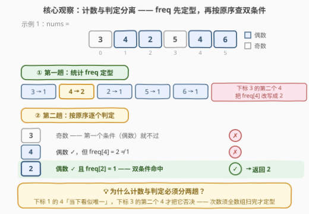
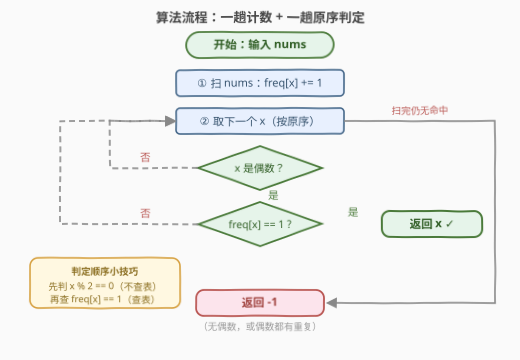

# LeetCode 找到第一个唯一偶数 题解

## 1. 题目概述

- **标题 / 题号**：找到第一个唯一偶数（#3866，easy）
- **链接**：https://leetcode.cn/problems/first-unique-even-element/
- **难度**：简单
- **标签**：数组、哈希表、计数

**题意**：给定整数数组 `nums`，返回其中**恰好出现一次**的**第一个偶数**（以数组下标最早为准）。若不存在这样的整数，返回 `-1`。能被 2 整除的整数视为偶数。

**示例 1**：

```text
输入：nums = [3,4,2,5,4,6]
输出：2
解释：2 和 6 都是偶数，且都恰好出现一次。
      2 在数组中出现得更早，所以答案是 2。
```

**示例 2**：

```text
输入：nums = [4,4]
输出：-1
解释：没有恰好出现一次的偶数，返回 -1。
```

**补充边界**（自造，帮助理解）：

```text
输入：nums = [1,3,5]
输出：-1
解释：数组中根本没有偶数。
```

**约束**：

- $1 \le nums.length \le 100$
- $1 \le nums[i] \le 100$

> 💡 **审题关键**：① 答案须同时满足两个**独立**条件——「偶数」与「恰好出现一次」，缺一不可；② 「第一个」按**下标最早**，判定必须按数组原序扫；③ 「恰好一次」统计的是值在**全数组**中的总次数——下标 1 的 `4` 在前缀里看似唯一，但全数组出现了 2 次，照样否决。与 387「字符串中的第一个唯一字符」骨架相同，只是多了一层偶数过滤。

## 2. 解题思路

### 2.1 暴力思路：逐个验证

从左到右枚举每个元素 $x$：若是偶数，再**重扫一遍全数组**数它出现了几次，次数为 1 即返回。内层重复扫描使总复杂度 $O(n^2)$。本题 $n \le 100$ 最多一万次比较，暴力也能过，但 $n$ 放大到 $10^5$ 就是 $10^{10}$ 次比较——**同一个值的次数被反复重算**，这明显可以省掉。

### 2.2 核心观察：计数与判定分离



判定条件可拆成两个独立子条件的合取：

$$
x \text{ 是答案} \iff (x \bmod 2 = 0) \wedge (\text{freq}[x] = 1)
$$

- 「偶数」只看 $x$ 本身，$O(1)$；
- 「恰好一次」需要知道 $x$ 在**全数组**的出现次数——而这在单趟扫描中是**未知**的：任何元素都可能被**后面**的重复改写命运（示例 1 下标 1 的 `4` 直到下标 3 才被否决）。

于是天然分两趟：

1. **第一趟**：扫 `nums` 统计 `freq[x]`，让所有次数**定型**；
2. **第二趟**：按 `nums` **原序**扫，第一个同时满足两个条件的 $x$ 即答案；扫完仍无命中返回 `-1`。

> 💡 这是「**先计数、再按原序找第一个**」的经典定式（387 的字符版、1394 的幸运数都是同款）：次数是全局属性，必须先看完全貌；答案是最左属性，必须按原序取。

### 2.3 算法流程图



| 步骤 | 操作 | 说明 |
|------|------|------|
| ① 第一趟 | 扫 `nums`：`freq[x] += 1` | 次数定型 |
| ② 第二趟 | 按 `nums` **原序**取下一个 $x$ | 保证「第一个」语义 |
| ③ 过滤一 | $x \bmod 2 = 0$？ | 否 → 取下一个（不查表） |
| ④ 过滤二 | $\text{freq}[x] = 1$？ | 是 → 返回 $x$；否 → 取下一个 |
| ⑤ 兜底 | 扫完仍无命中 → 返回 `-1` | 无偶数，或偶数都有重复 |

> ⚠️ **两个条件的顺序**：先判「偶数」再查 `freq[x]`——把不查表的廉价判断放前面短路，可以少查表（本题两者都是 $O(1)$，纯属好习惯）。

### 2.4 示例演算

示例 1 `nums = [3,4,2,5,4,6]`，第一趟得 `freq = {3:1, 4:2, 2:1, 5:1, 6:1}`，第二趟按原序判定：

| 下标 i | x | 偶数？ | freq[x] | 判定 |
|--------|---|--------|---------|------|
| 0 | 3 | ✗ | — | 奇数，跳过 |
| 1 | 4 | ✓ | 2 | 偶数但有重复，否决 |
| 2 | 2 | ✓ | 1 | ✓ 双条件命中 → 返回 **2** |

示例 2 `nums = [4,4]`：`freq = {4:2}`，两个 `4` 都是偶数但 `freq[4] = 2`，全部否决 → 返回 **-1** ✓。

## 3. 参考代码

值域 $1 \le nums[i] \le 100$，计数表用**定长数组**最省；值域大或含负数时换 `unordered_map` / `Counter`，骨架不变。

### C++

```cpp
class Solution {
public:
    int firstUniqueEven(vector<int>& nums) {
        int cnt[101] = {};                     // 值 → 次数
        for (int x : nums) cnt[x]++;

        for (int x : nums)                     // 必须按原数组序扫
            if (x % 2 == 0 && cnt[x] == 1)     // 偶数 且 恰好一次
                return x;
        return -1;
    }
};
```

### Python

```python
class Solution:
    def firstUniqueEven(self, nums: List[int]) -> int:
        freq = Counter(nums)                   # 第一趟：次数定型
        for x in nums:                         # 第二趟：按原序判定
            if x % 2 == 0 and freq[x] == 1:
                return x
        return -1
```

> 💡 **写法要点**：① 两趟都扫 `nums` 而非字典键，天然保「最左」语义（哈希键序 ≠ 出现序）；② `if x % 2 == 0 and freq[x] == 1` 两个条件按廉价→查表排序；③ Python 也可用 `next((x for x in nums if x % 2 == 0 and freq[x] == 1), -1)` 一行收尾。

## 4. 复杂度分析

| 维度 | 复杂度 | 说明 |
|------|--------|------|
| **时间** | $O(n + U)$ | 两遍扫 `nums`；数组版第二趟无需遍历值域，此处 $U = 101$ 仅指建表开销，可忽略为 $O(n)$ |
| **空间** | $O(U)$ | 计数表；$U = 101$ 为常数，哈希版按不同值个数 $D$ 计 |
| **量级 / 值域** | $n \le 100$，$1 \le nums[i] \le 100$ | 两百次操作，微秒级 |

## 5. 扩展：变体清单

- **第一个唯一元素**（不限偶数）：去掉偶数过滤条件，即 387 的整数版骨架。
- **最后一个唯一偶数**：第二趟倒序扫 `nums`，其余不动。
- **流式 / 单躺压缩**：不可行——次数必须等输入终结才定型，任何「边扫边判」都会被后续重复否决；这是所有「唯一性」题的共同宿命。
- **与 3843 的关系**：3843「频率唯一的第一个元素」判定的是「$\text{freq}[x]$ 无人共享」，需第二层 `freqCount` 接力；本题只查一层 `freq[x] == 1`，是其单层弱化版。

## 6. 面试要点

**Q1：为什么必须两趟，不能单趟边扫边判？**

> 「恰好出现一次」是**全局**属性：示例 1 下标 1 的 `4` 在扫到它时前缀内仅此一个，看似唯一，直到下标 3 的第二个 `4` 出现才被否决。任何元素的次数都可能被后面的重复改写，`freq` 必须先看完全貌定型，判定只能后置。

**Q2：两个判定条件的顺序有讲究吗？**

> 习惯上把**不查表**的判断（`x % 2 == 0`）放前面短路，**查表**的判断（`freq[x] == 1`）放后面。本题两者都是 $O(1)$ 差别不大，但在条件代价悬殊的场景（如字符串比较）这个顺序意识很关键。

**Q3：计数表用数组还是哈希？**

> 值域小且非负（本题 $1 \sim 100$）→ 定长数组 `cnt[101]`，省哈希常数、无冲突；值域大、稀疏或含负数 → 哈希表按不同值个数 $D$ 计空间。判断标准就是「值域大小 vs 元素个数」。

**Q4：与 387「字符串中的第一个唯一字符」的异同？**

> 骨架完全一致：先计数、再按原序找 `freq == 1` 的第一个。差异仅两点：本题对象是整数而非字符；多了一层 `x % 2 == 0` 的过滤条件。掌握一题即掌握一族。

**Q5：第二趟能否只扫偶数、或按 freq 的键序扫？**

> 不能按键序——哈希键序 ≠ 出现序，会丢「第一个」语义；扫偶数等过滤优化改变不了渐进复杂度，反而增加维护成本。直接按 `nums` 原序扫最简单也最正确。

> 💡 **一句话总结**：一趟计数让 `freq` 定型，一趟按原序查「偶数 ∧ 唯一」，双条件短路命中即返回——$O(n)$ 时间、$O(1)$ 空间（值域常数级）。

## 同类练习题

| # | 题目 | 与本题的关联 |
|---|------|-------------|
| 387 | [字符串中的第一个唯一字符](https://leetcode.cn/problems/first-unique-character-in-a-string/)（[题解](../0301-0400/387_字符串中的第一个唯一字符.md)） | 去掉偶数过滤的同款骨架——先计数、再按原序找 freq == 1 |
| 3843 | [频率唯一的第一个元素](https://leetcode.cn/problems/first-element-with-unique-frequency/)（[题解](../3801-3900/3843_频率唯一的第一个元素.md)） | 判定升级为「频率的频率」的双层计数，本题的单层 freq 是其前身 |
| 1394 | [找出数组中的幸运数](https://leetcode.cn/problems/find-lucky-integer-in-an-array/)（[题解](../1301-1400/1394_找出数组中的幸运数.md)） | freq 表 + 一次遍历判定，条件换成 freq[x] == x |
| 1207 | [独一无二的出现次数](https://leetcode.cn/problems/unique-number-of-occurrences/)（[题解](../1201-1300/1207_独一无二的出现次数.md)） | 同一张计数表换个问法，判「全员频率互不相同」 |
| 1636 | [按照频率将数组升序排序](https://leetcode.cn/problems/sort-array-by-increasing-frequency/)（[题解](../1601-1700/1636_按照频率将数组升序排序.md)） | freq 表的排序延伸——计数定式的进阶应用 |
