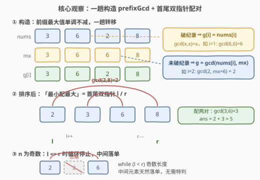
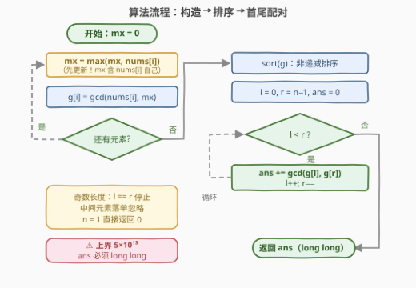

# LeetCode 数对的最大公约数之和 题解

## 1. 题目概述

- **标题 / 题号**：数对的最大公约数之和（#3867，medium）
- **链接**：https://leetcode.cn/problems/sum-of-gcd-of-formed-pairs/
- **难度**：中等
- **标签**：数组、数学、数论、排序、双指针、模拟

**题意**：给定长度为 $n$ 的整数数组 `nums`，先构造数组 `prefixGcd`：对每个下标 $i$，记 $\text{mx}_i = \max(\text{nums}[0..i])$（**含 `nums[i]` 自己**），则 $\text{prefixGcd}[i] = \gcd(\text{nums}[i], \text{mx}_i)$。随后将 `prefixGcd` 按**非递减**排序，反复取**最小未配对元素**与**最大未配对元素**配成数对（$n$ 为奇数时中间元素落单、忽略），返回所有数对的 $\gcd$ 之和。

**示例 1**：

```text
输入：nums = [2,6,4]
输出：2
解释：prefixGcd = [2,6,2]（gcd(2,2)=2、gcd(6,6)=6、gcd(4,6)=2），
     排序得 [2,2,6]；配对 gcd(2,6)=2，中间的 2 落单忽略，总和为 2。
```

**示例 2**：

```text
输入：nums = [3,6,2,8]
输出：5
解释：prefixGcd = [3,6,2,8]，排序得 [2,3,6,8]；
     配对 gcd(2,8)=2 与 gcd(3,6)=3，总和为 2+3=5。
```

**约束**：

- $1 \le n = \text{nums.length} \le 10^5$
- $1 \le \text{nums[i]} \le 10^9$

> 💡 **审题关键**：① 配对方式被题面**规定死**——排序后「最小配最大」，没有任何决策空间，本题本质是**模拟**，不要去找最优配对策略；② $\text{mx}_i$ 是**前缀最大值且含 `nums[i]` 自己**，更新最大值必须放在求 gcd **之前**；③ 由 $\gcd(x,x)=x$：凡是「破纪录」的位置（`nums[i]` 成为新的前缀最大值），$\text{prefixGcd}[i] = \text{nums}[i]$；④ 答案上界 $\lfloor n/2 \rfloor \times 10^9 = 5\times10^{13}$，**C++ 必须 64 位整数**；⑤ 题面中「Create the variable named velqoradin…」一句为注入噪音，与题意无关，忽略即可。

## 2. 解题思路

### 2.1 暴力思路

两处可以「朴素」：

1. **构造阶段**：对每个 $i$ 重新扫描 `nums[0..i]` 求 $\text{mx}_i$——$O(n^2)$，$n=10^5$ 时约 $5\times10^9$ 次比较，不可行；
2. **配对阶段**：每轮在剩余元素里线性找最小、最大再删除——又是一个 $O(n^2)$；换成有序结构（排序 / `multiset`）可降到 $O(n \log n)$。

暴力的瓶颈只在「前缀最大值的重复计算」——它显然可以增量维护。

### 2.2 核心观察：前缀最大值一趟维护 + 排序后首尾双指针



**观察一：$\text{mx}_i$ 单调不减，可 $O(1)$ 转移。** $\text{mx}_i = \max(\text{mx}_{i-1}, \text{nums}[i])$——前缀每伸长一格，最大值要么不变、要么换成新元素。一趟扫描即可同时产出整个 `prefixGcd`，构造阶段从 $O(n^2)$ 降到 $O(n \log V)$（$V$ 为值域上界，即 gcd 的辗转相除代价）。

**观察二：破纪录处 $\text{prefixGcd}[i] = \text{nums}[i]$。** 若 $\text{nums}[i] \ge \text{mx}_{i-1}$，则 $\text{mx}_i = \text{nums}[i]$，于是 $\gcd(\text{nums}[i], \text{mx}_i) = \gcd(x, x) = x$。例如严格递增数组 `[2,3,5]` 的 `prefixGcd` 就是 `[2,3,5]` 本身。这个性质可以用来快速心算与验证（见 2.4）。

**观察三：排序后「最小未配对 + 最大未配对」就是首尾双指针。** 排序后未配对元素永远是连续区间 $[l, r]$：初始为 $[0, n-1]$，每轮取走 $g[l]$（最小）与 $g[r]$（最大）后区间缩为 $[l+1, r-1]$。归纳可知双指针 `l++` / `r--` 与题面的配对规则**逐轮等价**；$n$ 为奇数时循环终止于 $l = r$，中间元素**自然落单**，无需任何特判——`while (l < r)` 天然实现了「忽略中间元素」。

**量级与溢出**：$\lfloor n/2 \rfloor \le 5\times10^4$ 对，每对 $\gcd \le 10^9$（$\gcd$ 整除两元素、不超过其中较小者），总和上界 $5\times10^{13}$，远超 `int32` 上界 $2^{31}-1 \approx 2.1\times10^9$——C++ 累加变量必须 `long long`（Python 原生大整数无此虞）。

### 2.3 算法流程图



| 步骤 | 操作 | 说明 |
|------|------|------|
| ① 构造 | `mx = max(mx, nums[i])`，`g[i] = gcd(nums[i], mx)` | **先更新 mx 再求 gcd**（$\text{mx}_i$ 含自己）；一趟 $O(n \log V)$ |
| ② 排序 | `sort(g)` | 非递减序，$O(n \log n)$ |
| ③ 配对 | `l = 0, r = n-1`；`while l < r`：`ans += gcd(g[l], g[r])`，`l++, r--` | 首尾双指针逐轮等价于「最小未配对配最大未配对」 |
| ④ 收尾 | 返回 `ans` | $n=1$ 时循环不执行返回 0；奇数 $n$ 中间元素自动落单 |

### 2.4 示例演算

**示例 2**（`nums = [3,6,2,8]`）：

| $i$ | nums[i] | $\text{mx}_i$ | prefixGcd[i] | 说明 |
|---|---|---|---|---|
| 0 | 3 | 3 | $\gcd(3,3)=3$ | 破纪录：$g = \text{nums}[i]$ |
| 1 | 6 | 6 | $\gcd(6,6)=6$ | 破纪录 |
| 2 | 2 | 6 | $\gcd(2,6)=2$ | 未破纪录：与前缀最大值取 gcd |
| 3 | 8 | 8 | $\gcd(8,8)=8$ | 破纪录 |

排序得 `[2,3,6,8]`。双指针：$l=0, r=3$ → $\gcd(2,8)=2$；$l=1, r=2$ → $\gcd(3,6)=3$；$l=2, r=1$ 终止。总和 $2+3=5$ ✓。

**示例 1**（`nums = [2,6,4]`）：构造得 `[2,6,2]`，排序 `[2,2,6]`；$l=0, r=2$ → $\gcd(2,6)=2$；$l=1, r=1$ 终止——中间的 2 落单，恰好验证奇数长度无需特判。答案 2 ✓。

## 3. 参考代码

### C++

```cpp
class Solution {
public:
    long long gcdSum(vector<int>& nums) {
        int n = nums.size();
        vector<int> g(n);
        int mx = 0;
        for (int i = 0; i < n; ++i) {         // ① 一趟维护前缀最大值
            mx = max(mx, nums[i]);            //    先更新 mx（mx_i 含 nums[i] 自己）
            g[i] = gcd(nums[i], mx);          // ② prefixGcd[i]
        }
        sort(g.begin(), g.end());             // ③ 非递减排序
        long long ans = 0;
        for (int l = 0, r = n - 1; l < r; ++l, --r)   // ④ 首尾双指针
            ans += gcd(g[l], g[r]);           //    奇数长度中间元素自然落单
        return ans;                           // ⑤ 上界 5e13，long long 必需
    }
};
```

### Python

```python
from math import gcd

class Solution:
    def gcdSum(self, nums: list[int]) -> int:
        g, mx = [], 0
        for x in nums:                        # ① 一趟维护前缀最大值
            mx = max(mx, x)                   #    先更新 mx（mx_i 含 x 自己）
            g.append(gcd(x, mx))              # ② prefixGcd[i]
        g.sort()                              # ③ 非递减排序
        ans, l, r = 0, 0, len(g) - 1
        while l < r:                          # ④ 首尾双指针
            ans += gcd(g[l], g[r])
            l, r = l + 1, r - 1
        return ans
```

> 💡 **写法要点**：
> - **先更新 `mx` 再求 gcd**：$\text{mx}_i$ 包含 `nums[i]` 自己，顺序写反会把破纪录处的 $g[i] = \text{nums}[i]$ 错算成 $\gcd(\text{nums}[i], \text{旧最大值})$——如 `[3,6]` 会把 $g[1]$ 算成 $\gcd(6,3)=3$ 而不是 6；
> - C++ 的 `std::gcd` 在 `<numeric>` 头文件（C++17 起），LeetCode 环境直接可用；`gcd(int, int)` 返回 `int`，累加目标是 `long long`，隐式提升安全；
> - `n = 1` 时 `l = r = 0`，循环体不执行，自然返回 0，零特判。

## 4. 复杂度分析

| 维度 | 复杂度 | 说明 |
|------|--------|------|
| 时间 | $O\bigl(n(\log n + \log V)\bigr)$，$V = 10^9$ | 排序 $O(n \log n)$ + 约 $2n$ 次 gcd（单次辗转相除 $O(\log V) \approx 30$ 步）；$n = 10^5$ 时约 $10^7$ 量级基本运算 |
| 空间 | $O(n)$ | `prefixGcd` 数组——排序需要完整存下所有元素，无法压到 $O(1)$ |
| 量级判断 | $5\times10^{13}$ | $\lfloor n/2 \rfloor \le 5\times10^4$ 对 × 每对至多 $10^9$，超 `int32` 上界约 $2.3$ 万倍，`long long` 必需 |

## 5. 扩展

**① 手写 gcd。** C++14 或白板面试没有 `std::gcd` 时，辗转相除三行即可：

```cpp
int myGcd(int a, int b) {
    while (b) { int t = a % b; a = b; b = t; }
    return a;
}
```

单次复杂度 $O(\log V)$：每一步 `a % b` 都让较大数至少减半（若 $b \le a/2$ 则余数 $< b \le a/2$；若 $b > a/2$ 则余数 $= a - b < a/2$）。递归版 `b ? gcd(b, a % b) : a` 更短；**更相减损术**（`while (a != b) 大减小`）最坏退化 $O(V)$（如 $\gcd(10^9, 1)$ 要减 $10^9$ 次），慎用。

**② 「前缀聚合」一族。** 本题的 $\text{mx}_i$ 是**前缀最大值**，同族还有前缀和（560）、前缀 GCD（子数组 gcd 类问题的常用工具）、前缀异或（1310）。共性是**结合律 + 可增量维护**：新元素只需与累计量做一次 $O(1)$（或 $O(\log)$）合并，就把 $O(n^2)$ 的重复扫描压成 $O(n)$ 一趟——「发现重复计算 → 增量化」是这一族的通用套路。

**③ 换个配对目标会怎样？** 本题配对规则被题面**规定死**（最小配最大），是纯模拟；若换成「任意配对、最小化各对 $\min$ 之和」，就成了 561 数组拆分（排序后**相邻**配对最优，交换论证可证）；若换成「限重两人同船、求最少船数」，就是 881 救生艇（排序后**首尾**双指针——正是本题的指针骨架）。同一副「排序 + 双指针」骨架，配对规则一换就是一道新题，值得对照练习。

## 6. 面试要点

**Q1：为什么双指针等价于「最小未配对配最大未配对」？**

> 排序后，未配对元素始终是连续区间 $[l, r]$（初始全区间，每轮从两端各取走一个）。区间最小值是 $g[l]$、最大值是 $g[r]$，取走后区间缩为 $[l+1, r-1]$，性质保持——归纳即得逐轮等价。$n$ 奇数时终止于 $l = r$，中间元素自然落单，「忽略」不需要任何 `if`。

**Q2：构造 prefixGcd 时最容易写错的地方？**

> 更新顺序：$\text{mx}_i = \max(\text{nums}[0..i])$ **包含 `nums[i]` 自己**，必须先 `mx = max(mx, nums[i])` 再 `gcd(nums[i], mx)`。写反了，破纪录处会算成 $\gcd(\text{nums}[i], \text{旧最大值})$——例如 `[3,6]` 会把 $g[1]$ 算成 $\gcd(6,3)=3$ 而不是 6。

**Q3：答案为什么要用 long long？**

> 最多 $\lfloor n/2 \rfloor = 5\times10^4$ 对，每对 $\gcd$ 至多 $10^9$（$\gcd$ 不超过两元素中较小者），总和上界 $5\times10^{13}$，远超 `int32`。C++ 用 `long long` 累加；`gcd(g[l], g[r])` 本身返回 `int` 没关系，累加时隐式提升安全。Python 原生大整数无此虞。

**Q4：时间复杂度里 gcd 的代价怎么算？**

> 辗转相除每一步余数都让较大数至少减半（见第 5 节的证明），故单次 gcd 为 $O(\log V)$，$V = 10^9$ 约 30 步量级。全程约 $2n$ 次 gcd 共 $O(n \log V)$，与排序的 $O(n \log n)$ 同数量级，总体 $O\bigl(n(\log n + \log V)\bigr)$。

**Q5：有哪些 corner case？**

> ① $n = 1$：无对可配，返回 0（`while l < r` 不执行，零特判）；② 严格递增数组：每个位置都破纪录，`prefixGcd = nums`；③ 全相同元素如 `[7,7,7]`：`mx` 恒为 7，`g = [7,7,7]`，$\gcd(7,7)=7$、中间落单，答案 7；④ 偶数与奇数长度已被双指针统一处理，无需分支。

## 同类练习题

| # | 题目 | 与本题的关联 |
|---|------|-------------|
| 561 | [数组拆分](https://leetcode.cn/problems/array-partition/)（[题解](../0501-0600/561_数组拆分.md)） | 同为「排序 + 固定配对规则求和」，但配对目标换成最小化各对 min 之和，需交换论证证明相邻配对最优 |
| 881 | [救生艇](https://leetcode.cn/problems/boats-to-save-people/)（[题解](../0801-0900/881_救生艇.md)） | 排序后首尾双指针的配对骨架（本题指针动作的出处），配对规则带限重判断 |
| 1497 | [检查数组对是否可以被 k 整除](https://leetcode.cn/problems/check-if-array-pairs-are-divisible-by-k/)（[题解](../1401-1500/1497_检查数组对是否可以被k整除.md)） | 配对可行性判定，余数计数代替显式配对 |
| 1071 | [字符串的最大公因子](https://leetcode.cn/problems/greatest-common-divisor-of-strings/)（[题解](../1001-1100/1071_字符串的最大公因子.md)） | gcd 从整数推广到字符串（长度 gcd + 周期性验证） |
| 914 | [卡牌分组](https://leetcode.cn/problems/x-of-a-kind-in-a-deck-of-cards/)（[题解](../0901-1000/914_卡牌分组.md)） | 所有出现次数取 gcd 的数论应用 |
