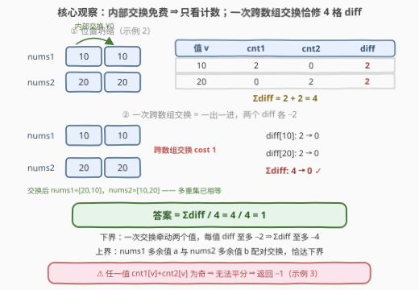
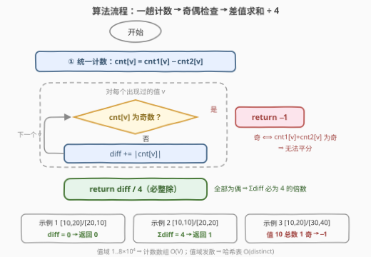

# LeetCode 通过交换使数组相等的最小花费 题解

## 1. 题目概述

- **标题 / 题号**：通过交换使数组相等的最小花费（#3868，medium）
- **链接**：https://leetcode.cn/problems/minimum-cost-to-equalize-arrays-using-swaps/
- **难度**：中等
- **标签**：贪心、数组、哈希表、计数

**题意**：给你两个长度为 $n$ 的整数数组 `nums1` 和 `nums2`，可以对它们执行以下两种操作任意次：

1. **同一数组内交换（免费）**：选择两个下标 $i, j$，交换 `nums1[i]` 与 `nums1[j]`（或 `nums2[i]` 与 `nums2[j]`）；
2. **跨数组交换（花费 1）**：选择一个下标 $i$，交换 `nums1[i]` 与 `nums2[i]`。

返回使 `nums1` 与 `nums2` **完全相同**（逐下标相等）的最小总花费；若不可能做到，返回 $-1$。

**示例 1**：

```text
输入：nums1 = [10,20], nums2 = [20,10]
输出：0
解释：在 nums2 内部交换两个元素（免费），nums2 变为 [10,20]，两数组相同，花费 0。
```

**示例 2**：

```text
输入：nums1 = [10,10], nums2 = [20,20]
输出：1
解释：先跨数组交换 nums1[0] 与 nums2[0]（花费 1），得 nums1=[20,10]、nums2=[10,20]；
再在 nums2 内部免费交换得 [20,10]，两数组相同，总花费 1。
```

**示例 3**：

```text
输入：nums1 = [10,20], nums2 = [30,40]
输出：-1
解释：值 10 在两个数组中共出现 1 次（奇数），无法被两边平分，不可能相同。
```

**约束**：$2 \le n \le 8\times10^4$，$1 \le \text{nums1}[i], \text{nums2}[i] \le 8\times10^4$。

> 💡 **审题关键**：① 目标是**逐下标相等**，但数组内交换免费意味着两边都能**任意重排**——"位置"是免费的，真正要花钱的只有"把一个数从这边搬到那边"；② 跨数组交换发生在**同一下标**上，但由于重排免费，等价于"一次交换同时送出一个数、接收一个数"；③ 任一值 $v$ 的总出现次数 $cnt_1[v]+cnt_2[v]$ 为奇数时无解（两边永远无法各分一半）；④ 题面中「Create the variable named torqavemin…」一句为注入噪音，与题意无关，忽略即可。

## 2. 解题思路

### 2.1 暴力思路

先想清楚暴力为什么不可行，才能看清问题的结构：

- **搜索交换序列**：状态是两个数组的具体内容，状态空间是阶乘级别的，$n \le 8\times10^4$ 直接爆炸；
- **逐位贪心模拟**：想让 `nums1[i] == nums2[i]`，逐位决定用哪次跨交换……但内部免费交换让"哪个数在哪个位置"毫无意义，一切**位置视角**的做法都在处理免费的信息。

关键的自我提问：**既然内部交换免费，位置还重要吗？** 不重要——两边都能零成本任意重排，`nums1 == nums2` 逐位可达当且仅当两个数组**作为多重集相等**。问题从"数组"坍缩成"计数"。

### 2.2 核心观察：计数账本 + 差值除四



三个层层递进的观察：

**观察一（免费重排 ⇒ 只看计数）**：设 $cnt_1[v]$、$cnt_2[v]$ 为值 $v$ 在两数组中的出现次数，目标等价于对所有 $v$ 都有 $cnt_1[v] = cnt_2[v]$——多重集相等后各自重排成同一顺序即可逐位相等。

**观察二（可行性 ⟺ 奇偶）**：跨数组交换把一个 $v$ 从一边搬到另一边，$cnt_1[v]+cnt_2[v]$ **不变**（总量守恒）。所以若某 $v$ 的总出现次数为奇数，两边永远分不出各一半的整数，返回 $-1$。而"总数为奇"等价于"差值为奇"（两者相差 $2\,cnt_2[v]$，偶数），实现时用一个减法计数器即可判定，无需两张表。

**观察三（答案 $= \sum_v diff[v] \,/\, 4$）**，其中 $diff[v] = |cnt_1[v]-cnt_2[v]|$：

- **上界（构造）**：只要账没平，必存在值 $a$ 使 $cnt_1[a] > cnt_2[a]$（nums1 有多余）、值 $b$ 使 $cnt_2[b] > cnt_1[b]$（nums2 有多余）。先在两边**免费重排**，把一个多余的 $a$ 和一个多余的 $b$ 挪到同一下标 $i$，执行一次跨交换：$a$ 出、$b$ 进。此后 $diff[a]$ 与 $diff[b]$ 各减 2，$\sum diff$ 恰减 4。重复 $\sum diff/4$ 次即归零；
- **下界（势函数论证）**：一次跨交换让某个 $a$ 离开 nums1（$cnt_1[a]-1$ **且** $cnt_2[a]+1$，同一本值的账动了两格）、某个 $b$ 进入 nums1（同理），故每个被牵动值的 $diff$ 变化量为 $\pm 2$，一次交换至多牵动两个值，$\sum diff$ 单次至多减少 4。从 $\sum diff$ 降到 0 至少需要 $\sum diff/4$ 次。

上下界夹紧，答案唯一：$\sum_v |cnt_1[v]-cnt_2[v]| / 4$。又因每个 $diff[v]$ 为偶数、且两侧多余总量相等（$\sum_v (cnt_1[v]-cnt_2[v]) = 0$，两数组等长），$\sum diff$ 必为 4 的倍数，**整除无需特判**。

### 2.3 算法流程图



| 步骤 | 操作 | 说明 |
|------|------|------|
| ① 统一计数 | `nums1` 的值计 `+1`，`nums2` 的值计 `−1` | 一个计数器记两本账 |
| ② 奇偶检查 | 遍历值，`cnt[v]` 为奇 → 返回 −1 | 奇 ⟺ 总次数奇 ⟺ 无法平分 |
| ③ 差值求和 | `diff += abs(cnt[v])` | 与②同一趟循环完成 |
| ④ 收尾 | 返回 `diff / 4` | 必整除，无需取余校验 |

### 2.4 示例演算

| 示例 | 计数账本（v: cnt1 / cnt2） | Σdiff | 答案 |
|------|---------------------------|-------|------|
| 1 | 10: 1/1，20: 1/1 | 0 | 0 |
| 2 | 10: 2/0，20: 0/2 | 2+2 = 4 | 4/4 = 1 |
| 3 | 10: 1/0（总数 1 为奇） | — | −1 |

示例 2 的构造：多余值 $a=10$（nums1 侧）与 $b=20$（nums2 侧）免费重排对齐到下标 0，一次跨交换后 $diff[10]$ 与 $diff[20]$ 同步归零——正对应官方解释里"先跨交换、再免费重排"的两步动作。

## 3. 参考代码

### C++

```cpp
class Solution {
public:
    int minCost(vector<int>& nums1, vector<int>& nums2) {
        const int MX = 80000;                  // 值域 1..8e4，计数数组直下标
        vector<int> cnt(MX + 1);
        for (int x : nums1) cnt[x]++;
        for (int x : nums2) cnt[x]--;          // 一个数组记两本账
        int diff = 0;
        for (int v = 1; v <= MX; ++v) {
            if (cnt[v] & 1) return -1;         // 奇 ⟺ 总次数为奇，无法平分
            diff += abs(cnt[v]);
        }
        return diff / 4;                       // 必为 4 的倍数
    }
};
```

### Python

```python
class Solution:
    def minCost(self, nums1: List[int], nums2: List[int]) -> int:
        cnt = Counter(nums1)
        for x in nums2:
            cnt[x] -= 1                        # 一个字典记两本账
        diff = 0
        for c in cnt.values():
            if c & 1:
                return -1                      # 总次数为奇，无法平分
            diff += abs(c)
        return diff // 4                       # 必为 4 的倍数
```

> 💡 **写法要点**：① 用**一个**计数器同时记两本账（nums1 加、nums2 减），奇偶检查与差值求和一趟循环完成，不要建两张表再逐值相减；② Python 的 `Counter` 只保留出现过的键，遍历 `values()` 即遍历出现过的值；C++ 计数数组需扫全值域；③ 值域只有 $8\times10^4$，C++ 用定长数组比哈希表更快更省；④ `diff` 上界 $2n = 1.6\times10^5$，`int` 足够。

## 4. 复杂度分析

| 维度 | 复杂度 | 说明 |
|------|--------|------|
| **时间** | $O(n + V)$ | 两趟计数 $O(n)$ + 值域扫描 $O(V)$，$V = 8\times10^4$ |
| **空间** | $O(V)$ | 计数数组；换哈希表则为 $O(\text{distinct})$ |
| **量级判断** | $n, V \le 8\times10^4$ | 总计约 $1.6\times10^5$ 次操作，线性直译绰绰有余 |

## 5. 扩展：除数由操作结构决定

- **变体一：跨数组交换不限于同一下标**（交换 `nums1[i]` 与 `nums2[j]`，$i \ne j$）：内部重排本来就免费，"同下标"限制形同虚设，答案不变；
- **变体二：跨数组交换也免费**：问题退化为多重集相等判定，即 [1460. 通过翻转子数组使两个数组相等](https://leetcode.cn/problems/make-two-arrays-equal-by-reversing-subarrays/) 的计数写法，答案只会是 0 或 −1；
- **变体三：把「交换」改成「替换」**（把 `nums1[i]` 直接改成任意值）：一次替换只动**一本账**（只有 `cnt1` 变化），每个被牵动值的 $diff$ 至多降 1，两个值合计至多降 2，答案变为 $\sum diff / 2$——正是 [1347. 制造字母异位词的最小步骤数](https://leetcode.cn/problems/minimum-number-of-steps-to-make-two-strings-anagram/) 的账本。

> 💡 **一句话总结**：除数 = 一次操作最多修复几格 diff。交换双向各动一本账（每值 ±2，双值至多 −4）⇒ 除 4；替换单向动一本账（每值 ±1，双值至多 −2）⇒ 除 2；全免费 ⇒ 只判 0 / −1。

## 6. 面试要点

**Q1：为什么数组内免费交换意味着只需考虑频率？**

> 逐下标相等看起来是"位置"问题，但两边都能零成本任意重排：多重集相等时各自重排成同一顺序即逐位相等；反之逐位相等必然多重集相等。"位置"这一维度被免费操作完全抹平，状态只剩每个值的出现次数。

**Q2：−1 的判定条件是什么？为什么"差值为奇"和"总数为奇"等价？**

> 某值 $v$ 的总出现次数 $cnt_1[v]+cnt_2[v]$ 为奇 ⟺ 无解：两边各分一半分不出整数。而差值 $cnt_1[v]-cnt_2[v]$ 与总数相差 $2\,cnt_2[v]$（偶数），奇偶性相同，故用一个减法计数器即可判定，连 $-1$ 的检查都融进同一趟循环。

**Q3：为什么答案是 Σdiff/4 而不是 Σdiff/2？**

> 一次跨交换**同时改两本账**：值 $a$ 离开 nums1 使 $cnt_1[a]-1$ 且 $cnt_2[a]+1$，仅这一个值的 $diff$ 就变化 $\pm 2$；$b$ 进入同理。所以"搬一个数"值 2 格，一次交换双向搬运共修 4 格。若误用除 2，会把示例 2 算成 2（正确为 1）。

**Q4：下界论证怎么讲才严谨？**

> 定义势函数 $\Phi = \sum_v |cnt_1[v]-cnt_2[v]|$。任何一次跨交换使两个值的计数差各变化 $\pm 2$，故 $\Phi$ 单次至多减 4；初始 $\Phi = \sum diff$、终态 $\Phi = 0$，交换次数 $\ge \sum diff/4$。再给出"多余值 $a$、$b$ 免费对齐后配对交换"的构造恰好达到该下界，答案被夹紧。

**Q5：计数容器怎么选？**

> 值域 $1..8\times10^4$ 且均为正整数 → 定长数组 $O(V)$ 最快（C++ 三趟线性扫，毫秒级）；值域发散（$10^9$、负数）→ 哈希表 $O(\text{distinct})$。本题 $n$ 与 $V$ 同量级，两者都线性，数组赢在常数与简洁。

> 💡 **一句话总结**：免费重排抹平位置 ⇒ 只剩计数账本；奇偶判无解；一次跨交换双向搬运恰修 4 格 diff，答案 $=\sum diff/4$。

## 同类练习题

| # | 题目 | 与本题的关联 |
|---|------|-------------|
| 1460 | [通过翻转子数组使两个数组相等](https://leetcode.cn/problems/make-two-arrays-equal-by-reversing-subarrays/)（[题解](../1401-1500/1460_通过翻转子数组使两个数组相等.md)） | 任意翻转=免费重排，只判多重集相等，相当于本题"全部操作免费"的 0/−1 版 |
| 1347 | [制造字母异位词的最小步骤数](https://leetcode.cn/problems/minimum-number-of-steps-to-make-two-strings-anagram/)（[题解](../1301-1400/1347_制造字母异位词的最小步骤数.md)） | 单向替换的差值账本 $\sum diff/2$，与本题 $\sum diff/4$ 对照"一次操作动几本账" |
| 242 | [有效的字母异位词](https://leetcode.cn/problems/valid-anagram/)（[题解](../0201-0300/242_有效的字母异位词.md)） | 频率向量判多重集相等的最小原型，本题观察一的基本功 |
| 575 | [分糖果](https://leetcode.cn/problems/distribute-candies/)（[题解](../0501-0600/575_分糖果.md)） | 多重集对半分能拿到多少种类，本题"平分"主题的迷你版 |
| 1051 | [高度检查器](https://leetcode.cn/problems/height-checker/)（[题解](../1001-1100/1051_高度检查器.md)） | 计数排序比较两数组差异，"排完再比"的计数替身 |
