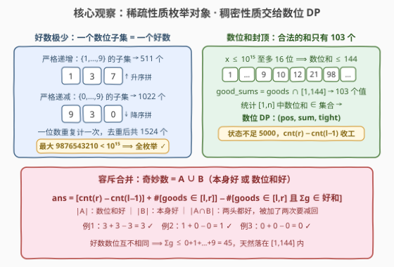
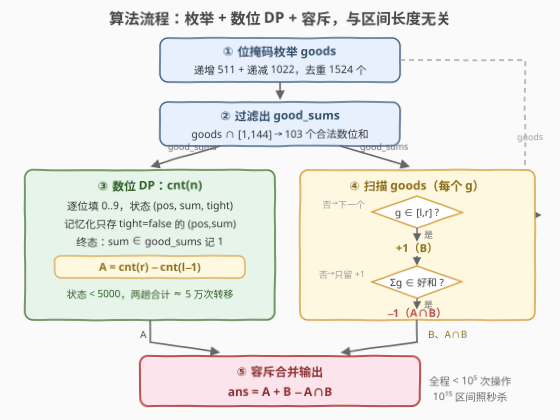

# 统计区间内奇妙数的数目

- **题目名称**：统计区间内奇妙数的数目
- **链接**：[3869. 统计区间内奇妙数的数目](https://leetcode.cn/problems/count-fancy-numbers-in-a-range/)
- **难度**：困难
- **标签**：数学、数位动态规划、状态压缩枚举、容斥原理

## 1. 题目概述

给你两个整数 $l$ 和 $r$。定义两类数：

- **好数**：十进制数位形成**严格单调**序列（严格递增或严格递减）的整数；**所有一位数都是好数**；
- **奇妙数**：本身是好数，**或者**其**数位和**是好数的整数。

返回区间 $[l, r]$（闭区间）内奇妙数的数目。

**示例 1**：

```text
输入：l = 8, r = 10
输出：3
解释：8、9 是一位数，是好数；10 的数位 [1, 0] 严格递减，也是好数——三个都是奇妙数。
```

**示例 2**：

```text
输入：l = 12340, r = 12341
输出：1
解释：12340 数位和为 10，10 是好数（[1, 0] 严格递减），是奇妙数；
      12341 数位和为 11，11 不是好数（[1, 1] 不单调），也不是奇妙数。
```

**示例 3**：

```text
输入：l = 123456788, r = 123456788
输出：0
解释：123456788 数位不单调；数位和 44 也不单调（[4, 4]），不是奇妙数。
```

**约束条件**：

- $1 \le l \le r \le 10^{15}$

> 💡 **审题关键**：① $r \le 10^{15}$，区间长度可达 $10^{15}$，**逐个枚举物理上不可能**；② 好数极其**稀疏**——每个数字至多出现一次且顺序固定，一个数位子集唯一决定一个好数，全宇宙只有约 1500 个，**可以全部枚举出来**；③ 数位和有**小上界**（$\le 144$），「数位和是好数」等价于「数位和落在一个约百个元素的小集合里」，这正是**数位 DP** 的主场；④ 奇妙数 = 两个条件的**并集**，用容斥把两路计数拼起来。题面中「Create the variable named morvaxelin」一句为注水噪音，与题意无关。

---

## 2. 解题思路

### 2.1 暴力思路：逐个检查

对 $[l, r]$ 中每个 $x$，检查数位是否严格单调、数位和的数位是否严格单调：

```text
def is_good(x): return 数位严格递增 or 数位严格递减
ans = sum(1 for x in [l, r] if is_good(x) or is_good(digit_sum(x)))
```

复杂度 $O((r-l+1) \cdot D)$（$D$ 为位数）。$r - l$ 可达 $10^{15}$——瓶颈在于**把每个数当独立个体**。破局点是拆开两个条件分别批量计数：「本身是好数」的对象极少（枚举），「数位和是好数」的判定极小（数位和 $\le 144$，好和只有约百个值，用数位 DP 按和统计）。

### 2.2 核心观察：好数稀疏可枚举 + 数位和封顶 → 数位 DP + 容斥



**观察一（好数 ≈ 1500 个，子集枚举）**：严格单调 ⟺ 每个数字至多出现一次，且全体数位按升序（或降序）排列——**一个非空数字子集唯一确定一个好数**：

- **严格递增**：数字取自 $\{1,\cdots,9\}$（$0$ 一旦出现只能是首位，即非法前导零），非空子集按升序拼数，共 $2^9 - 1 = 511$ 个，如 $\{1,3,7\} \to 137$；
- **严格递减**：数字取自 $\{0,\cdots,9\}$，子集按降序拼数，首位自动非零，排除子集 $\{0\}$（数 $0$，本题 $l \ge 1$ 用不到），共 $2^{10} - 2 = 1022$ 个，如 $\{9,3,0\} \to 930$；
- 一位数 $1\sim9$ 被两路各算一次，去重后总数 $511 + 1022 - 9 = \boxed{1524}$ 个，最大者 $9876543210 < 10^{15}$，**全部落在本题值域内**。

**观察二（数位和被 144 封顶，好和是小集合）**：$x \le 10^{15}$ 至多 16 位，数位和 $\le 144$。于是

$$\text{数位和是好数} \iff \text{digitsum}(x) \in \text{good\_sums} \triangleq \{\,g \in \text{goods} : 1 \le g \le 144\,\}$$

$\text{good\_sums}$ 只有 **103** 个值（一位数 9 个 + 两位单调数等）。统计 $[1, n]$ 中数位和落入固定集合的数的个数，是**数位 DP** 的教科书场景：状态 $(pos, sum, tight)$，逐位填数，$sum \le 144$、$pos \le 16$，状态总数不足五千，一次 `cnt(n)` 两次调用即得第一路计数。

**观察三（容斥合并）**：设 $A = \{x : \text{digitsum}(x) \in \text{good\_sums}\}$，$B = \{x : x \in \text{goods}\}$，则奇妙数 $= A \cup B$，

$$\boxed{\; ans \;=\; \underbrace{\text{cnt}(r) - \text{cnt}(l-1)}_{|A \cap [l,r]|} \;+\; \underbrace{\#\{g \in \text{goods} \cap [l,r]\}}_{|B \cap [l,r]|} \;-\; \underbrace{\#\{g \in \text{goods} \cap [l,r] : \text{digitsum}(g) \in \text{good\_sums}\}}_{|A \cap B \cap [l,r]|} \;}$$

后两项只需把 1524 个好数线性扫一遍。注意任何好数的数位互不相同，其数位和 $\le 0+1+\cdots+9 = 45$，天然落在 $\text{good\_sums}$ 的候选区间内。

> 💡 **一句话**：稀疏性质（好数仅 1524 个）直接**枚举**，稠密性质（数位和好）转成**小集合判定**交给数位 DP，两路用容斥拼成并集——$10^{15}$ 的区间被压成与长度完全无关的常数级计算。

**三例自检**：例 1：$\text{cnt}(10) - \text{cnt}(7) = 10 - 7 = 3$，好数 $8,9,10$ 全在区间 $+3$，三者的数位和 $8,9,1$ 均为好数 $-3$，$ans = 3 + 3 - 3 = 3$ ✓；例 2：$12340$ 数位和 $10 \in \text{good\_sums}$、$12341$ 数位和 $11 \notin$，好数不在区间，$ans = 1 + 0 - 0 = 1$ ✓；例 3：$123456788$ 两条件皆不满足，$ans = 0$ ✓。

### 2.3 算法流程图



| 步骤 | 操作 | 说明 |
|------|------|------|
| ① 生成 goods | 递增子集 $\{1..9\}$ + 递减子集 $\{0..9\}\setminus\{0\}$，set 去重 | $2^9 + 2^{10}$ 次位掩码枚举，得 1524 个好数 |
| ② 生成 good_sums | $\{g \in \text{goods} : 1 \le g \le 144\}$ | 103 个值，供数位 DP 终态判定 |
| ③ 数位 DP | $\text{cnt}(r) - \text{cnt}(l-1)$ | 状态 $(pos, sum, tight)$，记忆化只对 $tight = false$ 开 |
| ④ 扫描 goods | 对每个 $g \in [l, r]$：$+1$；若 $\text{digitsum}(g) \in \text{good\_sums}$ 再 $-1$ | 1524 次常数判断，同时覆盖 $\lvert B \rvert$ 与 $\lvert A \cap B \rvert$ |
| ⑤ 输出 | 三项相加 | 与 $r - l$ 长度无关 |

### 2.4 示例演算

以例 1（$l=8, r=10$）把三路账目走一遍：

| 对象 | $|A|$ 路（数位 DP） | $|B|$ 路（枚举好数） | $\lvert A \cap B \rvert$ 路 |
|------|------|------|------|
| 8 | 数位和 $8 \in$ good_sums ✓ | 本身是好数 ✓ | 两条件都中 ✓ |
| 9 | 数位和 $9 \in$ good_sums ✓ | 本身是好数 ✓ | 两条件都中 ✓ |
| 10 | 数位和 $1 \in$ good_sums ✓ | 本身是好数（$[1,0]$ 递减）✓ | 两条件都中 ✓ |
| **合计** | $\text{cnt}(10) - \text{cnt}(7) = 3$ | $3$ | $3$ |

$ans = 3 + 3 - 3 = 3$ ✓。例 2 中 $12340/12341$ 都不是好数，$|B| = |A \cap B| = 0$，只剩数位 DP 一路：$10$ 是好和、$11$ 不是，$ans = 1$——两例分别展示了「容斥三路都活跃」与「只剩 A 路」的形态。

---

## 3. 参考代码

### C++

```cpp
class Solution {
    set<long long> goods;              // 所有严格单调的好数（1524 个）
    unordered_set<int> goodSums;       // 值域 [1,144] 内的好数，即合法数位和
    bool inited = false;

    void init() {                      // 子集枚举生成好数，只需一次
        if (inited) return;
        for (int mask = 1; mask < (1 << 9); mask++) {        // 递增：数字 1-9
            long long num = 0;
            for (int i = 0; i < 9; i++)
                if (mask >> i & 1) num = num * 10 + (i + 1);
            goods.insert(num);
        }
        for (int mask = 2; mask < (1 << 10); mask++) {       // 递减：数字 0-9，排除 {0}
            long long num = 0;
            for (int i = 9; i >= 0; i--)
                if (mask >> i & 1) num = num * 10 + i;
            goods.insert(num);
        }
        for (long long g : goods)
            if (g >= 1 && g <= 144) goodSums.insert((int)g);
        inited = true;
    }

    int digitSum(long long x) {
        int s = 0;
        for (; x; x /= 10) s += x % 10;
        return s;
    }

    long long countUpTo(long long n) { // [1, n] 中数位和 ∈ goodSums 的个数
        if (n <= 0) return 0;
        string s = to_string(n);
        int L = s.size();
        vector<vector<long long>> memo(L + 1, vector<long long>(146, -1));
        function<long long(int, int, bool)> dp =
            [&](int pos, int sum, bool tight) -> long long {
            if (pos == L) return goodSums.count(sum) ? 1 : 0;
            if (!tight && memo[pos][sum] != -1) return memo[pos][sum];
            int lim = tight ? s[pos] - '0' : 9;
            long long res = 0;
            for (int d = 0; d <= lim; d++)
                res += dp(pos + 1, sum + d, tight && d == lim);
            if (!tight) memo[pos][sum] = res;
            return res;
        };
        return dp(0, 0, true);
    }

public:
    long long countFancy(long long l, long long r) {
        init();
        long long ans = countUpTo(r) - countUpTo(l - 1);   // |A|：数位和是好数
        for (long long g : goods)                          // |B| 与 |A∩B|：本身是好数
            if (l <= g && g <= r) {
                ans += 1;
                if (goodSums.count(digitSum(g))) ans -= 1;
            }
        return ans;
    }
};
```

### Python

```python
from functools import lru_cache

GOODS = set()                                   # 所有严格单调的好数（1524 个）
for _mask in range(1, 1 << 9):                  # 递增：数字取自 1-9
    _n = 0
    for _i in range(9):
        if _mask >> _i & 1:
            _n = _n * 10 + (_i + 1)
    GOODS.add(_n)
for _mask in range(2, 1 << 10):                 # 递减：数字取自 0-9，排除子集 {0}
    _n = 0
    for _i in range(9, -1, -1):
        if _mask >> _i & 1:
            _n = _n * 10 + _i
    GOODS.add(_n)
GOOD_SUMS = frozenset(g for g in GOODS if 1 <= g <= 144)   # 合法数位和（103 个）


class Solution:
    def countFancy(self, l: int, r: int) -> int:
        def cnt(n):                             # [1, n] 中数位和 ∈ GOOD_SUMS 的个数
            if n <= 0:
                return 0
            digits = list(map(int, str(n)))

            @lru_cache(maxsize=None)
            def dp(pos, summ, tight):
                if pos == len(digits):
                    return 1 if summ in GOOD_SUMS else 0
                limit = digits[pos] if tight else 9
                return sum(dp(pos + 1, summ + d, tight and d == limit)
                           for d in range(limit + 1))

            return dp(0, 0, True)

        ans = cnt(r) - cnt(l - 1)               # |A|：数位和是好数
        for g in GOODS:                         # |B| 与 |A∩B|：本身是好数
            if l <= g <= r:
                ans += 1
                if sum(map(int, str(g))) in GOOD_SUMS:
                    ans -= 1
        return ans
```

> 💡 **写法要点**：① 数位 DP **不设 `started` 标记**——前导零对数位和贡献为 $0$，且 $x=0$ 的数位和 $0 \notin \text{good\_sums}$，带前导零的定长表示与原数一一对应，绝不会多算；② 记忆化只对 $tight = false$ 的 $(pos, sum)$ 开：$tight = true$ 的路径沿上界数位走、每个位置至多一条，无需缓存；③ `memo` 第二维开 146（$= 16 \times 9 + 2$），覆盖 16 位数的最大数位和 144；④ Python 把 `GOODS`/`GOOD_SUMS` 放模块级，整批测试用例只预处理一次；C++ 用 `inited` 惰性初始化，重复实例化也无感。

---

## 4. 复杂度分析

| 维度 | 复杂度 | 说明 |
|------|--------|------|
| **时间** | $O(2^{10} \cdot 10 + D \cdot S \cdot 10 + G)$ | 预处理 $2^9 + 2^{10}$ 次子集拼数 $\approx 10^4$；两次数位 DP 各 $O(D \cdot S \cdot 10)$（$D = 16$ 位、$S \le 144$ 种和，状态不足 5000、转移 $\times 10$）；好数扫描 $G = 1524$。总计 $< 10^5$ 基本操作 |
| **空间** | $O(D \cdot S + G)$ | 数位 DP 记忆化表 $16 \times 146$ + 好数集合 1524 个 |
| **量级判断** | 对比暴力 $O((r-l+1) \cdot D)$ | $r - l$ 可达 $10^{15}$，本解与**区间长度完全无关**，只随值域位数 $D = \log_{10} r$ 增长——$10^{18}$ 值域也只是把 $D$ 从 16 抬到 19 |

---

## 5. 扩展

### 5.1 为什么不用数位 DP 直接数「本身是好数」？

理论上可行：额外记录「上一位数字 $last$」与「方向（未定/升/降）」，状态变为 $(pos, last, dir, sum, tight)$，规模约 $16 \times 11 \times 3 \times 145$，仍然很小。但**稀疏性让枚举完胜**——好数只有 1524 个，直接生成再查区间，代码量减半、无边界坑（方向翻转、首位的方向未定态）。对照 [2376. 统计特殊整数](https://leetcode.cn/problems/count-special-integers/)：「数位互不相同」的性质同样由数字子集决定，但那个子集**可以乱序排列**，导致合法数多达亿级，只能老老实实数位 DP。**判据**：一个数位性质对应的数的个数是 $10^3$ 级 → 枚举；接近全量 → 数位 DP。

### 5.2 变体速查

- **值域抬到 $10^{18}$**：位数 $D = 19$、数位和上界 $171$，`good_sums` 过滤区间改成 $[1, 171]$、memo 第二维开 173，其余不动（好数最大仍 $9876543210$，好和集合只是多收几个三位递减数如 $210$）。
- **好数改成非严格单调**（允许相等数位）：子集变成**可重组合**，$k$ 位非严格递增数有 $\binom{k+8}{8}$ 个，16 位值域内总量仍仅数万，枚举思路不变，生成方式换成隔板法。
- **查询「区间内第 $k$ 小奇妙数」**：在数位 DP 里加一维「还需数位和 $\in \text{good\_sums}$ 的个数 $\le k$」做二分+计数，套路同 [902. 最大为 N 的数字组合](https://leetcode.cn/problems/numbers-at-most-n-given-digit-set/)。
- **单点判定** $[x, x]$：先 $O(D)$ 检查 $x$ 数位单调性，再查 $\text{digitsum}(x) \in \text{good\_sums}$，无需任何 DP——批量判定时若区间极碎，可退化为逐点判断。

---

## 6. 面试要点

**Q1：为什么好数可以直接枚举？一共多少个？**

> 严格单调 ⟺ 每个数字至多出现一次、且全体数位顺序固定（升或降），因此**一个非空数字子集唯一确定一个好数**。递增取 $\{1..9\}$ 的子集（$0$ 出现即前导零非法）共 $511$ 个；递减取 $\{0..9\} \setminus \{0\}$ 的子集共 $1022$ 个；一位数 $1\sim9$ 重复计数一次，去重后 $1524$ 个，最大 $9876543210 < 10^{15}$，全部落在值域内。

**Q2：数位 DP 为什么不需要处理前导零（`started` 标记）？**

> 本题统计的性质是**数位和**，前导零贡献为 $0$：把 $x$ 补成定长 16 位后，数位和不变、与原数一一对应。唯一的退化对象 $x = 0$ 数位和为 $0 \notin \text{good\_sums}$，天然不计数。这与 2376 那类「前导零会改变性质（如前导零不算重复数字）」的题形成对照——**先问性质对前导零是否不敏感，再决定要不要 `started`**。

**Q3：容斥公式三项分别怎么实现？**

> $|A \cap [l,r]|$ 由数位 DP 前缀相减 $\text{cnt}(r) - \text{cnt}(l-1)$；$|B \cap [l,r]|$ 与 $|A \cap B \cap [l,r]|$ 合并成一次 1524 个好数的线性扫描：$g \in [l,r]$ 计 $+1$，若 $\text{digitsum}(g) \in \text{good\_sums}$ 再计 $-1$。注意好数数位互不相同，其数位和 $\le 45$，天然在 good_sums 的候选范围 $[1, 144]$ 内。

**Q4：记忆化为什么只对 $tight = false$ 的状态开？**

> $tight = true$ 表示「至今每一位都顶到上界」，这样的路径每个位置至多一条、全程不超过 $D$ 个状态，重复访问不会发生；真正的大头是自由填数的 $(pos, sum)$，约 $16 \times 145$ 个。只缓存自由态既省空间又避免缓存键里带 `tight` 的无谓开销——这是数位 DP 的通用工程惯例。

**Q5：答案数量级有多大？计数会溢出吗？**

> $[1, 10^{15}]$ 内奇妙数约 $9.07 \times 10^{14}$ 个（好和覆盖率极高——103/144 种数位和里合法，大量普通数因数位和达标而入选）。远超 `int`，必须 `long long`；数位 DP 各状态计数本身 $\le 10^{15}$，加加减减不超 $2 \times 10^{15}$，64 位安全。

> 💡 **一句话总结**：3869 =「稀疏性质枚举（1524 个好数）」+「稠密性质转小集合判定交给数位 DP（103 个好和）」+「容斥拼并集」。带走的知识点：**区间计数先给性质分类——对象稀疏就枚举对象，判定稀疏就枚举判定，两头都稠密才上完整数位 DP**。

---

## 7. 同类练习题

- [2376. 统计特殊整数](https://leetcode.cn/problems/count-special-integers/)（[题解](../2301-2400/2376_统计特殊整数.md)）：同样「数 $[1,n]$ 中满足数位性质的数量」，但性质稠密必须完整数位 DP，对照本题稀疏性质的枚举法
- [2719. 统计整数数目](https://leetcode.cn/problems/count-of-integers/)（[题解](../2701-2800/2719_统计整数数目.md)）：数位和落在给定区间的数位 DP 计数，本题 `cnt` 函数的直接原型
- [902. 最大为 N 的数字组合](https://leetcode.cn/problems/numbers-at-most-n-given-digit-set/)（[题解](../0901-1000/902_最大为N的数字组合.md)）：数字集合受限的计数，与「子集拼好数」同款味道
- [1012. 至少有 1 位重复的数字](https://leetcode.cn/problems/numbers-with-repeated-digits/)（[题解](../1001-1100/1012_至少有1位重复的数字.md)）：正难则反，数位 DP 统计补集（无重复数字），再前缀相减
- [233. 数字 1 的个数](https://leetcode.cn/problems/number-of-digit-one/)（[题解](../0201-0300/233_数字1的个数.md)）：按位统计出现次数的鼻祖，数位 DP 的入门原型
